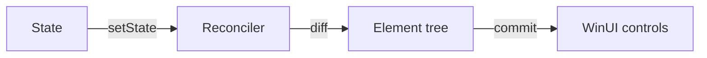

# AI Author Skill — Reactor Documentation Generator

You are an AI technical writer generating documentation for **Reactor**, a
declarative UI framework for building native Windows apps in C#. Your output
must work with the `mur docs compile` pipeline.

## Pipeline Overview

The doc system has two inputs and one output per topic:

1. **Template** (`docs/_pipeline/templates/<topic>.md.dt`) — Markdown with YAML
   front-matter, snippet directives, screenshot references, and `ai:lock`
   sections.
2. **Doc App** (`docs/_pipeline/apps/<topic>/`) — A compilable Reactor app containing
   snippet-marked code and a `doc-manifest.yaml` for screenshots.
3. **Output** (`docs/guide/<topic>.md`) — Final compiled Markdown with
   snippets inlined and screenshot paths resolved.

You produce both the template and the doc app. The compile pipeline does the
rest.

---

## Template Format (`.md.dt`)

### Front-Matter

```yaml
---
title: "Human-readable title"
app: <topic-id>            # matches the docs/_pipeline/apps/<topic-id>/ directory
order: 3                   # sort order in the final docset
audience: beginner|intermediate|advanced
goal: |
  2-4 sentence description of what this page should accomplish.
  Written as a directive to you, the AI author.
tier: stub|solid|comprehensive   # quality bar (spec 041 §6); see "Tiers" below
winui-ref: https://learn.microsoft.com/en-us/windows/apps/design/controls/...
                                 # optional — only on pages that wrap a WinUI control
---
```

#### Tiers (`tier:` field)

Every page declares one tier. The `mur docs compile --validate-only` lint
enforces the structural checklist below. Pick the tier the page is *meant*
to be; do not mark a page Comprehensive that doesn't meet the bar.

| Tier | Structural minimum | When to use |
|------|---------------------|-------------|
| `stub` | front-matter + title + one paragraph | Placeholder for surface visibility while you draft. "Coming soon" content. |
| `solid` | ≥3 resolved `snippet=` refs, ≥1 `screenshot://`, a Markdown reference table, `## Tips`, `## Next Steps` with ≥3 links | Default bar for any new page. Code-first, working examples, modifier table. |
| `comprehensive` | All solid checks plus an ≥80-word mental-model lead paragraph, ≥1 `<!-- ai:caveat -->` block, `## Patterns` heading, `## Common Mistakes` heading, ≥5 inline cross-links, `winui-ref:` if the page wraps a WinUI control | Top-traffic pages and Under-the-hood deep dives. |

Stub example:

```yaml
---
title: "Persistence"
app: persistence
order: 14.5
audience: intermediate
goal: "Coming soon — UsePersisted, scopes, and migration."
tier: stub
---
```

Solid example:

```yaml
---
title: "Forms"
app: forms
order: 7
audience: intermediate
goal: "Cover every form control with controlled-input idioms and validation."
tier: solid
```

Comprehensive example:

```yaml
---
title: "Date Pickers"
app: date-pickers
order: 7.6
audience: intermediate
goal: "DatePicker, CalendarDatePicker, CalendarView, TimePicker — full coverage."
tier: comprehensive
winui-ref: https://learn.microsoft.com/en-us/windows/apps/design/controls/date-picker
---
```

When `winui-ref:` is present, the compiler emits a styled "WinUI reference"
blockquote at the top of the generated page. Use it for transparent-wrapper
pages so readers reach Microsoft's design guidance in one click. Reactor-
original controls (DataGrid, VirtualList, FlexPanel, MarkdownTextBlock,
ErrorBoundary, AccessibilityScanner) do **not** set `winui-ref:` — the
Reactor page *is* the reference.

### Body Directives

**Snippet insertion** — reference code from the doc app by ID:

```markdown
```csharp snippet="<topic>/<snippet-id>"
```​
```

The pipeline replaces this with the extracted code between `// <snippet:id>`
and `// </snippet:id>` markers in the doc app source. The snippet is
auto-deindented.

**Screenshot insertion** — reference a screenshot defined in the manifest:

```markdown

```

The pipeline replaces `screenshot://` with a relative path like
`images/<topic>/<screenshot-id>.png`.

**Locked sections** — content the AI must not modify:

```markdown
<!-- ai:lock -->
> **Prerequisites:** .NET 10+ and the Windows App SDK.
<!-- /ai:lock -->
```

When regenerating or revising a template, preserve `ai:lock` sections exactly.
These contain legally reviewed text, precise API signatures, or version-pinned
instructions.

**Caveats** — per-API gotchas, rendered as a "Caveat" callout (React-style):

```markdown
<!-- ai:caveat -->
`UseEffect` runs **after** the render commit, not during. State you set
inside an effect causes a second render, which the compiler will warn about
if the dep array is missing.
<!-- /ai:caveat -->
```

Comprehensive pages must include at least one `<!-- ai:caveat -->` block.
A missing close tag fails compile with `REACTOR_DOC_CAVEAT_001`.

**Reference-page link marker** — link to an auto-generated reference page
(Section 10 of the index) from a guide page:

```markdown
The state hook (<!-- ref:UseState -->) is the building block.
```

The marker accepts either a short name (`<!-- ref:UseState -->`) or a
full XML-doc cref (`<!-- ref:M:Microsoft.UI.Reactor.Hooks.UseState -->`).
The compiler resolves it to a relative link into
`docs/guide/reference/<category>/<name>.md` and also feeds the reverse
"Featured in" callout that appears on the reference page. Use the marker
inline in prose — it is the only Reactor-specific syntax for cross-axis
linking; everything else is standard XML doc `<see cref="..."/>` /
`<seealso cref="..."/>` in the source.

**Cross-link analyzer (`REACTOR_DOC_XLINK_001`)** — `mur docs compile`
walks every prose paragraph and flags any mention of a concept that has
its own page when that mention is not already a link. The concept
registry is built from (a) template titles, (b) optional
`concept-aliases:` declared in front-matter, and (c) reference-page
filenames (`UseFocusTrap`, `DataGrid`, …). Single-word common-noun
titles (`Hooks`, `Focus`, `Reactor`) are filtered out by default to
avoid English-usage false positives — opt them in via
`concept-aliases:` if the page truly owns that exact word as a concept.

Single-page exemptions use a paragraph-scoped marker:

```markdown
<!-- xlink:skip -->
This paragraph mentions UseState and UseEffect on purpose without
linking; the rule resumes at the next blank line.
```

A finer-grained form silences just one concept:

```markdown
<!-- xlink:skip "UseFocusTrap" -->
UseFocusTrap appears here unlinked; other concepts are still enforced.
```

Use sparingly. The right fix for most findings is to add the link —
inline the concept name as the link text. **Do not** insert "see also
X" sentences or "click here for more on X" — link the noun in the
existing prose. The opt-out exists for comparison pages and other
contexts where linking every mention hurts flow.

Optional front-matter for opting single-word concepts in:

```yaml
concept-aliases: "Trampoline, Cross-thread dispatch"
```

---

## Doc App Structure

Each topic has a companion app in `docs/_pipeline/apps/<topic>/`:

```
docs/_pipeline/apps/my-topic/
  my-topic.csproj          # Standard Reactor project
  App.cs                   # Main source with snippet markers
  doc-manifest.yaml        # App config + screenshot definitions
```

### `.csproj` Template

```xml
<Project Sdk="Microsoft.NET.Sdk">
  <PropertyGroup>
    <OutputType>WinExe</OutputType>
    <TargetFramework>net10.0-windows10.0.22621.0</TargetFramework>
    <Platforms>x64;ARM64</Platforms>
    <ImplicitUsings>enable</ImplicitUsings>
    <Nullable>enable</Nullable>
    <UseWinUI>true</UseWinUI>
    <WindowsPackageType>None</WindowsPackageType>
  </PropertyGroup>
  <ItemGroup>
    <PackageReference Include="Microsoft.WindowsAppSDK"
                      Version="$(WindowsAppSDKVersion)" />
  </ItemGroup>
  <ItemGroup>
    <ProjectReference Include="..\..\..\Reactor\Reactor.csproj" />
  </ItemGroup>
</Project>
```

### Snippet Markers

Mark extractable code regions in `.cs` files:

```csharp
// <snippet:my-snippet>
var (count, setCount) = UseState(0);
return VStack(
    Text($"Count: {count}"),
    Button("+1", () => setCount(count + 1))
);
// </snippet:my-snippet>
```

Rules:
- IDs must be unique within the app.
- Snippets can nest (outer includes inner code, not markers).
- Keep snippets short — under 30 lines. If longer, split into focused pieces.
- Snippets are auto-deindented to the minimum indentation level.
- Do not include `using` statements or class declarations in snippets unless
  they are the point of the snippet. The template prose provides that context.

#### Source-tree snippets (`snippet="source:..."`)

There are **two snippet forms**. Use the right one for the page.

1. **Doc-app form** — for everything teaching the public API:

   ```markdown
   ```csharp snippet="hooks/usestate-counter"
   ```​
   ```

   Resolves against `docs/_pipeline/apps/<topic>/`. This is the default.
   The code must come from a real compilable doc app that ships with the
   docset; reviewers should be able to launch it and see the screenshot.

2. **Source-tree form** — for the Under-the-hood track (spec §7.1.1) and
   any reference-grounded prose that shows real framework internals:

   ```markdown
   ```csharp snippet="source:src/Reactor/Hooks/UseState.cs#main"
   ```​
   ```

   Resolves against the repo source tree. Region markers in the source
   look exactly like the doc-app markers:

   ```csharp
   // <snippet:main>
   public static (T, Action<T>) UseState<T>(T initial) { ... }
   // </snippet:main>
   ```

   The `source:` prefix is the disambiguator — anything before the `#` is
   the path under repo root. Use this form when the page is *about* the
   framework's own behavior (reconciliation, hooks-internals, animation
   pipeline). Do **not** use it on user-facing topic pages — those should
   stay grounded in a doc app the reader can run themselves.

### `doc-manifest.yaml`

```yaml
app:
  title: "Human-readable app title"
  width: 600                    # Window width for screenshot capture
  height: 400                   # Window height
  startup-delay: 1500           # ms to wait before capturing (default 2000)

screenshots:
  - id: main-view
    description: "Description of what's shown"
    region: client              # "client" (no title bar) or "window"
    format: png
  - id: detail-view
    description: "Detailed view after interaction"
    region: client
    format: png
  # Controls-catalog index thumbnails (spec 041 §6.3, §12 Q7).
  # kind: catalog-thumb downscales the captured frame to 320x240 with
  # high-quality interpolation and writes <id>-thumb.png (rather than
  # <id>.png) so a topic can declare both a full-size screenshot and a
  # thumbnail under the same logical id.
  - id: forms-group
    kind: catalog-thumb
    description: "Forms category thumbnail for the controls catalog index."
    region: client
    format: png
    # thumb-width / thumb-height default to 320 x 240 — override only if a
    # catalog category benefits from a non-default aspect.
```

### App Code Guidelines

The doc app must be a real, compilable, runnable Reactor application:

```csharp
using Microsoft.UI.Reactor;
using Microsoft.UI.Reactor.Core;
using static Microsoft.UI.Reactor.Factories;
using Microsoft.UI.Xaml;

ReactorApp.Run<MyApp>("Title", width: 600, height: 400, devtools: true);
```

- Always include `devtools: true` — this enables the screenshot capture system.
  (The older `preview:` parameter is deprecated; the compiler will warn.)
- Each component class in the file can be wrapped in snippet markers.
- The app should display a reasonable default state on launch (the screenshots
  are captured after `startup-delay` ms with no interaction).

---

## Diagram Authoring

**SVG-over-ASCII policy** (spec 041 §7.1.0). The docset is published on
GitHub, which renders SVG inline. ASCII boxes-and-arrows diagrams are
hard to maintain, hostile to screen readers, and look poor against the
SVG-rendered docsets we benchmarked.

Rules:

- **Default to SVG.** Architectural diagrams, flowcharts, state machines,
  reconciler walks, hook-table snapshots — all SVG. Author as Mermaid
  (`.mmd`) and let the pipeline render to `.svg` at compile time, or
  hand-author the `.svg` directly.
- **Screenshots stay PNG.** SVG is for vector content; screenshots of a
  running app remain PNG, captured via `doc-manifest.yaml`.
- **ASCII art is allowed only when** the visual is ≤8 lines, purely
  structural (folder tree, code skeleton), and needs no spatial
  precision. Anything else is SVG.
- **Light-and-dark aware.** Use CSS variables (`currentColor`, theme-aware
  fills) or duplicate paths so the diagram is legible on GitHub's light
  *and* dark themes. Default to a palette that contrasts on both
  (foreground `#1f2937` ↔ `#e5e7eb` is a safe pair).

### Authoring a Mermaid diagram

```
docs/_pipeline/diagrams/<topic>/<id>.mmd
```

`mur docs compile` renders each `.mmd` to
`docs/guide/images/<topic>/<id>.svg` (content-hash cached so unchanged
files don't re-render). Reference the rendered SVG with a normal
Markdown image link:

```markdown

```

Scaffold a new diagram with:

```
mur docs new-diagram architecture-overview render-loop
```

This emits a starter `.mmd` with a placeholder graph. Iterate with
`mur docs render-diagrams --topic architecture-overview` (no full
compile required). Pass `--skip-diagrams` to `mur docs compile` for
fast inner-loop runs when you are only editing prose.

A minimal Mermaid example for an Under-the-hood page:



Hand-authored SVG works the same way — drop the `.svg` under
`docs/_pipeline/diagrams/<topic>/` and the pipeline copies it through.

### When ASCII is fine

```
src/Reactor/
  Hooks/
    UseState.cs
    UseEffect.cs
  Reconciler/
    Reconciler.cs
```

Folder trees, four-line code skeletons, and similar structural snippets
are clearer as preformatted text than as a diagram. Use a fenced code
block (no language tag) — not an SVG.

---

## Writing Guidelines

### Voice and Tone

- **Direct and practical.** Lead with what to do, then explain why.
- **Second person.** "You describe your UI..." not "The developer describes..."
- **Present tense.** "Reactor re-renders the component" not "Reactor will re-render."
- **No filler.** Cut "In this section we will learn about..." — just teach it.

### Structure

- **One concept per section.** Each `##` heading introduces one idea.
- **Code first, then explanation.** Show the snippet, then break down what's
  happening. Readers learn by seeing the shape before the details.
- **Progressive complexity.** Start with the simplest version that works, then
  layer on features. The hello-world → counter → todo → calculator arc is the
  model.
- **Tables for reference, prose for concepts.** Use a table when listing
  options or properties. Use paragraphs when explaining how something works.

### Code Examples

- Every code block should reference a snippet from the doc app:
  `snippet="topic/id"`. Never write inline code that doesn't compile.
- Snippets should be self-contained — a reader should understand the snippet
  without reading the surrounding app code.
- Use real, meaningful variable names: `setCount` not `setX`.
- Show the fluent modifier pattern: `Text("hi").FontSize(24).Bold()`.
- Prefer `VStack`/`HStack` for layout in beginner content. Introduce `Grid`
  and `Flex` in intermediate content.

### Screenshots

- Every major UI example should have a screenshot immediately after the code.
- Alt text should describe what the screenshot shows, not what it is:
  "Todo list with two items checked off" not "Screenshot of todo app."

### Tips Sections

End each page with 3-5 practical tips relevant to the topic. Format as bold
lead sentence followed by explanation paragraph. Tips should be actionable
and specific to Reactor, not generic programming advice.

### Cross-Links and Navigation

Every page must be reachable through link traversal from the readme. Follow
these rules:

- **Readme links to all topics.** The readme landing page must contain a
  categorized list linking to every topic in the docset.
- **Next Steps section.** Every topic page (except readme) must end with a
  `## Next Steps` section after the Tips section. List 3-5 related topics
  as Markdown links using relative paths: `[Title](topic.md)`.
- **Inline links.** When prose mentions a concept covered in another topic,
  link to it inline: "see [Effects and Lifecycle](effects.md) for details."
- **Previous/Next.** Include a sequential link to the previous and next topic
  by order number so readers can follow the learning path linearly.
- **Link format.** Use relative `.md` paths: `[Getting Started](getting-started.md)`.
  Do not use absolute paths or `screenshot://` syntax for page links.

**Topic order for sequential navigation:** see the full 64-page index in
the "Topic Ideas" table at the bottom of this file. Authors should always
trust the `order:` value in each template's front-matter as the source of
truth; the bottom-of-file index is a snapshot of the spec-041 §7.1 layout.

---

## Reactor API Quick Reference

Use this to write correct, compilable code.

### App Entry Point

```csharp
ReactorApp.Run<TRoot>(title, width, height, preview, configure)
ReactorApp.Run(title, ctx => { /* inline function component */ }, width, height)
```

### Component Base Classes

```csharp
class MyComponent : Component
{
    public override Element Render() { ... }
}

record MyProps(string Name, int Count);
class MyComponent : Component<MyProps>
{
    public override Element Render()
    {
        var name = Props.Name;
        ...
    }
}
```

### Hooks (call only inside Render)

**Core state & computation:**

| Hook | Signature | Purpose |
|------|-----------|---------|
| `UseState` | `(T, Action<T>) UseState<T>(T initial)` | Reactive state |
| `UseReducer` | `(T, Action<Func<T,T>>) UseReducer<T>(T initial)` | State with functional updater |
| `UseReducer` | `(TState, Action<TAction>) UseReducer<TState,TAction>(Func<TState,TAction,TState> reducer, TState initial)` | Redux-style reducer |
| `UseEffect` | `void UseEffect(Action effect, params object[] deps)` | Side effects |
| `UseEffect` | `void UseEffect(Func<Action> effect, params object[] deps)` | Effect with cleanup |
| `UseMemo` | `T UseMemo<T>(Func<T> factory, params object[] deps)` | Memoized computation |
| `UseRef` | `Ref<T> UseRef<T>(T initial)` | Mutable ref across renders |
| `UseCallback` | `Action UseCallback(Action cb, params object[] deps)` | Stable callback reference |
| `UseContext` | `T UseContext<T>(Context<T> ctx)` | Read ambient context |

**Data binding & persistence:**

| Hook | Signature | Purpose |
|------|-----------|---------|
| `UsePersisted` | `(T, Action<T>) UsePersisted<T>(string key, T initial)` | Local-storage-backed state (Application scope, legacy default) |
| `UsePersisted` | `(T, Action<T>) UsePersisted<T>(string key, T initial, PersistedScope scope)` | Same, but routes to the Application or Window scope explicitly. `PersistedScope.Window` is the recommended default for new code. |
| `UseObservableTree` | `T UseObservableTree<T>(T source)` | Re-render on any INotifyPropertyChanged |
| `UseObservable` | `T UseObservable<T>(T source)` | Re-render on direct property changes |
| `UseObservableProperty` | `TProp UseObservableProperty<T,TProp>(T src, Func<T,TProp> sel, string prop)` | Track a single property |
| `UseCollection` | `IReadOnlyList<T> UseCollection<T>(ObservableCollection<T> col)` | Track observable collection changes |

**Navigation:**

| Hook | Signature | Purpose |
|------|-----------|---------|
| `UseNavigation` | `NavigationHandle<TRoute> UseNavigation<TRoute>(TRoute initial)` | Create a navigation stack (root) |
| `UseNavigation` | `NavigationHandle<TRoute> UseNavigation<TRoute>()` | Access ancestor navigation via context |
| `UseNavigationLifecycle` | `void UseNavigationLifecycle(onNavigatedTo?, onNavigatingFrom?, onNavigatedFrom?)` | Page lifecycle callbacks |
| `UseSystemBackButton` | `void UseSystemBackButton<TRoute>(NavigationHandle<TRoute> nav, Window win)` | Wire system back button |

`NavigationHandle<TRoute>` additional members:
`.CanGoForward`, `.ForwardStack`, `.GoForward()` — forward navigation,
`.PopTo(predicate)` — pop until matching route,
`.Navigate(route, NavigateOptions)` — with transition override and `PushToBackStack` flag,
`.GetState(options?)` / `.SetState(json)` — serialize/restore full nav state.

**Validation & forms:**

| Hook | Signature | Purpose |
|------|-----------|---------|
| `UseValidationContext` | `ValidationContext UseValidationContext()` | Create/access nearest validation context |
| `UseFocus` | `FocusManager UseFocus()` | Programmatic focus, enter-to-advance |
| `UseElementFocus` | `(ElementRef Ref, Action RequestFocus) UseElementFocus()` | Untyped ref + dispatcher-scheduled focus |
| `UseElementRef<T>` | `ElementRef<T> UseElementRef<T>() where T : FrameworkElement` | Typed element ref — `.Current` is already `T`, no cast needed at the call site (spec 033 §3) |

**Accessibility:**

| Hook | Signature | Purpose |
|------|-----------|---------|
| `UseAnnounce` | `AnnounceHandle UseAnnounce()` | Screen reader announcements via live regions |
| `UseFocusTrap` | `FocusTrapHandle UseFocusTrap(bool isActive)` | Keyboard focus trapping for modals/flyouts |

`AnnounceHandle` — `.Region` (invisible Element to include in tree),
`.Announce(message)`, `.Announce(message, assertive)` (polite vs. interrupt).

`FocusTrapHandle` — `.IsActive`, `.SetContainer(UIElement)`.
Apply with `.FocusTrap(handle)` modifier on a container element.

**Styling & theming:**

| Hook | Signature | Purpose |
|------|-----------|---------|
| `UseColorScheme` | `ColorScheme UseColorScheme()` | Effective color scheme (Light/Dark/HighContrast) |
| `UseIsDarkTheme` | `bool UseIsDarkTheme()` | True when effective scheme is Dark |

**Framework integration:**

| Hook | Signature | Purpose |
|------|-----------|---------|
| `UseCommand` | `Command UseCommand(Command cmd)` | Command lifecycle + async tracking |
| `UseCommand<T>` | `Command<T> UseCommand<T>(Command<T> cmd)` | Parameterized command tracking |
| `UseWindowSize` | `(double W, double H) UseWindowSize(Window win)` | Reactive window dimensions |
| `UseBreakpoint` | `bool UseBreakpoint(Window win, double minWidth)` | Media-query-style breakpoint |
| `UseIntl` | `IntlAccessor UseIntl()` | Localization accessor (formatting, strings) |

### Common Elements

**Text:** `Text(s)`, `Heading(s)`, `SubHeading(s)`, `Caption(s)`

**Input:** `TextField(value, onChange, placeholder?, header?)`,
`CheckBox(isChecked, onChange, label?)`, `Button(label, onClick)`,
`Slider(value, min, max, onChange)`, `ToggleSwitch(isOn, onChange)`,
`NumberBox(value, onChange)`, `ComboBox(items, selectedIndex, onChange)`,
`PasswordBox(password, onChange)`, `RadioButtons(items, selectedIndex, onChange)`

**Layout:** `VStack(spacing?, children)`, `HStack(spacing?, children)`,
`Grid(GridSize[] columns, GridSize[] rows, children)`, `ScrollView(child)`,
`Border(child)`, `Expander(header, content)`, `FlexRow(children)`,
`FlexColumn(children)`

`GridSize` value type with helpers: `GridSize.Auto`, `GridSize.Star(weight = 1)`,
`GridSize.Px(pixels)`. Example: `Grid([GridSize.Auto, GridSize.Star()], [GridSize.Px(40)], …)`.
The legacy string-form overload (`Grid(["Auto", "1*"], …)`) is soft-deprecated
(`CS0618`) — prefer the typed helpers (spec 033 §1).

**Collections:** `ListView<T>(items, keySelector, viewBuilder)`,
`LazyVStack<T>(items, keySelector, viewBuilder)`,
`GridView<T>(items, keySelector, viewBuilder)`,
`VirtualList(itemCount, renderItem, getItemKey?, itemHeight?, estimatedItemHeight, spacing, ref?, onVisibleRangeChanged?)`

`VirtualListRef` — `.ScrollToIndex(index)`, `.ScrollOffset`,
`.RestoreScrollOffset(offset)`, `.Repeater` (raw WinUI access).

**Navigation:** `NavigationView(menuItems, content)`, `TabView(tabs)`,
`BreadcrumbBar(items)`, `NavigationHost(nav, routeMap)` with
`Transition`, `CacheMode` (`Disabled`, `Enabled`, `Required`), `CacheSize`
properties.

`DeepLinkMap<TRoute>` — `.Map(pattern, factory)` with URI patterns
(`/users/{id:int}/posts/{postId}?sort=date`), optional params `{name?}`,
wildcards `{**}`, typed extraction via `RouteArgs.Get<T>()` /
`RouteArgs.Query<T>()`. `.Resolve(uri)` → `DeepLinkResult<TRoute>`.

`NavigationDiagnostics` — static events: `NavigationRequested`,
`NavigationCompleted`, `NavigationCancelled`, plus cache and transition
events. Subscribe for debugging/telemetry.

**Validation:** `FormField(content, label?, required?, description?)`,
`ValidationRule(predicate, message, field)`,
`ValidationVisualizer(style, content)` with styles: Inline, Summary,
InfoBar, Custom. `.Validate(fieldName, value, validators...)` extension.

**Data System:** `DataGrid<T>(source, columns, selectionMode?, onSelectionChanged?,
onRowChanged?, rowHeight?, editable?, editMode?, templates...)` — full-featured
virtualized grid with sort, filter, search, inline editing, column resize/reorder.

`Column<T>(name, accessor, editable?, displayName?, format?, width?, pin?)` →
`ColumnBuilder<T>` — `.Validate(...)`, `.CellRenderer(...)`, `.NotSortable()`,
`.Build()`. `AutoColumns<T>(registry?, overrides?)` — auto-generate from
reflection. Both `DataGrid<T>(...)` and `Column<T>(...)` are factory methods
on `Microsoft.UI.Reactor.Factories` — already imported by the standard
`using static Microsoft.UI.Reactor.Factories;`.

Data sources: `IDataSource<T>` (abstract), `ListDataSource<T>` (in-memory
with client-side sort/filter/search), `ObservableListDataSource<T>` (wraps
`ObservableCollection<T>`). `IMutableDataSource<T>` adds CRUD.
`DataPageCache<T>(source, blockSize, maxBlocks)` for incremental paging.
`FieldDescriptor` — unified field metadata (name, type, getter/setter,
width, pin, sortable, validators, cell renderer, formatter).

**Charting** (via ReactorCharting): `LineChart<T>(data, x, y)`,
`BarChart<T>(data, x, y)`, `AreaChart<T>(data, x, y)`,
`PieChart<T>(data, value, label?)`, `TreeChart<T>(root, children, label?)`,
`ForceGraph(nodes, links)`. Import: `using static Microsoft.UI.Reactor.Charting.Charts;`

**Accessibility elements:** `SemanticPanel` — wraps a child to provide
custom automation peer metadata (role, value, range) for complex components
like star ratings. Properties: `SemanticRole`, `SemanticValue`,
`RangeMinimum`, `RangeMaximum`, `RangeValue`, `IsReadOnly`.

`AccessibilityScanner.Scan(root)` — post-reconciliation diagnostic tool
that walks the element tree, returns `List<A11yDiagnostic>` with WCAG
criterion, fix suggestions, and context. 8 built-in checks (icon buttons,
images, form labels, headings, landmarks, TabIndex gaps, etc.).

**Helpers:** `When(bool, () => element)`, `If(bool, then, else?)`,
`Expr(Func<Element?>)` — inline block-expression escape hatch; runs the lambda
and returns its result, no node, no hook scope, no memoization (spec 033 §5),
`ForEach(items, render)`, `Empty()`, `Group(children)`

**Function components:** `Memo(ctx => …)` for the common render-once-plus-state
case (no deps); `Memo(ctx => …, deps)` to also re-render when any dep changes;
`RenderEachTime(ctx => …)` for the explicit always-re-render shape. The legacy
`Func(ctx => …)` factory is soft-deprecated (`CS0618`) — replace with `Memo`
(common case) or `RenderEachTime` (always-re-render case) (spec 033 §4).

### Common Modifiers (chainable on any Element)

**Layout & appearance:**
`.Width(n)`, `.Height(n)`, `.Size(w, h)`, `.Margin(n)`, `.Padding(n)`,
`.FontSize(n)`, `.Bold()`, `.SemiBold()`, `.Opacity(n)`,
`.Background(color|ThemeRef)`, `.Foreground(color|ThemeRef)`,
`.CornerRadius(n)`, `.WithBorder(color|ThemeRef, thickness?)`,
`.HAlign(alignment)`, `.VAlign(alignment)`,
`.Disabled(bool)`, `.Visible(bool)`, `.WithKey(string)`,
`.Flex(grow?, shrink?, basis?)`, `.ToolTip(string)`,
`.FocusTrap(FocusTrapHandle)`,
`.Set(control => { /* raw WinUI access */ })`

**Styling:**
`.RequestedTheme(ElementTheme)`,
`.Resources(r => r.Set(key, value))` — lightweight styling overrides,
`.Backdrop(BackdropKind)` — apply a system backdrop (Mica / MicaAlt /
DesktopAcrylic / AcrylicThin / None) to the host window. Modifier is
host-side: it walks up to the `ReactorHost`'s `Window` and assigns the
materialized `SystemBackdrop`. On `ReactorHostControl` (windowless) it
no-ops (spec 033 §6).

**Animation — implicit transitions:**
`.OpacityTransition(duration?)`, `.ScaleTransition(transition?)`,
`.TranslationTransition(transition?)`, `.RotationTransition(duration?)`,
`.BackgroundTransition(duration?)` (Grid/Stack only)

**Animation — compositor:**
`.Animate(Curve, AnimateProperty?)` — persistent implicit animation,
`.Transition(Transition, Curve?)` — enter/exit (Fade, Slide, Scale; `+` parallel, `|` asymmetric),
`.InteractionStates(builder, curve?)` — zero-reconcile hover/press/focus,
`.Stagger(delay, curve?)` — cascade child animations,
`.Keyframes(name, trigger, builder)` — trigger-based multi-property keyframes,
`.ScrollLinked(scrollViewer, builder)` — scroll-driven expression animations

**Animation — layout:**
`.LayoutAnimation()`, `.LayoutAnimation(duration)`,
`.SpringLayoutAnimation(damping?, period?)`,
`.ConnectedAnimation(key)`

**Animation — scopes (call in event handlers):**
`AnimationScope.WithAnimation(Curve, Action)` — ambient animation scope,
`AnimationScope.WithAnimationAsync(Curve, Action)` — async choreography

**Compositor properties (animated via .Animate() or WithAnimation):**
`.Scale(Vector3)`, `.Rotation(float)`, `.Translation(x, y, z)`,
`.CenterPoint(Vector3)`

---

## Topic Ideas for the Full Docset

The 64-page layout mirrors spec 041 §7.1. Each row lists the target tier,
the `order:` slot, and a one-line description. "NEW" pages were authored
as Stub-tier templates in Phase 1 and grow tier-by-tier through Phases
2-4. Generate every page as `<topic>.md.dt` + `docs/_pipeline/apps/<topic>/`
unless the file basename indicates otherwise (e.g. `recipes/login.md.dt`).

### 1. Get Started

| Order | Page | Tier | Description |
|-------|------|------|-------------|
| 0 | readme | comprehensive | Landing page: what Reactor is, the 10-section index, decision tree |
| 1 | getting-started | comprehensive | Project setup, hello world, state, layout, todo + calculator |
| 1.5 | thinking-in-reactor | NEW stub | Mental-model essay — function of state, no XAML, declarative shell |
| 24 | xaml-developers | comprehensive | Migration cookbook: XAML/binding/MVVM/navigation → Reactor |
| 1.7 | reactor-vs-xaml | NEW stub | Architectural essay (also indexed in §9): DependencyProperty → modifier, Binding → closure, DataTemplate → function component |

### 2. Learn the framework

| Order | Page | Tier | Description |
|-------|------|------|-------------|
| 3 | components | comprehensive | `Component`, `Component<TProps>`, record props, function components, `ShouldUpdate` |
| 4 | hooks | comprehensive | Deep dive: UseState, UseReducer, UseEffect, UseMemo, UseRef, UseCallback; rules and ordering |
| 11 | effects | comprehensive | UseEffect lifecycle, async patterns, cleanup, dependency arrays |
| 13 | context | comprehensive | Context\<T\>, ContextProvider, UseContext, scoped overrides |
| 12 | commanding | comprehensive | Command, Command\<T\>, UseCommand, accelerators, async tracking |
| 18 | advanced | comprehensive | ErrorBoundary, Memo, `.Set()`, observable binding, perf tuning |

### 3. UI surface

| Order | Page | Tier | Description |
|-------|------|------|-------------|
| 5 | layout | solid | VStack, HStack, Grid, ScrollView, Border, Expander; responsive patterns |
| 6 | flex-layout | comprehensive | FlexPanel (Yoga): direction, justify, align, wrap, gap |
| 10 | styling | comprehensive | Theme tokens, UseColorScheme, `.RequestedTheme()`, lightweight styling |
| 16 | animation | comprehensive | Implicit transitions, `.Animate`, `.Transition`, `.InteractionStates`, keyframes, scroll-linked |
| 16.5 | input-and-gestures | solid | Pointer events, `.OnTapped`, gestures, AccessKey wiring |

### 4. Controls catalog

| Order | Page | Tier | Description |
|-------|------|------|-------------|
| 6.5 | controls | NEW stub → comprehensive | Thumbnail index linking every catalog page |
| 7 | forms | solid → comprehensive | TextField, CheckBox, ComboBox, Slider, NumberBox, PasswordBox, RadioButtons, ToggleSwitch, AutoSuggestBox, DatePicker, TimePicker, CalendarView, ColorPicker, validation |
| 8 | collections | solid → comprehensive | ListView, GridView, LazyVStack, VirtualList, grouping, drag-reorder |
| 8.3 | text-and-media | NEW stub → comprehensive | TextBlock variants, RichTextBlock, RichEditBox, MarkdownTextBlock, Image, MediaPlayerElement, WebView2, InkCanvas, MapControl |
| 8.5 | status-and-info | NEW stub → solid | InfoBar, InfoBadge, ProgressBar, ProgressRing, TeachingTip, PipsPager, PersonPicture, RatingControl |
| 8.7 | dialogs-and-flyouts | NEW stub → comprehensive | ContentDialog, MenuFlyout, CommandBarFlyout, Popup |
| 19 | data-system | comprehensive | DataGrid\<T\>: sort, filter, search, inline editing, paging |
| 17 | charting | comprehensive | LineChart, BarChart, AreaChart, PieChart, TreeChart, ForceGraph |

### 5. App architecture

| Order | Page | Tier | Description |
|-------|------|------|-------------|
| 9 | navigation | comprehensive | UseNavigation, NavigationHandle, NavigationView, TabView, DeepLinkMap, lifecycle |
| 21 | windows | solid | ReactorApp.Run, OpenWindow, WindowSpec, ShutdownPolicy, tray icons (moved from §3) |
| 12 | async-resources | solid → comprehensive | UseResource, UseInfiniteResource, UseMutation, Pending (renamed from async-resources-cookbook) |
| 14.5 | persistence | NEW stub → solid | UsePersisted, Window/Application scopes, migration |
| 15 | localization | solid | LocaleProvider, UseIntl, RtlHelper, logical layout, pseudo-localization |
| 14 | accessibility | comprehensive | AutomationName, landmarks, UseFocusTrap, UseAnnounce, SemanticPanel, AccessibilityScanner |

### 6. Patterns & recipes

| Order | Page | Tier | Description |
|-------|------|------|-------------|
| 22 | recipes/index | NEW stub → solid | Gallery: thumbnail + one-line per recipe |
| 22.1 | recipes/login | NEW stub → solid | Login form recipe |
| 22.2 | recipes/master-detail | NEW stub → solid | Master-detail recipe |
| 22.3 | recipes/settings-page | NEW stub → solid | Settings page recipe |
| 22.4 | recipes/paginated-list | NEW stub → solid | Paginated list recipe |
| 22.5 | recipes/modal-dialog | NEW stub → solid | Modal dialog recipe |
| 22.6 | recipes/multi-step-form | NEW stub → solid | Multi-step form recipe |
| 22.7 | recipes/search-with-suggestions | NEW stub → solid | Search-with-suggestions recipe |
| 22.8 | recipes/command-palette | NEW stub → solid | Command-palette recipe |
| 22.9 | recipes/drag-reorder | NEW stub → solid | Drag-to-reorder recipe |
| 22.95 | cheat-sheet | NEW stub → solid | Single-page reference card |
| 22.97 | rules-of-reactor | NEW stub → solid | Hook rules, idioms, anti-patterns |
| 22.99 | theming-tokens | NEW stub → comprehensive | Full token catalog with swatches |

### 7. Tooling & process

| Order | Page | Tier | Description |
|-------|------|------|-------------|
| 2 | dev-tooling | solid → comprehensive | `mur` CLI, MCP server, VS Code panel, dotnet watch, in-app dev menu, reconcile-highlight + layout-cost overlays |
| 22.6 | testing | NEW stub → solid | Renderer fixtures, headless tests, snapshot tests, a11y scanner |
| 22.7 | performance | NEW stub → solid | ETW, EventDispatch walkthroughs, flame graphs |
| 22.8 | packaging | NEW stub → solid | MSIX, single-file, ARM64, AOT considerations |

### 8. Interop & integration

| Order | Page | Tier | Description |
|-------|------|------|-------------|
| 20 | winforms-interop | comprehensive | XAML Islands hosting, XamlIslandBootstrap, ComponentType property |
| 20.5 | wpf-interop | NEW stub → solid | WPF host control, data flow, threading |

### 9. Under the hood (NEW track — Phase 3.5)

| Order | Page | Tier | Description |
|-------|------|------|-------------|
| 30 | architecture-overview | NEW stub → comprehensive | Diagram-led: shell → element records → reconciler → WinUI tree |
| 31 | reactivity-model | NEW stub → comprehensive | setState → re-render mental model; why hooks not INPC |
| 1.7 | reactor-vs-xaml | NEW stub → comprehensive | (also indexed in §1) DependencyProperty/Binding/DataTemplate mapping |
| 32 | hooks-internals | NEW stub → comprehensive | Hook slot table, dispatcher, closure capture, stale state |
| 33 | reconciliation | NEW stub → comprehensive | Element-record diff, identity, `WithKey`, three phases — promotes `docs/reference/reconciliation.md` |
| 34 | element-pool | NEW stub → solid | Pooling for GC pressure under scroll-heavy lists (spec 034) |
| 35 | effects-scheduling | NEW stub → comprehensive | When effects run; dep semantics; cleanup ordering; async cancellation |
| 36 | threading-and-dispatch | NEW stub → solid | UI-thread invariants, trampoline, batched renders, off-thread patterns |
| 37 | source-mapping | NEW stub → solid | Spec 010: stack-trace attribution to user source |
| 38 | modifier-system | NEW stub → comprehensive | `.FontSize(24).Bold()` — modifier records vs property writes |
| 39 | analyzer-architecture | NEW stub → comprehensive | REACTOR_THEME/A11Y/GRID/FUNC/PERSIST — authoring your own analyzer |
| 40 | devtools-internals | NEW stub → comprehensive | Dev menu, reconcile-highlight overlay, layout-cost overlay, MCP protocol |
| 41 | animation-pipeline | NEW stub → comprehensive | Composition API end-to-end, 4 animation systems, compositor-property ceiling |
| 42 | focus-and-input-internals | NEW stub → comprehensive | UseFocus dispatcher, UseFocusTrap container, pointer vs routed events |
| 43 | perf-instrumentation | NEW stub → comprehensive | ETW sources, frame-aligned sampling (spec 031), layout-cost attribution (spec 032) |

### 10. API Reference (auto-generated — spec §7.1.2)

Section 10 is generated from XML doc comments in `src/Reactor*/` and
landed in Phase 1 for the Hooks category. Authors do **not** hand-write
template files for the leaves — they author `<summary>`, `<remarks>`,
`<param>`, `<returns>`, `<example>`, and `<seealso cref="..."/>` in the
canonical C# source, and the pipeline emits one MD page per public
member into `docs/guide/reference/<category>/<name>.md`. The hand-
written part is the per-category `index.md` (e.g.
`docs/guide/reference/hooks/index.md`).

Categories (driven by `docs/_pipeline/reference-map.yaml`):

- **factories** — every element factory
- **hooks** — every `Use*` hook (Phase 1 prototype: 73 pages)
- **modifiers** — every chainable modifier
- **elements** — every Element record type
- **system** — App, Window, Navigation, Context, Command primitives

Cross-axis linking: write `<!-- ref:UseState -->` in a guide template to
link into the reference axis; write `<seealso cref="UseState"/>` in XML
doc to link from a reference page into the conceptual guide.

---

## Checklist Before Submitting

- [ ] Template has valid YAML front-matter with all required fields
- [ ] All `snippet=` references match `// <snippet:id>` markers in the app
- [ ] All `screenshot://` references match entries in `doc-manifest.yaml`
- [ ] `ai:lock` sections are preserved exactly from any prior version
- [ ] Doc app compiles with `dotnet build`
- [ ] Doc app shows a useful default state when launched (no interaction needed)
- [ ] Snippets are under 30 lines each
- [ ] Prose explains code *after* showing it, not before
- [ ] Tips are specific to Reactor, not generic programming advice
- [ ] Page has a `## Next Steps` section with links to related and sequential topics
- [ ] Readme links to all topic pages; all pages are reachable via link traversal
- [ ] Run `mur docs compile --validate-only` to check all references resolve
