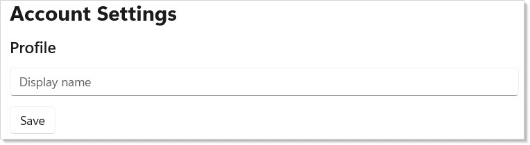
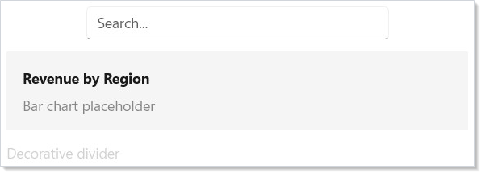
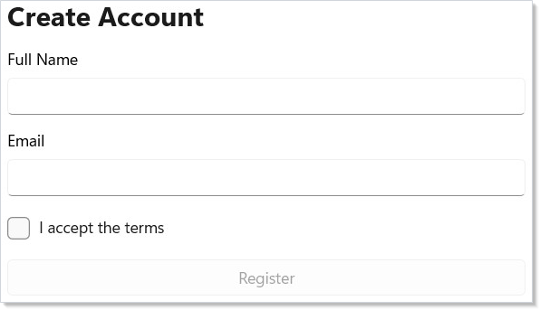
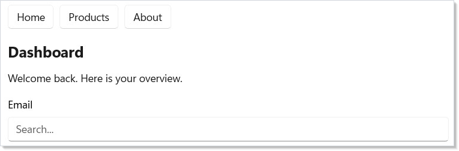
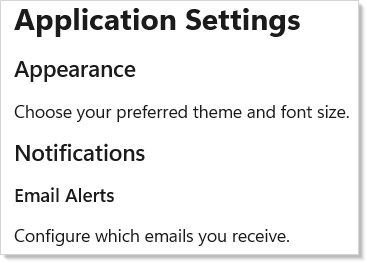
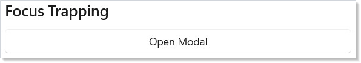
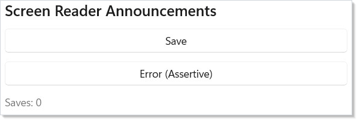
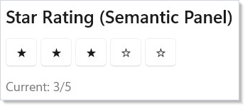

Microsoft.UI.Reactor (Reactor)'s accessibility surface is two layers: modifiers that map to
WinUI automation properties (`.AutomationName`, `.HeadingLevel`,
`.Landmark`, `.LiveRegion`, `.TabIndex`, `.AccessKey`) and hooks that
add runtime behavior (`UseFocusTrap` for modal focus trapping,
`UseAnnounce` for live-region announcements, `SemanticPanel` for
custom automation peers that the modifier set can't express). The
analyzer set is the third layer — `REACTOR_A11Y_001..003` catch the
three most common omissions (icon-only buttons missing an automation
name, images missing alt text, form fields missing a label) at
compile time. The `AccessibilityScanner` is the runtime cousin: it
walks the post-reconciliation element tree and emits 8 categories of
WCAG-mapped diagnostics with concrete fix suggestions. Aim for clean
analyzer output as you type, clean scanner output before merge, and
Narrator tab-through as the final manual check. Read [Tier 1
Modifiers](#tier-1-modifiers) first — those five modifiers cover most
production cases; everything else on this page is for the
non-trivial 20%.

# Accessibility

Reactor provides accessibility modifiers on every [component](components.md). They map directly to
WinUI's automation properties, so screen readers, keyboard navigation, and
test tools work out of the box. Modifiers are split into two tiers based on
how often you need them.

## Reference

| Surface | Where it lives | What it does |
|---|---|---|
| Tier 1 modifiers | `.AutomationName`, `.HeadingLevel`, `.TabIndex`, `.AccessKey`, `.IsTabStop` | Inline on every render — labels, headings, keyboard order. |
| Tier 2 modifiers | `.HelpText`, `.FullDescription`, `.AccessibilityHidden`, `.AccessibilityView`, `.Landmark`, `.Required`, `.LiveRegion` | Lazy-allocated; descriptions, landmarks, hidden subtrees, regions. |
| `UseFocusTrap(isActive)` | hook | Returns a `FocusTrapHandle`; apply with `.FocusTrap(handle)` on a container. |
| `UseAnnounce()` | hook | Returns an `AnnounceHandle` with `.Region` (zero-size element) and `.Announce(message, assertive?)`. |
| `SemanticPanel` | wrapper | Custom automation peer (role / value / range) for composites. |
| `AccessibilityScanner.Scan(root)` | static | Post-render runtime diagnostic — 8 WCAG checks with fix suggestions. |
| `REACTOR_A11Y_001` | analyzer | Icon-only `Button(icon, action)` without `.AutomationName()`. |
| `REACTOR_A11Y_002` | analyzer | `Image()` without `.AutomationName()` or `.AccessibilityHidden()`. |
| `REACTOR_A11Y_003` | analyzer | Form field without `header:` or label modifier. |

## Tier 1 Modifiers

Tier 1 modifiers are the ones you use constantly: labels, headings, tab order,
and keyboard shortcuts. They are applied inline on every render — no lazy
allocation.

```csharp
class Tier1Demo : Component
{
    public override Element Render()
    {
        return VStack(12,
            TextBlock("Account Settings")
                .FontSize(24).Bold()
                .HeadingLevel(AutomationHeadingLevel.Level1),
            TextBlock("Profile")
                .FontSize(18).SemiBold()
                .HeadingLevel(AutomationHeadingLevel.Level2),
            TextBox("", _ => { }, placeholderText: "Display name")
                .AutomationName("Display name")
                .TabIndex(1)
                .AccessKey("N"),
            Button("Save", () => { })
                .AutomationName("Save profile changes")
                .TabIndex(2)
                .AccessKey("S")
        ).Padding(24);
    }
}
```



Here is what each modifier does:

- **`.HeadingLevel()`** marks an element as a heading (Level1 through Level9).
  Screen reader users navigate by heading, just like `h1`--`h6` in HTML.
- **`.AutomationName()`** sets the accessible label. Use it when the visible
  text does not fully describe the control's purpose.
- **`.TabIndex()`** sets the tab order. Lower values receive focus first.
- **`.AccessKey()`** assigns an Alt+key shortcut. WinUI shows the key hint
  when the user presses Alt.
- **`.IsTabStop()`** controls whether the element participates in Tab
  navigation at all.

## Tier 2 Modifiers

Tier 2 modifiers cover supplemental information, landmarks, and visibility
control. They are lazy-allocated — Reactor only creates the backing storage when
you use them, keeping the common case lightweight.

```csharp
class Tier2Demo : Component
{
    public override Element Render()
    {
        return VStack(12,
            TextBox("", _ => { }, placeholderText: "Search...")
                .AutomationName("Search products")
                .HelpText("Type a product name or SKU to filter results")
                .Width(300),
            VStack(8,
                TextBlock("Revenue by Region").Bold(),
                TextBlock("Bar chart placeholder").Opacity(0.5)
            ).FullDescription(
                "Bar chart showing Q1 revenue: East $4.2M, " +
                "West $3.8M, Central $2.1M")
             .Padding(16).Background("#f5f5f5").CornerRadius(8),
            TextBlock("Decorative divider")
                .Opacity(0.2)
                .AccessibilityHidden()
        ).Padding(24);
    }
}
```



| Modifier | Purpose |
|----------|---------|
| `.HelpText()` | Extra hint read after the name |
| `.FullDescription()` | Extended description for complex visuals |
| `.AccessibilityHidden()` | Hide decorative elements from the tree |
| `.AccessibilityView()` | Content, Control, or Raw visibility |
| `.Landmark()` | Main, Navigation, Search, Form, Custom |
| `.Required()` | Announces "required" for form fields |
| `.LiveRegion()` | Announces dynamic content changes |

The tiered design means you pay zero cost for Tier 2 on elements that only
need a label and heading level.

## Accessible Form

A real [form](forms.md) combines Tier 1 and Tier 2 modifiers. Labels, required markers,
help text, landmarks, and tab order work together:

```csharp
class AccessibleFormDemo : Component
{
    public override Element Render()
    {
        var (name, setName) = UseState("");
        var (email, setEmail) = UseState("");
        var (agree, setAgree) = UseState(false);
        var valid = !string.IsNullOrWhiteSpace(name)
            && email.Contains('@') && agree;

        return VStack(12,
            TextBlock("Create Account").FontSize(24).Bold()
                .HeadingLevel(AutomationHeadingLevel.Level1),
            TextBox(name, setName, header: "Full Name")
                .AutomationName("Full name").Required().TabIndex(1),
            TextBox(email, setEmail, header: "Email")
                .AutomationName("Email address").Required().TabIndex(2)
                .HelpText("We'll send a verification link"),
            CheckBox(agree, setAgree, label: "I accept the terms")
                .TabIndex(3),
            Button("Register", () => { })
                .IsEnabled(valid).TabIndex(4).AccessKey("R")
        ).Landmark(AutomationLandmarkType.Form).Padding(24);
    }
}
```



The form container uses `.Landmark(AutomationLandmarkType.Form)` so screen
reader users can jump directly to it. Each field has `.AutomationName()` for
its label, `.Required()` for required fields, and `.TabIndex()` for
predictable keyboard order. The email field adds `.HelpText()` to explain
what happens after submission.

## Navigation Landmarks

Landmarks let screen reader users jump between major page regions. Use them
on your navigation bar, main content area, and search box:

```csharp
class LandmarksDemo : Component
{
    public override Element Render()
    {
        return VStack(16,
            HStack(8,
                Button("Home", () => { }),
                Button("Products", () => { }),
                Button("About", () => { })
            ).Landmark(AutomationLandmarkType.Navigation)
             .AutomationName("Main navigation"),

            VStack(12,
                TextBlock("Dashboard")
                    .FontSize(20).Bold()
                    .HeadingLevel(AutomationHeadingLevel.Level1),
                TextBlock("Welcome back. Here is your overview.")
            ).Landmark(AutomationLandmarkType.Main)
             .AutomationName("Main content"),

            TextBox("", _ => { }, placeholderText: "Search...")
                .AutomationName("Site search")
                .Landmark(AutomationLandmarkType.Search)
        ).Padding(24);
    }
}
```



WinUI supports five landmark types: `Navigation`, `Main`, `Search`, `Form`,
and `Custom`. Pair each landmark with `.AutomationName()` so screen readers
announce "Main navigation" rather than just "navigation."

## Heading Hierarchy

A clear heading structure lets screen reader users skim your page. This pairs
well with your [layout](layout.md) hierarchy. Use `Level1` for the page
title, `Level2` for sections, and `Level3` for subsections:

```csharp
class HeadingHierarchyDemo : Component
{
    public override Element Render()
    {
        return VStack(12,
            TextBlock("Application Settings")
                .FontSize(24).Bold()
                .HeadingLevel(AutomationHeadingLevel.Level1),
            TextBlock("Appearance")
                .FontSize(18).SemiBold()
                .HeadingLevel(AutomationHeadingLevel.Level2),
            TextBlock("Choose your preferred theme and font size."),
            TextBlock("Notifications")
                .FontSize(18).SemiBold()
                .HeadingLevel(AutomationHeadingLevel.Level2),
            TextBlock("Email Alerts")
                .FontSize(15).SemiBold()
                .HeadingLevel(AutomationHeadingLevel.Level3),
            TextBlock("Configure which emails you receive.")
        ).Padding(24);
    }
}
```



Keep your heading levels sequential — do not skip from Level1 to Level3.
Screen readers use the hierarchy to build a page outline, and gaps confuse
users.

## Focus Trapping

`UseFocusTrap` locks keyboard focus inside a container — essential for modal
dialogs and flyouts. When active, Tab and Shift+Tab cycle within the
trapped subtree and cannot escape:

```csharp
class FocusTrapDemo : Component
{
    public override Element Render()
    {
        var (showModal, setShowModal) = UseState(false);
        var trap = this.UseFocusTrap(showModal);

        return VStack(12,
            SubHeading("Focus Trapping"),
            Button("Open Modal", () => setShowModal(true)),
            When(showModal, () =>
                Border(
                    VStack(12,
                        TextBlock("Modal Dialog").FontSize(18).Bold(),
                        TextBlock("Tab/Shift+Tab stays inside this panel."),
                        TextBox("", _ => { }, placeholderText: "Name")
                            .TabIndex(0),
                        Button("Close", () => setShowModal(false))
                            .TabIndex(1)
                    ).Padding(24)
                ).WithBorder("#888", 1)
                 .CornerRadius(8)
                 .Background("#ffffff")
                 .FocusTrap(trap)
            )
        ).Padding(24);
    }
}
```



Create a `FocusTrapHandle` with `UseFocusTrap(isActive)`. Apply it to a
container with `.FocusTrap(handle)`. When `isActive` is true, focus wraps
within the subtree; when false, normal tab behavior resumes.

Use focus trapping for any overlay that should prevent interaction with
background content: modal dialogs, confirmation sheets, and dropdown menus.
For a complete dialog pattern that combines `UseFocusTrap` with
[`ContentDialog`](dialogs-and-flyouts.md), see the
[modal-dialog recipe](recipes/modal-dialog.md).

> **Caveat:** `UseFocusTrap` guards its `LosingFocus` handler against three "no
> sensible container" states — `IsLoaded == false`, `Visibility !=
> Visible`, and `!IsHitTestVisible`. Outside those guards, the trap
> keeps eating focus changes for as long as the handle says
> `IsActive`. The classic failure: an `When(isOpen, () => ...)`
> modal whose `setOpen(false)` runs first (unmounting the trapped
> container) and *then* flips `isActive` to false on the next render —
> between the two, `Tab` from outside the now-removed container still
> matches the stale handle and `args.Cancel = true` wedges focus on a
> neighboring page element. Always flip `isActive` to false in the same
> state batch that unmounts the container, or apply the trap to an
> element that stays in the tree across the open/closed transition
> (an always-mounted overlay with `.IsVisible(open)` rather than
> `When(open, ...)`).

## Screen Reader Announcements

`UseAnnounce` sends programmatic announcements to screen readers via live
regions (WCAG 4.1.3). Use it to notify users of dynamic state changes that
are not visible in the focus path:

```csharp
class AnnouncementsDemo : Component
{
    public override Element Render()
    {
        var (count, setCount) = UseState(0);
        var announce = this.UseAnnounce();

        return VStack(12,
            SubHeading("Screen Reader Announcements"),
            Button("Save", () =>
            {
                setCount(count + 1);
                announce.Announce($"Document saved ({count + 1} times)");
            }),
            Button("Error (Assertive)", () =>
                announce.Announce("Connection lost!", assertive: true)),
            TextBlock($"Saves: {count}").Opacity(0.6),
            announce.Region  // invisible live region — must be in tree
        ).Padding(24);
    }
}
```



Create an `AnnounceHandle` with `UseAnnounce()`. Include `announce.Region`
somewhere in your element tree — it renders an invisible live region. Then
call `announce.Announce(message)` for polite announcements (queued after
current speech) or `announce.Announce(message, assertive: true)` to
interrupt.

Calling `Announce` before `Region` has been mounted is a silent no-op —
the handle holds an internal `TextBlock?` that the modifier pipeline
fills in `OnMount`. If a [`UseEffect`](effects.md) with `[]` deps fires
an `Announce` immediately on mount, the live region may not have wired
up yet; defer the first announcement by a dispatcher tick or trigger
it from `onNavigatedTo`.

Common use cases: form submission confirmations, async operation completions,
error messages, and timer-based status updates.

## Semantic Panel

`SemanticPanel` wraps a child element to provide custom automation metadata
that Reactor components cannot expose directly (since they are C# records, not
WinUI controls with overridable automation peers):

```csharp
class SemanticPanelDemo : Component
{
    public override Element Render()
    {
        var (rating, setRating) = UseState(3);

        // .Semantics() wraps the element in a SemanticPanel so
        // screen readers announce it as a slider, not raw buttons
        return VStack(12,
            SubHeading("Star Rating (Semantic Panel)"),
            HStack(4, Enumerable.Range(1, 5).Select(i =>
                Button(i <= rating ? "\u2605" : "\u2606",
                    () => setRating(i))
                    .AutomationName($"{i} star{(i == 1 ? "" : "s")}")
            ).ToArray())
            .Semantics(
                role: "slider",
                value: $"{rating} of 5 stars",
                rangeMin: 1, rangeMax: 5, rangeValue: rating),
            TextBlock($"Current: {rating}/5").Opacity(0.6)
        ).Padding(24);
    }
}
```



| Property | Purpose |
|----------|---------|
| `SemanticRole` | Automation role (e.g., "slider") |
| `SemanticValue` | Current value reported to assistive tech |
| `RangeMinimum` / `RangeMaximum` | Numeric range for range-value patterns |
| `RangeValue` | Current numeric position in the range |
| `IsReadOnly` | Whether the value can be changed |

Use `SemanticPanel` for custom controls like star ratings, progress
indicators, or any composite widget that needs a specific automation role
beyond what WinUI infers from its visual tree.

## Accessibility Scanner

`AccessibilityScanner` is a post-reconciliation diagnostic tool that walks
the element tree and flags common accessibility issues. Run it during
development or in CI to catch violations early:

```csharp
// Run AccessibilityScanner during development or CI:
//
// var diagnostics = AccessibilityScanner.Scan(rootElement);
// foreach (var d in diagnostics)
// {
//     Console.WriteLine($"[{d.Severity}] {d.Message}");
//     Console.WriteLine($"  WCAG: {d.WcagCriterion}");
//     Console.WriteLine($"  Fix: {d.Fix?.Modifier}({d.Fix?.SuggestedValue})");
// }
//
// Export structured JSON for CI integration:
// AccessibilityScanner.ExportJson(diagnostics, "a11y-report.json");
```

The scanner checks for 8 common issues:

| Check | WCAG Criterion |
|-------|---------------|
| Icon buttons without AutomationName | 4.1.2 Name, Role, Value |
| Images without alt text | 1.1.1 Non-text Content |
| Form fields without labels | 1.3.1 Info and Relationships |
| Heading-styled text missing HeadingLevel | 1.3.1 Info and Relationships |
| Concrete brushes on interactive controls | 1.4.11 Non-text Contrast |
| Missing Main landmark | 1.3.1 Info and Relationships |
| TabIndex gaps | 2.4.3 Focus Order |
| Unresolved LabeledBy references | 1.3.1 Info and Relationships |

Each `A11yDiagnostic` includes a `Fix` suggestion with the exact modifier
and value to add. Export to JSON with `AccessibilityScanner.ExportJson()`.

## Roslyn Analyzers

Reactor ships three compile-time accessibility analyzers that flag violations
as you type in your IDE:

| Diagnostic ID | Rule |
|--------------|------|
| `REACTOR_A11Y_001` | Icon-only `Button(icon, action)` calls without `.AutomationName()` |
| `REACTOR_A11Y_002` | `Image()` without `.AutomationName()` or `.AccessibilityHidden()` |
| `REACTOR_A11Y_003` | `TextBox`/`NumberBox`/`PasswordBox` without `header:` arg or label modifier |

These analyzers run automatically when you reference the `Reactor.Analyzers`
package. They complement the runtime `AccessibilityScanner` by catching the
most common violations at compile time. The analyzer architecture itself is
documented in [Analyzer Architecture](analyzer-architecture.md) under the
Under-the-hood track.

## Patterns

### Modal dialog with focus trap and announcement

The standard accessible modal combines three primitives: a controlled
`isOpen` boolean, a `UseFocusTrap` keyed on it, and a
`UseAnnounce` that announces "Dialog opened" on first render and
"Dialog closed" on dismiss. The trap container should stay mounted
across the open/closed transition (use `.IsVisible(open)` not
`When(open, ...)`) so focus is released cleanly when `isActive`
flips false — see the caveat above. The
[modal-dialog recipe](recipes/modal-dialog.md) wires all three end
to end against [`ContentDialog`](dialogs-and-flyouts.md).

### Toast / status updates

Application-wide live announcements (save succeeded, connection
restored, error toast) belong on a single `AnnounceHandle` hoisted to
the app root and shared through [context](context.md). Each surface
that wants to announce reads it with `UseContext` and calls
`announce.Announce(message)`. The single live region keeps WCAG 4.1.3
satisfied without sprinkling regions through the tree, and message
ordering is sequential because the underlying
`RaiseNotificationEvent` queues at the automation peer.

### Custom-control semantics

Composite controls (a star rating built from `Button` children, a
custom toggle group, a draggable slider) need a single automation node
that says "this is a slider, the value is 3 of 5". Wrap the composite
in `SemanticPanel { SemanticRole = "slider", RangeMinimum = 1,
RangeMaximum = 5, RangeValue = rating }`. Mark the child buttons
`.AccessibilityHidden()` so screen readers see one node, not five — the
hidden modifier removes the descendants from the automation tree but
keeps them keyboard- and pointer-interactive.

## Common Mistakes

### Disabled Submit with no `.IsDisabledFocusable()`

```csharp
// Don't:
Button("Submit", onSubmit).IsEnabled(form.IsValid)
```

A disabled button is removed from the Tab order. The user fixes the
last field, presses Tab to reach Submit, focus skips past the still-
disabled button, and they're stranded with no keyboard route. Use
`.IsDisabledFocusable(!form.IsValid)` on the button — it keeps the
button keyboard-focusable while presenting as disabled. The
[Forms page](forms.md#keeping-submit-reachable) covers the full
shape (it composes with `.Immediate()` on commit-on-blur inputs).

### `AccessibilityHidden` on a focusable element

```csharp
// Don't:
Button("Save", onSave)
    .AccessibilityHidden()  // hides the button from screen readers
```

`.AccessibilityHidden()` only affects the automation tree — keyboard
focus and pointer hit-testing still work. The result is a button the
user can Tab to and click but a screen reader user cannot discover.
If the control should not be exposed to assistive tech, it should
not exist for keyboard users either; use `.IsEnabled(false)` or pull it
from the tree with `When(...)`. Use `.AccessibilityHidden()` only on
decorative elements that don't accept focus (icons, ornamental
borders, redundant labels).

### Heading levels skipped or out of order

```csharp
// Don't:
TextBlock("Page Title").HeadingLevel(Level1),
TextBlock("Subtle Detail").HeadingLevel(Level4)
```

Screen readers build a page outline by walking heading levels in
order; gaps confuse navigation (NVDA's "next heading at level 2"
silently fails). Promote the second heading to `Level2` or demote
the first to match the structure. Treat heading levels like HTML —
`h1` once per page, `h2` for sections, `h3` for subsections.

## Tips

**Label every interactive control.** If the visible text is sufficient, WinUI
infers the name automatically. Use `.AutomationName()` when it is not — icon
buttons, image buttons, and controls with placeholder-only text all need it.

**Use `.Required()` instead of asterisks.** Screen readers announce "required"
automatically. Visual asterisks are invisible to assistive technology unless
you also set the automation property.

**Test with Narrator.** Press Win+Ctrl+Enter to launch Narrator and tab
through your app. Every control should announce its name, role, and state.

**Keep landmarks minimal.** One `Main`, one `Navigation`, and optionally one
`Search` per page. Too many landmarks defeat the purpose — users cannot
quickly jump when every section is a landmark.

**Set `.AccessKey()` on frequent actions.** Alt+S for Save, Alt+N for New.
WinUI renders the key tips automatically when the user presses Alt.

## Next Steps

- **[Context](context.md)** — previous topic: share state across the tree without prop drilling
- **[Localization](localization.md)** — next topic: translate strings, format numbers/dates, and support RTL layouts
- **[Forms and Input](forms.md)** — build accessible forms with labels, validation, and tab order
- **[Navigation](navigation.md)** — add landmarks and keyboard-navigable page structure
- **[Styling and Theming](styling.md)** — ensure high-contrast themes work with your accessible controls
- **[Dialogs and Flyouts](dialogs-and-flyouts.md)** — focus traps and ARIA semantics for modal surfaces
- **[Analyzer Architecture](analyzer-architecture.md)** — how `REACTOR_A11Y_001..003` are authored
- **[WinForms Interop](winforms-interop.md)** — accessibility bridging between WinForms and Reactor
