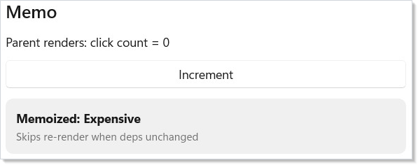
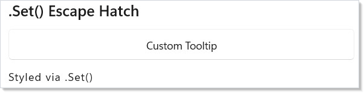
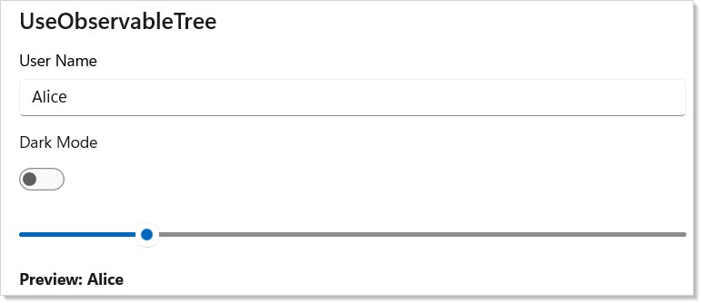
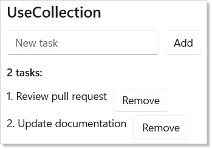

Advanced is the layer where Microsoft.UI.Reactor (Reactor)'s declarative ceiling meets the
imperative WinUI runtime underneath. Most of the framework is shaped to
make the declarative path the right path — render is a function of
state, the reconciler turns the next element record into a control
tree, you never new up a `Button` yourself. But every real app has a
handful of jobs that don't fit: focusing the password field after a
login error, integrating an existing MVVM view model that already owns
its INPC story, recovering from a crash inside a third-party
component's render, hand-tuning a 4,900-cell ticker that allocates
during scroll. The tools on this page — `ErrorBoundary`, `Memo`,
`UseElementRef`, `.Set(...)`, `UseObservableTree`, custom hooks, direct
record-initializer cell construction — are the escape hatches.
Reach for them when the declarative shape is genuinely wrong for the
job; reach back for the declarative shape the moment the escape
hatch's scope is fulfilled.

# Advanced Patterns

## Escape-hatch reference

| Tool | When it's the right hammer | When it isn't |
|---|---|---|
| `ErrorBoundary` | Wrap a third-party subtree (plugin, marketplace component) that may throw during render. | App-wide error handlers — those belong to host code, not the render tree. |
| `Memo(ctx => ..., deps)` | Skip re-render of an expensive subtree when none of `deps` changed by reference. | Cheap subtrees — Memo's bookkeeping costs more than the render itself. |
| `UseElementRef<T>()` | Imperative WinUI calls scoped to one element: focus, scroll, animation handles. | Reading state from the control — your component state is the source of truth. |
| `.Set(control => ...)` | A WinUI property Reactor doesn't expose. | Properties Reactor does expose — `.Set` bypasses reconciliation's property diff. |
| `UseObservableTree` | Bridging an existing INPC view model with nested objects. | New code — prefer `UseState` and `UseReducer` from [hooks](hooks.md). |
| `UseCollection` | Wrapping an `ObservableCollection<T>` you don't own. | Owned lists — use `UseState<ImmutableList<T>>` or `ImmutableArray<T>`. |
| Custom hook (`this RenderContext`) | Reusing a hook combination across components. | One-off compositions inside a single Render. |
| Direct record-initializer cells | Profiled hot loops (tickers, stress grids). | Ordinary screens. Keep them fluent. |

## Error Boundary

`ErrorBoundary` wraps a subtree and catches exceptions during render.
Instead of crashing the whole app, the boundary displays a fallback
element:

```csharp
class ErrorBoundaryDemo : Component
{
    public override Element Render()
    {
        return VStack(12,
            SubHeading("Error Boundary"),
            ErrorBoundary(
                Component<BuggyComponent>(),
                (Exception ex) => VStack(8,
                    TextBlock("Something went wrong").Bold()
                        .Foreground("#d13438"),
                    TextBlock(ex.Message).FontSize(12).Opacity(0.7)
                ).Padding(12)
                 .Background("#fde7e9")
                 .CornerRadius(8)
            )
        ).Padding(24);
    }
}

class BuggyComponent : Component
{
    public override Element Render()
    {
        var (crash, setCrash) = UseState(false);
        if (crash) throw new InvalidOperationException("Oops!");
        return Button("Click to crash", () => setCrash(true));
    }
}
```


The first argument is the child subtree. The second is a fallback —
either a static element or a function that receives the caught
`Exception`. When the boundary re-renders (e.g., its parent updates), it
retries the child. That gives the user a chance to recover by changing
the state that caused the crash.

### Retrying a failed subtree

The retry pattern uses [`WithKey`](components.md) to assign a fresh
identity to the child each retry — same shape as React's
`resetKeys`. Bumping the key drops the previous subtree's mounted
state, so a transient failure that left bad state behind doesn't
persist:

```csharp
class ErrorBoundaryRetryDemo : Component
{
    public override Element Render()
    {
        var (resetKey, setResetKey) = UseState(0);

        return VStack(12,
            SubHeading("ErrorBoundary with retry"),
            ErrorBoundary(
                Component<FlakyComponent>().WithKey($"flaky-{resetKey}"),
                ex => VStack(8,
                    TextBlock("Couldn't load.").Bold().Foreground("#d13438"),
                    TextBlock(ex.Message).FontSize(12).Opacity(0.7),
                    // Bumping resetKey reassigns identity to the child, so the
                    // ErrorBoundary mounts a fresh subtree on the next render.
                    Button("Retry", () => setResetKey(resetKey + 1))
                ).Padding(12).Background("#fde7e9").CornerRadius(8)
            )
        ).Padding(24);
    }
}

class FlakyComponent : Component
{
    public override Element Render()
    {
        var (attempt, _) = UseState(Random.Shared.Next(0, 3));
        if (attempt == 0) throw new InvalidOperationException("Service unavailable");
        return TextBlock("Loaded.").Foreground("#107c10");
    }
}
```


The Retry button bumps `resetKey`, the child gets a new key, and the
reconciler mounts a fresh subtree on the next render. This is the same
identity-reset trick used by [navigation](navigation.md) cache
invalidation and by list-item-identity recovery in
[collections](collections.md).

## Memo

`Memo(ctx => ..., deps)` skips re-rendering an entire subtree when its
dependencies have not changed by reference. The parent can re-render
freely — the memoized subtree stays frozen:

```csharp
class MemoSubtreeDemo : Component
{
    public override Element Render()
    {
        var (count, setCount) = UseState(0);
        var (label, setLabel) = UseState("Expensive");

        return VStack(12,
            SubHeading("Memo"),
            TextBlock($"Parent renders: click count = {count}"),
            Button("Increment", () => setCount(count + 1)),
            Memo(ctx =>
            {
                // This subtree only re-renders when label changes
                return Border(
                    VStack(4,
                        TextBlock($"Memoized: {label}").Bold(),
                        TextBlock("Skips re-render when deps unchanged")
                            .FontSize(12).Opacity(0.6)
                    ).Padding(12)
                ).Background("#f0f0f0").CornerRadius(8);
            }, label)
        ).Padding(24);
    }
}
```



`Memo` takes a render function and a list of dependencies. The subtree
only re-renders when at least one dependency changes by reference
equality. Clicking "Increment" re-renders the parent, but the memoized
border stays untouched because `label` hasn't changed.

Use Memo for expensive subtrees — large [collections](collections.md),
complex [charts](charting.md), or deeply nested
[component](components.md) trees that don't depend on frequently-changing
state. For per-cell memoization inside long lists, see
[Memoizing list cells](#memoizing-list-cells).

## Imperative refs — UseElementRef

`UseElementRef<T>()` returns a stable `ElementRef<T>` whose `.Current`
the reconciler keeps in sync with the mounted control. Attach the ref
to an element with `.Ref(ref)`, then call into `.Current` from an event
handler or `UseEffect` for the imperative operations Reactor doesn't
wrap declaratively:

```csharp
class ElementRefFocusDemo : Component
{
    public override Element Render()
    {
        var (name, setName) = UseState("");
        var fieldRef = this.UseElementRef<TextBox>();

        return VStack(12,
            SubHeading("Imperative focus via ElementRef<T>"),
            TextBox(name, setName, placeholder: "Name").Ref(fieldRef),
            Button("Focus the field", () =>
                fieldRef.Current?.Focus(FocusState.Programmatic))
        ).Padding(24);
    }
}
```

The ref instance is identity-stable across re-renders (the hook returns
the same instance every time), so it's safe to use in dep arrays and
`UseEffect` capture. `.Current` is null until the element mounts; null-
check before dereferencing.

> **Caveat:** Holding a raw `FrameworkElement` (the WinUI control underneath, not the
> Reactor `ElementRef<T>`) across renders is unsafe. The reconciler may
> unmount, pool, or replace the underlying control between renders — the
> control you cached in a `static` field or in a captured local is
> no longer attached to the tree, and any property you set on it has no
> effect. `UseElementRef<T>` is the supported shape: the ref instance is
> stable, but `.Current` is **re-read each time** through a property the
> reconciler updates on mount and unmount. The analyzer
> `REACTOR_HOOKS_005` catches the common forms (caching a control in a
> field, dereferencing without null-checking), but indirect caches
> through helper methods aren't visible to it — keep the rule in your
> head: never store the control, always go through the ref.

## .Set() escape hatch

`.Set()` gives you direct access to the underlying WinUI control. Use
it for the properties Reactor doesn't expose as modifiers:

```csharp
class SetEscapeHatchDemo : Component
{
    public override Element Render()
    {
        return VStack(12,
            SubHeading(".Set() Escape Hatch"),
            Button("Custom Tooltip", () => { })
                .Set(btn =>
                {
                    Microsoft.UI.Xaml.Controls.ToolTipService
                        .SetToolTip(btn, "This is a native tooltip");
                    btn.Padding = new Thickness(20, 10, 20, 10);
                }),
            TextBlock("Styled via .Set()")
                .Set(tb =>
                {
                    tb.TextWrapping = TextWrapping.WrapWholeWords;
                    tb.CharacterSpacing = 80;
                    tb.IsTextSelectionEnabled = true;
                })
        ).Padding(24);
    }
}
```



Each element type has a typed `.Set()` overload. `Button` receives an
`Action<Microsoft.UI.Xaml.Controls.Button>`, `Text` receives
`Action<TextBlock>`, and so on. The callback runs at both mount and
update, so set properties idempotently — don't accumulate event
handlers. Use `.OnMount(...)` instead when you need a one-shot
attachment.

`.Set` bypasses the property-diff path in reconciliation — the
reconciler doesn't know about state you write through the callback, so
the next render that touches a real modifier will not unwind it. Treat
`.Set` as one-way: you're driving the control, not letting Reactor
manage it.

## Custom hooks

Custom hooks compose existing hooks into reusable shapes. They're
extension methods on `RenderContext` — the same shape as the built-in
hooks, called from any function-component `Memo(ctx => ...)` or from
a class component's `Context`:

```csharp
// Custom hook — composes UseState + UseEffect on RenderContext. Treated like
// a built-in hook from any function-component Render. Same hook-rules apply:
// call unconditionally, at the top of render, in the same order every time.
static class TogglerHook
{
    public static (bool IsOn, Action Toggle) UseToggler(this RenderContext ctx, bool initial = false)
    {
        var (on, setOn) = ctx.UseState(initial);
        return (on, () => setOn(!on));
    }
}

class CustomHookDemo : Component
{
    public override Element Render() => Memo(ctx =>
    {
        var (isOn, toggle) = ctx.UseToggler();
        return VStack(8,
            SubHeading("Custom hook: UseToggler"),
            Button(isOn ? "On" : "Off", toggle),
            TextBlock(isOn ? "State is on." : "State is off.")
                .Foreground(isOn ? "#107c10" : "#666666")
        ).Padding(24);
    });
}
```

The same hook rules apply (see [rules-of-reactor](rules-of-reactor.md)):
call unconditionally, at the top of render, in the same order every
time, never inside loops or conditionals. The analyzer
`REACTOR_HOOKS_001` enforces these rules across custom hooks as well as
built-ins — it walks the call graph through extension methods.

## Observable bridges — UseObservableTree

`UseObservableTree` bridges `INotifyPropertyChanged` view models into
the declarative render cycle. It subscribes to property changes at
every depth and re-renders the component when any nested property
fires.

Define a standard INPC view model:

```csharp
class SettingsViewModel : INotifyPropertyChanged
{
    private string _userName = "Alice";
    private bool _darkMode;
    private int _fontSize = 14;

    public string UserName
    {
        get => _userName;
        set { _userName = value; Notify(nameof(UserName)); }
    }
    public bool DarkMode
    {
        get => _darkMode;
        set { _darkMode = value; Notify(nameof(DarkMode)); }
    }
    public int FontSize
    {
        get => _fontSize;
        set { _fontSize = value; Notify(nameof(FontSize)); }
    }

    public event PropertyChangedEventHandler? PropertyChanged;
    private void Notify(string n) =>
        PropertyChanged?.Invoke(this, new(n));
}
```

Then bind it in a component with `UseObservableTree`:

```csharp
class ObservableTreeDemo : Component
{
    private static readonly SettingsViewModel _vm = new();

    public override Element Render()
    {
        var vm = UseObservableTree(_vm);

        return VStack(12,
            SubHeading("UseObservableTree"),
            TextBox(vm.UserName, v => vm.UserName = v,
                header: "User Name"),
            ToggleSwitch(vm.DarkMode, v => vm.DarkMode = v,
                header: "Dark Mode"),
            Slider(vm.FontSize, 10, 32, v => vm.FontSize = (int)v),
            TextBlock($"Preview: {vm.UserName}")
                .FontSize(vm.FontSize).Bold()
        ).Padding(24);
    }
}
```



The view model is a plain C# class with `INotifyPropertyChanged`. You
mutate it directly (`vm.UserName = v`) and Reactor re-renders. This is
the migration bridge for teams arriving with existing MVVM view models
— they work without modification.

`UseObservable(source)` is the shallow variant: it only subscribes to
the source object's own `PropertyChanged` events, not nested objects.
Prefer it for flat view models — `UseObservableTree` walks the entire
graph on every render and the cost shows up on deep object trees.

## UseCollection

`UseCollection` tracks an `ObservableCollection<T>` and re-renders the
component when items are added, removed, or the collection resets:

```csharp
class ObservableCollectionDemo : Component
{
    private static readonly ObservableCollection<string> _tasks = new()
        { "Review pull request", "Update documentation" };

    public override Element Render()
    {
        var tasks = UseCollection(_tasks);
        var (input, setInput) = UseState("");

        return VStack(12,
            SubHeading("UseCollection"),
            HStack(8,
                TextBox(input, setInput, placeholder: "New task")
                    .Width(200),
                Button("Add", () => {
                    if (!string.IsNullOrWhiteSpace(input))
                    { _tasks.Add(input.Trim()); setInput(""); }
                })
            ),
            TextBlock($"{tasks.Count} tasks:").SemiBold(),
            VStack(4, tasks.Select((task, i) =>
                HStack(8,
                    TextBlock($"{i + 1}. {task}"),
                    Button("Remove", () => _tasks.RemoveAt(i))
                ).WithKey($"task-{i}-{task}")
            ).ToArray())
        ).Padding(24);
    }
}
```



The hook returns `IReadOnlyList<T>` — you read from it in render and
mutate the original `ObservableCollection` in event handlers. Reactor
subscribes to `CollectionChanged` and triggers a re-render on any
modification. For owned lists (collections you created in the same
component), prefer `UseState<ImmutableList<T>>` — the immutable shape
fits the render-from-state model without an observable middleman.

## Hot loops

The fluent modifier chain is ergonomic but allocates an
`ElementModifiers` clone per `with`-step. For ordinary UI that cost is
invisible — a button with five modifiers means two extra small records
allocated on a click handler. For inner-loop cell construction in a
4,900-cell grid that re-renders 30× per second, those clones dominate
the allocation profile.

The escape hatch is to construct the `Element` and its
`ElementModifiers` record directly, skipping the fluent chain entirely.
`LayoutModifiers` and `VisualModifiers` are public types specifically
so perf-critical code can build them once instead of having the fluent
chain rebuild them step-by-step.

```csharp
// Fluent — five clones per cell. Right tool for ordinary UI.
var cell = TextBlock(label)
    .FontSize(8)
    .Foreground(item.IsUp ? GreenBrush : RedBrush)
    .Padding(2, 1, 2, 1)
    .Grid(row: r, column: c);

// Direct record initializer — one TextBlockElement, one ElementModifiers,
// two bucket sub-records, one Attached dictionary. Use only when the
// allocation cost shows up in profiles.
var cell = new TextBlockElement(label)
{
    FontSize = 8,
    Modifiers = new ElementModifiers
    {
        Layout = new LayoutModifiers { Padding = new Thickness(2, 1, 2, 1) },
        Visual = new VisualModifiers { Foreground = item.IsUp ? GreenBrush : RedBrush },
    },
    Attached = new Dictionary<Type, object>(1)
    {
        [typeof(GridAttached)] = new GridAttached(r, c, 1, 1),
    },
};
```

**Workload shape.** Use this idiom in lists or grids with hundreds-plus
elements per render — tickers, log tables, observability dashboards.
Don't adopt it for ordinary screens. The fluent chain is the right tool
for everything except the inner cell loop.

**Trade-offs.** Roughly halves the allocation cost of cell construction
on the 4,900-cell stress grid, but loses fluent ergonomics. The direct
form is more brittle to refactor — changing one field touches an
explicit initializer block instead of a chain step. Restrict it to the
identifiable hot loop and keep the rest of the file fluent. See
[modifier-system](modifier-system.md) for the under-the-hood explanation
of why the fluent chain allocates.

**Reference implementation.** The canonical before/after pair lives in
`tests/stress_perf/StressPerf.Reactor` (naive — fluent chain, the shape
unaware users write) and `tests/stress_perf/StressPerf.ReactorOptimized`
(idiomatic perf-tuned variant). Same workload, side-by-side diffable.

## Memoizing list cells

`UseMemoCells` skips the cell-build for indices whose item value (and
declared dependencies) haven't changed since the previous render. The
reconciler's `ReferenceEquals` shortcut means a reused cell allocates
nothing and skips diffing entirely.

```csharp
var theme = ctx.UseTheme();
var children = ctx.UseMemoCells(
    stocks,
    (item, i) => Cell(item, theme),
    theme);   // ← deps; framework invalidates on change
```

**When it's the right hammer.** Tickers, log tables, file lists, large
read-only grids — anywhere the cell content is a pure function of `T`
plus a small set of declared deps.

**When it's the wrong hammer.** Rows whose chrome depends on focus,
drag, selection, or hover state that you aren't capturing in deps.
Memo silently renders stale when an external state change isn't
declared as a dep — the analyzer below catches the obvious cases, but
indirect captures through helper methods aren't visible to it.

**Three overloads:**

| Overload | Use when |
|---|---|
| `UseMemoCells<T>` | Per-item value equality. Default choice. |
| `UseMemoCellsByKey<T, TKey>` | Items have stable identity but mutable interior. Hashes by key, value-compares for content. Reordered keys reuse cells via the reconciler's keyed-children path. |
| `UseMemoCellsByIndex<T>` | Data source already knows which indices changed. Skips the per-cell equality scan; only the named indices run the builder. |

**gen2 caveat.** Memo trades short-lived gen0 churn for longer-lived
gen1/gen2 retention. Many memoized lists across an app can compound
gen2 pressure even when bytes-per-tick drops. Profile before adopting
across the board — see
[perf-instrumentation](perf-instrumentation.md) for ETW-driven sampling
and [performance](performance.md) for the top-down walkthrough.

**Compile-time safety net.** The companion Roslyn analyzer
`REACTOR_HOOKS_007` warns when a builder closure captures a value that
isn't declared in the deps list. Codefix is "add the missing capture to
deps". Indirect captures through intermediate methods are a documented
blind spot — the analyzer can't see through a method call without
whole-program analysis (same blind spot as React's
`react-hooks/exhaustive-deps`).

## Patterns

### Custom hook authoring

Custom hooks let you bundle a hook combination behind a single name —
`UseDebouncedValue`, `UseWindowScroll`, `UsePersistedToggle` — and reuse
it across components. They're plain `RenderContext` extension methods.
The [rules-of-reactor](rules-of-reactor.md) page covers naming
conventions (`Use*` prefix) and call-order discipline; the
[hooks-internals](hooks-internals.md) page explains why custom hooks
work — Reactor doesn't distinguish them from built-ins, the slot table
just counts hook invocations in order.

### ErrorBoundary with retry key

The retry pattern shown above scales to async failures, transient
network errors, and any subtree whose state should reset on user
acknowledgment. Pair the retry key with an [async resource](async-resources.md)
that holds the in-flight task — bumping the key cancels the previous
attempt by reassigning identity, so a slow fetch from the failed
attempt doesn't race with the new one.

### Imperative focus from an event handler

A login form that focuses the password field when the username is
valid is the canonical `UseElementRef` shape — see the snippet above
for the call site. The same shape covers focusing a list item after a
keyboard shortcut, scrolling a `VirtualList` to a known index via
[`VirtualListRef`](collections.md), and starting a Composition
animation on a known control. For the broader focus model (focus trap,
enter-to-advance, automation tree), see
[accessibility](accessibility.md) and
[focus-and-input-internals](focus-and-input-internals.md).

## Common Mistakes

### Caching elements (or controls) in module-level statics

```csharp
// Don't — the FrameworkElement underneath is pool-managed.
static TextBox? _passwordField;

public override Element Render()
{
    var (pwd, setPwd) = UseState("");
    return TextBox(pwd, setPwd).Set(c => _passwordField = c);
}

// Elsewhere:
static void FocusPassword() => _passwordField?.Focus(FocusState.Programmatic);
```

The reconciler may unmount, swap, or pool the underlying control
between renders. The static field outlives every one of those events
and ends up pointing at a detached or recycled instance. Use
[`UseElementRef<T>`](#imperative-refs--useelementref) — the ref's
`.Current` is null when the control isn't attached and is repopulated
when it remounts.

### Calling `setState` from a `UseEffect` cleanup

```csharp
// Don't — setState inside cleanup runs during unmount/dispose.
UseEffect(() =>
{
    var sub = Subscribe();
    return () => { sub.Dispose(); setState(false); };  // ← stale state, may throw
}, []);
```

Cleanup runs after the component has stopped being part of the tree;
calling `setState` from there either no-ops (the disposed render
context refuses the call) or schedules a render against state that no
longer matters. Put state resets in the effect body or in an event
handler that explicitly transitions the parent. See
[effects-scheduling](effects-scheduling.md) for cleanup ordering.

### Subscribing to events from a parent that captures the wrong `this`

```csharp
// Don't — captures the parent's `this` inside the child component.
class Parent : Component
{
    public override Element Render() =>
        Component<Child>().Set(c => c.Loaded += (s, e) => this.OnChildLoaded());
}
```

`.Set(control => ...)` runs on every mount and update — every event
subscription accumulates. The `this` inside the lambda is the parent
component, captured at the lambda's closure site, which keeps a strong
reference to a stale render's component instance after the parent has
re-rendered. Two fixes: lift the handler to a stable `UseCallback`
in the parent and pass it via [props](components.md), or use
`.OnMount(...)` for a one-shot subscription with explicit cleanup.

### Reaching for `.Set` when a modifier exists

```csharp
// Don't — Reactor exposes .RequestedTheme() as a modifier.
Button("Save", onSave).Set(c => c.RequestedTheme = ElementTheme.Dark);
```

The modifier participates in property diffing — the next render that
removes the modifier walks the property back to default. `.Set` is
imperative and one-way; the next render won't undo it. Prefer the
modifier when one exists; reserve `.Set` for properties Reactor
genuinely doesn't expose. The `REACTOR_THEME_003` analyzer catches this
specific case for `RequestedTheme`; the same shape applies broadly.

## Tips

**Wrap third-party components in `ErrorBoundary`.** If a plugin or
marketplace component throws during render, the boundary stops it from
taking down your entire app. Pair with a Retry button keyed by a
`UseState` counter to let users recover without restarting the app.

**Profile before memoizing.** `Memo` adds bookkeeping cost and a
second hook slot per subtree. Only reach for it when you have measured
a re-render bottleneck on a profiler. Most subtrees re-render fast
enough without it.

**Prefer declarative modifiers over `.Set()`.** Every `.Set()` call is
an escape hatch that bypasses Reactor's property diff. Reserve it for
WinUI properties Reactor doesn't expose. If you find yourself reaching
for `.Set` frequently, the right next step is a Reactor feature
request — the framework should grow a modifier for the common case.

**Keep view models outside the component.** Store them as `static`
fields or inject them via [context](context.md). Creating a new view
model inside `Render()` would allocate a fresh object on every render
and lose all state, plus break the `UseObservableTree` subscription on
every render.

**Use `UseObservable` when depth is one level.** `UseObservableTree`
walks the entire object graph on every change. For flat view models
with no nested INPC objects, `UseObservable` is cheaper and produces
fewer event subscriptions.

## Next Steps

- **[Data System](data-system.md)** — DataGrid with sort, filter, and inline editing
- **[WinForms Interop](winforms-interop.md)** — host Reactor components inside WinForms applications
- **[Charting](charting.md)** — data visualization with line, bar, area, pie, and force-directed charts
- **[Hooks](hooks.md)** — review the hook system that `UseObservableTree`, `UseCollection`, and custom hooks build on
- **[Effects and Lifecycle](effects.md)** — side-effect scheduling alongside observable data binding
- **[Hooks internals](hooks-internals.md)** — Under-the-hood: how hooks actually store their values
- **[Modifier system](modifier-system.md)** — Under-the-hood: why the fluent chain allocates, and what the direct-initializer escape buys
- **[Rules of Reactor](rules-of-reactor.md)** — hook rules, render purity, and the dos and don'ts of custom hook authoring
