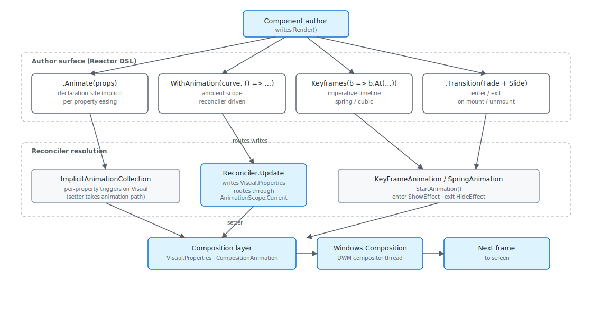

Microsoft.UI.Reactor (Reactor)'s animation surface looks deceptively simple — set
`.Opacity(visible ? 1 : 0)` and attach `.OpacityTransition()`, and the
property change animates on next render. Underneath, four distinct
systems route into the same compositor layer: declaration-site implicit
animation via `.Animate(properties)`, an ambient
[`WithAnimation`](animation.md) scope that captures the reconciler's
property writes and replays them through a curve, the
[`KeyframeBuilder`](animation.md) imperative timeline, and the
`.Transition()` enter/exit machinery that runs when an element mounts
or unmounts. All four converge on Windows Composition, which runs
animation interpolation on a dedicated compositor thread — separately
from the UI thread, which is why a stalled `Render()` doesn't stutter a
running animation. The most common mistake is reaching for an animation
on a layout property (Width, Height, Margin) and finding the animation
stutters; those properties live in WinUI's layout system, not the
compositor's, so they animate at layout rate instead of frame rate.

# Animation Pipeline

This page maps the four authoring surfaces onto the underlying
compositor and explains the trade-offs that pick one surface over
another. The user-facing API is on the
[Animation](animation.md) page; this is the internals view.

## The four systems



Each system answers a different question. `.Animate(properties)` says
"any time these properties change on this element, smooth between old
and new"; the curve and duration are part of the element's
configuration. `WithAnimation(curve, body)` says "run `body` and route
every reconciler-driven property write into a transition with this
curve"; the curve is ambient to the call, not attached to any element.
`KeyframeBuilder` builds an explicit timeline you can name and trigger.
`.Transition(...)` is for the mount / unmount edge, where the property
change isn't between two values at all — the element is appearing or
disappearing.

```csharp
public static void WithAnimation(Curve? curve, Action action)
{
    var prevCurve = _current;
    var prevScope = _hasScope;
    _current = curve;
    _hasScope = true;
    try { action(); }
    finally { _current = prevCurve; _hasScope = prevScope; }
}
```

`WithAnimation` is a `[ThreadStatic]` scope, not an element modifier.
That matters: it captures property writes made by *anything* running
inside the scope, including code that runs through the
[reconciler](reconciliation.md) on a setState callback. The
`HasScope` flag carries through the `try / finally` so nested scopes
correctly restore the outer curve when they exit. Reach for this when
the trigger for the animation is a state change rather than a property
delta — the reconciler's natural fire-after-state-change behavior is
what routes the writes into the scope.

> **Caveat:** The compositor only animates a fixed set of properties cheaply:
> `Opacity`, `Offset` (translation), `Scale`, `Rotation`, and
> `CenterPoint`. Anything else — `Width`, `Height`, `Margin`,
> `Background`, `Foreground` — has to go through XAML's property system,
> which means a layout pass per frame. The
> [`AnimateProperty`](animation.md) flag enum reflects exactly the
> compositor-cheap set; if your animation isn't smooth, the property
> you're animating probably isn't in it. Switch to a transform
> (scale a button down rather than animate its width) or accept that the
> animation will hold up the UI thread.

## Transition composition

```csharp
public abstract record Transition
{
    // -- Presets --
    public static readonly Transition Fade = new FadeTransition();
    public static Transition Slide(Edge edge = Edge.Bottom) => new SlideTransition(edge);
    public static Transition Scale(float from = 0.85f) => new ScaleTransition(from);

    // -- Asymmetric factory --
    public static Transition Enter(Transition enter) => new DirectionalTransition(enter, null);
    public static Transition Exit(Transition exit) => new DirectionalTransition(null, exit);

    // -- Combinators --
    /// <summary>Combine two transitions to play in parallel (e.g., Fade + Slide).</summary>
    public static Transition operator +(Transition a, Transition b) => new CombinedTransition(a, b);

    /// <summary>Asymmetric: left side is enter, right side is exit.</summary>
    public static Transition operator |(Transition enter, Transition exit)
        => new AsymmetricTransition(enter, exit);
}
```

`Transition` is the enter/exit machinery — what runs when an element
appears in or disappears from the tree on a re-render. The composition
operators are the API: `Fade + Slide(Bottom)` runs both in parallel,
`Fade | Scale(0.85f)` is asymmetric (`|` reads as "enter | exit"). The
combinators produce record types (`CombinedTransition`,
`AsymmetricTransition`); the reconciler walks the record graph at
mount and unmount time and translates each leaf into a
`CompositionAnimation` that targets the underlying Visual.

The mount path attaches `Fade.Enter` to the new element's Visual after
[the reconciler](reconciliation.md) creates it, runs the animation, and
clears the override once it completes. The unmount path is the inverse
and is the trickier of the two: WinUI normally removes a child from
its panel immediately on detach, which would kill the exit animation
mid-flight. Reactor holds the element in a "leaving" pseudo-state
until the exit transition's `CompositionScopedBatch` reports
completion, then commits the detach. State changes that fire while an
element is leaving go to the new tree, never the leaving one — the
leaving element is read-only.

## Reference

| Surface | Owner type | When to use | Compositor thread? |
|---|---|---|---|
| `.Animate(props, curve)` | `AnimationConfig` | Stable element, animate a property delta on every change. | Yes (per-property triggers) |
| `WithAnimation(curve, body)` | `AnimationScope` | The change is driven by `setState`, animate whatever the reconciler writes. | Yes (writes route through scope) |
| `Keyframes(name, b => ...)` | `KeyframeBuilder` | Named, repeatable timeline triggered imperatively. | Yes (explicit `KeyFrameAnimation`) |
| `.Transition(t)` | `ElementTransition` | The element is appearing / disappearing on a render. | Yes (mount-time + unmount-leave hold) |

`AnimationScope.HasScope` distinguishes "no scope" from "explicit
suppression": passing `null` as the curve marks the scope active but
disables animation, useful for one-off explicit writes inside an outer
animated scope.

## Keyframe authoring

```csharp
public KeyframeBuilder At(float progress,
    float? opacity = null, Vector3? scale = null,
    Vector3? translation = null, float? rotation = null,
    Easing? easing = null)
{
    if (progress < 0f || progress > 1f)
        throw new ArgumentOutOfRangeException(nameof(progress), progress, "Progress must be between 0.0 and 1.0.");

    _keyframes.Add(new KeyframeDef(progress)
    {
        Opacity = opacity,
        Scale = scale,
        Translation = translation,
        Rotation = rotation,
        Easing = easing,
    });
    return this;
}
```

[`KeyframeBuilder.At(progress, ...)`](animation.md) is the per-frame
entry point — `progress` is normalized 0.0 to 1.0 across the
animation's `Duration`. Each property argument is optional, so a
keyframe that only sets `Opacity` leaves `Scale` and the rest at their
interpolated values. The internal `KeyframeDef` record carries the
optional easing override for that segment; when omitted, the segment
inherits the animation's default curve.

`KeyframeBuilder` produces a `KeyframeAnimationDef` — pure data, no
compositor types. The reconciler is the layer that turns the def into a
`KeyFrameAnimation` and calls `Visual.StartAnimation` on the materialized
element. Building the def in component code rather than building a
`CompositionAnimation` directly means the same definition can flow
through serialization, hot reload, or a future declarative
keyframe authoring API without touching the compositor binding.

## Patterns

### Animating an entire conditional subtree

When a state flag toggles a chunk of UI, reach for `.Transition()`
on the wrapping element rather than per-property animations on each
child. The element's enter / exit drive the whole subtree's
appearance through one transition spec:

```csharp
public override Element Render()
{
    var (show, setShow) = UseState(false);
    return VStack(
        Button(show ? "Hide" : "Show", () => setShow(!show)),
        show
            ? Card(Text("Hello")).Transition(Transition.Fade + Transition.Slide(Edge.Top))
            : null
    );
}
```

The reconciler treats the `null` branch as an unmount and the
`Card(...)` branch as a mount; the `.Transition` modifier on the
`Card` is what tells it to play the enter combination on mount and
the symmetric exit on unmount. The
[reconciliation](reconciliation.md) page documents the
mount / leave / unmount state machine in detail.

## Common Mistakes

### Animating a layout property and expecting compositor smoothness

```csharp
// Don't:
return Border(child)
    .Width(expanded ? 400 : 100)        // layout property, not compositor
    .Animate(AnimateProperty.All);      // no effect on Width
```

```csharp
public static void WithAnimation(Curve? curve, Action action)
{
    var prevCurve = _current;
    var prevScope = _hasScope;
    _current = curve;
    _hasScope = true;
    try { action(); }
    finally { _current = prevCurve; _hasScope = prevScope; }
}
```

`.Animate(AnimateProperty.All)` only triggers implicit animations on
the five compositor properties (`Opacity`, `Offset`, `Scale`,
`Rotation`, `CenterPoint`). `Width` is a XAML layout property — to
animate it, the panel measures and arranges every frame, on the UI
thread. The correct shape is to express the size change as a scale
transform on a fixed-size child, or to gate the change behind a
`WithAnimation` scope so at least the property write coalesces across
the dispatcher hop.

## Tips

**Five properties animate cheaply, the rest don't.** The compositor
animates `Opacity`, `Offset`, `Scale`, `Rotation`, and `CenterPoint`
on its own thread — anything else takes the layout path. When picking
between an authoring shape, prefer one that targets the cheap set
(a scaled button instead of a resized button, a translated panel
instead of a margined panel).

**`Curve.Spring` is the Reactor default.** A spring curve has no
explicit duration — it settles when the physics says it does, which
tends to feel more responsive than a fixed-duration ease. Reach for
`Curve.Ease(durationMs)` only when the duration is part of the
design contract (e.g. matching a toast that times out after 400ms).

**One scope per state cascade.** When a single setState fires three
property writes that should all animate together, wrap the work in
one `WithAnimation` scope rather than attaching three `.Animate(...)`
modifiers. The single scope keeps the writes coherent across the
[reconciler's](reconciliation.md) update pass.

## Next Steps

- **[Animation](animation.md)** — Surface-level animation API and ready-made transitions.
- **[Reconciliation](reconciliation.md)** — How mount / leave / unmount drive transition lifecycle.
- **[Focus and Input Internals](focus-and-input-internals.md)** — Companion under-the-hood page on input.
- **[Hooks Internals](hooks-internals.md)** — Why `setState` cascades animate consistently.
- **[Perf Instrumentation](perf-instrumentation.md)** — Reading ETW events from animation frames.
