# Animation

Reactor animations are declarative. You set the target value (opacity, scale,
translation) and attach a transition modifier. When the value changes on the
next render — driven by [hooks](hooks.md) and state — WinUI animates from
the old value to the new one automatically.

## Opacity Transition

`.OpacityTransition()` animates opacity changes. Set `.Opacity()` to your
target value and the transition handles the rest:

```csharp
class OpacityDemo : Component
{
    public override Element Render()
    {
        var (visible, setVisible) = UseState(true);

        return VStack(12,
            SubHeading("Opacity Transition"),
            Button(visible ? "Fade Out" : "Fade In",
                () => setVisible(!visible)),
            Text("This text fades in and out")
                .FontSize(18).Bold()
                .Opacity(visible ? 1.0 : 0.0)
                .OpacityTransition(TimeSpan.FromMilliseconds(500))
        ).Padding(24);
    }
}
```

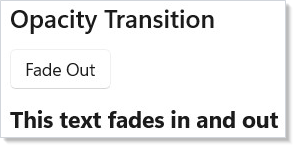

The optional `TimeSpan` parameter controls duration. The default is 300ms.
Use this for fade-in/fade-out on showing and hiding elements.

## Scale Transition

`.ScaleTransition()` animates scale changes. Set `.Scale()` to the target
factor:

```csharp
class ScaleDemo : Component
{
    public override Element Render()
    {
        var (enlarged, setEnlarged) = UseState(false);

        return VStack(12,
            SubHeading("Scale Transition"),
            Button(enlarged ? "Shrink" : "Enlarge",
                () => setEnlarged(!enlarged)),
            Border(
                Text("Scales up and down").FontSize(18).Bold()
            ).Padding(12)
             .CornerRadius(8)
             .Background("#e8e8e8")
             .ScaleTransition()
        ).Padding(24);
    }
}
```

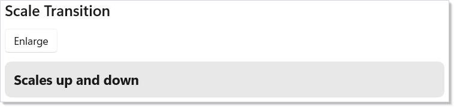

Scale uses the element's center as the transform origin. A value of `1.0f` is
normal size, `1.5f` is 150%. You can pass a custom `Vector3Transition` to
control which axes animate.

## Translation Transition

`.TranslationTransition()` animates position offsets. Set `.Translation()`
to the target X, Y, Z offset in pixels:

```csharp
class TranslationDemo : Component
{
    public override Element Render()
    {
        var (moved, setMoved) = UseState(false);

        return VStack(12,
            SubHeading("Translation Transition"),
            Button(moved ? "Slide Back" : "Slide Right",
                () => setMoved(!moved)),
            Text("Slides horizontally")
                .FontSize(18).Bold()
                .Translation(moved ? 120f : 0f, 0f, 0f)
                .TranslationTransition()
        ).Padding(24);
    }
}
```

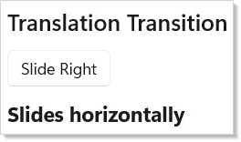

Translation offsets are relative to the element's layout position. Positive X
moves right, positive Y moves down. The element still occupies its original
layout space — only the visual position changes.

## Background Transition

`.BackgroundTransition()` animates background color changes on `VStack`,
`HStack`, and `Grid` elements:

```csharp
class BackgroundDemo : Component
{
    public override Element Render()
    {
        var (warm, setWarm) = UseState(false);

        return VStack(12,
            SubHeading("Background Transition"),
            Button(warm ? "Cool Colors" : "Warm Colors",
                () => setWarm(!warm)),
            VStack(8,
                Text("Background animates between colors")
                    .Foreground("#ffffff").Bold()
            ).Padding(16)
             .CornerRadius(8)
             .Background(warm ? "#da3b01" : "#0078d4")
             .BackgroundTransition(TimeSpan.FromMilliseconds(600))
        ).Padding(24);
    }
}
```

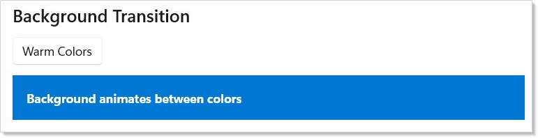

Background transitions use WinUI's `BrushTransition`. They only work on
panel elements (`StackPanel`, `Grid`) because WinUI restricts
`BackgroundTransition` to those types.

## Combining Transitions

You can chain multiple transition modifiers on a single element. Each
property animates independently:

```csharp
class CombinedDemo : Component
{
    public override Element Render()
    {
        var (active, setActive) = UseState(false);

        return VStack(12,
            SubHeading("Combined Transitions"),
            Button(active ? "Reset" : "Animate",
                () => setActive(!active)),
            Border(
                Text("All at once").FontSize(16).Bold()
                    .Foreground("#ffffff")
            ).Padding(16)
             .CornerRadius(8)
             .Background("#7b2ab5")
             .Opacity(active ? 1.0 : 0.4)
             .Translation(active ? 40f : 0f, 0f, 0f)
             .OpacityTransition(TimeSpan.FromMilliseconds(400))
             .TranslationTransition()
        ).Padding(24);
    }
}
```

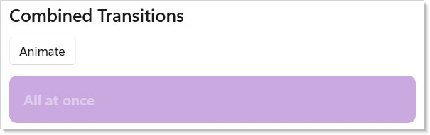

Each transition modifier is independent — `.OpacityTransition()` animates
opacity while `.ScaleTransition()` animates scale simultaneously. Set the
target values (`.Opacity()`, `.Scale()`, `.Translation()`) and the
transitions handle the animation for each property in parallel.

## Layout Animation

`.LayoutAnimation()` animates elements when their position changes due to
layout reflow — items entering, leaving, or reordering in a [collection](collections.md):

```csharp
class LayoutAnimationDemo : Component
{
    public override Element Render()
    {
        var (items, updateItems) = UseReducer(
            new List<string> { "Apple", "Banana", "Cherry" });
        var nextId = UseRef(3);

        return VStack(12,
            SubHeading("Layout Animation"),
            HStack(8,
                Button("Add Item", () => {
                    nextId.Current++;
                    updateItems(l => [.. l, $"Item {nextId.Current}"]);
                }),
                Button("Remove Last", () => updateItems(l =>
                    l.Count > 0 ? l.Take(l.Count - 1).ToList() : l))
            ),
            VStack(4, items.Select(item =>
                Text(item).Padding(8, 12).Background("#f0f0f0")
                    .CornerRadius(4).LayoutAnimation()
                    .WithKey($"item-{item}")
            ).ToArray())
        ).Padding(24);
    }
}
```

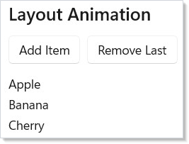

Layout animation works at the Composition layer. When WinUI repositions an
element (e.g., a sibling is added or removed), Reactor animates from the old
position to the new one. Use `.WithKey()` on each element so the reconciler
can track identity across reorders.

You can also use `.LayoutAnimation(TimeSpan)` for a custom duration or
`.SpringLayoutAnimation()` for a bouncy feel.

## Connected Animation

`.ConnectedAnimation(key)` creates a visual continuity effect between two
views. When an element with a key is unmounted and another with the same key
is mounted, WinUI animates a snapshot from the old position to the new one:

```csharp
class ConnectedAnimationDemo : Component
{
    public override Element Render()
    {
        var (selected, setSelected) = UseState<string?>(null);

        if (selected is not null)
            return VStack(12,
                Button("Back to list", () => setSelected(null)),
                Text(selected)
                    .FontSize(28).Bold()
                    .ConnectedAnimation($"title-{selected}")
            ).Padding(24);

        var items = new[] { "Photos", "Music", "Videos" };
        return VStack(12,
            SubHeading("Connected Animation"),
            VStack(4,
                items.Select(item =>
                    Button(item, () => setSelected(item))
                        .ConnectedAnimation($"title-{item}")
                ).ToArray()
            )
        ).Padding(24);
    }
}
```

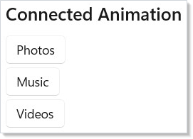

Both the source and destination elements must use the same key string. The
animation runs automatically when the reconciler detects the transition.
Use connected animations for list-to-detail [navigation](navigation.md)
where an element "flies" from the list into the detail view.

## WithAnimation Scope

`AnimationScope.WithAnimation()` wraps a state change so that every
compositor property modified during the scope animates with the given curve.
Call it inside a button handler or effect:

```csharp
class WithAnimationDemo : Component
{
    public override Element Render()
    {
        var (opacity, setOpacity) = UseState(1.0);

        return VStack(12,
            SubHeading("WithAnimation Scope"),
            Button(opacity > 0.5 ? "Fade Out" : "Fade In", () =>
            {
                Microsoft.UI.Reactor.Animation.AnimationScope.WithAnimation(
                    Microsoft.UI.Reactor.Animation.Curve.Ease(300, Microsoft.UI.Reactor.Animation.Easing.Decelerate), () =>
                    {
                        setOpacity(opacity > 0.5 ? 0.2 : 1.0);
                    });
            }),
            Text("Compositor-animated via WithAnimation scope")
                .FontSize(18).Bold()
                .Opacity(opacity)
        ).Padding(24);
    }
}
```

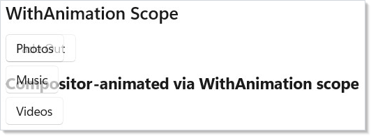

`WithAnimation` captures the curve, triggers the state change, and any
`.Opacity()`, `.Scale()`, `.Translation()`, or `.Rotation()` values that
change during the render animate on the compositor thread. The managed
render completes instantly — animation runs on the GPU.

## .Animate() Modifier

`.Animate(curve)` attaches a persistent implicit animation to an element.
Every time a compositor property changes (opacity, offset, scale, rotation),
it animates with the given curve — no scope needed:

```csharp
class AnimateDemo : Component
{
    public override Element Render()
    {
        var (active, setActive) = UseState(false);

        return VStack(12,
            SubHeading(".Animate() Modifier"),
            Button(active ? "Reset" : "Animate", () => setActive(!active)),
            Border(
                Text("Spring-animated").FontSize(18).Bold()
            ).Padding(12).CornerRadius(8).Background("#e8e8e8")
             .Opacity(active ? 0.5 : 1.0)
             .Animate(Microsoft.UI.Reactor.Animation.Curve.Spring(0.65f))
        ).Padding(24);
    }
}
```

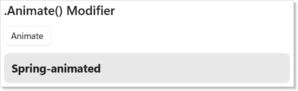

Pass a `Curve.Spring()` for a bouncy feel or `Curve.Ease(ms)` for a timed
ease. You can restrict which properties animate with the `AnimateProperty`
flags: `.Animate(Curve.Spring(), AnimateProperty.Opacity | AnimateProperty.Scale)`.

## Interaction States

`.InteractionStates()` applies hover, press, and focus effects at the
compositor layer with zero reconciles. The visual feedback runs entirely on
the GPU — Reactor's render loop is never involved:

```csharp
class InteractionStatesDemo : Component
{
    public override Element Render()
    {
        return VStack(12,
            SubHeading("InteractionStates"),
            Text("Hover and press — zero reconcile, compositor-driven."),
            HStack(12,
                Border(
                    Text("Hover me").FontSize(16).Bold()
                        .HAlign(HorizontalAlignment.Center).VAlign(VerticalAlignment.Center)
                ).Padding(16).CornerRadius(8).Size(150, 60).Background("#50C878")
                 .InteractionStates(s => s
                    .PointerOver(opacity: 0.85f, scale: 1.05f)
                    .Pressed(scale: 0.95f, opacity: 0.7f)),
                Border(
                    Text("Press me").FontSize(16).Bold()
                        .HAlign(HorizontalAlignment.Center).VAlign(VerticalAlignment.Center)
                ).Padding(16).CornerRadius(8).Size(150, 60).Background("#9B59B6")
                 .InteractionStates(s => s
                    .PointerOver(scale: 1.03f)
                    .Pressed(scale: 0.97f, opacity: 0.8f),
                    curve: Microsoft.UI.Reactor.Animation.Curve.Spring(0.5f))
            )
        ).Padding(24);
    }
}
```

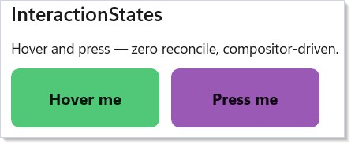

The builder supports `.PointerOver(...)`, `.Pressed(...)`, and
`.Focused(...)`. Each accepts optional `opacity`, `scale`, `translation`,
`rotation`, `background`, `foreground`, and `borderBrush` parameters. Pass
a `curve:` parameter for spring or ease transitions between states.

## Enter/Exit Transitions

`.Transition()` animates an element when it enters or leaves the tree.
Combine transitions with `+` (parallel) and `|` (asymmetric enter/exit):

```csharp
class TransitionDemo : Component
{
    public override Element Render()
    {
        var (visible, setVisible) = UseState(true);

        return VStack(12,
            SubHeading("Enter/Exit Transition"),
            Button(visible ? "Hide" : "Show", () => setVisible(!visible)),
            visible
                ? Border(
                    Text("Fade + Slide").FontSize(16).Bold()
                        .HAlign(HorizontalAlignment.Center).VAlign(VerticalAlignment.Center)
                ).Padding(12).CornerRadius(8).Size(200, 60).Background("#E74C3C")
                 .Transition(Microsoft.UI.Reactor.Animation.Transition.Fade + Microsoft.UI.Reactor.Animation.Transition.Slide(Microsoft.UI.Reactor.Animation.Edge.Bottom))
                : (Element)Text("(removed from tree)")
        ).Padding(24);
    }
}
```

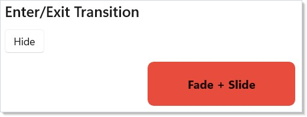

Built-in transitions:

| Transition | Effect |
|-----------|--------|
| `Transition.Fade` | Fade in/out |
| `Transition.Slide(edge)` | Slide from an edge (Left, Top, Right, Bottom) |
| `Transition.Scale(from)` | Scale from a starting factor |
| `a + b` | Run both in parallel |
| `enter \| exit` | Different transitions for enter and exit |

The default curve is 300ms with Decelerate easing. Pass a custom `Curve`
as the second parameter to override.

## Stagger

`.Stagger(delay)` on a container adds an incremental delay to each child's
enter transition and layout animation, creating a cascade effect:

```csharp
class StaggerDemo : Component
{
    public override Element Render()
    {
        var (items, setItems) = UseState(new[] { "One", "Two", "Three", "Four", "Five" });

        return VStack(12,
            SubHeading("Staggered Animation"),
            Button("Shuffle", () => setItems(items.OrderBy(_ => Random.Shared.Next()).ToArray())),
            VStack(4, items.Select(item =>
                Text(item).Padding(8, 12).Background("#f0f0f0")
                    .CornerRadius(4).LayoutAnimation()
                    .WithKey(item)
            ).ToArray()).Stagger(TimeSpan.FromMilliseconds(40))
        ).Padding(24);
    }
}
```

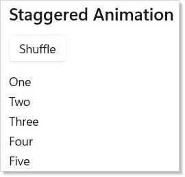

Each child's animation starts `delay` milliseconds after the previous one.
Combine with `.LayoutAnimation()` on each child and `.WithKey()` for smooth
reorder cascades.

## Keyframes

`.Keyframes(name, trigger, configure)` runs a multi-property keyframe
animation whenever `trigger` changes. Define keyframes at progress points
from 0.0 to 1.0:

```csharp
class KeyframeDemo : Component
{
    public override Element Render()
    {
        var (count, setCount) = UseState(0);

        return VStack(12,
            SubHeading("Keyframe Animation"),
            Button("Pulse!", () => setCount(count + 1)),
            Border(
                Text("Pulse target").FontSize(16).Bold()
                    .HAlign(HorizontalAlignment.Center).VAlign(VerticalAlignment.Center)
            ).Padding(12).CornerRadius(8).Size(200, 60).Background("#9B59B6")
             .Keyframes("pulse", count, kf => kf
                .Duration(600)
                .At(0.0f, scale: global::System.Numerics.Vector3.One)
                .At(0.4f, scale: new global::System.Numerics.Vector3(1.3f, 1.3f, 1f), easing: Microsoft.UI.Reactor.Animation.Easing.Decelerate)
                .At(0.7f, scale: new global::System.Numerics.Vector3(0.95f, 0.95f, 1f))
                .At(1.0f, scale: global::System.Numerics.Vector3.One, easing: Microsoft.UI.Reactor.Animation.Easing.Accelerate))
        ).Padding(24);
    }
}
```

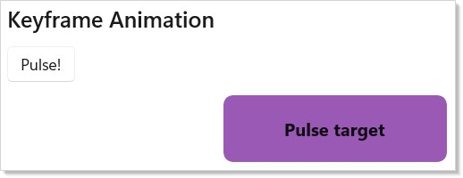

The builder supports `.Duration(ms)`, `.Loop()` for infinite repeat, and
`.At(progress, opacity?, scale?, translation?, rotation?, easing?)` for
each keyframe. Keyframes run on the compositor — no managed-code
involvement during playback.

## Choreography

`AnimationScope.WithAnimationAsync()` returns a `Task` that completes when
the compositor animation finishes. Chain multiple calls with `await` to
build sequenced animations:

```csharp
class ChoreographyDemo : Component
{
    public override Element Render()
    {
        var (phase, setPhase) = UseState(0);

        return VStack(12,
            SubHeading("Choreography (WithAnimationAsync)"),
            Button("Run Sequence", async () =>
            {
                await Microsoft.UI.Reactor.Animation.AnimationScope.WithAnimationAsync(
                    Microsoft.UI.Reactor.Animation.Curve.Ease(200), () => setPhase(1));
                await Microsoft.UI.Reactor.Animation.AnimationScope.WithAnimationAsync(
                    Microsoft.UI.Reactor.Animation.Curve.Spring(0.7f), () => setPhase(2));
            }),
            Text($"Phase: {phase}").FontSize(18).Bold()
                .Opacity(phase == 0 ? 1.0 : phase == 1 ? 0.3 : 1.0)
        ).Padding(24);
    }
}
```

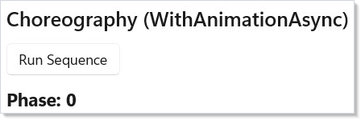

Each `await` waits for the `CompositionScopedBatch` to complete before
starting the next step. Use this for onboarding flows, multi-step reveals,
or any animation that must happen in order.

## Tips

**Keep durations short.** 200--400ms feels responsive. Anything over 500ms
feels sluggish. Use the default duration unless you have a specific reason.

**Use `.InteractionStates()` for hover/press effects.** It runs entirely on
the compositor with zero reconciles — far cheaper than tracking pointer
state in `UseState` and re-rendering.

**Use `.Transition()` for conditional rendering.** When an element enters or
leaves the tree via `When()` or ternary, `.Transition()` adds polish
without manual mount/unmount tracking.

**Combine transitions sparingly.** One or two transitions per element is
natural. Three or more competing animations can feel chaotic.

**Always set `.WithKey()` with layout animations.** Without stable keys, the
reconciler cannot track which element moved where, and the animation falls
back to a simple fade.

**Use `Curve.Spring()` for interactive feedback.** Spring curves feel
natural for user-triggered animations. Use `Curve.Ease()` for timed,
non-interactive transitions.

## Next Steps

- **[Localization](localization.md)** — previous topic: translate strings, format numbers/dates, and support RTL layouts
- **[Charting](charting.md)** — next topic: data visualization with line, bar, area, and pie charts
- **[Navigation](navigation.md)** — pair connected animations with page transitions
- **[Collections](collections.md)** — animate list items as they enter, reorder, and leave
- **[Styling and Theming](styling.md)** — combine animations with theme-aware colors
