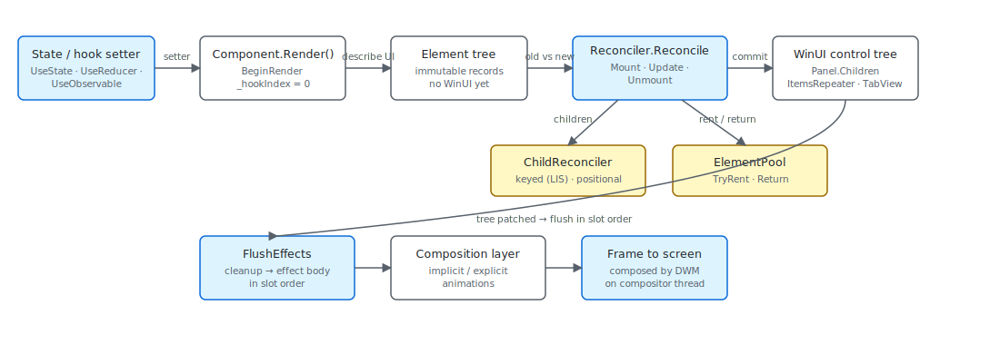

Microsoft.UI.Reactor (Reactor) is a declarative shell over WinUI. You write a `Component` whose
`Render()` method returns an immutable tree of element records — value
types that describe what you want on screen, not the WinUI controls that
implement it. A single reconciler diffs the new tree against the previous
one and edits a long-lived WinUI control tree in place, renting and
returning controls through an element pool so the heavy classes
([`Button`](text-and-media.md), [`TabView`](navigation.md),
[`ItemsRepeater`](collections.md)) survive across renders. Hooks like
[`UseState`](hooks.md) hold the state that drives the loop, and effects
fire after the reconciler has committed property writes, so the UI you
observe in an effect is the UI on screen. The most common mistake is
reading this page as "Reactor wraps XAML" — the element tree is not a
shadow XAML graph, it is a new authoring surface that happens to
materialize WinUI.

# Architecture Overview

This page maps Reactor's runtime end-to-end so the rest of the
Under-the-hood track has a shared diagram to point at. Read it once,
then jump to the section you care about: [Reactivity
Model](reactivity-model.md), [Reconciliation](reconciliation.md),
[Hooks Internals](hooks-internals.md), or
[Effects Scheduling](effects-scheduling.md).

## The render loop



The flow is one-way. A hook setter writes a new value into a
[`RenderContext`](hooks-internals.md) slot, the context calls back into
the host with a re-render request, the component's `Render()` produces a
new element tree, the reconciler walks both trees in lockstep and writes
the differences to existing WinUI controls. Nothing pulls. There is no
binding expression listening to a property; the element tree is the
single source of truth for the frame after a re-render, and the
reconciler is the single mutator.

| Subsystem | Files | What it owns |
|---|---|---|
| Component shell | `src/Reactor/Core/Component.cs` | `Render()` contract, `ShouldUpdate`, hook convenience methods |
| Hook table | `src/Reactor/Core/RenderContext.cs` | Slot table, hook implementations, UI-thread invariant |
| Elements | `src/Reactor/Core/Element.cs`, `ElementFactory.cs` | Immutable records, factory plumbing for ItemsRepeater |
| Reconciler | `src/Reactor/Core/Reconciler*.cs`, `ChildReconciler.cs` | Mount / Update / Unmount, keyed LIS diff |
| Pool | `src/Reactor/Core/ElementPool.cs` | `TryRent` / `Return` for poolable leaf controls |
| Modifiers | `src/Reactor/Elements/ElementExtensions*.cs` | Fluent modifier fold |
| Hosting | `src/Reactor/Hosting/` | Window/app bootstrap, UI dispatcher capture |
| Diagnostics | `src/Reactor/Core/Diagnostics/` | ETW provider, overlay hooks |

Every section below zooms into one row of that table.

```csharp
public abstract class Component
{
    internal RenderContext Context { get; } = new();

    /// <summary>
    /// Override to describe the UI. Use UseState, UseEffect, etc. from the context.
    /// Must call hooks in the same order every render.
    /// </summary>
    public abstract Element Render();

    /// <summary>
    /// Controls whether this propless component should re-render when its parent re-renders.
    /// Default: false — propless components only re-render from their own state changes or context changes.
    /// Override and return true to always re-render when the parent re-renders.
    /// </summary>
    protected internal virtual bool ShouldUpdate() => false;
```

`Component` is the surface — a single `abstract Element Render()` plus
the `ShouldUpdate()` hook that lets a propless component opt out of
parent-driven renders. Everything else is convenience wiring around the
[`RenderContext`](hooks-internals.md) that holds the hook slot table.
Function components (`Func(ctx => ...)`) skip the class declaration but
go through the same `RenderContext` machinery.

> **Caveat:** The reconciler never recreates the WinUI control tree on a re-render.
> If you cache a control reference outside Reactor (e.g. stash a `Button`
> from a captured ref in a long-lived field) and the element it
> materialized later gets replaced because its type changed, your stash
> points at an unmounted control still tagged with its old element. Use
> [`UseElementRef`](hooks-internals.md) and read `.Current` inside an
> effect — the ref is the only thing the reconciler keeps current.

## Element records — the immutable description

```csharp
public abstract record Element
{
    /// <summary>
    /// Optional key for stable identity across re-renders (like React's key prop).
    /// When set, the reconciler uses it to match elements across list reorderings.
    /// </summary>
    public string? Key { get; init; }

    /// <summary>
    /// Layout modifiers (margin, padding, size, alignment, etc.) applied to this element.
    /// Set via fluent extension methods: Text("hi").Margin(10).Width(200)
    /// Modifiers are stored inline so the concrete element type is preserved through chaining.
    /// </summary>
    public ElementModifiers? Modifiers { get; init; }
```

Every node in the tree is a `record` deriving from `Element`. The shape
matters: records are value-like, structurally immutable, and cheap to
allocate. A render produces a fresh tree on the heap; the previous
tree's records become garbage as soon as the reconciler finishes the
pass. The `Key` slot is the identity primitive — set it via `.WithKey()`
on collection items so the [child reconciler](reconciliation.md) can
match elements across reorderings.

Modifiers ride inside `ElementModifiers`. A chain like
`Text("hi").FontSize(24).Margin(8)` produces one `TextElement` with a
merged `Modifiers` record, not three nested wrappers — the
[modifier system](modifier-system.md) folds them so the reconciler only
sees one shape per concept.

```csharp
public UIElement GetElement(ElementFactoryGetArgs args)
{
    // Resolve the realized data → (key, dataIndex). Three paths:
    //   1. Spec 042: args.Data is ReactorRow — read both off the row.
    //   2. Legacy: args.Data is int — index directly, synthetic key.
    //   3. Fallback: unknown shape, treat as index 0.
    string key;
    int index;
    switch (args.Data)
    {
        case ReactorRow row:
            key = row.Key;
            index = row.Index;
            break;
        case int i:
            index = i;
            key = i.ToString(global::System.Globalization.CultureInfo.InvariantCulture);
            break;
        default:
            index = 0;
            key = "0";
            break;
    }

    if (index < 0 || index >= _items.Count)
        return new TextBlock { Text = "" };

    var item = _items[index];
    var element = _viewBuilder(item, index);

    UIElement? control;
    if (_recyclePool.Count > 0)
    {
        // Reuse a previously-recycled container. The framework still has
        // it parented to the ItemsRepeater, so the ViewManager.cpp:866
        // Append-skip kicks in and the visual tree stays stable.
        var reused = _recyclePool.Pop();
        if (_lastElementByControl.TryGetValue(reused, out var oldElement))
        {
            var replacement = _reconciler.Reconcile(oldElement, element, reused, _requestRerender);
            if (replacement is not null && !ReferenceEquals(replacement, reused))
            {
                // Heterogeneous-row case: Reconcile decided the root
                // element type changed and built a fresh control.
                // `reused` is now unmounted but still parented to the
                // ItemsRepeater — detach so it doesn't sit there as
                // an orphan (the original leak shape we're fixing).
                // (PR #324 review)
                DetachFromParent(reused);
                _lastElementByControl.Remove(reused);
                control = replacement;
            }
            else
            {
                control = reused;
            }
        }
        else
        {
            // Defensive: pool entry without a tracked oldElement should
            // not happen — fall back to re-mounting on top of it.
            control = _reconciler.Mount(element, _requestRerender);
        }
    }
    else
    {
        control = _reconciler.Mount(element, _requestRerender);
    }

    _mountedElements[key] = element;
    if (control is not null)
    {
        _keyByControl[control] = key;
        _lastElementByControl[control] = element;
    }

    return control ?? new TextBlock { Text = "" };
}
```

Element factories show the shape from the other side: the
[collections](collections.md) layer hands an `ItemsRepeater` an
`ElementFactory` which, on demand, builds a new element for an item
index, mounts a control through the same reconciler, and hands the
control back. The `_viewBuilder` is the closure you passed to
`ForEach(items, viewBuilder)`; the reconciler ensures that re-rendering
re-uses the same control whenever the keyed identity matches.

## Reconciler — the only mutator

```csharp
public UIElement? Reconcile(
    Element? oldElement,
    Element? newElement,
    UIElement? existingControl,
    Action requestRerender)
{
    // Trace only top-level reconcile passes (depth == 0) to avoid flooding
    // the provider with per-subtree entries; nested Reconcile() calls during
    // the same pass don't emit their own start/stop. Gate the depth counter
    // and Start emit on IsEnabled so the disabled path pays nothing extra.
    bool emitTrace = Diagnostics.ReactorEventSource.Log.IsEnabled(
        global::System.Diagnostics.Tracing.EventLevel.Informational,
        Diagnostics.ReactorEventSource.Keywords.Reconcile)
        && _reconcileTraceDepth++ == 0;
    if (emitTrace)
    {
        Diagnostics.ReactorEventSource.Log.ReconcileStart(
            newElement?.GetType().Name ?? "null");
    }
    if (_debugReconcileDepth++ == 0)
    {
        DebugElementsDiffed = 0;
        DebugElementsSkipped = 0;
        DebugUIElementsCreated = 0;
        DebugUIElementsModified = 0;
        if (ReactorFeatureFlags.HighlightReconcileChanges)
        {
            (_highlightMounted ??= new()).Clear();
            (_highlightModified ??= new()).Clear();
        }
        // Consume the hot-reload signal exactly once per top-level pass so
        // every component re-runs Render() even when props/deps are unchanged.
        _forceFullRenderActive = ForceFullRenderPending;
        ForceFullRenderPending = false;
    }
    try {
    try
    {
        if (newElement is null or EmptyElement)
        {
            if (existingControl is not null)
                Unmount(existingControl);
            return null;
        }

        if (oldElement is null or EmptyElement || existingControl is null)
            return Mount(newElement, requestRerender);

        return ReconcileImperative(oldElement, newElement, existingControl, requestRerender);
```

`Reconcile` is a tri-state dispatch: `(oldElement, newElement)` resolves
into Unmount, Mount, or [Update](reconciliation.md). The Mount path
walks down the new tree allocating WinUI controls (or renting them from
the [element pool](element-pool.md)); the Update path uses
`CanUpdate(old, new)` to decide whether to patch the existing control
in place or unmount-and-remount. The Unmount path returns to the pool
and walks effect cleanups in reverse slot order.

The reconciler is split across partial files so the Mount and Update
switches stay tractable: `Reconciler.Mount.cs` holds the 40+ MountXxx
handlers, `Reconciler.Update.cs` holds the matching UpdateXxx, and
[`ChildReconciler.cs`](reconciliation.md) holds the keyed-vs-positional
child diff. There is one reconciler instance per host; component
recursion shares the dispatch.

## Hooks — slot table per RenderContext

```csharp
public (T Value, Action<T> Set) UseState<T>(T initialValue, bool threadSafe = false)
{
    if (_hookIndex >= _hooks.Count)
    {
        _hooks.Add(new ValueHookState<T>(initialValue, threadSafe));
    }

    var currentIndex = _hookIndex;
    _hookIndex++;

    if (_hooks[currentIndex] is not ValueHookState<T> hook)
        throw new HookOrderException(
            $"Hook at index {currentIndex} is {_hooks[currentIndex].GetType().Name}, expected ValueHookState<{typeof(T).Name}> (UseState). " +
            "Hooks must be called in the same order every render.");
```

Each component instance owns a [`RenderContext`](hooks-internals.md)
with a `List<HookState>` indexed by call order. `BeginRender` resets
`_hookIndex` to zero; each hook call reads or creates the slot at the
current index and advances. Slot type mismatches throw
`HookOrderException` immediately — this is why
[hook rules](rules-of-reactor.md) (no conditional hooks, no hooks in
loops with varying counts) exist. Without the positional invariant, a
setter on render N would write the wrong slot on render N+1.

Hook setters are the entry point into the render loop. They do not
mutate the UI directly; they store a value, equality-check against the
previous, and call `_requestRerender` on the host if anything changed.
The host coalesces requests through `DispatcherQueue.TryEnqueue`, so a
synchronous handler that calls three setters produces one re-render.

## Patterns

### Tracing a render end-to-end

When you need to know what happened on a single frame, enable the
reconcile overlay from the [dev menu](dev-tooling.md) and watch the ETW
`ReactorEventSource` provider. The keywords are split so you can subscribe
to `State`, `Render`, `Reconcile`, and `Effect` independently — each
roughly corresponds to one box on the diagram above. The
[perf-instrumentation](perf-instrumentation.md) page covers the
attribution side; the [devtools-internals](devtools-internals.md) page
covers the overlay rendering.

```csharp
public abstract class Component
{
    internal RenderContext Context { get; } = new();

    /// <summary>
    /// Override to describe the UI. Use UseState, UseEffect, etc. from the context.
    /// Must call hooks in the same order every render.
    /// </summary>
    public abstract Element Render();

    /// <summary>
    /// Controls whether this propless component should re-render when its parent re-renders.
    /// Default: false — propless components only re-render from their own state changes or context changes.
    /// Override and return true to always re-render when the parent re-renders.
    /// </summary>
    protected internal virtual bool ShouldUpdate() => false;
```

Setting a state cell turns into a `StateChange` event, the request
fires `RenderStart`, the reconciler emits `ReconcileStart` and
`ReconcileStop` with elements-diffed / elements-skipped counters, and
each effect emits its own `EffectStart`/`EffectStop`. Following the
sequence in PerfView for a single frame is the fastest way to confirm
the runtime is doing what you expect.

## Common Mistakes

### Treating the element tree as a retained graph

```csharp
// Don't:
private TextElement _label = Text("hello");
public override Element Render() => _label;  // same record every render
```

```csharp
public abstract record Element
{
    /// <summary>
    /// Optional key for stable identity across re-renders (like React's key prop).
    /// When set, the reconciler uses it to match elements across list reorderings.
    /// </summary>
    public string? Key { get; init; }

    /// <summary>
    /// Layout modifiers (margin, padding, size, alignment, etc.) applied to this element.
    /// Set via fluent extension methods: Text("hi").Margin(10).Width(200)
    /// Modifiers are stored inline so the concrete element type is preserved through chaining.
    /// </summary>
    public ElementModifiers? Modifiers { get; init; }
```

The reconciler compares the new tree against the old to decide what to
patch. Returning the same instance defeats `with` expressions on the
modifier chain and prevents any state-driven property update from
reaching the WinUI control; the comparison short-circuits as
"unchanged" and nothing flows. Always describe the UI freshly inside
`Render()` and let element identity follow position (or `Key`) — the
records are cheap.

## Tips

**The diagram is the API contract.** When you read a new corner of
`src/Reactor/`, locate it on the render-loop diagram first. The four
boxes (Render, Reconcile, Effects, Composition) are mutually exclusive
in time; anything that doesn't fit one of them is either hosting glue
or diagnostics.

**`Reconciler.cs` is partial on purpose.** Don't grep for a Mount
implementation in `Reconciler.cs` itself — the dispatch lives there,
the handlers live in `Reconciler.Mount.cs`. Same for Update / gestures
/ drag-drop.

**The element pool is opt-in by type.** If a custom control needs
pooling, the type must be in `ElementPool.PoolableTypes` and survive a
`Return` cleanup pass. Interactive controls (Button, TextBox) are
deliberately not pooled today; the [element-pool](element-pool.md) page
documents the current set.

## Next Steps

- **[Reactor vs XAML](reactor-vs-xaml.md)** — Same diagram, but mapped onto the XAML concepts you already know.
- **[Reactivity Model](reactivity-model.md)** — Zooms into the state-setter → re-render arrow.
- **[Reconciliation](reconciliation.md)** — Zooms into the diff box.
- **[Hooks Internals](hooks-internals.md)** — Zooms into the slot table.
- **[Effects Scheduling](effects-scheduling.md)** — Zooms into the effect-flush box and the async layer above it.
