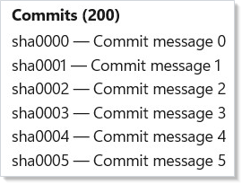
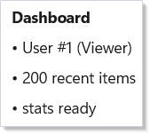

# Async Resources

Microsoft.UI.Reactor (Reactor)'s async hooks — `UseResource`, `UseInfiniteResource`, and
`UseMutation` — replace the "one `UseState` for data, one for loading, one
for error, one `UseEffect` to tie them together" pattern. They own the
fetch lifecycle: cancellation on deps-change, drop late results after
unmount, shared caching across siblings, and stale-while-revalidate by default.

| Hook | Use it for |
|------|------------|
| `UseResource` | A single async read (fetch one record, one page, one computed value) |
| `UseInfiniteResource` | Cursor-paginated reads paired with `VirtualList` or scroll-driven loaders |
| `UseMutation` | Optimistic writes with `InvalidateKeys` to refresh sibling resources |
| `PendingFactory.Pending` | Hold a fallback in place until every nested resource leaves `Loading` |

For the full state-machine reference, see
[async-system.md](../reference/async-system.md). This page is task-oriented:
each section is a recipe you can copy.

## Porting UseEffect + UseState → UseResource

The old pattern: three `UseState` hooks (data, error, loading) plus a
`UseEffect` that orchestrates the fetch, cancellation, and state updates:

```csharp
class BeforeUseResourceExample : Component
{
    public override Element Render()
    {
        var (data, setData) = UseState<DemoApi.User?>(null);
        var (error, setError) = UseState<Exception?>(null);
        var (loading, setLoading) = UseState(true);

        UseEffect(() =>
        {
            var cts = new CancellationTokenSource();
            setLoading(true);
            _ = Task.Run(async () =>
            {
                try
                {
                    var u = await DemoApi.GetUserAsync(42, cts.Token);
                    if (!cts.IsCancellationRequested)
                    {
                        setData(u);
                        setError(null);
                        setLoading(false);
                    }
                }
                catch (OperationCanceledException) { /* swallow */ }
                catch (Exception ex)
                {
                    if (!cts.IsCancellationRequested)
                    {
                        setError(ex);
                        setLoading(false);
                    }
                }
            });
            return () => cts.Cancel();
        }, 42);

        if (loading) return (Element)TextBlock("Loading…").Padding(24);
        if (error is not null) return (Element)TextBlock($"Error: {error.Message}").Padding(24);
        return VStack(4,
            Heading("Before: manual plumbing").FontSize(14),
            TextBlock(data?.Name ?? "(none)").FontSize(20).Bold(),
            TextBlock(data?.Role ?? "").Opacity(0.6)
        ).Padding(24);
    }
}
```


`UseResource` collapses all four into one call. The fetcher receives a
cancellation token that fires on deps change or unmount; the hook returns
an `AsyncValue<T>` you pattern-match against:

```csharp
class AfterUseResourceExample : Component
{
    public override Element Render()
    {
        var user = UseResource(
            ct => DemoApi.GetUserAsync(42, ct),
            deps: new object[] { 42 });

        return user.Match<Element>(
            loading: () => TextBlock("Loading…").Padding(24),
            data: u => VStack(4,
                Heading("After: one hook").FontSize(14),
                TextBlock(u.Name).FontSize(20).Bold(),
                TextBlock(u.Role).Opacity(0.6)
            ).Padding(24),
            error: ex => TextBlock($"Error: {ex.Message}").Padding(24));
    }
}
```


`AsyncValue<T>.Match` dispatches on the four states:
`Loading` (first fetch), `Data(value)` (success), `Error(exception)` (failure),
and `Reloading(previous)` (stale-while-revalidate — a refetch with the old value
still available). Omitting the `reloading` arm makes it fall back to `data`, so
the UI keeps the last-known value visible while revalidating.

## Infinite Scroll with UseInfiniteResource

`UseInfiniteResource` models a cursor-paginated read. Drive fetches from
`ItemAt(i)` inside a `VirtualList` `renderItem` — that's the pull model:
the virtualizer asks for item *i*, the hook schedules whichever page covers it,
and the row renders a shimmer until the page lands:

```csharp
class InfiniteScrollExample : Component
{
    public override Element Render()
    {
        var commits = UseInfiniteResource<DemoApi.Commit, string>(
            fetchPage: async (cursor, ct) =>
            {
                var (items, next, total) = await DemoApi.GetCommitsPageAsync(cursor, ct);
                return new Page<DemoApi.Commit, string>(items, next, total);
            },
            deps: new object[] { "repo-main" });

        // With a real virtualizer, drive fetches from ItemAt inside VirtualList's
        // renderItem. The important bit: null return = placeholder row.
        return VStack(4,
            Heading($"Commits ({commits.TotalCount ?? 0})").FontSize(14),
            VStack(2,
                Enumerable.Range(0, Math.Min(commits.Items.Count, 6))
                    .Select(i =>
                    {
                        var commit = commits.ItemAt(i);
                        return commit is null
                            ? TextBlock("…").Opacity(0.4).Padding(4)
                            : TextBlock($"{commit.Sha} — {commit.Message}").Padding(4);
                    })
                    .ToArray())
        ).Padding(24);
    }
}
```



Scrolling ahead faults in new pages automatically. `LoadState` drives
footer UI (spinner, end-of-list marker, retry button). For explicit
prefetching, call `commits.EnsureRange(first, last)` from the
`onVisibleRangeChanged` callback — faster than row-by-row `ItemAt`.

Pull-to-refresh is `commits.Refresh()`: it cancels in-flight fetches,
clears the page table, and refetches page 0. Retry after error is
`commits.Retry()` — only the failed page is re-requested.

## Migrating from a DataPageCache-Style Cache

If you've rolled a block-cache over `IDataSource<T>` — the pre-Phase-3
`DataPageCache<T>` is the canonical example — the replacement path is five
mechanical steps:

1. **Swap the cache field for a hook call.** Replace the long-lived
   `DataPageCache<T>` instance with `var resource = UseDataSource(source, request, options);`.
   `UseDataSource` bridges any `IDataSource<T>` onto `UseInfiniteResource`
   using `request.ContinuationToken` as the cursor.
2. **Read from `resource.Items[i]`.** The sparse `IReadOnlyList<T?>` has
   null placeholders for in-flight slots. This replaces `cache.PeekItem(i)`
   plus the `LoadingBlock` sentinel.
3. **Drop `BlockLoaded` event wiring.** The hook re-renders the component
   on every state transition — no manual subscription needed.
4. **Route prefetch through `EnsureRange`.** Replace `cache.RequestBlock(i)`
   calls inside `onVisibleRangeChanged` with `resource.EnsureRange(first, last)`.
   The hook dedups in-flight fetches.
5. **Request changes = deps change.** Sort/filter/search updates flow
   through `request` into the hook's deps. The hook cancels in-flight
   fetches, unsubscribes the old cache keys, and restarts on page 0.

The `DataGrid<T>` built-in runs both code paths today, gated by
`ReactorFeatureFlags.UseHookBasedPaging`. See
[data-system.md](data-system.md) for the full DataGrid story.

> **Mutation overlay still lives on the caller.** The hook's page table is
> server-sourced and immutable. Optimistic edits should be kept in your
> own overlay (`Dictionary<int, T>`) that takes precedence over `resource.Items[i]`
> at read time. `DataGridState<T>` implements this pattern — see its
> `_mutations` field for the reference shape.

## Optimistic Writes with UseMutation

`UseMutation` separates reads from writes. Register it once per component;
call `mutation.RunAsync(input)` from click handlers. The optimistic
callback fires synchronously so the UI never flashes stale data waiting
for the server:

```csharp
class UseMutationExample : Component
{
    public override Element Render()
    {
        var (todos, setTodos) = UseState<IReadOnlyList<DemoApi.Todo>>(Array.Empty<DemoApi.Todo>());

        var mutation = UseMutation<DemoApi.TodoInput, DemoApi.Todo>(
            mutator: (input, ct) => DemoApi.AddTodoAsync(input, ct),
            options: new MutationOptions<DemoApi.TodoInput, DemoApi.Todo>(
                OnOptimistic: input =>
                    setTodos([.. todos, new DemoApi.Todo(input.Title, IsTemporary: true)]),
                OnSuccess: (todo, _) =>
                    setTodos([.. todos.Select(t => t.IsTemporary ? todo : t)]),
                OnError: (_, input) =>
                    setTodos([.. todos.Where(t => t.Title != input.Title)]),
                InvalidateKeys: ["todos/list"]));

        return VStack(8,
            Heading($"Todos ({todos.Count})").FontSize(14),
            VStack(2, todos.Select(t =>
                TextBlock(t.Title + (t.IsTemporary ? " (saving…)" : ""))
                    .Opacity(t.IsTemporary ? 0.5 : 1.0)).ToArray()),
            Button("Add Todo",
                () => _ = mutation.RunAsync(new DemoApi.TodoInput($"Item {todos.Count + 1}")))
        ).Padding(24);
    }
}
```


`InvalidateKeys` invalidates cache entries on success. Any sibling
`UseResource` subscribed to those keys observes the invalidation and
refetches. On error, `InvalidateKeys` does **not** fire — the server
state didn't change, so the cache is still valid.

Unmount during pending cancels the mutator token. `OnError` does **not**
fire for cancellation — it's silent, matching `UseResource`'s
cancellation semantics.

## Pending Fallbacks

Wrap a subtree that depends on multiple resources in
`PendingFactory.Pending(fallback, child)`. The fallback stays visible
until every `UseResource` / `UseInfiniteResource` inside the subtree has
left the initial `Loading` state:

```csharp
class PendingFallbackExample : Component
{
    public override Element Render()
    {
        return PendingFactory.Pending(
            fallback: TextBlock("Loading dashboard…").Opacity(0.5).Padding(24),
            child: VStack(8,
                Heading("Dashboard").FontSize(14),
                Component<UserHeader>(),
                Component<RecentActivity>(),
                Component<Stats>()
            ).Padding(24));
    }

    private class UserHeader : Component
    {
        public override Element Render()
        {
            var user = UseResource(
                ct => DemoApi.GetUserAsync(1, ct),
                deps: new object[] { "user-1" });
            return user.Match<Element>(
                loading: () => TextBlock("• user loading…").Opacity(0.5),
                data: u => TextBlock($"• {u.Name} ({u.Role})"),
                error: ex => TextBlock($"• error: {ex.Message}"));
        }
    }

    private class RecentActivity : Component
    {
        public override Element Render()
        {
            var feed = UseInfiniteResource<DemoApi.Commit, string>(
                fetchPage: async (cursor, ct) =>
                {
                    var (items, next, total) = await DemoApi.GetCommitsPageAsync(cursor, ct);
                    return new Page<DemoApi.Commit, string>(items, next, total);
                },
                deps: new object[] { "feed" });
            return TextBlock($"• {feed.Items.Count} recent items");
        }
    }

    private class Stats : Component
    {
        public override Element Render()
        {
            var user = UseResource(
                ct => DemoApi.GetUserAsync(99, ct),
                deps: new object[] { "stats" });
            return user.Match(
                loading: () => TextBlock("• stats loading…").Opacity(0.5),
                data: _ => TextBlock("• stats ready"),
                error: ex => TextBlock($"• error: {ex.Message}"));
        }
    }
}
```



Both trees are mounted — the child renders in the background so it's
ready when all three resources resolve. `Reloading` (stale-while-revalidate
refetches) does **not** re-trigger the fallback; only the initial `Loading`
does. This matches TanStack's `Suspense` semantics and avoids the "blink
every revalidation" anti-pattern.

## Tips

**Keep deps value-comparable.** A new `List<T>` or lambda each render
will thrash the hook's deps-change detection. Memoize with `UseMemo`, or
project to a scalar cache key. Wait for `REACTOR_HOOKS_004` (WIP) to
flag the pattern at compile time.

**Only use `UseResource` for reads.** The hook may retry and refetch —
non-idempotent fetchers will double-create on retry. Use
[`UseMutation`](#optimistic-writes-with-usemutation) for writes.

**Cursor paging is inherently serial.** `UseInfiniteResource` must load
page *N-1* before requesting page *N* because the cursor lives in the
previous page's payload. For parallel offset-based paging, pass an offset
as the cursor and `InfiniteResourceOptions.PageSize` to size each batch —
the hook won't parallelize for you.

**Don't share a `CacheKey` across unrelated hooks.** The default per-hook
auto-key keeps siblings independent. Opt into sharing explicitly via
`ResourceOptions.CacheKey` — typically when you want two distant subtrees
to observe the same entry.

**Pending applies only to Loading, not Reloading.** If the fallback
flashes on every refetch, you've probably wrapped the resource in a
`Pending` that's checking `Reloading` too. Read the spec's §10.1 for the
exact predicate.

## Next Steps

- **[Effects and Lifecycle](effects.md)** — Previous: the `UseEffect` primitive underneath the old pattern
- **[Commanding](commanding.md)** — Next: command tracking with async execution
- **[Data System](data-system.md)** — Full DataGrid story including hook-based paging
- **[Hooks](hooks.md)** — Core hook primitives (`UseState`, `UseReducer`, `UseRef`)
