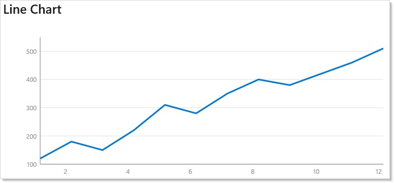
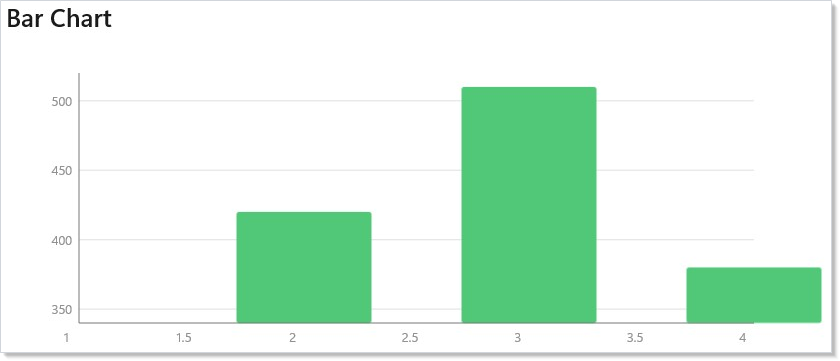
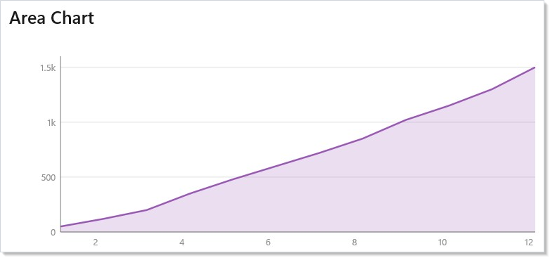
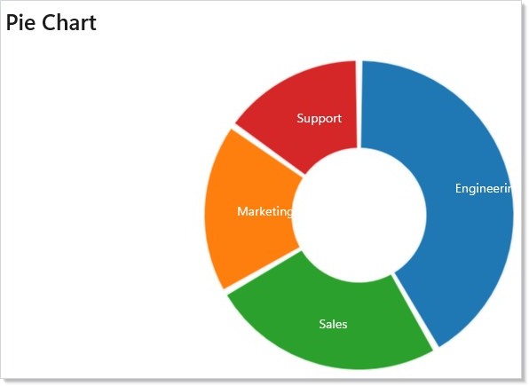
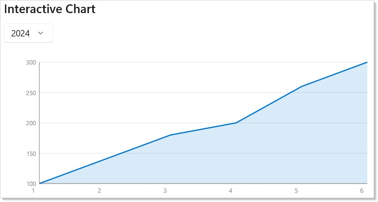
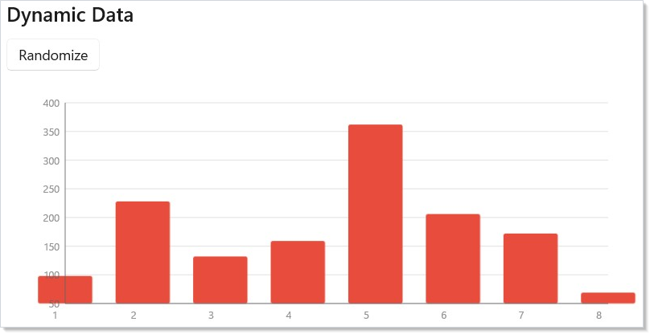
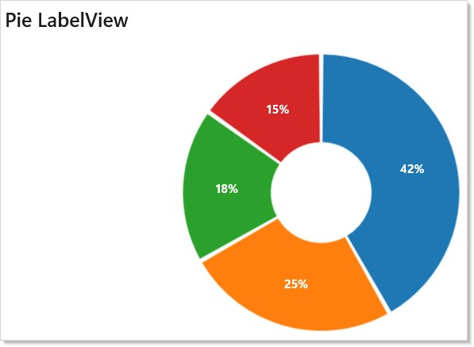
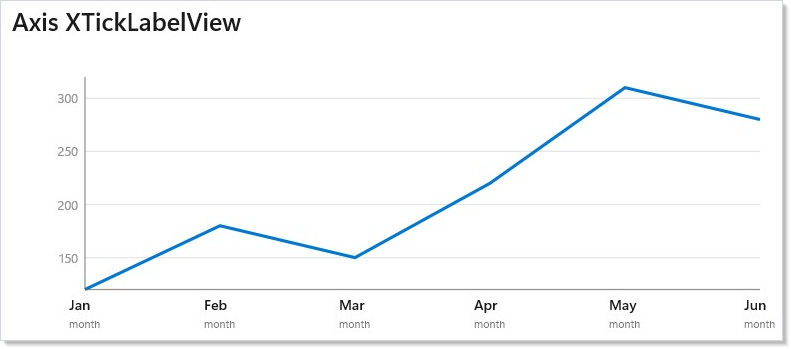
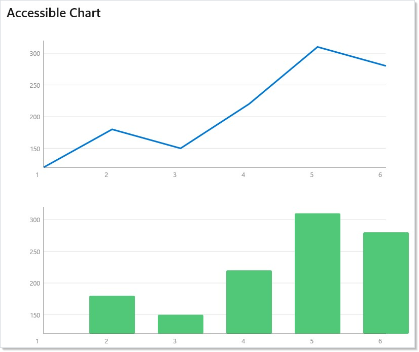

ReactorD3 sits on two layers and you choose the level you author at.
The high-level DSL — `LineChart`, `BarChart`, `AreaChart`, `PieChart`,
plus `TreeChart` and `ForceGraph` — covers the cases dashboards keep
asking for: a series, an x accessor, a y accessor, and an opinionated
visual surface that the library wires up for you (axes, grids,
palettes, keyboard navigation, screen-reader summary). When the
opinionated surface doesn't fit — when you want a slice's percent
rendered inside the slice itself, when you want a heatmap, when you
want a bespoke parallel-coordinates view — the same library exposes
the D3 primitives that built the high-level shapes: `LinearScale`,
`BandScale`, `D3Canvas`, `D3LinePath<T>`, `D3ArcPath`, and the
`*LabelView` escape hatches on the high-level charts. This is the
same trade-off Recharts and Observable Plot draw — convenience first,
escape hatch beneath — except every D3 primitive renders as a WinUI
shape on the same `Canvas` the high-level charts use, so dropping a
level never means switching renderers. Pick the high level by default;
drop into D3 only when the higher-level surface refuses what you need.

# Charting

ReactorD3 brings data visualization to Reactor. The chart DSL provides high-level
`LineChart`, `BarChart`, `AreaChart`, and `PieChart` factories that produce
standard Reactor elements. You bind data, configure appearance with a fluent
API, and the chart renders as native WinUI shapes on a Canvas.

Import the DSL alongside the standard Reactor factories:

```csharp
using static Microsoft.UI.Reactor.Factories;
using static Microsoft.UI.Reactor.Charting.Charts;
```

## Line Chart

`LineChart` draws a continuous line through your data points. Pass a
collection and accessor functions for X and Y:

```csharp
class LineChartDemo : Component
{
    public override Element Render()
    {
        var data = new SalesPoint[]
        {
            new(1, 120), new(2, 180), new(3, 150),
            new(4, 220), new(5, 310), new(6, 280),
            new(7, 350), new(8, 400), new(9, 380),
            new(10, 420), new(11, 460), new(12, 510)
        };

        return VStack(12,
            SubHeading("Line Chart"),
            LineChart(data, d => d.Month, d => d.Revenue)
                .Title("Monthly Revenue — Line")
                .SeriesName("Revenue")
                .Units("months", "USD")
                .AxisLabel(ChartAxisType.X, "Month")
                .AxisLabel(ChartAxisType.Y, "Revenue (USD)")
                .Width(600).Height(250)
                .Stroke("#0078D4").StrokeWidth(2.5)
                .ShowGrid(true).ShowAxes(true)
        ).Padding(24);
    }
}
```



The chart auto-scales axes to fit your data with `.Nice()` rounding. Toggle
grid lines with `.ShowGrid()` and axis labels with `.ShowAxes()`.

## Bar Chart

`BarChart` renders vertical bars. Each data point becomes a bar whose height
maps to the Y value:

```csharp
class BarChartDemo : Component
{
    public override Element Render()
    {
        var data = new SalesPoint[]
        {
            new(1, 340), new(2, 420), new(3, 510), new(4, 380)
        };

        return VStack(12,
            SubHeading("Bar Chart"),
            BarChart(data, d => d.Month, d => d.Revenue)
                .Title("Quarterly Revenue — Bar")
                .SeriesName("Revenue")
                .Units("quarters", "USD")
                .AxisLabel(ChartAxisType.X, "Quarter")
                .AxisLabel(ChartAxisType.Y, "Revenue (USD)")
                .Width(600).Height(250)
                .Fill("#50C878")
                .ShowGrid(true).ShowAxes(true)
        ).Padding(24);
    }
}
```



Bar width is calculated automatically based on the number of data points.
Use `.Fill()` to set the bar color and `.FillOpacity()` to control
transparency.

## Area Chart

`AreaChart` fills the region between the data line and the baseline. It
combines a filled area with a line overlay:

```csharp
class AreaChartDemo : Component
{
    public override Element Render()
    {
        var data = new SalesPoint[]
        {
            new(1, 50), new(2, 120), new(3, 200),
            new(4, 350), new(5, 480), new(6, 600),
            new(7, 720), new(8, 850), new(9, 1020),
            new(10, 1150), new(11, 1300), new(12, 1500)
        };

        return VStack(12,
            SubHeading("Area Chart"),
            AreaChart(data, d => d.Month, d => d.Revenue)
                .Title("Monthly Revenue — Area")
                .SeriesName("Revenue")
                .Units("months", "USD")
                .AxisLabel(ChartAxisType.X, "Month")
                .AxisLabel(ChartAxisType.Y, "Revenue (USD)")
                .Width(600).Height(250)
                .Stroke("#9B59B6").Fill("#9B59B6")
                .FillOpacity(0.2)
                .ShowGrid(true).ShowAxes(true)
        ).Padding(24);
    }
}
```



Use `.FillOpacity()` to control area transparency. A low value (0.15--0.3)
lets grid lines show through while still filling the shape.

## Pie Chart

`PieChart` divides data into proportional arcs. Set `.InnerRadius()` > 0
for a donut chart:

```csharp
class PieChartDemo : Component
{
    public override Element Render()
    {
        var data = new CategoryData[]
        {
            new("Engineering", 42),
            new("Marketing", 18),
            new("Sales", 25),
            new("Support", 15)
        };

        return VStack(12,
            SubHeading("Pie Chart"),
            PieChart(data, d => d.Value, d => d.Name)
                .Title("Team Distribution")
                .Description("Pie chart showing team size across Engineering, Marketing, Sales, and Support.")
                .Width(300).Height(300)
                .InnerRadius(60)
                .PadAngle(0.03)
        ).Padding(24);
    }
}
```



Pass a label accessor to display text at each arc's centroid. Colors cycle
through the Category10 palette by default — override with `.SetColors()`.

## Chart Configuration

All chart types share a common set of builder methods:

| Method | Default | Purpose |
|--------|---------|---------|
| `.Width(n)` | 400 | Canvas width in pixels |
| `.Height(n)` | 300 | Canvas height in pixels |
| `.Margin(t, r, b, l)` | 20, 20, 30, 40 | Axis/label margins |
| `.Stroke(color)` | `#4285f4` | Line/border color |
| `.Fill(color)` | `#4285f4` | Fill color |
| `.StrokeWidth(n)` | 2 | Line thickness |
| `.FillOpacity(n)` | 0.3 | Fill transparency (0--1) |
| `.ShowAxes(bool)` | true | Show axis lines and labels |
| `.ShowGrid(bool)` | true | Show horizontal grid lines |

Colors accept any CSS-style string: `#RGB`, `#RRGGBB`, `rgb(r,g,b)`, or
named colors like `steelblue`. For palette-aware colors that adapt to
dark mode, see [styling](styling.md) and the
[`.Palette(...)` accessibility modifier](#accessibility-modifiers) below.

## Binding Data to State

Charts are standard Reactor elements. When state changes, the chart re-renders
with the new data:

```csharp
class CombinedChartDemo : Component
{
    public override Element Render()
    {
        var (year, setYear) = UseState(0);
        var years = new[] { "2024", "2025" };

        var data2024 = new SalesPoint[]
        {
            new(1, 100), new(2, 140), new(3, 180),
            new(4, 200), new(5, 260), new(6, 300)
        };
        var data2025 = new SalesPoint[]
        {
            new(1, 160), new(2, 220), new(3, 280),
            new(4, 320), new(5, 390), new(6, 450)
        };

        var data = year == 0 ? data2024 : data2025;

        return VStack(12,
            SubHeading("Interactive Chart"),
            ComboBox(years, year, setYear),
            AreaChart(data, d => d.Month, d => d.Revenue)
                .Title("Revenue by Year")
                .SeriesName("Revenue")
                .Units("months", "USD")
                .Interactive()
                .Width(600).Height(250)
                .Stroke("#0078D4").Fill("#0078D4")
                .FillOpacity(0.15)
                .ShowGrid(true).ShowAxes(true)
        ).Padding(24);
    }
}
```



Use [hooks](hooks.md) like `UseState` to drive data selection. The chart
rebuilds on every render — keep datasets small (under ~1000 points) for
smooth interaction.

## Dynamic Data Updates

Charts are native Reactor elements, so changing state is all you need. Use
`UseState`, `UseReducer`, or any hook to update the data — the reconciler
diffs the old and new element trees and patches only what changed:

```csharp
class DynamicDataDemo : Component
{
    public override Element Render()
    {
        var (points, updatePoints) = UseReducer(
            Enumerable.Range(1, 8)
                .Select(i => new SalesPoint(i, Random.Shared.Next(50, 500)))
                .ToList());

        return VStack(12,
            SubHeading("Dynamic Data"),
            Button("Randomize", () => updatePoints(_ =>
                Enumerable.Range(1, 8)
                    .Select(i => new SalesPoint(i, Random.Shared.Next(50, 500)))
                    .ToList())),
            BarChart<SalesPoint>(points, d => d.Month, d => d.Revenue)
                .Title("Dynamic Revenue Data")
                .SeriesName("Revenue")
                .Units("months", "USD")
                .Width(600).Height(250)
                .Fill("#E74C3C")
                .ShowGrid(true).ShowAxes(true)
        ).Padding(24);
    }
}
```



For high-frequency updates (60fps streaming), use `OnReady` to get a
handle that exposes the underlying `Canvas` for direct manipulation.
This is the same compositor-property escape hatch the
[animation pipeline](animation-pipeline.md) uses — render the static
geometry through Reactor, then mutate the live values directly.

## Custom Label Elements

Most charts only need the string-based label APIs (`AxisLabel`,
`LabelAccessor`, `DataLabel`). Reach for the `*View` extensions only when
plain text isn't enough — for icon-plus-text ticks, multi-line labels with
mixed typography, or rendering a slice's percent inside the slice itself.

### Pie slice labels

`LabelView` replaces the built-in text label on each pie slice. The delegate
receives the slice's data item plus a `PieSliceLayout` describing its
geometry, and returns any Element:

```csharp
// Percent rendered inside the slice. The string label accessor
// is still passed so screen readers describe the slice.
PieChart(data, d => d.Value, d => d.Name)
    .Title("Team Distribution")
    .Width(300).Height(300)
    .InnerRadius(50).PadAngle(0.02)
    .LabelView((d, layout) =>
        TextBlock($"{layout.Fraction:P0}")
            .FontSize(12).Bold().Foreground("White"))
```



`PieSliceLayout` exposes the slice's `Index`, `Value`, `Fraction`,
`CentroidX`/`CentroidY`, `StartAngle`/`EndAngle`, `InnerRadius`/`OuterRadius`,
and the resolved palette `Color` so a label can echo slice geometry without
recomputing it.

### Axis tick labels

`XTickLabelView` and `YTickLabelView` replace the numeric tick labels with
any Element. Each delegate receives the tick's domain value:

```csharp
// X axis ticks: render month name plus a caption per tick.
LineChart(data, d => d.Month, d => d.Revenue)
    .Title("Revenue by Month")
    .SeriesName("Revenue")
    .Width(600).Height(220)
    .Stroke("#0078D4").StrokeWidth(2.5)
    .ShowGrid(true).ShowAxes(true)
    .XTickLabelView(t => VStack(2,
        TextBlock(months[Math.Clamp((int)t - 1, 0, months.Length - 1)])
            .FontSize(11).SemiBold(),
        TextBlock("month").FontSize(8).Opacity(0.6)))
```



| Method | Purpose |
|--------|---------|
| `PieChartElement<T>.LabelView(Func<T, PieSliceLayout, Element>)` | Replace the built-in slice text with any Element, anchored on the slice centroid |
| `ChartElement<T>.XTickLabelView(Func<double, Element>)` | Replace the X-axis tick label, horizontally centered on the tick |
| `ChartElement<T>.YTickLabelView(Func<double, Element>)` | Replace the Y-axis tick label, right-anchored to the axis edge |

The element you return is auto-anchored — you don't need a known size at
construction time, and the chart re-positions on layout. It is also rendered
non-interactive and hidden from the UIA tree, so the chart's structured
accessibility description (see below) stays canonical. Always keep the
string `LabelAccessor` (pie) or `DataLabel` (line/bar/area) set when you use
a `*View` override; that's what screen readers read.

## Chart Accessibility

Charts are fully accessible out of the box. Add `.Title()` and
`.SeriesName()` for screen-reader identification, `.Units()` for axis
annotations, and `.Interactive()` for keyboard navigation:

```csharp
/// <summary>
/// Canonical accessible chart pattern — demonstrates all recommended accessibility
/// modifiers for both static and interactive charts. Follow this pattern to ensure
/// charts are fully accessible to screen readers, keyboard users, and users who
/// need forced-colors or reduced-motion.
/// </summary>
class AccessibleChartDemo : Component
{
    public override Element Render()
    {
        var data = new SalesPoint[]
        {
            new(1, 120), new(2, 180), new(3, 150),
            new(4, 220), new(5, 310), new(6, 280)
        };

        return VStack(12,
            SubHeading("Accessible Chart"),

            // Static accessible chart: Title + SeriesName + Units
            LineChart(data, d => d.Month, d => d.Revenue)
                .Title("Monthly Revenue 2024")
                .SeriesName("Revenue")
                .Units("months", "USD")
                .AxisLabel(ChartAxisType.X, "Month")
                .AxisLabel(ChartAxisType.Y, "Revenue (USD)")
                .Width(600).Height(250)
                .Stroke("#0078D4").StrokeWidth(2.5)
                .ShowGrid(true).ShowAxes(true),

            // Interactive accessible chart: adds keyboard nav and point invocation
            BarChart(data, d => d.Month, d => d.Revenue)
                .Title("Monthly Revenue — Interactive")
                .SeriesName("Revenue")
                .Units("months", "USD")
                .Interactive()
                .Width(600).Height(250)
                .Fill("#50C878")
                .ShowGrid(true).ShowAxes(true)
        ).Padding(24);
    }
}
```



### Accessibility Modifiers

| Method | Purpose |
|--------|---------|
| `.Title(str)` | Visible title and accessible name |
| `.Description(str)` | Override auto-generated summary |
| `.SeriesName(str)` | Name the data series |
| `.Units(x, y)` | Axis unit annotations (e.g., "months", "USD") |
| `.AxisLabel(axis, str)` | Explicit axis label |
| `.Interactive()` | Enable keyboard navigation and virtual focus |
| `.OnPointInvoke(handler)` | Callback when Enter/Space pressed on a point |
| `.AlternateView(element)` | Toggle between chart and data table (T key) |
| `.Palette(palette)` | Curated colorblind-safe palette |
| `.SeriesShapes(shapes)` | Marker shapes for double-encoding |
| `.SeriesDashes(dashes)` | Dash patterns for double-encoding |

Screen readers announce the chart type, series count, data range, and
individual point values. Keyboard users navigate with arrow keys, invoke
points with Enter, and toggle an alternate data-table view with T. The
full a11y story for the framework is in [accessibility](accessibility.md);
the chart-specific contract is that color is never the only encoding —
combine `.Palette(...)` with `.SeriesShapes(...)` or `.SeriesDashes(...)`
for any multi-series chart that ships to forced-colors users.

## Low-Level Drawing

For custom visualizations, ReactorD3 provides shape generators and a Canvas
DSL. Import `using static Microsoft.UI.Reactor.Charting.D3.D3Charts` for:

- **`D3Canvas(w, h, children)`** — create a drawing surface
- **`D3Rect`, `D3Circle`, `D3Line`, `D3Path`** — primitive shapes
- **`D3Text`, `D3TextRight`, `D3TextCenter`** — positioned text
- **`D3LinePath<T>`, `D3AreaPath<T>`, `D3ArcPath`** — generator helpers
- **`D3Axes`, `D3Grid`, `D3Legend`** — axis/legend composites
- **`LinearScale`, `BandScale`, `LogScale`** — map data to pixels

## Scale Types

| Scale | Purpose |
|-------|---------|
| `LinearScale` | Continuous numeric mapping with `.Nice()` and `.Ticks()` |
| `BandScale<T>` | Categorical mapping with bandwidth (bar charts) |
| `LogScale` | Logarithmic mapping for exponential data |
| `PowScale` | Power/sqrt mapping |
| `OrdinalScale<T>` | Discrete-to-discrete mapping |

> **Caveat:** Recreate the data array inside `Render()` only at your own peril.
> Charts compare incoming data by reference on the fast path — a new
> array on every render means the chart re-derives scales, re-runs the
> pie layout, and re-allocates the WinUI shape pool every frame, even
> when nothing changed. The symptom is a chart that flickers when an
> unrelated piece of state updates. The fix is the same shape Reactor
> uses everywhere: wrap the data in `UseMemo(() => …, deps)` keyed on
> whatever actually changes. The pattern is most obvious with
> `PieChart` — a fresh `new[] { … }` on every render makes each slice
> remount, the `.Transition()` enter/exit fires for slices that haven't
> moved, and the chart "redraws itself" on every keystroke into an
> unrelated `TextField`.

## Patterns

### Live-updating chart from a ticking source

A streaming chart — a price feed, a sensor reading — drives a sliding
window of points. Hold the window in `UseState`, append on tick, drop
the head once `Count` exceeds the window size:

```csharp
var (samples, setSamples) = UseState<IReadOnlyList<Sample>>(Array.Empty<Sample>());

UseEffect(() =>
{
    using var timer = new PeriodicTimer(TimeSpan.FromMilliseconds(200));
    while (await timer.WaitForNextTickAsync(token))
    {
        setSamples(prev =>
        {
            var next = prev.Append(Sample.Now()).ToList();
            return next.Count > 60 ? next.Skip(next.Count - 60).ToList() : next;
        });
    }
}, Array.Empty<object>());

return LineChart(samples, s => s.Time.Ticks, s => s.Value)
    .Title("Live feed")
    .Width(600).Height(220)
    .Stroke("#0078D4");
```

The chart redraws on every tick. For sub-100ms cadence, drop into
`OnReady` and mutate the `Canvas` directly — the reconciler is fast
but it isn't free. See [effects-scheduling](effects-scheduling.md) for
the timer-cleanup pattern.

### Switching chart type without losing the data binding

The same data feeds a line, a bar, or an area chart — let users pick
the shape. Hold the chart kind in state, switch the factory call:

```csharp
var (kind, setKind) = UseState("line");

return VStack(8,
    ComboBox(new[] { "line", "bar", "area" }, kind, setKind),
    (kind switch
    {
        "line"  => LineChart(data, d => d.X, d => d.Y),
        "bar"   => BarChart(data, d => d.X, d => d.Y),
        _       => AreaChart(data, d => d.X, d => d.Y),
    })
    .Title("Revenue")
    .Width(600).Height(250)
    .Stroke("#0078D4"));
```

Because each factory returns a `ChartElement<T>`, the modifier chain is
identical — the only branching is the constructor.

### Dropping into D3 for a custom shape

When the high-level surface doesn't fit (heatmap, parallel coordinates,
swarm plot), render `D3Canvas` directly and compose D3 shape generators.
The `LinearScale` / `BandScale` factories are the same ones the high-level
charts use internally, so behavior matches — `.Nice()`, `.Ticks()`,
`.Domain()` and friends work identically:

```csharp
var x = new LinearScale().Domain(0, 100).Range(0, 600);
var y = new LinearScale().Domain(min, max).Range(220, 20).Nice();

return D3Canvas(600, 240,
    D3Axes(x, y),
    D3LinePath(data, d => x(d.X), d => y(d.Y)).Stroke("#0078D4"),
    ForEach(data, d => D3Circle(x(d.X), y(d.Y), 3).Fill("#0078D4")));
```

This is the same composition strategy Observable Plot uses — geometric
primitives over scales — except the primitives render as WinUI shapes,
not SVG. For a heatmap, swap `D3LinePath` for nested
`D3Rect`s; for parallel coordinates, repeat the line-path call per axis.

## Common Mistakes

### Constructing the data array in Render

```csharp
// Don't:
public override Element Render()
{
    var data = new SalesPoint[] { new(1, 120), new(2, 180), /* … */ };
    return LineChart(data, d => d.Month, d => d.Revenue);
}
```

```csharp
class DynamicDataDemo : Component
{
    public override Element Render()
    {
        var (points, updatePoints) = UseReducer(
            Enumerable.Range(1, 8)
                .Select(i => new SalesPoint(i, Random.Shared.Next(50, 500)))
                .ToList());

        return VStack(12,
            SubHeading("Dynamic Data"),
            Button("Randomize", () => updatePoints(_ =>
                Enumerable.Range(1, 8)
                    .Select(i => new SalesPoint(i, Random.Shared.Next(50, 500)))
                    .ToList())),
            BarChart<SalesPoint>(points, d => d.Month, d => d.Revenue)
                .Title("Dynamic Revenue Data")
                .SeriesName("Revenue")
                .Units("months", "USD")
                .Width(600).Height(250)
                .Fill("#E74C3C")
                .ShowGrid(true).ShowAxes(true)
        ).Padding(24);
    }
}
```

Every render allocates a new array, so the chart's reference-equality
check fails, scales re-derive, and shape pools reset — even though
nothing visible changed. Hoist the static data into a `static readonly`
field or wrap dynamic data in `UseMemo(() => BuildData(...), deps)`.

### Using color as the only series encoding

```csharp
// Don't:
LineChart(serverA, ...).Stroke("red"),
LineChart(serverB, ...).Stroke("green"),
LineChart(serverC, ...).Stroke("blue")
```

In forced-colors mode (Windows High Contrast), every stroke collapses
to the active accent color and the user can't tell the series apart.
Pair color with `.SeriesShapes(MarkerShape.Circle, Square, Triangle)`
or `.SeriesDashes(DashStyle.Solid, Dot, Dash)` so the series is
identifiable without color. Same principle as charts in WCAG 2.2 SC
1.4.1.

### Animating individual D3 shapes by hand

```csharp
// Don't:
D3Circle(x(d.X), y(d.Y), 3)
    .Set(c =>
    {
        var anim = c.Compositor.CreateScalarKeyFrameAnimation();
        anim.InsertKeyFrame(0f, 0.0f);
        anim.InsertKeyFrame(1f, 1.0f);
        c.StartAnimation("Opacity", anim);
    })
```

Inline composition animation duplicates what `.OpacityTransition()`
and `.Transition(Transition.Fade)` already do, and it bypasses the
reduced-motion preference Reactor honors at the
[animation pipeline](animation-pipeline.md) level. Use the Reactor
animation modifiers on the D3 shape — they work the same way they do
on a `Border` or `TextBlock`.

## Tips

**Start with the high-level DSL.** `LineChart`, `BarChart`, `AreaChart`, and
`PieChart` cover most dashboard needs without touching scales or generators.

**Use `.ShowGrid(true)` for readability.** Grid lines make it much easier
to read values from a chart, especially line and area charts.

**Keep datasets under 1000 points.** Each data point creates WinUI shapes on
a Canvas. For larger datasets, aggregate or sample before charting.

**Just change state for live data.** Charts diff efficiently — updating
state triggers the reconciler to patch only what changed. For 60fps
escape hatches, use `OnReady` to access the underlying Canvas directly.

**Use donut charts (`InnerRadius > 0`) for proportional data.** The center
space works well for displaying a total or label.

## Next Steps

- **[Animation](animation.md)** — Previous: transitions, keyframes, interaction states
- **[Advanced Patterns](advanced.md)** — Next: error boundaries, memoization, and performance tuning
- **[Collections](collections.md)** — Bind chart data from virtualized lists and observable collections
- **[Effects and Lifecycle](effects.md)** — Load chart data asynchronously with UseEffect
- **[Styling and Theming](styling.md)** — Use theme tokens for chart colors that adapt to dark mode
- **[Accessibility](accessibility.md)** — Screen reader, keyboard navigation, and forced-colors guidance
