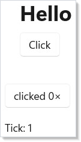

# Cheat Sheet

Reactor at a glance. Every row links to the page that covers it in
depth.

## Minimum viable app

```csharp
class HelloVignette : Component
{
    public override Element Render() =>
        VStack(8,
            Heading("Hello"),
            Button("Click", () => { })
        ).Padding(20);
}
```



Three pieces: a `using static Microsoft.UI.Reactor.Factories` import,
a `Component` subclass, and a `ReactorApp.Run<App>(title, ...)` call.
Add `#if DEBUG preview: true #endif` so `mur` can capture screenshots.

## Hooks

| Hook | Returns | Use when |
|---|---|---|
| `UseState<T>(initial)` | `(T, Action<T>)` | Local state that drives re-render. |
| `UseReducer<T>(initial)` | `(T, Action<Func<T,T>>)` | Functional updates from prev. |
| `UseReducer<S,A>(reducer, initial)` | `(S, Action<A>)` | Redux-style state. |
| `UseEffect(setup, deps?)` | void | Side effects after render; cleanup on re-run. |
| `UseMemo<T>(factory, deps)` | `T` | Cache expensive computation across renders. |
| `UseCallback(fn, deps)` | stable delegate | Memoize a callback identity. |
| `UseRef<T>(initial)` | `Ref<T>` | Mutable value that does *not* trigger re-render. |
| `UseContext<T>(ctx)` | `T` | Read a [context](context.md) value. |
| `UsePersisted<T>(key, initial, scope)` | `(T, Action<T>)` | Survive re-mount via [LRU cache](persistence.md). |
| `UseColorScheme()` | `ColorScheme` | Reactive light/dark/HighContrast. |
| `UseAsync(factory, deps)` | `AsyncResource<T>` | [`async-resources`](async-resources.md). |
| `UseFocusTrap()` | `FocusTrapHandle` | Trap Tab inside a sub-tree. |
| `UseAnnounce()` | `Action<string>` | Push a screen-reader announcement. |
| `UseDevtools()` | `DevtoolsApi` | [Dev-tooling](dev-tooling.md) hooks. |

```csharp
class StateVignette : Component
{
    public override Element Render()
    {
        var (count, setCount) = UseState(0);
        return Button($"clicked {count}×", () => setCount(count + 1));
    }
}
```

```csharp
class EffectVignette : Component
{
    public override Element Render()
    {
        var (tick, setTick) = UseState(0);
        UseEffect(() =>
        {
            var timer = new System.Timers.Timer(1000);
            timer.Elapsed += (_, _) => setTick(tick + 1);
            timer.Start();
            return () => timer.Dispose();
        });
        return TextBlock($"Tick: {tick}");
    }
}
```

Full coverage on [Hooks](hooks.md).

## Common factories

| Factory | Notes |
|---|---|
| `TextBlock(s)` / `Heading(s)` / `SubHeading(s)` / `Caption(s)` | Read-only text. |
| `Button(label, onClick)` | The click control. |
| `TextField(value, set, placeholder?, header?)` | Single-line input. |
| `PasswordBox(pwd, set, placeholderText?)` | Obscured input. |
| `NumberBox(value, set, header?)` | Numeric input. |
| `CheckBox(checked, set, label?)` | Two-state checkbox. |
| `ToggleSwitch(on, set, header?)` | Two-state switch. |
| `Slider(value, min, max, set)` | Numeric range. |
| `ComboBox(items, index, set)` | Drop-down list. |
| `RadioButtons(items, index, set)` | Single-select radio group. |
| `VStack(spacing, ...children)` / `HStack(spacing, ...children)` | Linear stacks. |
| `Grid(cols, rows, ...children)` | Two-axis layout. |
| `ScrollView(child)` | Scroll container. |
| `Border(child)` | Border + corner radius wrapper. |
| `Expander(header, content)` | Collapsible section. |
| `ListView<T>(items, key, view)` | Bound list. |
| `VirtualList(count, render, ...)` | Index-driven virtual list. |
| `DataGrid<T>(source, columns, ...)` | [Data-system](data-system.md) grid. |
| `Empty()` / `Group(...children)` / `ForEach(items, render)` | Tree helpers. |
| `Memo(ctx => ...)` / `RenderEachTime(ctx => ...)` | Function components. |
| `Component<TComp>()` | Mount a class-based [Component](components.md). |

Full coverage on [Controls](controls.md).

## Modifier chains

| Group | Methods |
|---|---|
| Size | `.Width(n)` `.Height(n)` `.Size(w,h)` |
| Spacing | `.Margin(n)` `.Padding(n)` `.HAlign(...)` `.VAlign(...)` |
| Text | `.FontSize(n)` `.Bold()` `.SemiBold()` `.Opacity(n)` |
| Color | `.Background(token)` `.Foreground(token)` `.WithBorder(token, thickness?)` |
| Shape | `.CornerRadius(n)` |
| Behavior | `.Disabled(bool)` `.Visible(bool)` `.ToolTip(s)` |
| Keying | `.WithKey(s)` |
| Flex | `.Flex(grow?, shrink?, basis?)` |
| Themed | `.RequestedTheme(ElementTheme)` `.Backdrop(BackdropKind)` |
| Transition | `.OpacityTransition()` `.ScaleTransition()` `.TranslationTransition()` |
| Compositor anim | `.Animate(Curve, prop?)` `.Transition(t, c?)` `.InteractionStates(b, c?)` |
| Layout anim | `.LayoutAnimation()` `.SpringLayoutAnimation()` `.ConnectedAnimation(key)` |
| Escape hatch | `.Set(ctrl => { /* raw WinUI */ })` |

Full coverage on [Styling](styling.md), [Animation](animation.md),
[Theming Tokens](theming-tokens.md).

## App entry + hosting

| API | Purpose |
|---|---|
| `ReactorApp.Run<TComp>(title, width?, height?, preview?)` | Single-window app. |
| `ReactorWindow.Open<TComp>(...)` | Additional window from a Component. |
| `ReactorHost` / `ReactorHostControl` | Embed Reactor in XAML / WinForms. |
| `NavigationHost(nav, routeMap)` | Multi-page navigation. |
| `DeepLinkMap<TRoute>` | URI-pattern routing. |
| `Command<T>` / `.Bind(button)` | [Commanding](commanding.md). |
| `IDataSource<T>` / `DataGrid<T>` | [Data system](data-system.md). |
| `ApplicationPersistedScope.Default` | Process-wide [persistence](persistence.md) cache. |

## Themed colors

| Token | What it is |
|---|---|
| `Theme.Accent` / `Theme.AccentSecondary` / `Theme.AccentText` | Accent fill + text. |
| `Theme.PrimaryText` / `Theme.SecondaryText` / `Theme.DisabledText` | Text levels. |
| `Theme.CardBackground` / `Theme.SolidBackground` / `Theme.LayerFill` | Surfaces. |
| `Theme.ControlFill` / `Theme.ControlFillSecondary` / `Theme.ControlFillInputActive` | Control states. |
| `Theme.CardStroke` / `Theme.DividerStroke` / `Theme.ControlStroke` | Borders. |
| `Theme.SystemSuccess` / `Theme.SystemCaution` / `Theme.SystemCritical` | Signal. |
| `Theme.Ref("CustomKey")` | Escape hatch for an app-level key. |

Full 35-token catalog on [Theming Tokens](theming-tokens.md).

## Patterns at a glance

**Controlled input.** `var (v, set) = UseState("")` →
`TextField(v, set)`.

**Effect with cleanup.** Return a `Func<void>` from the effect lambda;
Reactor calls it before the next run and on unmount.

**Conditional render.** `cond ? Element1 : Empty()` keeps the element
out of the tree when `cond` is false — see the
[modal-dialog recipe](recipes/modal-dialog.md).

**List with stable keys.** `ForEach(items, x => Card(x).WithKey(x.Id))`
so the reconciler can move rows rather than rebuild them.

**Memoized subtree.** Wrap the expensive child in `Memo(ctx => …)`;
the function-component cache holds it across parent re-renders.

**Disable submit during async work.** A single `submitting` bool
covers both the button's `.Disabled(...)` and the spinner label.

## Rules

Five rules cover most analyzer findings (full list on
[Rules of Reactor](rules-of-reactor.md)):

1. Hooks at the top of `Render`, never in a loop or conditional.
2. Setters returned by hooks are stable; you can capture them in
   closures safely.
3. Render functions are pure — side effects go in `UseEffect`.
4. Lists need stable `.WithKey()` for any element that can reorder.
5. Theme-aware modifiers (`.Background`, `.Foreground`, `.WithBorder`)
   want a `Theme.*` token, not a hex literal.

## Tips

**Skim the cheat sheet, then jump.** Each row is a one-liner; the
deep-dive page is one click away. Don't try to learn Reactor from
this page — learn it from [getting-started](getting-started.md) and
[components](components.md), and use this card as the recall surface.

**Bookmark the modifier table.** Modifier chains are the easiest thing
to forget mid-keystroke; the modifier table is the highest-traffic
section of this page.

**Copy from the recipes for shape, not from the cheat sheet.** The
recipes are the working compositions; the cheat sheet is the catalog.

## Next Steps

- **[Getting Started](getting-started.md)** — Hello world walkthrough.
- **[Hooks](hooks.md)** — Hook-by-hook deep dive.
- **[Controls](controls.md)** — Full control catalog.
- **[Styling](styling.md)** — Modifiers in detail.
- **[Rules of Reactor](rules-of-reactor.md)** — The full rule list
  with analyzer codes.
