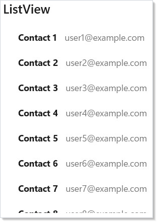
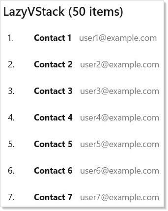
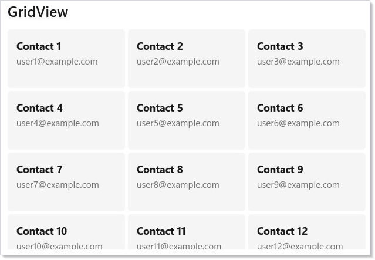
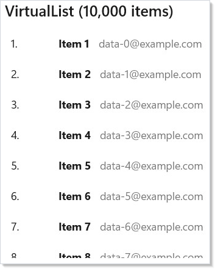
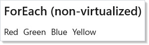
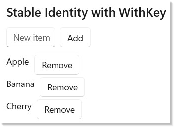
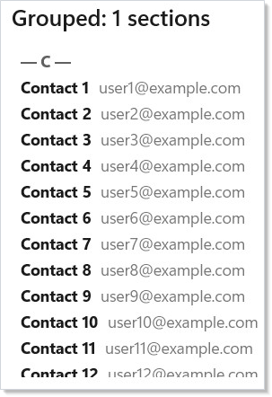
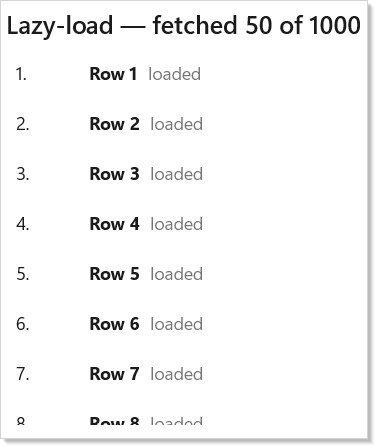

> **WinUI reference:** For the full property surface and design guidance, see [Items Collections](https://learn.microsoft.com/en-us/windows/apps/design/controls/items-collections).

Collections are the highest-leverage primitive in any non-trivial app —
a contacts list, a feed, a settings tree, an editor's gutter. Microsoft.UI.Reactor (Reactor)
ships three typed bound collections (`ListView<T>`, `GridView<T>`,
`LazyVStack<T>`) and one count-based virtualization primitive
(`VirtualList`), plus the inline `ForEach` helper for non-scrolling
maps over data. The decision tree starts with two questions: how big is
the data, and how is it shaped. For a few dozen items in a list, reach
for `ListView<T>`. For thousands of items with the same row template,
reach for `LazyVStack<T>` (virtualizes by default). For millions of
items or count-known-but-items-not-loaded scenarios, reach for
`VirtualList`. For a tiled grid, `GridView<T>`. For inline maps inside
a [`VStack`](layout.md), `ForEach`. Every collection takes a
[key selector](#stable-identity-with-withkey) so reconciliation can
match items across renders; that is the single most important thing to
get right. Skim the comparison table first, then jump to your control.

# Collections

When you need to render a list of data, Reactor provides three typed collection
elements and a simple `ForEach` helper. Each takes your data, a key selector,
and a view builder function that returns an [element](components.md).

## Sample Data

The examples on this page use a shared `Contact` record and sample data
generator:

```csharp
record Contact(string Id, string Name, string Email);

static class SampleData
{
    public static readonly List<Contact> Contacts =
        Enumerable.Range(1, 50).Select(i =>
            new Contact($"c{i}", $"Contact {i}",
                $"user{i}@example.com")
        ).ToList();
}
```

## ListView

`ListView<T>` renders a scrollable vertical list. Pass your data, a function
that returns a unique key for each item, and a builder that turns each item
into an element:

```csharp
class ListViewDemo : Component
{
    public override Element Render()
    {
        var contacts = SampleData.Contacts.Take(10).ToList();

        return VStack(12,
            SubHeading("ListView"),
            ListView<Contact>(
                contacts,
                c => c.Id,
                (contact, index) =>
                    HStack(12,
                        TextBlock(contact.Name).Bold(),
                        TextBlock(contact.Email).Opacity(0.6)
                    ).Padding(8)
            ).Height(300)
        ).Padding(24);
    }
}
```



The `keySelector` parameter (`c => c.Id`) tells Reactor how to identify each
item. When your data changes, Reactor uses keys to match old items to new ones
and update only what changed — no full-list rebuild.

### Keyed reconciliation, in one paragraph

When you replace the list (immutable state in, immutable state out), Reactor
walks the old and new key sequences and emits the minimum set of
`Insert` / `Move` / `RemoveAt` operations to the underlying WinUI
`ListView` / `GridView` / `ItemsRepeater`. A single insert at the front of
a 100-item list animates one row instead of re-realizing 100 containers.
You get this for free as long as `keySelector` returns a value that is:

- **Stable** across re-renders for the lifetime of the item — using a
  row index defeats reconciliation and produces the same churn as
  having no key.
- **Unique** within the list — duplicate keys trigger a bulk-replace
  bailout and a one-shot diagnostic in the dev log.
- **Non-null** — null keys bail out the diff for the affected list.

### `IReactorKeyed` — identity on the data

When a model type owns its identity, implement `IReactorKeyed` to drop the
`keySelector` boilerplate at every call site:

```csharp
record Contact(string Id, string Name, string Email) : IReactorKeyed
{
    string IReactorKeyed.Key => Id;
}

// keySelector is inferred from IReactorKeyed.Key:
ListView<Contact>(contacts, (contact, index) => …);
LazyVStack<Contact>(contacts, (contact, index) => …);
GridView<Contact>(contacts, (contact, index) => …);
```

The explicit-`keySelector` overload remains the right choice for types you
do not own (interop / third-party POCOs without a natural identity
property) — for those, keep `c => c.Id` at the call site.

### `.WithKey(item)` for hand-built children

For hand-built keyed children — `FlexColumn(items.Select(…))` and
similar — `.WithKey<TKey>(TKey item) where TKey : IReactorKeyed` is the
ergonomic peer of `.WithKey(item.Key)`:

```csharp
FlexColumn(
    contacts.Select(c =>
        TextBlock(c.Name).WithKey(c)   // identity-on-data
    ).ToArray<Element?>()
)
```

Both shapes route through the same incremental diff, so a hand-built
`FlexColumn` of contacts animates inserts and reorders just like the
templated `ListView<Contact>`.

## LazyVStack (Virtualized)

`LazyVStack<T>` looks like `ListView<T>` but only creates elements for items
currently visible on screen. Use it for large datasets:

```csharp
class LazyVStackDemo : Component
{
    public override Element Render()
    {
        var contacts = SampleData.Contacts;

        return VStack(12,
            SubHeading($"LazyVStack ({contacts.Count} items)"),
            LazyVStack<Contact>(
                contacts,
                c => c.Id,
                (contact, index) =>
                    HStack(12,
                        TextBlock($"{index + 1}.").Width(30),
                        TextBlock(contact.Name).Bold(),
                        TextBlock(contact.Email).Opacity(0.6)
                    ).Padding(8)
            ).Height(300)
        ).Padding(24);
    }
}
```



Even with 50 items in the list, `LazyVStack` only materializes the rows
you can see. As you scroll, it creates new rows and recycles old ones. This
keeps memory usage constant regardless of list size.

When to use which:

| Collection | Virtualized | Best for |
|-----------|------------|---------|
| `ListView<T>` | No | Small lists (< 50 items) |
| `LazyVStack<T>` | Yes | Large lists with known items |
| `VirtualList` | Yes | Count-based / async-loaded lists |

## GridView

`GridView<T>` lays items out in a wrapping grid. The framework determines
column count based on item width and available space:

```csharp
class GridViewDemo : Component
{
    public override Element Render()
    {
        var contacts = SampleData.Contacts.Take(12).ToList();

        return VStack(12,
            SubHeading("GridView"),
            GridView<Contact>(
                contacts,
                c => c.Id,
                (contact, index) =>
                    VStack(4,
                        TextBlock(contact.Name).Bold(),
                        TextBlock(contact.Email).FontSize(12).Opacity(0.6)
                    ).Padding(12)
                     .Background("#f5f5f5")
                     .CornerRadius(8)
                     .Width(160).Height(80)
            ).Height(300)
        ).Padding(24);
    }
}
```



Each item is sized by the element you return from the view builder. The
grid automatically wraps items into rows based on the container width.

## VirtualList (Count-Based)

`VirtualList` provides count-based virtualization — you tell it how many
items exist and it calls your render function only for visible indices.
Use it when items are loaded asynchronously or your data source provides
a count but not all items upfront:

```csharp
class VirtualListDemo : Component
{
    public override Element Render()
    {
        return VStack(12,
            SubHeading("VirtualList (10,000 items)"),
            VirtualList(
                itemCount: 10_000,
                renderItem: index =>
                    HStack(12,
                        TextBlock($"{index + 1}.").Width(50),
                        TextBlock($"Item {index + 1}").Bold(),
                        TextBlock($"data-{index}@example.com").Opacity(0.6)
                    ).Padding(8),
                getItemKey: index => $"item-{index}",
                itemHeight: 40
            ).Height(300)
        ).Padding(24);
    }
}
```



Unlike `LazyVStack<T>` which takes a full list, `VirtualList` takes an
`itemCount` and a `renderItem(index)` callback. This makes it ideal for
paginated data sources where items load on demand.

`VirtualListRef` provides imperative control over the virtualized list:

```csharp
class VirtualListRefDemo : Component
{
    public override Element Render()
    {
        var listRef = UseRef<VirtualListRef?>(null);
        var (targetIndex, setTargetIndex) = UseState("5000");

        return VStack(12,
            SubHeading("VirtualListRef — Imperative Scroll"),
            HStack(8,
                TextBox(targetIndex, setTargetIndex,
                    placeholder: "Index"),
                Button("Scroll To", () =>
                {
                    if (int.TryParse(targetIndex, out var idx))
                        listRef.Current?.ScrollToIndex(idx);
                })
            ),
            VirtualList(
                itemCount: 10_000,
                renderItem: index =>
                    TextBlock($"Row {index + 1}").Padding(8),
                getItemKey: index => $"row-{index}",
                itemHeight: 36,
                @ref: r => listRef.Current = r
            ).Height(250)
        ).Padding(24);
    }
}
```

| Member | Purpose |
|--------|---------|
| `ScrollToIndex(index)` | Jump to a specific item |
| `ScrollOffset` | Current scroll position |
| `RestoreScrollOffset(offset)` | Restore a saved scroll position |
| `Repeater` | Access the underlying WinUI ItemsRepeater |

Set `itemHeight` for a fixed-height fast path (O(1) offset calculation) or
`estimatedItemHeight` for variable-height rows with automatic measurement.
Use `onVisibleRangeChanged` to load data blocks as the user scrolls.

## ForEach

For small, non-virtualized inline lists, use `ForEach`. It maps a collection
to elements without creating a scrollable container:

```csharp
class ForEachDemo : Component
{
    public override Element Render()
    {
        var colors = new[]
        {
            ("Red", "#ff4444"), ("Green", "#44ff44"),
            ("Blue", "#4444ff"), ("Yellow", "#ffff44")
        };

        return VStack(12,
            SubHeading("ForEach (non-virtualized)"),
            HStack(8,
                ForEach(colors, ((string Name, string Hex) color) =>
                    TextBlock(color.Name)
                        .Padding(horizontal: 8, vertical: 16)
                        .Background(color.Hex)
                        .CornerRadius(4)
                        .WithKey(color.Name)
                )
            )
        ).Padding(24);
    }
}
```



`ForEach` is a convenience for `items.Select(render).ToArray()` that works
directly inside element trees. Use it when you want to inline a small list
of items inside a larger [layout](layout.md).

## Multi-Select with SelectionChanged

`ListView`, `GridView`, `ListBox`, and the typed peers (`ItemsView<T>`,
`TemplatedListView<T>`, `TemplatedGridView<T>`) all expose a universal
`SelectionChanged` fluent for multi-select scenarios. Set
`SelectionMode = Multiple` (or `Extended`) and the handler fires with a
snapshot of the full selection on every change — not added/removed deltas:

```csharp
class MultiSelectDemo : Component
{
    public override Element Render()
    {
        var contacts = SampleData.Contacts.Take(10).ToList();
        var (selectedIds, setSelectedIds) = UseState(new List<string>());

        return VStack(12,
            SubHeading($"{selectedIds.Count} selected"),
            ListView<Contact>(
                contacts,
                c => c.Id,
                (contact, index) =>
                    HStack(12,
                        TextBlock(contact.Name).Bold(),
                        TextBlock(contact.Email).Opacity(0.6)
                    ).Padding(8)
            )
            .Set(lv => lv.SelectionMode =
                Microsoft.UI.Xaml.Controls.ListViewSelectionMode.Multiple)
            .SelectionChanged(selected =>
                setSelectedIds(selected.Select(c => c.Id).ToList()))
            .Height(300)
        ).Padding(24);
    }
}
```

The handler signature varies by element type:

| Element | Handler |
|---------|---------|
| `ListView`, `GridView`, `ListBox` | `Action<IReadOnlyList<int>>` (selected indices) |
| `ItemsView<T>`, `TemplatedListView<T>`, `TemplatedGridView<T>` | `Action<IReadOnlyList<T>>` (selected items) |

Snapshot semantics match `CalendarView.SelectedDatesChanged` — the list you
receive is the full current selection, not the change since the last call.
Passing `null` to the fluent clears any previously-set handler.

> `TreeView` multi-select is intentionally deferred — see
> [spec 039](../specs/039-property-and-event-scrub.md) §5.8 for the
> rationale. Use single-select `OnItemInvoked` until then.

## Stable Identity with WithKey

When rendering dynamic lists, always give each item a stable key with
`.WithKey()`. Without keys, Reactor matches items by position — adding or
removing an item causes every subsequent item to be rebuilt:

```csharp
class WithKeyDemo : Component
{
    public override Element Render()
    {
        var (items, updateItems) = UseReducer(
            new List<string> { "Apple", "Banana", "Cherry" });
        var (newItem, setNewItem) = UseState("");

        return VStack(12,
            SubHeading("Stable Identity with WithKey"),
            HStack(8,
                TextBox(newItem, setNewItem, placeholder: "New item"),
                Button("Add", () => {
                    if (!string.IsNullOrWhiteSpace(newItem)) {
                        updateItems(l => [.. l, newItem.Trim()]);
                        setNewItem("");
                    }
                })
            ),
            VStack(4, items.Select((item, i) =>
                HStack(8,
                    TextBlock(item),
                    Button("Remove", () => updateItems(
                        l => l.Where((_, idx) => idx != i).ToList()))
                ).WithKey($"item-{item}-{i}")
            ).ToArray())
        ).Padding(24);
    }
}
```



The typed collections (`ListView<T>`, `LazyVStack<T>`, `GridView<T>`) handle
keying automatically through their `keySelector` parameter. You only need
`.WithKey()` manually when using `ForEach`, `Select().ToArray()`, or other
manual list rendering.

Rules for good keys:

- **Use a stable identifier** from your data (database ID, unique name).
  Avoid using the array index as a key — it defeats the purpose.
- **Keys must be unique** within their sibling list. Duplicates cause
  undefined reconciliation behavior.
- **Keys should be strings.** The `WithKey` modifier accepts a string.

## Grouping

Reactor doesn't ship a built-in grouped-list control. The composition
recipe is straightforward: group the data with LINQ, then render a
`VStack` of `header + items` per group. Each group's body is its own
typed collection, so virtualization still applies inside a section if
you swap `ForEach` for `LazyVStack<T>`:

```csharp
class GroupingDemo : Component
{
    public override Element Render()
    {
        var grouped = SampleData.Contacts
            .Take(24)
            .GroupBy(c => c.Name[0])
            .OrderBy(g => g.Key)
            .ToList();

        // Reactor doesn't ship a built-in grouped-list control; instead,
        // compose a VStack of header + items per group. The render
        // function for each group hands back its own typed collection,
        // so virtualization still applies inside each section if you
        // swap LazyVStack for ListView.
        return VStack(8,
            SubHeading($"Grouped: {grouped.Count} sections"),
            ScrollView(
                VStack(16,
                    ForEach(grouped, group =>
                        VStack(4,
                            TextBlock($"— {group.Key} —").Bold()
                                .Opacity(0.7),
                            ForEach(group.ToArray(), c =>
                                HStack(8,
                                    TextBlock(c.Name).Bold(),
                                    TextBlock(c.Email).Opacity(0.6))
                                    .WithKey(c.Id))
                        ).WithKey($"group-{group.Key}"))
                ).Padding(8)
            ).Height(300)
        ).Padding(24);
    }
}
```



The shape generalizes to two-level grouping (city → country), sticky
headers (set `Position` via a `Border` modifier), and collapsible
sections (wrap each group's body in `When(expanded[key], ...)`).
Because every group's collection has its own keyed render, items can
move between groups across renders without remounting — the keys
travel with the items.

## Drag-to-reorder

WinUI `ListView` and `GridView` ship drag-reorder, and Reactor exposes
the relevant properties through the `.Set` passthrough until a
first-class fluent ships. Three properties switch the surface on —
`CanReorderItems`, `AllowDrop`, and `CanDragItems` — and the list
mutates its internal `ItemsSource` order on drop. Mirror the new order
back into your state via the underlying `ItemsSource` collection or a
`DragItemsCompleted` handler:

```csharp
class DragReorderDemo : Component
{
    public override Element Render()
    {
        var (items, setItems) = UseState(
            new List<string> { "Alpha", "Bravo", "Charlie",
                "Delta", "Echo", "Foxtrot" });

        // Reactor surfaces drag-reorder through the underlying WinUI
        // ListView's CanReorderItems / AllowDrop / CanDragItems. The
        // .Set passthrough is the supported escape hatch until a
        // first-class fluent ships. The user's reorder is mirrored
        // back into state via the ListView's reorder event.
        return VStack(8,
            SubHeading("Drag to reorder"),
            ListView<string>(
                items,
                s => s,
                (item, _) =>
                    HStack(8,
                        TextBlock("☰").Opacity(0.4),
                        TextBlock(item).Bold()
                    ).Padding(8))
                .Set(lv =>
                {
                    lv.CanReorderItems = true;
                    lv.AllowDrop = true;
                    lv.CanDragItems = true;
                })
                .Height(260)
        ).Padding(24);
    }
}
```

| Property | Effect |
|---|---|
| `CanDragItems` | The user can start a drag from a row. |
| `AllowDrop` | The list accepts drops. |
| `CanReorderItems` | Drops inside the list reorder; drops outside fire `DragItemsCompleted`. |

`GridView` and `ItemsView<T>` expose the same three properties. For
free-form drag-and-drop between two lists (move item from A to B),
subscribe to `DragItemsStarting` on the source and `Drop` on the
destination, then update both states. The
[`recipes/drag-reorder`](recipes/drag-reorder.md) recipe walks the
single-list case end-to-end.

## Lazy loading

For data sources where the total count is known but the items are
loaded incrementally (paged APIs, large local stores), the
`onVisibleRangeChanged` callback on `VirtualList` is the load
trigger. The callback fires whenever the visible window changes;
compare the trailing edge to your high-water mark and request the
next page when the user scrolls past it:

```csharp
class LazyLoadingDemo : Component
{
    public override Element Render()
    {
        // Pretend "loaded" up to a high-water mark; new items fetch
        // when the visible range crosses into unloaded territory.
        var (loadedTo, setLoadedTo) = UseState(50);
        var totalCount = 1_000;

        return VStack(8,
            SubHeading($"Lazy-load — fetched {loadedTo} of {totalCount}"),
            VirtualList(
                itemCount: totalCount,
                renderItem: index =>
                    index < loadedTo
                        ? HStack(8,
                            TextBlock($"{index + 1}.").Width(50),
                            TextBlock($"Row {index + 1}").Bold(),
                            TextBlock($"loaded").Opacity(0.6))
                            .Padding(8)
                        // Skeleton for not-yet-loaded indices.
                        : HStack(8,
                            TextBlock($"{index + 1}.").Width(50),
                            TextBlock("loading…").Opacity(0.4))
                            .Padding(8),
                getItemKey: index => $"lazy-{index}",
                itemHeight: 40,
                // Watcher fires whenever the visible range changes —
                // bump the high-water mark when the bottom passes the
                // current limit.
                onVisibleRangeChanged: (first, last) =>
                {
                    if (last >= loadedTo - 5 && loadedTo < totalCount)
                        setLoadedTo(Math.Min(loadedTo + 50, totalCount));
                }
            ).Height(300)
        ).Padding(24);
    }
}
```



Pair this with [`UseResource`](async-resources.md) to manage the
async fetch state — `Pending` becomes the skeleton row, `Loaded`
becomes the populated row, `Error` becomes a retry inline. The full
shape lives in the [`recipes/paginated-list`](recipes/paginated-list.md)
recipe.

> **Caveat:** `itemHeight` vs. `estimatedItemHeight` is the single most expensive
> decision in `VirtualList`. With `itemHeight` set, scrollbar position
> is O(1) — multiply the index by the height. Without it, the list
> measures every row that has been seen and maintains a cumulative
> offset table; the scrollbar approximation drifts and large jumps can
> cause measure-storms. Set `itemHeight` whenever your rows are the
> same fixed height — it is almost always the right choice for paginated
> data, message lists, and table-shaped UIs. Fall back to
> `estimatedItemHeight` only when the row heights genuinely vary
> (masonry feeds, chat with rich attachments). The default
> `estimatedItemHeight: 40` is a guess; tune it to within ±25% of your
> real row heights to keep scroll-bar drift under control.

## Patterns

### Virtualized contacts with letter-jump

Combine grouping (section per letter) with `VirtualListRef` imperative
scroll: the user clicks a letter, the list calls `ScrollToIndex` for
the first row in that group. This is the canonical "A-Z scrubber"
pattern from contacts apps:

```csharp
var listRef = UseRef<VirtualListRef?>(null);
var groupStarts = UseMemo(() => ComputeStartIndices(contacts), contacts);

return HStack(0,
    VirtualList(contacts.Count, RenderRow,
        getItemKey: i => contacts[i].Id,
        itemHeight: 60,
        @ref: r => listRef.Current = r).Width(360),
    VStack(2,
        ForEach("ABCDEFGHIJKLMNOPQRSTUVWXYZ".ToCharArray(), letter =>
            Button(letter.ToString(), () =>
                listRef.Current?.ScrollToIndex(groupStarts[letter]))))
);
```

### Lift state for selection across remounts

Selection state belongs to the parent, never to the collection. The
parent owns the `HashSet<TKey>` of selected IDs; the row template
checks membership on every render to set `IsSelected`. This pattern
survives data refresh, sort changes, filter changes, and remounts —
all of which would lose selection if it lived inside the list. Same
shape as form state from [forms.md](forms.md).

## Common Mistakes

### Using array index as key

```csharp
// Don't:
ForEach(items, (item, i) => Row(item).WithKey(i.ToString()))
```

```csharp
class WithKeyDemo : Component
{
    public override Element Render()
    {
        var (items, updateItems) = UseReducer(
            new List<string> { "Apple", "Banana", "Cherry" });
        var (newItem, setNewItem) = UseState("");

        return VStack(12,
            SubHeading("Stable Identity with WithKey"),
            HStack(8,
                TextBox(newItem, setNewItem, placeholder: "New item"),
                Button("Add", () => {
                    if (!string.IsNullOrWhiteSpace(newItem)) {
                        updateItems(l => [.. l, newItem.Trim()]);
                        setNewItem("");
                    }
                })
            ),
            VStack(4, items.Select((item, i) =>
                HStack(8,
                    TextBlock(item),
                    Button("Remove", () => updateItems(
                        l => l.Where((_, idx) => idx != i).ToList()))
                ).WithKey($"item-{item}-{i}")
            ).ToArray())
        ).Padding(24);
    }
}
```

Index keys defeat the purpose of keys. When the list reorders or an
item is removed, every subsequent item gets a new key, every row
remounts, every text input inside a row loses focus, and animations
restart. Use a stable identifier from your data.

### Not setting `itemHeight` on a uniform-height VirtualList

```csharp
// Don't:
VirtualList(itemCount, RenderItem, getItemKey: GetKey)
// estimatedItemHeight defaults to 40 — drift accumulates for any
// row whose actual height differs.
```

```csharp
class VirtualListDemo : Component
{
    public override Element Render()
    {
        return VStack(12,
            SubHeading("VirtualList (10,000 items)"),
            VirtualList(
                itemCount: 10_000,
                renderItem: index =>
                    HStack(12,
                        TextBlock($"{index + 1}.").Width(50),
                        TextBlock($"Item {index + 1}").Bold(),
                        TextBlock($"data-{index}@example.com").Opacity(0.6)
                    ).Padding(8),
                getItemKey: index => $"item-{index}",
                itemHeight: 40
            ).Height(300)
        ).Padding(24);
    }
}
```

If your rows are all the same height (the common case), tell the list.
The O(1) offset math is dramatically faster than the cumulative
measure table, and the scrollbar tracks the true position rather than
the estimate.

## Tips

**Use `keySelector` wisely.** The key must uniquely identify each item across
re-renders. A database ID or GUID is ideal. Avoid index-based keys like
`i.ToString()` — they break when items are reordered or removed.

**Prefer `LazyVStack<T>` for anything beyond a handful of items.** The
virtualization overhead is negligible, but the memory savings with large lists
are significant.

**Keep view builders simple.** The function you pass to `ListView<T>` runs
for every visible item on every render. Extract complex item layouts into
their own [`Component<TProps>`](components.md) to get automatic memoization.

**Use `ForEach` for inline lists, typed collections for scrollable lists.**
`ForEach` does not create a scroll container — it just maps data to elements.
For scrollable content, use `ListView<T>` or `LazyVStack<T>`.

**Remember the `index` parameter.** All view builders receive `(T item, int index)`.
Use the index for display (row numbers) but not for keys.

## Next Steps

- **[Forms and Input](forms.md)** — controlled input controls and validation patterns
- **[Navigation](navigation.md)** — stack-based routing, NavigationView, and tabs
- **[Data System](data-system.md)** — DataGrid with sort, filter, search, and inline editing
- **[Flex Layout](flex-layout.md)** — wrapping grids and proportional sizing for collection items
- **[Components](components.md)** — extract item templates into reusable memoized components
