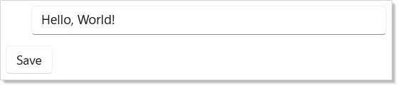
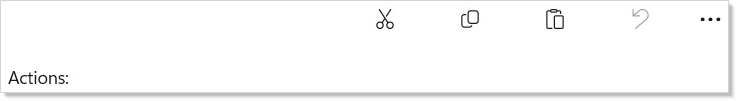
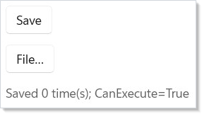
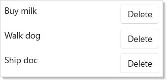
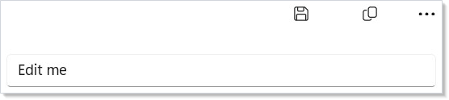
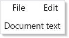

A Microsoft.UI.Reactor (Reactor) `Command` is the unit of "what the user can do" in a Reactor
app. It bundles the action, its label, icon, keyboard accelerator,
description, and enabled state into a single immutable record that you
bind from multiple call sites simultaneously. The button that runs the
action, the menu item in the toolbar overflow, the right-click flyout
entry, and the Ctrl+S keyboard binding all reference the same record —
disable the command, and every surface disables in lock-step; change
its label for [localization](localization.md), and every surface re-
labels. The contract is *synchronized state across surfaces* — the
opposite of the WPF `RoutedCommand` model where each surface registers
its own binding and `CanExecuteChanged` events fan out invalidations.
Read this page when you have an action that lives in more than one
place (toolbar + menu + keyboard), when you need async tracking with
disable-while-running semantics, or when you're wiring a
[dialog's primary button](dialogs-and-flyouts.md) to a real action
rather than an inline lambda.

# Commanding

A `Command` bundles an action with its metadata. Define it once and use it
across buttons, menus, toolbars, and dialogs — the metadata stays consistent
everywhere.

## Defining a Command

Create a command with the properties you need:

```csharp
class BasicCommandExample : Component
{
    public override Element Render()
    {
        var (text, setText) = UseState("Hello, World!");
        var (saved, setSaved) = UseState(false);

        var saveCmd = new Command
        {
            Label = "Save",
            Execute = () => setSaved(true),
            CanExecute = !saved,
            Icon = SymbolIcon("Save"),
            Accelerator = Accelerator(VirtualKey.S, VirtualKeyModifiers.Control)
        };

        return VStack(12,
            TextBox(text, v => { setText(v); setSaved(false); })
                .Width(400),
            HStack(8,
                Button(saveCmd),
                When(saved, () => TextBlock("Saved!").Foreground(Theme.SystemSuccess))
            )
        ).Padding(24);
    }
}
```



Pass a `Command` to `Button()`, `MenuItem()`, or `AppBarButton()` and the
label, icon, accelerator, and enabled state are wired automatically. You
do not set them individually on each control.

## Reference

| Member | Type | Purpose |
|---|---|---|
| `Label` | `string` (required) | Text rendered on the button / menu item / tooltip. |
| `Execute` | `Action?` | Synchronous action. Mutually exclusive with `ExecuteAsync`. |
| `ExecuteAsync` | `Func<Task>?` | Async action — pair with [`UseCommand`](hooks.md) for tracking. |
| `CanExecute` | `bool` (default `true`) | Whether the action can run right now. |
| `IsExecuting` | `bool` | Managed by `UseCommand` while async work is in flight. |
| `Icon` | `IconData?` | `SymbolIcon(name)`, `FontIcon(...)`, or `BitmapIcon(uri)`. |
| `Description` | `string?` | Tooltip / accessibility description. |
| `Accelerator` | `KeyboardAcceleratorData?` | Keyboard binding (`Accelerator(VirtualKey.S, Control)`). |
| `AccessKey` | `string?` | Single-character Alt-prefix shortcut for menu items. |
| `IsEnabled` | `bool` (computed) | `CanExecute && !IsExecuting` — what every surface reads. |

`Command<T>` exposes the same members with `Execute: Action<T>?` and
`ExecuteAsync: Func<T, Task>?` — the action receives an argument from
the call site.

## Standard Commands

`StandardCommand` provides factory methods for the 16 most common application
actions. Each comes with a label, icon, and keyboard accelerator preset:

```csharp
class StandardCommandsExample : Component
{
    public override Element Render()
    {
        var (log, updateLog) = UseReducer(new List<string>());

        var cut = StandardCommand.Cut(() => updateLog(l => [.. l, "Cut"]));
        var copy = StandardCommand.Copy(() => updateLog(l => [.. l, "Copy"]));
        var paste = StandardCommand.Paste(() => updateLog(l => [.. l, "Paste"]));
        var undo = StandardCommand.Undo(
            () => updateLog(l => [.. l, "Undo"]),
            canExecute: log.Count > 0);

        return VStack(12,
            CommandBar(
                primaryCommands: new[] { AppBarButton(cut), AppBarButton(copy),
                    AppBarButton(paste), AppBarButton(undo) }
            ),
            TextBlock($"Actions: {string.Join(", ", log)}").Padding(12)
        ).Padding(24);
    }
}
```



Available: `Cut`, `Copy`, `Paste`, `Undo`, `Redo`, `Delete`, `SelectAll`,
`Save`, `Open`, `Close`, `Share`, `Play`, `Pause`, `Stop`, `Forward`,
`Backward`. Each factory takes the action as its first argument and
optional `canExecute:` / `label:` overrides — the icon and accelerator
come from the preset.

## One Command, Many Surfaces

The point of the model: one declaration drives every surface. Bind the
same `Command` to a `Button` and a `MenuFlyout` item — clicking either
runs the action, disabling the command disables both, and the
[keyboard accelerator](#keyboard-accelerators) routes through the same
target:

```csharp
class ButtonAndMenuExample : Component
{
    public override Element Render()
    {
        var (saves, setSaves) = UseState(0);

        // One Command. Two surfaces. Identical enabled-state, label, icon, accelerator.
        var save = new Command
        {
            Label = "Save",
            Icon = SymbolIcon("Save"),
            Accelerator = Accelerator(VirtualKey.S, VirtualKeyModifiers.Control),
            Execute = () => setSaves(saves + 1),
            CanExecute = saves < 3,
        };

        return VStack(12,
            // Button surface.
            Button(save),
            // MenuFlyout surface — same Command record.
            MenuFlyout(
                Button("File…"),
                MenuItem(save)),
            TextBlock($"Saved {saves} time(s); CanExecute={save.CanExecute}")
                .Foreground(Theme.SecondaryText)
        ).Padding(24);
    }
}
```



The synchronized-state contract is the value. Without it, each surface
would compute its own `IsEnabled`, each would carry its own label
duplicate, and the keyboard binding would have to be wired by hand.
With it, the `Command` record is the source of truth; the surfaces are
projections.

## Async Commands and UseCommand

When a command has an `ExecuteAsync` action, wrap it with the
[`UseCommand`](hooks.md) hook to get automatic `IsExecuting` tracking
and a re-entrance guard. The button disables itself while the async
operation runs; a second click is dropped:

```csharp
class AsyncCommandExample : Component
{
    public override Element Render()
    {
        var (status, setStatus) = UseState("Ready");

        var saveCmd = UseCommand(new Command
        {
            Label = "Save to Cloud",
            ExecuteAsync = async () =>
            {
                setStatus("Saving...");
                await Task.Delay(2000);
                setStatus("Saved at " + DateTime.Now.ToString("HH:mm:ss"));
            },
            Icon = SymbolIcon("Save")
        });

        return VStack(12,
            HStack(8,
                Button(saveCmd),
                TextBlock(status).Foreground(Theme.SecondaryText)
            ),
            When(saveCmd.IsExecuting, () =>
                ProgressRing().Width(20).Height(20))
        ).Padding(24);
    }
}
```


`UseCommand` sets `IsExecuting = true` *before* invoking the wrapped
action and clears it in a `finally` block — so a throwing
`ExecuteAsync` still unwinds the busy state. Read `command.IsExecuting`
from any surface that wants to render progress.

```csharp
class AsyncWithProgressExample : Component
{
    public override Element Render()
    {
        var (progress, setProgress) = UseState(0.0);

        var upload = UseCommand(new Command
        {
            Label = "Upload",
            Icon = SymbolIcon("Upload"),
            ExecuteAsync = async () =>
            {
                for (var i = 0; i <= 100; i += 10)
                {
                    setProgress(i / 100.0);
                    await Task.Delay(120);
                }
            },
        });

        return VStack(12,
            HStack(8,
                Button(upload),
                When(upload.IsExecuting, () =>
                    TextBlock($"{(int)(progress * 100)}%")
                        .Foreground(Theme.SecondaryText))
            ),
            When(upload.IsExecuting, () =>
                Progress(progress * 100).Width(300))
        ).Padding(24);
    }
}
```


> **Caveat:** `UseCommand` sets `IsExecuting = true` synchronously before the awaited
> body runs, and clears it in a `finally` block after the awaited body
> completes — but a single `Command` record bound to two surfaces shares
> one `IsExecuting` flag. That is intentional for the common case (one
> Save button + one Save menu item should *both* disable while saving,
> preventing double-submit) and surprising for the cross-page case: if
> the same `Command` instance is bound from two
> [NavigationView](navigation.md) pages, the disable state crosses pages
> too — saving from page A leaves page B's Save button disabled until
> the await completes. Hoist the `Command` to the navigation root and
> the behavior is correct; recreate it per page (via
> [`UseMemo`](hooks.md) keyed on page identity) when you want
> per-surface isolation.

## Parameterized commands

`Command<T>` lets a single command apply to every row of a list, every
selected item in a grid, or any other "do X with this thing" pattern.
The action receives the argument from the call site:

```csharp
record TodoItem(int Id, string Title);

class ParameterizedCommandExample : Component
{
    public override Element Render()
    {
        var (items, setItems) = UseState<IReadOnlyList<TodoItem>>(
            new[] { new TodoItem(1, "Buy milk"), new TodoItem(2, "Walk dog"), new TodoItem(3, "Ship doc") });

        // One Command<TodoItem> drives every row.
        var delete = new Command<TodoItem>
        {
            Label = "Delete",
            Icon = SymbolIcon("Delete"),
            Execute = item => setItems(items.Where(i => i.Id != item.Id).ToList()),
        };

        return VStack(8,
            ForEach(items, item =>
                HStack(8,
                    TextBlock(item.Title).Width(180),
                    // Inline button — Command<T> doesn't have a Button(cmd, arg) overload
                    // by design, so call .Execute(arg) directly from the click handler.
                    Button(delete.Label, () => delete.Execute?.Invoke(item))
                        .IsEnabled(delete.IsEnabled)))
        ).Padding(24);
    }
}
```



For menu integration, the variadic `MenuItem(Command<T>, T parameter)`
overload binds the row's data to the menu item:

```csharp
MenuFlyout(rowContent,
    MenuItem(deleteCommand, item),
    MenuItem(renameCommand, item))
```

This is the same shape as the [right-click on a list row
pattern](dialogs-and-flyouts.md) — one parameterized command, one
context-menu declaration, every row carries its own data.

## Command Bar Integration

`CommandBar` with `AppBarButton` is the canonical toolbar surface.
Primary commands render inline; secondary commands collapse into the
overflow menu:

```csharp
class CommandBarExample : Component
{
    public override Element Render()
    {
        var (text, setText) = UseState("Edit me");

        var save = StandardCommand.Save(() => { });
        var copy = StandardCommand.Copy(() => { });
        var delete = StandardCommand.Delete(
            () => setText(""), canExecute: text.Length > 0);

        return VStack(0,
            CommandBar(
                primaryCommands: new[] {
                    AppBarButton(save), AppBarButton(copy) },
                secondaryCommands: new[] {
                    AppBarButton(delete) }
            ),
            TextBox(text, setText).Margin(16)
        );
    }
}
```



The `AppBarButton` variant of every button supports `Command` directly;
there is no second wiring step. Use `CommandBarFlyout` for the same
shape rendered next to a selection — see
[dialogs and flyouts](dialogs-and-flyouts.md#commandbarflyout).

## Menu Integration

Commands work in menu bars too. The accelerator text (like Ctrl+S)
appears automatically next to the menu item:

```csharp
class MenuBarExample : Component
{
    public override Element Render()
    {
        var (text, setText) = UseState("Document text");

        var save = StandardCommand.Save(() => { });
        var close = StandardCommand.Close(() => setText(""));
        var undo = StandardCommand.Undo(() => { });
        var redo = StandardCommand.Redo(() => { });

        return VStack(0,
            MenuBar(
                Menu("File", MenuItem(save), MenuItem(close)),
                Menu("Edit", MenuItem(undo), MenuItem(redo))
            ),
            TextBlock(text).Padding(16)
        );
    }
}
```



`MenuItem(Command)` and `MenuItem<T>(Command<T>, T parameter)` are the
two factory overloads. The latter is what powers per-row context
menus in [`ListView`](collections.md) and [`DataGrid`](data-system.md).

## Keyboard accelerators

The `Accelerator` property on `Command` is the source of truth for the
keyboard binding. The accelerator is wired at the WinUI level — the
binding lives on whichever surface is rendering the command (the
button or the menu item), and Reactor inherits WinUI's "keyboard
accelerators are scoped to the focused element's ancestor chain" rule.
For a global accelerator that fires regardless of focus, render the
command from a `MenuBar` or `CommandBar` at the window root — both
attach their accelerators to the window's `KeyboardAccelerators`
collection, which is window-scoped.

```csharp
var save = new Command
{
    Label = "Save",
    Accelerator = Accelerator(VirtualKey.S, VirtualKeyModifiers.Control),
    Execute = () => SaveDocument(),
};

// Window-scoped via MenuBar at the root.
return VStack(0,
    MenuBar(Menu("File", MenuItem(save))),
    content);
```

For a command palette-style global shortcut catalog, see
[recipes/command-palette](recipes/command-palette.md).

## Patterns

### Async confirmation dialog

The classic delete confirmation — primary button runs an `ExecuteAsync`,
the dialog stays open until the await completes, the primary disables
mid-flight. Wrap with `UseCommand`, bind `IsPrimaryButtonEnabled` to
`command.IsEnabled`, and close the dialog from inside the async body:

```csharp
var delete = ctx.UseCommand(new Command
{
    Label = "Delete",
    ExecuteAsync = async () =>
    {
        await api.DeleteAsync(id);
        setOpen(false);
    },
});

ContentDialog("Delete?", body, primaryButtonText: "Delete") with
{
    IsOpen = open,
    IsPrimaryButtonEnabled = delete.IsEnabled,
    OnClosed = r =>
    {
        if (r == ContentDialogResult.Primary) delete.Execute?.Invoke();
        else setOpen(false);
    },
}
```

See [dialogs and flyouts](dialogs-and-flyouts.md) for the full pattern.

### Localized commands

`StandardCommand` presets ship with English labels. Override per render
using the `with { ... }` expression on the returned record:

```csharp
var save = StandardCommand.Save(action) with
{
    Label = intl.Get("save.button"),
    Description = intl.Get("save.tooltip"),
};
```

See [localization](localization.md) for the `UseIntl` accessor.

### One command, three surfaces, one accelerator

The shape that motivates the whole model — Ctrl+S triggers the same
action whether the user pressed it from the editor body, opened the
File menu and clicked Save, or clicked the toolbar Save button:

```csharp
var save = new Command
{
    Label = "Save",
    Icon = SymbolIcon("Save"),
    Accelerator = Accelerator(VirtualKey.S, VirtualKeyModifiers.Control),
    ExecuteAsync = SaveDocumentAsync,
};
var saveWrapped = UseCommand(save);

return VStack(0,
    MenuBar(Menu("File", MenuItem(saveWrapped))),
    CommandBar(primaryCommands: new[] { AppBarButton(saveWrapped) }),
    editorBody);
```

## Common Mistakes

### Creating Commands inside render without memoization

```csharp
// Don't: re-create the Command on every render — every surface that
// holds the previous reference sees a fresh identity each frame, which
// thrashes the WinUI keyboard-accelerator wiring and re-renders every
// consumer. Lift to a memo or hoist out of Render().
class DontCreateInRender : Component
{
    public override Element Render()
    {
        // BAD — Command identity churns every render:
        // var save = new Command { Label = "Save", Execute = () => { } };

        // GOOD — UseMemo pins identity until deps change:
        var (count, setCount) = UseState(0);
        var save = UseMemo(() => new Command
        {
            Label = "Save",
            Execute = () => setCount(count + 1),
        }, count);

        return VStack(8, Button(save), TextBlock($"Saved {count}")).Padding(24);
    }
}
```

Re-creating the `Command` record every frame creates a fresh
`KeyboardAccelerator` and forces every consumer to re-render. The
window's accelerator table grows without bound on rapid re-renders and
the analyzer fires `REACTOR_PERF_FUNCREF` for the inline lambda
identity. Wrap the construction in [`UseMemo`](hooks.md) with the
correct dependencies, or hoist the command above the component.

### Ignoring CanExecute changes

```csharp
// Don't:
var save = new Command
{
    Label = "Save",
    Execute = () => { if (form.IsValid) Save(); },
};
```

Pushing the guard inside `Execute` works but loses the synchronized
disable across surfaces — the toolbar button stays *enabled-looking*,
the menu item is still focusable, and the user clicks expecting an
action. Promote the predicate to `CanExecute`:

```csharp
var save = new Command
{
    Label = "Save",
    Execute = Save,
    CanExecute = form.IsValid,
};
```

Now the button greys out, the menu item disables, and the accelerator
no-ops — one decision, every surface.

### Awaiting in a non-async event handler

```csharp
// Don't:
Button("Save", async () => { await api.SaveAsync(); setSaved(true); })
```

The inline async lambda runs unmanaged — there is no `IsExecuting`,
no re-entrance guard, no busy state to render against. The user
clicks five times during the await and starts five concurrent saves.
Promote the action to `ExecuteAsync` on a `Command`, wrap with
[`UseCommand`](hooks.md), and bind the button to the command. The
re-entrance guard drops duplicate clicks and `IsExecuting` lights up
the spinner.

## Tips

**Use `StandardCommand` for common operations.** It saves you from manually
specifying icons and keyboard accelerators for the 16 most common actions
and keeps your surface consistent with WinUI conventions.

**Always wrap async commands with `UseCommand`.** It prevents
double-execution via the re-entrance guard, tracks `IsExecuting`, and
clears the busy flag in a `finally` so exceptions don't leave the UI
stuck disabled.

**Read `command.IsExecuting` for loading indicators.** Any surface
bound to a wrapped async command can render a spinner from the same
flag — the [`UseCommand`](hooks.md) wrapper guarantees the flag is
live across re-renders.

**Commands are records — use `with` to customize.** Override the label
for [localization](localization.md):
`StandardCommand.Save(action) with { Label = "Guardar" }`. The original
preset stays intact for the next caller.

**Define commands at the call site for one-offs; hoist them when shared.**
A single Save button can declare its command inline. A Save action used
in the toolbar, the menu, the keyboard binding, and the dialog primary
belongs at the parent component or in a `UseMemo` so identity is stable.

## Next Steps

- **[Effects and Lifecycle](effects.md)** — Previous: run side effects for timers, data loading, and cleanup
- **[Context](context.md)** — Next: share data across the component tree without prop drilling
- **[Dialogs and Flyouts](dialogs-and-flyouts.md)** — Wire dialog primaries and right-click menus to commands
- **[Hooks](hooks.md)** — `UseCommand` and the rest of the hook surface
- **[Navigation](navigation.md)** — Scope commands to a page vs. a window
- **[Recipes: Command palette](recipes/command-palette.md)** — End-to-end recipe for a Ctrl+K palette
- **[Localization](localization.md)** — Localize command labels and accelerator text
