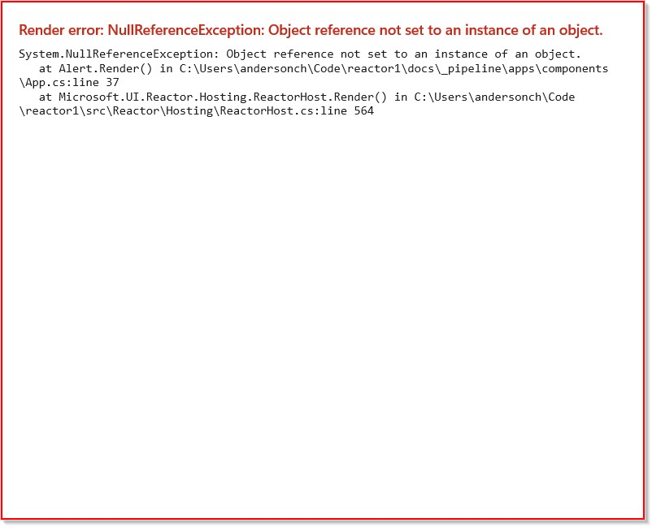
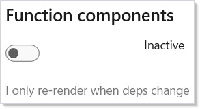
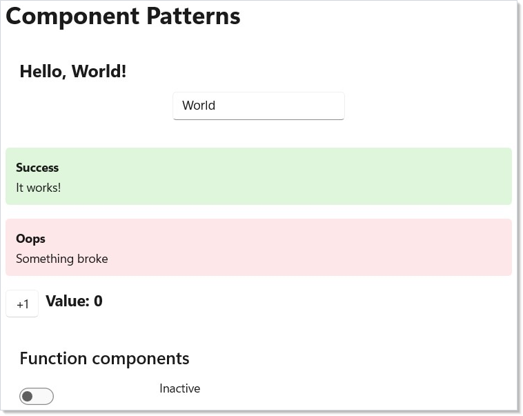

A component in Reactor is a pure function from (state + props) to an element
tree. `Render()` is called every time the component's state changes or its
parent's render produces new props, and its only job is to return what the
UI should look like *right now*. Reactor takes that return value, diffs it
against the previous render via the [reconciler](reconciliation.md), and
patches the underlying WinUI controls in place — only the properties and
children that actually changed get touched. The "function" framing is
load-bearing: a component must not mutate props, must not write to external
state during render, and must call [hooks](hooks.md) in the same positional
order on every render. Side effects belong in [`UseEffect`](effects.md);
derived values belong in [`UseMemo`](hooks.md) or inline; subscriptions
belong in effects with cleanup. Get those four rules right and a component
becomes the unit of composition that the rest of the framework is built on
— class components for stateful nodes, function components via `Memo` for
inline shapes, both composed into trees by being instantiated inside their
parent's `Render()` return value.

# Components

Components are the building blocks of a Reactor app. Each component is a class
with a `Render()` method that returns an element tree describing its UI.

## Reference

| Shape | Use when | Re-renders when |
|---|---|---|
| `class C : Component` | Stateful node with no input from parent. | Internal state changes (default `ShouldUpdate()` returns `false` for propless components — parent re-renders alone don't propagate). |
| `class C : Component<TProps>` | Stateful node that takes a `record` of inputs. | Props compare unequal (records use structural equality), or internal state changes. |
| `Memo(ctx => …)` | Inline function component with its own hook state. | Internal state changes; with `deps` argument, also when any dep changes. |
| `RenderEachTime(ctx => …)` | Inline component that should always re-render with its parent. | Every parent render — opts out of memoization. |
| `Component<C, TProps>(new(…))` | Instantiate a typed-props class component inside another component's render. | Driven by the rules above. |

Override `ShouldUpdate(TProps? old, TProps? new)` to make a `Component<TProps>`
ignore certain prop changes (cosmetic-only label updates, for example). The
default `Equals()`-based check on records is the right call for most cases.
The auto-generated [components reference](reference/elements/index.md) covers
every member; the rest of this page is the narrative.

## Basic Component

Extend `Component` and override `Render()`:

```csharp
class Greeting : Component
{
    public override Element Render()
    {
        var (name, setName) = UseState("World");

        return VStack(12,
            TextBlock($"Hello, {name}!").FontSize(20).Bold(),
            TextField(name, setName, placeholder: "Your name")
                .Width(200)
        ).Padding(16);
    }
}
```


`Render()` is called every time state changes. You call [hooks](hooks.md) like `UseState`
at the top, then return an element tree. Reactor diffs the result against the
previous render and patches only the controls that changed.

## Props with Records

When a component needs input from its parent, define a C# record for its
props and extend `Component<TProps>`:

```csharp
record AlertProps(string Title, string Message, string Severity = "info");
```

```csharp
class Alert : Component<AlertProps>
{
    public override Element Render()
    {
        var bg = Props.Severity switch
        {
            "error" => "#FDE7E9",
            "warning" => "#FFF4CE",
            _ => "#DFF6DD"
        };

        return Border(
            VStack(4,
                TextBlock(Props.Title).Bold(),
                TextBlock(Props.Message)
            ).Padding(12)
        ).Background(bg).CornerRadius(4);
    }
}
```



Records give you immutable data with value equality. Reactor uses this for
automatic memoization — if the parent re-renders but the props haven't
changed structurally, the child skips its `Render()` call.

Access props via `Props.PropertyName` inside `Render()`. The parent sets
props by assigning the `Props` property when creating the component instance.

## Factory Helpers for Cleaner Call Sites

`Component<T, TProps>(new(...))` reads heavily at the call site, especially
when nested in an element tree. The idiomatic Reactor pattern is to wrap each
class component in a free-function factory that matches the rest of the DSL:

```csharp
static class Components
{
    public static ComponentElement Alert(string title, string message,
        string severity = "info") =>
        Component<global::Alert, AlertProps>(new(title, message, severity));
}
```

With `using static Components;` at the top of the consuming file, the call
site collapses to a normal function call:

| Before                                                | After                                |
|-------------------------------------------------------|--------------------------------------|
| `Component<Alert, AlertProps>(new("Saved", "Done"))`  | `Alert("Saved", "Done")`             |
| `Component<Alert, AlertProps>(new("Hi", "x", "warn"))`| `Alert("Hi", "x", "warn")`           |

The class `Alert` and the helper method `Alert` coexist in the same scope —
C# resolves `Alert(args)` as a method call and `Component<Alert, ...>` as a
type reference, based on syntactic position.

Conventions:

- **Match the component name.** Helper `Alert` for class `Alert` reads like
  JSX: `Alert(...)` instead of `<Alert ... />`.
- **Group helpers in a single static class** named `Components` (or per
  feature). One `using static` import per consuming file is plenty.
- **Skip `Create` / `Of` / `New` prefixes.** Reactor's built-in element
  factories (`Button`, `TextBlock`, `FlexRow`) all read as bare functions;
  user helpers should match that grammar.

## Custom ShouldUpdate

Override `ShouldUpdate` to control when a component re-renders:

```csharp
record ExpensiveProps(string Label, int Value);

class ExpensiveDisplay : Component<ExpensiveProps>
{
    protected override bool ShouldUpdate(
        ExpensiveProps? oldProps, ExpensiveProps? newProps)
    {
        // Only re-render when the Value changes, ignore Label
        return oldProps?.Value != newProps?.Value;
    }

    public override Element Render()
    {
        return TextBlock($"Value: {Props.Value}").FontSize(18).Bold();
    }
}
```

The default behavior for `Component<TProps>` uses `Equals()` — which with
records means structural equality. Override `ShouldUpdate` when you want
coarser control, like ignoring cosmetic prop changes.

For propless `Component`, `ShouldUpdate()` returns `false` by default,
meaning the component only re-renders from its own state changes. Override
and return `true` to re-render whenever the parent re-renders.

## Function Components

Not everything needs a class. Use `Memo` for lightweight inline components
with their own hook state:

```csharp
class FunctionComponentDemo : Component
{
    public override Element Render()
    {
        return VStack(12,
            SubHeading("Function components"),
            // Memo: render once + own state changes (the common case).
            Memo(ctx =>
            {
                var (on, setOn) = ctx.UseState(false);
                return HStack(8,
                    ToggleSwitch(on, setOn),
                    TextBlock(on ? "Active" : "Inactive")
                );
            }),
            // Memo with a dep: skip re-render when deps haven't changed.
            Memo(ctx =>
            {
                return TextBlock("I only re-render when deps change")
                    .Opacity(0.6);
            }, "stable-dep")
        ).Padding(16);
    }
}
```



- **`Memo(ctx => { ... })`** — an inline component with its own hook state.
  With no `deps` argument, it renders once and re-renders only on its own
  state changes. The `ctx` parameter is a `RenderContext` that provides
  `UseState`, `UseEffect`, and all other hooks.
- **`Memo(ctx => { ... }, deps)`** — same as above, but also re-renders when
  any value in `deps` changes. Use this for expensive subtrees that depend on
  external props (see [Hooks](hooks.md) for `UseMemo`).
- **`RenderEachTime(ctx => { ... })`** — opts the component back into
  re-rendering on every parent render. Use sparingly — it defeats memoization
  and can amplify render storms. Pick this only when you've decided you
  *need* the always-re-render behavior.

> The older `Func(ctx => ...)` factory still works but is soft-deprecated
> (`CS0618`) — replace it with `Memo(ctx => ...)` for the common case or
> `RenderEachTime(ctx => ...)` when you specifically want the always-re-render
> shape.

You can also use a function component as the app root:

<!-- ai:lock -->
```csharp
ReactorApp.Run("Title", ctx => {
    var (n, setN) = ctx.UseState(0);
    return Text($"{n}");
}, width: 400, height: 300);
```
<!-- /ai:lock -->

## Composition

Build complex UIs by nesting components:

```csharp
class ComponentsApp : Component
{
    public override Element Render()
    {
        var (count, setCount) = UseState(0);

        return ScrollView(
            VStack(16,
                Heading("Component Patterns"),
                Component<Greeting>(),
                Component<Alert, AlertProps>(new("Success", "It works!")),
                Component<Alert, AlertProps>(new("Oops", "Something broke",
                    "error")),
                HStack(8,
                    Button("+1", () => setCount(count + 1)),
                    Component<ExpensiveDisplay, ExpensiveProps>(
                        new("Counter", count))
                ),
                Component<FunctionComponentDemo>()
            ).Padding(24)
        );
    }
}
```



Each component manages its own state independently. The parent creates child
components with `new` and sets their `Props`. Reactor handles the rest —
mounting, updating, and unmounting as the tree changes.

> **Caveat:** Identity stability across renders is what lets a component preserve its
> state, its hook slots, and its WinUI control instance between renders. The
> [reconciler](reconciliation.md) matches children by **position** by default —
> the first child in render N matches the first child in render N+1 regardless
> of what type it is. That's fine when a list is append-only and order is
> stable; it's catastrophic when items reorder, because the second-position
> state cell now belongs to a different item. Apply
> `.WithKey(item.Id)` (or any stable key) on every child of a `ForEach` /
> collection render so the reconciler matches by **identity** instead. The
> [Reconciliation](reconciliation.md#child-reconciler--keyed-vs-positional)
> chapter walks the four-phase keyed algorithm in full. The classic failure
> mode: a todo list where deleting item 2 makes item 3's checkbox state
> appear on item 2 — because positionally, slot 2 is still occupied, and the
> reconciler updated the existing component instead of mounting a new one.
> The fix is one `.WithKey(item.Id)` call per row.

## Patterns

### Composition with children

Component nesting is the primary way Reactor composes UI — there's no
"slot" or `ContentPresenter` concept; the parent's `Render()` directly
returns child element trees:

```csharp
class Card : Component<CardProps>
{
    public override Element Render() =>
        Border(
            VStack(8,
                TextBlock(Props.Title).Bold(),
                Props.Body                 // any Element, including child components
            ).Padding(12)
        ).CornerRadius(8).WithBorder(Theme.Stroke);
}
```

The caller decides what to put inside — a `TextBlock`, a `Component<Form>`,
even a runtime-built tree from `ForEach`. This is the equivalent of
React's `children` prop or XAML's `ContentControl`, but expressed in plain
C# without any binding boilerplate.

### Render-props equivalent

When a component needs to delegate part of its render to the caller, take
a `Func<…, Element>` prop. The function gets called inside the
component's `Render()` and its return value is spliced in — same as
React's render props or the `DataTemplate` selector pattern:

```csharp
record ListProps<T>(IReadOnlyList<T> Items, Func<T, Element> Render);

class List<T> : Component<ListProps<T>>
{
    public override Element Render() =>
        VStack(4, ForEach(Props.Items, item => Props.Render(item).WithKey(item)));
}
```

The caller picks the row shape — `item => TextBlock(item.Name)` or a full
nested component — without the list component knowing anything about the
item type beyond the key.

### Lifted state

When two siblings need to coordinate, push the state up to their common
parent and pass `(value, setter)` down. This is the
[recipes/master-detail](recipes/master-detail.md) pattern: the master list
and the detail panel both react to a shared `selectedId`, owned by the
parent. The siblings stay pure — they take props in, call back out. See
[hooks](hooks.md) for the `UseState` shape this pattern composes from.

### ErrorBoundary integration

Wrap a subtree in `ErrorBoundary` to catch exceptions from any of its
children's `Render` calls. The boundary swaps in your fallback element
instead of letting the exception bubble up to the host, which would
unmount the whole tree:

```csharp
ErrorBoundary(
    fallback: ex => TextBlock($"Crash: {ex.Message}").Foreground(Theme.Error),
    child: Component<RiskyView>()
)
```

The [Advanced Patterns](advanced.md) page covers the lifecycle and
recovery contract; the point at the components layer is that boundaries
are themselves components, composed into the tree at the granularity you
want isolation.

## Common Mistakes

### Side effects in render

```csharp
// Don't:
public override Element Render()
{
    File.AppendAllText("log.txt", "rendered\n");  // I/O during render
    Globals.RenderCount++;                          // mutation during render
    return TextBlock("hi");
}
```

`Render()` may be called any number of times per user action — once per
state change, plus diagnostic renders the [devtools](dev-tooling.md) may
trigger. Side effects must move into [`UseEffect`](effects.md) so they
run exactly once per commit. Diagnostic counters belong in
[`UseRef`](hooks.md), which mutates without scheduling a re-render.

### Mutating props

```csharp
// Don't:
public override Element Render()
{
    Props.Items.Add(newItem); // mutates the parent's collection
    return ListView(...);
}
```

Props are inputs from the parent — read-only by contract. Mutating the
underlying list bypasses the parent's state setter, so the parent never
sees the change and doesn't re-render. Worse, the next time the parent
*does* re-render and pass `Items` down again, your local mutation has
silently changed the parent's snapshot. The fix is to call back through
the prop's setter: take an `Action<Item> OnAdd` prop and have the parent
own the list via [`UseState`](hooks.md).

### Creating components inside render

```csharp
// Don't:
public override Element Render()
{
    class LocalComponent : Component { ... }     // not even valid C#, but
    var inline = (Component)CreateLocal();        // any "build a class per render" shape
    return Component<inline>();
}
```

The reconciler matches by type identity — a fresh component class per
render compares unequal to last render's class, so the child unmounts and
remounts every commit, losing all hook state and WinUI control instances.
Define component classes at the top level of a file (or use `Memo(ctx =>
…)` for inline shapes, which the reconciler treats as a stable function
identity). The same anti-pattern in React loses state for the same reason
and for the same root cause.

## Tips

**Use records for props.** They give you immutable data, value equality, and
`with` expressions for free. Reactor's memoization depends on `Equals()` working
correctly.

**Prefer composition over deep inheritance.** `Component` and
`Component<TProps>` are the only base classes you need. Build complexity
through nesting, not class hierarchies.

**Use `Memo` for one-off components.** If a component is only used in one
place and has simple state, an inline `Memo(ctx => ...)` avoids the class
boilerplate while still memoizing its render.

**Keep Render() pure.** Don't mutate external state or perform I/O inside
`Render()`. Use [`UseEffect`](effects.md) for side effects. `Render()` should be a pure
function from (state + props) to elements.

**Name components after what they display, not what they do.** `Alert`,
`UserCard`, `SettingsPanel` — not `AlertHandler`, `UserManager`,
`SettingsProcessor`.

## Next Steps

- **[Hooks](hooks.md)** — Next: deep dive into UseState, UseReducer, UseEffect, and all the hooks
- **[Dev Tooling](dev-tooling.md)** — Previous: hot reload and preview mode for faster iteration
- **[Layout](layout.md)** — Arrange components with VStack, HStack, Grid, and responsive patterns
- **[Styling and Theming](styling.md)** — Apply colors, typography, and themes to your components
- **[Reconciliation](reconciliation.md)** — How the diff matches components across renders and why keys matter
- **[Advanced Patterns](advanced.md)** — ErrorBoundary, Memo, .Set, custom hooks
