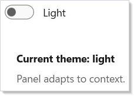
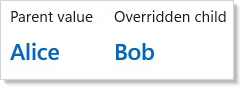
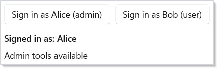

A Microsoft.UI.Reactor (Reactor) `Context<T>` is namespaced dependency injection scoped to the
element tree, with reactivity. Define a context once as a static field,
publish a value to any element's subtree with the `.Provide(ctx, value)`
modifier, and any descendant component reads the current value with
`UseContext(ctx)`. The component does not need to know which ancestor
provided it; intermediate components do not need to forward the value as
a prop; and when the provided value changes, every consumer re-renders.
That is the same shape as React's `createContext` /
`<Provider value>` / `useContext` triad, and the same shape as Compose's
`CompositionLocal`. The most important property of the system is
*value-identity awareness*: consumers re-render when the provided value
is not equal to the previous value, so passing a fresh object literal
on every render thrashes every consumer in the subtree. Read this page
when you have data that many distant components need (theme, current
user, locale, feature flags) and prop-threading would force every
intermediate component to declare a prop it never uses.

# Context

Context lets you pass data through the [component](components.md) tree without
threading it through every level of props. Define a `Context<T>`, provide a
value at any level, and any descendant can read it with `UseContext`.

## Reference

| API | Shape | Purpose |
|---|---|---|
| `Context<T>` | `new Context<T>(T defaultValue)` | The handle. Define once as a static field; `defaultValue` is returned when no provider is in scope. |
| `.Provide(ctx, value)` | Modifier on any `Element` | Supplies `value` to descendants of this element. Multiple `.Provide(...)` chain into one merged dictionary. |
| `UseContext(ctx)` | Hook returning `T` | Reads the current value from the nearest ancestor provider; returns `ctx.DefaultValue` if none. |

`Context<T>` is reactive: changing the provided `value` (by re-rendering
the provider with a different reference) re-renders every component in
the subtree that called `UseContext` on this context. Identity matters
— see [memoizing the value](#stabilizing-the-provided-value).

## Creating a Context

A context is a static field with a default value:

```csharp
static class Contexts
{
    public static Context<string> ThemeMode = new("light");
    public static Context<string> UserName = new("Guest");
    public static Context<int> FontScale = new(16);
}
```

Choose a sensible default — it makes components work standalone during
development, in [test fixtures](#testing-with-a-mock-provider) without
extra wiring, and in Storybook-style previews. A default of `null`
forces every consumer to handle the unprovided case; a default that's a
real value is almost always nicer.

## Providing and Consuming

Use `.Provide()` on any element to supply a value to its subtree. Use
`UseContext()` in any descendant to read it:

```csharp
class ProvideConsumeExample : Component
{
    public override Element Render()
    {
        return VStack(12,
            TextBlock("Outside: no provider"),
            VStack(12,
                Component<Greeting>()
            ).Provide(Contexts.UserName, "Alice")
        ).Padding(24);
    }
}

class Greeting : Component
{
    public override Element Render()
    {
        var name = UseContext(Contexts.UserName);
        return TextBlock($"Hello, {name}!").FontSize(20).Bold();
    }
}
```


`.Provide()` is a modifier like `.Padding()` or `.Background()` (see
[styling](styling.md)) — it works on any element and the value
propagates to every descendant, no matter how deep. Components between
the provider and the consumer don't need to know the value exists.

## Theme Switching with Context

A common use case is a theme toggle that affects an entire subtree. Here
the root component provides a theme value, and child components consume
it:

```csharp
class ThemeSwitchExample : Component
{
    public override Element Render()
    {
        var (isDark, setIsDark) = UseState(false);
        var mode = isDark ? "dark" : "light";
        return VStack(16,
            ToggleSwitch(isDark, setIsDark, onContent: "Dark", offContent: "Light"),
            VStack(12, Component<ThemePanel>()).Provide(Contexts.ThemeMode, mode)
        ).Padding(24);
    }
}

class ThemePanel : Component
{
    public override Element Render()
    {
        var theme = UseContext(Contexts.ThemeMode);
        var elTheme = theme == "dark" ? ElementTheme.Dark : ElementTheme.Light;
        return Border(
            VStack(8,
                TextBlock($"Current theme: {theme}").Bold(),
                TextBlock("Panel adapts to context.").Foreground(Theme.SecondaryText)
            ).Padding(16)
        ).Background(Theme.CardBackground)
         .CornerRadius(8)
         .Set(b => b.RequestedTheme = elTheme);
    }
}
```



The `ThemePanel` component reads the context and applies `ElementTheme`
accordingly. When the toggle changes the provided value, all consumers
re-render with the new theme. This is the same shape as Reactor's
[styling and theming](styling.md) tokens use internally.

## Nested Context Overrides

A child provider overrides its parent's value for its own subtree.
Siblings keep the original value:

```csharp
class NestedOverrideExample : Component
{
    public override Element Render()
    {
        return HStack(16,
            VStack(8,
                Caption("Parent value"),
                Component<NameDisplay>()
            ).Provide(Contexts.UserName, "Alice"),
            VStack(8,
                Caption("Overridden child"),
                VStack(4, Component<NameDisplay>())
                    .Provide(Contexts.UserName, "Bob")
            ).Provide(Contexts.UserName, "Alice")
        ).Padding(24);
    }
}

class NameDisplay : Component
{
    public override Element Render()
    {
        var name = UseContext(Contexts.UserName);
        return TextBlock(name).FontSize(18).SemiBold().Foreground(Theme.Accent);
    }
}
```



The inner `.Provide()` only affects descendants of that element. The
sibling subtree still sees the parent's value. This lets you create
local overrides — a single preview tile that always renders dark, an
accent-color demo, a permission-denied subtree that re-scopes the
current-user context — without affecting the rest of the tree.

## Multiple Contexts

Components can provide and consume multiple contexts simultaneously.
Each context is independent:

```csharp
class MultipleContextsExample : Component
{
    public override Element Render()
    {
        return VStack(8,
            Component<ProfileCard>()
        ).Provide(Contexts.UserName, "Charlie")
         .Provide(Contexts.FontScale, 22)
         .Padding(24);
    }
}

class ProfileCard : Component
{
    public override Element Render()
    {
        var name = UseContext(Contexts.UserName);
        var fontSize = UseContext(Contexts.FontScale);

        return Border(
            VStack(8,
                TextBlock(name).FontSize(fontSize).Bold(),
                TextBlock($"Font scale from context: {fontSize}px")
                    .Foreground(Theme.SecondaryText)
            ).Padding(16)
        ).Background(Theme.CardBackground).CornerRadius(8);
    }
}
```


Each `Context<T>` is a separate channel. Providing one doesn't affect
another. A component can call `UseContext` as many times as it needs;
each call subscribes that component to changes in its specific context.

## Current-user pattern

A typed record at the app root, provided once, read from every page —
this is the canonical "share state without prop-threading" shape:

```csharp
// A typed user-context record at the app root — every page reads the
// current user via UseContext rather than threading a User prop through
// every component along the way.
record CurrentUser(string Id, string DisplayName, bool IsAdmin);

static class AppContexts
{
    public static Context<CurrentUser> User = new(
        new CurrentUser("guest", "Guest", IsAdmin: false));
}

class UserContextExample : Component
{
    public override Element Render()
    {
        var (user, setUser) = UseState(new CurrentUser("u1", "Alice", IsAdmin: true));

        return VStack(12,
            HStack(8,
                Button("Sign in as Alice (admin)",
                    () => setUser(new CurrentUser("u1", "Alice", IsAdmin: true))),
                Button("Sign in as Bob (user)",
                    () => setUser(new CurrentUser("u2", "Bob", IsAdmin: false)))
            ),
            VStack(8,
                Component<AccountMenu>(),
                Component<AdminPanel>()
            ).Provide(AppContexts.User, user)
        ).Padding(24);
    }
}

class AccountMenu : Component
{
    public override Element Render()
    {
        var user = UseContext(AppContexts.User);
        return TextBlock($"Signed in as: {user.DisplayName}").SemiBold();
    }
}

class AdminPanel : Component
{
    public override Element Render()
    {
        var user = UseContext(AppContexts.User);
        return user.IsAdmin
            ? Border(TextBlock("Admin tools available").Padding(8))
                .Background(Theme.CardBackground).CornerRadius(4)
            : TextBlock("(no admin tools)").Foreground(Theme.SecondaryText);
    }
}
```



The signed-in user lives in [`UseState`](hooks.md) at the app root.
The `.Provide(AppContexts.User, user)` modifier publishes it; the
`AccountMenu` and `AdminPanel` components live anywhere in the tree
and read it via `UseContext`. Sign in as a different user — both
panels re-render because both subscribe to the same context.

## Stabilizing the provided value

The provided value's *identity* is what `UseContext` consumers compare
against. Constructing a fresh object literal on every render — even
when the underlying data hasn't changed — invalidates every consumer:

```csharp
// The value identity matters. Wrapping in UseMemo with explicit deps
// stops every consumer from re-rendering on every provider render —
// the inline-literal version below would create a fresh tuple every
// frame even when nothing changed.
record ThemeConfig(string Mode, int FontScale, string Accent);

static class ThemeContexts
{
    public static Context<ThemeConfig> Theme = new(new ThemeConfig("light", 14, "#0078D4"));
}

class MemoizeContextValueExample : Component
{
    public override Element Render()
    {
        var (mode, setMode) = UseState("light");
        var (scale, setScale) = UseState(14);

        // GOOD — identity stable while inputs unchanged. Consumers only
        // re-render when mode or scale actually change.
        var theme = UseMemo(() => new ThemeConfig(mode, scale, "#0078D4"), mode, scale);

        // BAD — every render creates a fresh ThemeConfig.
        // var theme = new ThemeConfig(mode, scale, "#0078D4");

        return VStack(12,
            HStack(8,
                Button("Toggle mode", () => setMode(mode == "light" ? "dark" : "light")),
                Button("Bump scale", () => setScale(scale + 2))
            ),
            VStack(8, Component<ThemedHeading>())
                .Provide(ThemeContexts.Theme, theme)
        ).Padding(24);
    }
}

class ThemedHeading : Component
{
    public override Element Render()
    {
        var t = UseContext(ThemeContexts.Theme);
        return TextBlock($"Headline @ {t.FontScale}px ({t.Mode})")
            .FontSize(t.FontScale).Foreground(t.Accent);
    }
}
```


The `UseMemo` call pins the `ThemeConfig` identity to its dependencies.
Consumers only re-render when `mode` or `scale` actually changes. This
is the same shape as React's
[`useMemo` for context values](https://react.dev/reference/react/useMemo#optimizing-re-rendering-of-components-that-use-context).

> **Caveat:** Context value-identity drives consumer re-renders. Passing a fresh
> object literal on every render — `.Provide(ctx, new Config { ... })`
> inside `Render()` — causes every component that called `UseContext(ctx)`
> in the subtree to re-render every frame, even when the underlying data
> didn't change. The classic failure mode: a theme provider at the app
> root passes `new Theme(...)` inline; every page, every form field,
> every text block re-renders on every state change anywhere in the
> parent tree. The fix is two-fold: (1) wrap the value in
> [`UseMemo`](hooks.md) with explicit dependencies so identity is stable
> between updates, or (2) move the construction outside `Render()` so
> it's a singleton. The performance overlay (`mur docs perf-overlay`)
> makes this visible — look for high "context-driven re-render" counts
> in the [devtools](dev-tooling.md) view.

## Patterns

### Hoisting state to the nearest common ancestor

The most-cited React tip — "lift state up to the lowest ancestor that
needs to know about it" — applies word-for-word in Reactor. Context is
how you propagate that lifted state back down without the boring
middle. A two-pane editor with a shared toolbar that needs the selected
item: lift selection to the parent that owns both panes, provide it as
context, both panes consume. The keyboard shortcut handler at the app
root also reads the same context — same pattern, no prop-threading.

### Testing with a mock provider

Production wraps the component tree with a real user-fetch provider.
Tests render the *same* component tree wrapped with `.Provide(ctx,
testStub)` — the consumer code is unchanged, and the test controls
every value via the stub:

```csharp
// Production root provides the real value; tests render the same
// component tree with a Provide(...) wrapper supplying a stub. The
// consumer code is unchanged — context lets you swap dependencies
// without re-plumbing props.
class CartConsumer : Component
{
    public override Element Render()
    {
        var user = UseContext(AppContexts.User);
        return TextBlock($"Cart for {user.DisplayName} ({user.Id})");
    }
}

class MockProviderExample : Component
{
    public override Element Render()
    {
        // Two trees: one with the "real" production default, one with a
        // test stub supplied via .Provide(). Same CartConsumer in both.
        return HStack(24,
            VStack(8,
                Caption("Production default"),
                Component<CartConsumer>()
            ),
            VStack(8,
                Caption("Test stub"),
                VStack(0, Component<CartConsumer>())
                    .Provide(AppContexts.User, new CurrentUser("test", "Test User", IsAdmin: false))
            )
        ).Padding(24);
    }
}
```


This is the recommended pattern for unit tests that span more than one
component — see [testing](testing.md) for the renderer-fixture details
and the snapshot-test surface.

### Scoped feature flags

Read a feature flag from the nearest ancestor `Context<FeatureFlags>`,
override it for a single subtree to demo a beta surface, and the rest
of the app stays on stable. The nested-override section above is the
shape; the flag record is the payload.

## Common Mistakes

### Inline literals as the provided value

```csharp
// Don't:
return VStack(child)
    .Provide(ctx, new ThemeConfig(mode, scale, "#0078D4"));
```

Every render constructs a fresh `ThemeConfig`, which compares unequal
to the previous render's value, which re-renders every
`UseContext(ctx)` consumer in the subtree. See the
[stabilization caveat](#stabilizing-the-provided-value) above and use
[`UseMemo`](hooks.md) or hoist the construction.

### Reading context from outside any provider

```csharp
// Static field default of `null`.
public static Context<CurrentUser?> User = new(null);

// In a component that's somehow rendered before the root provides:
var user = UseContext(AppContexts.User);
var name = user.DisplayName;  // NullReferenceException
```

When no ancestor has called `.Provide`, `UseContext` silently returns
`ctx.DefaultValue` — there's no warning, no exception. The component
runs against the default, which is rarely what the developer expected.
Either pick a non-null default that's safe to render against, or treat
the default as an "uninitialized" sentinel and branch explicitly. The
[init pattern](recipes/login.md) uses the latter — anonymous user is
the sentinel, the authentication flow swaps it out at the provider.

### Using context for state that should be props

```csharp
// Don't:
public static Context<int> SelectedIndex = new(0);

// In a list component:
var index = UseContext(SelectedIndex);
```

If the value flows from one parent to one child, it's a prop. Context
is for cross-cutting data — theme, locale, current user, feature flags
— where many distant components at different depths need it. Forcing
a single-source-single-sink relationship through context obscures the
data flow and makes the component impossible to reuse with a different
selection. See React's
[guidance on alternatives to context](https://react.dev/learn/passing-data-deeply-with-context#before-you-use-context).

## Tips

**Use context for cross-cutting concerns.** Theme, locale, current
user, feature flags, dispatcher handles — anything that many
components at different depths need. Component-specific data is what
[props](components.md) are for.

**Always set a meaningful default.** Components that read context
should work even without a provider — the default enables standalone
testing, Storybook-style previews, and ergonomic development against
isolated components.

**Memoize the provided value.** Wrap the value in [`UseMemo`](hooks.md)
with explicit dependencies. Inline literals on every render thrash
every consumer in the subtree.

**Override locally where it helps.** A debug-only `.Provide()` on a
single test panel lets you preview an alternate theme, a different
locale, or a mocked user without rewiring the rest of the app. See the
[nested overrides](#nested-context-overrides) section.

**Compose context with [`UseState`](hooks.md) for dynamic values.**
Store the value in state at the provider component, hand the setter
down through a separate command context if needed, and consumers
update automatically when the setter is called.

## Next Steps

- **[Commanding](commanding.md)** — Previous: bundle actions with labels, icons, and keyboard accelerators
- **[Accessibility](accessibility.md)** — Next: focus traps, screen-reader announcements, ARIA roles
- **[Hooks](hooks.md)** — `UseContext`, `UseState`, `UseMemo`, and the rest of the hook surface
- **[Styling and Theming](styling.md)** — Use context to propagate theme tokens across the app
- **[Components](components.md)** — Props vs. context — when each shape is right
- **[Localization](localization.md)** — `IntlContexts.Locale` is a real-world context in the framework
- **[Testing](testing.md)** — Use `.Provide()` in test fixtures to inject stubs without re-plumbing props
