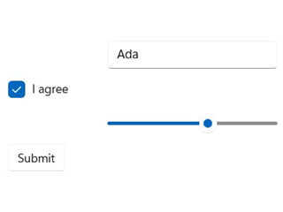
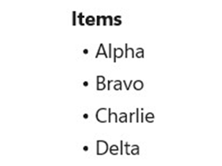
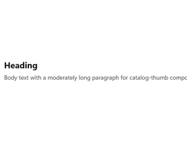
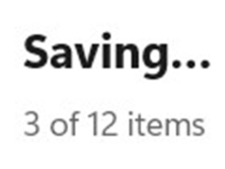
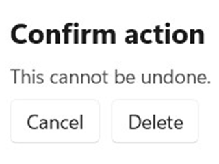
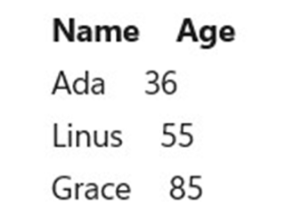
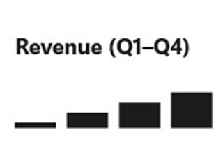

# Controls

```csharp
class ControlsCatalogApp : Component
{
    public override Element Render() => VStack(8,
        TextBlock("Controls catalog").FontSize(20).Bold(),
        TextBlock("Every Reactor control, grouped by category.").Opacity(0.7),
        Button("Open Forms", () => { })
    ).Padding(16);
}
```

Every visible thing on screen is a control. In Microsoft.UI.Reactor (Reactor) a control is the
return value of a factory like `TextBlock(...)` or `Button(...)` — a
plain element you compose, chain modifiers onto, and return from
`Render()`. The seven categories below cover the full set Reactor
exposes today. Pick a category, open its detail page, and you'll find
the factory signature, modifier matrix, and screenshots for every
control inside it.

Two ground rules apply across the catalog:

1. **Every control has a Reactor factory.** No XAML in `Render()` — the
   factories on [`Microsoft.UI.Reactor.Factories`](hooks.md) are the
   only thing you need to compose UI.
2. **WinUI-wrapper controls link out, not duplicate.** When a control
   (like `DatePicker` or `AutoSuggestBox`) is a transparent WinUI
   wrapper, the Reactor page covers the factory and modifier surface
   and links to the Microsoft Learn design page for theming, layout
   guidance, and accessibility behavior. Reactor-original controls
   (`DataGrid`, `MarkdownTextBlock`, `VirtualList`, `FlexPanel`) are
   documented exhaustively in their own pages.

## Categories

| Category | What's in it | Detail page |
|---|---|---|
| Forms | Text input, picker, button, validation primitives | [Forms](forms.md) |
| Collections | List, grid, virtualized list, repeater | [Collections](collections.md) |
| Text & Media | Heading, rich text, image, media player | [Text & Media](text-and-media.md) |
| Status & Info | Progress, info bar, badge, teaching tip | [Status & Info](status-and-info.md) |
| Dialogs & Flyouts | Content dialog, menu flyout, command bar flyout | [Dialogs & Flyouts](dialogs-and-flyouts.md) |
| Data System | DataGrid, columns, data sources, paging | [Data System](data-system.md) |
| Charting | Line, bar, area, pie, force graph | [Charting](charting.md) |

## Forms

Text input, choice, sliders, buttons, and the validation pipeline.
Forms is the category most apps spend time in; the detail page
([forms.md](forms.md)) covers controlled-input patterns and the
`FormField` validation surface.

```csharp
class FormsGroup : Component
{
    public override Element Render()
    {
        var (name, setName) = UseState("Ada");
        var (agree, setAgree) = UseState(true);
        var (volume, setVolume) = UseState(60.0);

        return VStack(8,
            TextBox(name, setName, placeholder: "Name").Width(200),
            CheckBox(agree, setAgree, label: "I agree"),
            Slider(volume, 0, 100, setVolume).Width(200),
            Button("Submit", () => { })
        ).Padding(16);
    }
}
```



| Control | Description |
|---|---|
| `TextBox` | Single-line text input with placeholder + header. |
| `PasswordBox` | Obscured text input. |
| `NumberBox` | Numeric input with up/down spinner. |
| `CheckBox` | Two-state checkbox with optional label. |
| `ToggleSwitch` | Two-state switch with optional header. |
| `Slider` | Min/max-bounded numeric value. |
| `ComboBox` | Drop-down list of strings. |
| `RadioButtons` | Single-select radio group. |
| `Button` | Click handler with label. |

WinUI design page: [Buttons](https://learn.microsoft.com/en-us/windows/apps/design/controls/buttons),
[Text controls](https://learn.microsoft.com/en-us/windows/apps/design/controls/text-controls).

## Collections

Bound-list rendering and virtualization. Use `ListView` when the data
fits in memory and the row template is uniform, `VirtualList` when the
list is large enough that mounting all rows would hurt frame time, and
`LazyVStack` when the layout must be a stack but mounting cost is the
bottleneck.

```csharp
class CollectionsGroup : Component
{
    public override Element Render()
    {
        var items = new[] { "Alpha", "Bravo", "Charlie", "Delta" };
        return VStack(4,
            TextBlock("Items").Bold(),
            ForEach(items, item => TextBlock($"  • {item}"))
        ).Padding(16);
    }
}
```



| Control | Description |
|---|---|
| `ListView<T>` | Bound, keyed list with per-item view builder. |
| `GridView<T>` | Tiled bound collection. |
| `LazyVStack<T>` | Defer-mounted vertical stack. |
| `VirtualList` | Index-driven virtual list with scroll API. |
| `ForEach` | Compose a sequence of elements without a list control. |

Detail page: [Collections](collections.md).

## Text & Media

Read-only display surfaces: headings, body text, formatted text,
images, video. Most are transparent WinUI wrappers; the
Reactor-original here is `MarkdownTextBlock`, which renders Markdown
without round-tripping through a WebView.

```csharp
class TextAndMediaGroup : Component
{
    public override Element Render() => VStack(6,
        TextBlock("Heading").FontSize(20).Bold(),
        TextBlock("Body text with a moderately long paragraph " +
                  "for catalog-thumb composition.").Opacity(0.8)
    ).Padding(16);
}
```



| Control | Description |
|---|---|
| `TextBlock` | Single-line or wrapping text. |
| `Heading` / `SubHeading` / `Caption` | Semantic text sizes. |
| `RichTextBlock` | Inline-formatted text. |
| `RichEditBox` | Editable rich text. |
| `MarkdownTextBlock` | Reactor-original Markdown renderer. |
| `Image` | Bitmap source. |
| `MediaPlayerElement` | Video / audio playback. |
| `WebView2` | Embedded Chromium surface. |
| `InkCanvas` | Pen input. **Not yet wrapped — track in spec TBD.** |

Detail page: [Text & Media](text-and-media.md).

## Status & Info

Non-interactive feedback: progress, badges, info bars, teaching tips.
Use these to inform without stealing focus — for blocking confirmation
you want [Dialogs & Flyouts](dialogs-and-flyouts.md) instead.

```csharp
class StatusGroup : Component
{
    public override Element Render() => VStack(8,
        TextBlock("Saving…").Bold(),
        TextBlock("3 of 12 items").Opacity(0.7)
    ).Padding(16);
}
```



| Control | Description |
|---|---|
| `ProgressBar` | Linear determinate / indeterminate progress. |
| `ProgressRing` | Spinner for indeterminate work. |
| `InfoBar` | Inline app-state message. |
| `InfoBadge` | Notification count badge. |
| `TeachingTip` | One-shot guided callout. |
| `PipsPager` | Compact paginator dots. |
| `PersonPicture` | Contact avatar. |
| `RatingControl` | 1–5 star rating. |

Detail page: [Status & Info](status-and-info.md).

## Dialogs & Flyouts

Modal and ephemeral surfaces. Reactor wires these through the
[commanding](commanding.md) system so the same `Command<T>` can light
up a button, a menu item, and a keyboard shortcut without duplicating
logic.

```csharp
class DialogsGroup : Component
{
    public override Element Render() => VStack(8,
        TextBlock("Confirm action").Bold(),
        TextBlock("This cannot be undone.").Opacity(0.8),
        HStack(8,
            Button("Cancel", () => { }),
            Button("Delete", () => { })
        )
    ).Padding(16);
}
```



| Control | Description |
|---|---|
| `ContentDialog` | Modal full-screen confirmation. |
| `MenuFlyout` | Context menu attached to a target. |
| `CommandBarFlyout` | Mini-toolbar with commands. |
| `Popup` | Free-form anchored surface. |

Detail page: [Dialogs & Flyouts](dialogs-and-flyouts.md).

## Data System

`DataGrid` and the data-source / column / paging primitives. The
data-system surface is Reactor-original (no WinUI parallel) and is
documented exhaustively in [data-system.md](data-system.md).

```csharp
class DataSystemGroup : Component
{
    public override Element Render()
    {
        var rows = new[] { ("Ada", 36), ("Linus", 55), ("Grace", 85) };
        return VStack(4,
            HStack(16,
                TextBlock("Name").Bold(),
                TextBlock("Age").Bold()
            ),
            ForEach(rows, r => HStack(16,
                TextBlock(r.Item1),
                TextBlock(r.Item2.ToString())
            ))
        ).Padding(16);
    }
}
```



| Control / Type | Description |
|---|---|
| `DataGrid<T>` | Virtualized grid with sort / filter / inline edit. |
| `Column<T>` | Column descriptor + builder. |
| `IDataSource<T>` | Pluggable data source abstraction. |
| `ListDataSource<T>` | In-memory source with client-side sort/filter. |
| `DataPageCache<T>` | Incremental paging cache. |

Detail page: [Data System](data-system.md).

## Charting

`ReactorCharting` package — chart primitives that compose like any
other element. Bring the charts into scope with
`using static Microsoft.UI.Reactor.Charting.Charts;`.

```csharp
class ChartingGroup : Component
{
    public override Element Render() => VStack(8,
        TextBlock("Revenue (Q1–Q4)").Bold(),
        // Placeholder visual — the real charting category uses ReactorCharting.
        TextBlock("▁ ▃ ▅ ▇").FontSize(28)
    ).Padding(16);
}
```



| Control | Description |
|---|---|
| `LineChart<T>` | Line series with axes. |
| `BarChart<T>` | Bar / column series. |
| `AreaChart<T>` | Filled area under a line. |
| `PieChart<T>` | Categorical share. |
| `TreeChart<T>` | Hierarchical layout. |
| `ForceGraph` | Force-directed node graph. |

Detail page: [Charting](charting.md).

## Tips

**Don't reach for a custom Component before checking the catalog.**
Most needs are met by composing existing factories — a "card" is a
`VStack` inside a `Border`, a "stat tile" is two `TextBlock`s stacked.
The cost of a custom Component is the cost of maintaining its render
function forever.

**Reactor-original vs. WinUI wrapper matters for documentation.**
Wrappers point to Microsoft Learn for design guidance; Reactor-originals
own their full surface here. When the per-control page is missing a
section like "accessibility behavior", check whether the control is a
wrapper — the answer is usually upstream.

**Catalog thumbnails are not micro-tutorials.** They show the control
in a representative state, no more. The detail page covers usage,
modifiers, and the "Don't" cases.

## Next Steps

- **[Components](components.md)** — Previous: how a `Component` is the
  thing that hosts a tree of controls.
- **[Forms](forms.md)** — Next: the biggest catalog category, with the
  full input + validation surface.
- **[Layout](layout.md)** — How `VStack` / `HStack` / `Grid` /
  `FlexPanel` compose any control into a real screen.
- **[Styling](styling.md)** — `ThemeRef` tokens, modifier chaining, and
  named styles applied across the catalog.
- **[Recipes](recipes/index.md)** — Real-world compositions that pull
  controls together into common shapes.
