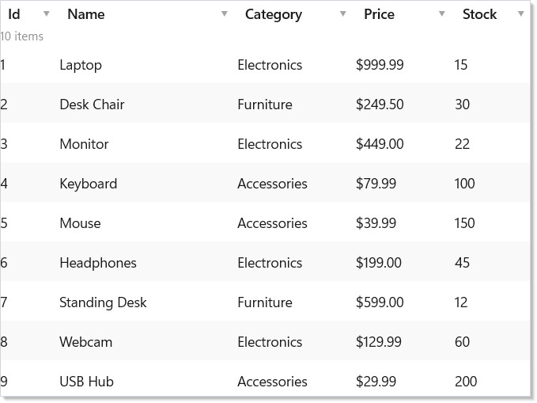
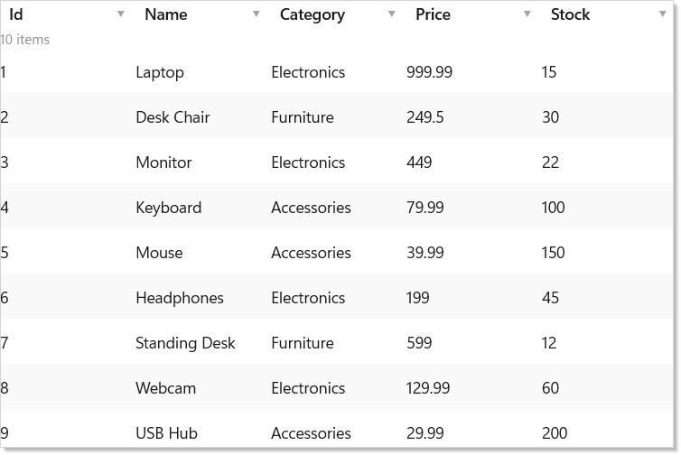
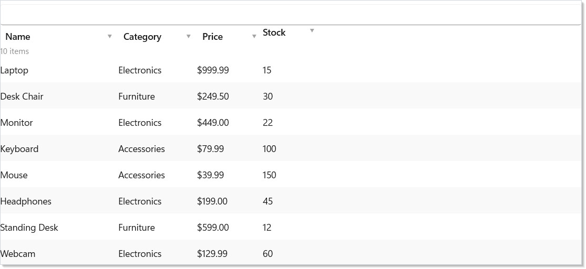
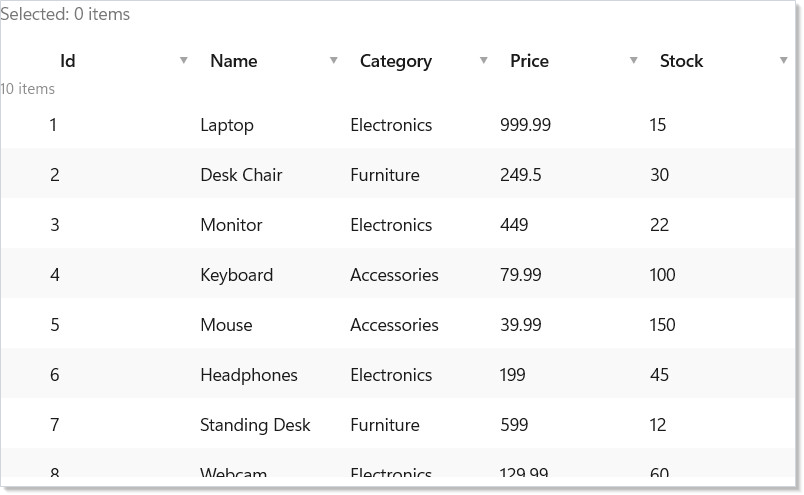
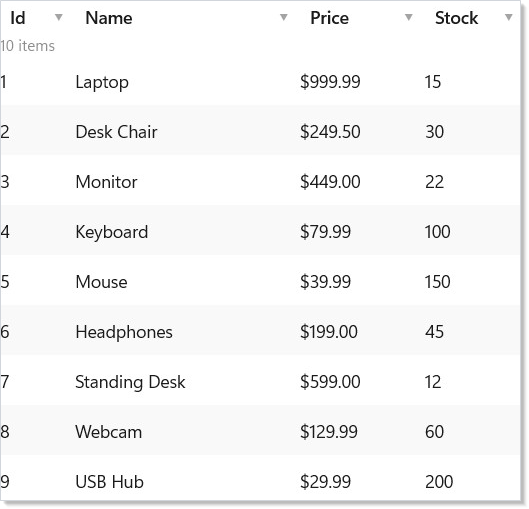
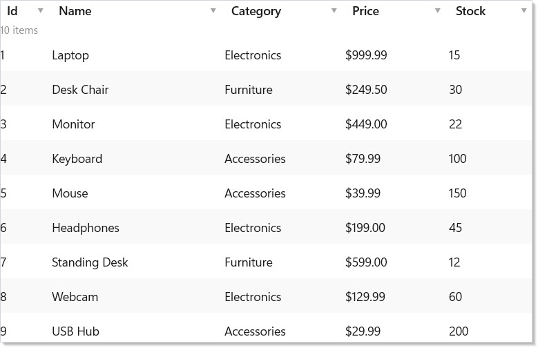
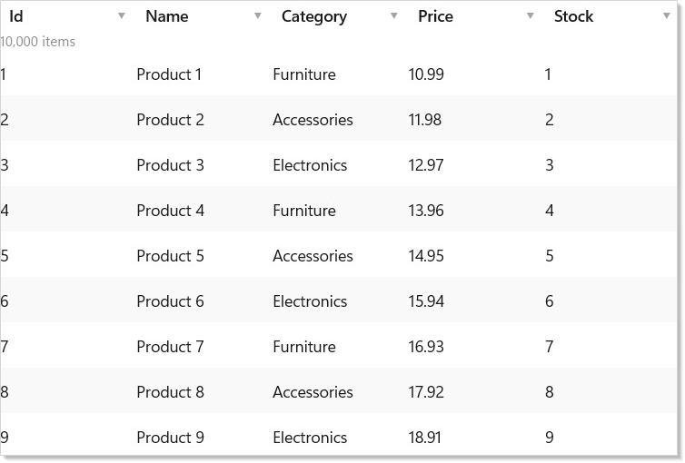
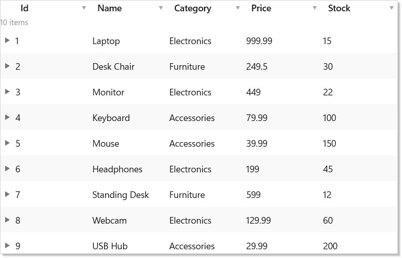

# Data System

Reactor's data system provides a virtualized `DataGrid<T>` backed by a
pluggable data source abstraction. You define columns (or auto-generate
them), connect a data source, and the grid handles sorting, filtering,
searching, selection, and inline editing.

## Data Sources

All data flows through `IDataSource<T>` — an async, page-based abstraction.
You never pass raw lists to the grid; instead you wrap your data in a
source that declares its capabilities:

```csharp
class DataSourceExample
{
    // Wrap an in-memory list — supports client-side sort, filter, search
    static ListDataSource<Product> CreateSource() =>
        new(SampleProducts.Items, p => (RowKey)p.Id);

    // source.Capabilities → Sort | Filter | Search | Count | Mutate
}
```

`ListDataSource<T>` wraps an in-memory list and provides client-side sort,
filter, and search. For data-bound collections, use
`ObservableListDataSource<T>` which tracks `ObservableCollection<T>`
mutations and fires `DataChanged`.

| Source | Best for |
|--------|---------|
| `ListDataSource<T>` | In-memory lists, local data |
| `ObservableListDataSource<T>` | Observable collections, live-updating data |
| Custom `IDataSource<T>` | REST APIs, databases, GraphQL endpoints |

## Defining Columns

Use `Column<T>()` to define columns with a fluent builder. Each column has
a name, an accessor function, and optional configuration:

```csharp
class ExplicitColumnsDemo : Component
{
    public override Element Render()
    {
        var source = UseMemo(() => new ListDataSource<Product>(
            SampleProducts.Items, p => (RowKey)p.Id));

        var columns = UseMemo(() => new FieldDescriptor[]
        {
            Column<Product>("Id", p => p.Id, width: 60),
            Column<Product>("Name", p => p.Name, width: 180),
            Column<Product>("Category", p => p.Category, width: 120),
            Column<Product>("Price", p => p.Price, format: "C2", width: 100),
            Column<Product>("Stock", p => p.Stock, width: 80),
        });

        return DataGrid<Product>(source, columns).Height(400);
    }
}
```



The `ColumnBuilder<T>` supports chaining:

| Method | Effect |
|--------|--------|
| `.Validate(validators...)` | Attach validators for inline editing |
| `.CellRenderer(fn)` | Custom cell rendering function |
| `.NotSortable()` | Disable sort for this column |
| `.Build()` | Finalize the `FieldDescriptor` |

Import both DSLs: `using static Reactor.DataGrid.DataGridDsl;` and
`using static Reactor.DataGrid.ColumnDsl;`

## Auto-Generated Columns

For quick prototyping, `AutoColumns<T>()` generates columns from public
properties using reflection:

```csharp
class AutoColumnsDemo : Component
{
    public override Element Render()
    {
        var source = UseMemo(() => new ListDataSource<Product>(
            SampleProducts.Items, p => (RowKey)p.Id));

        var registry = UseMemo(() => new TypeRegistry());

        return DataGrid<Product>(source, registry).Height(400);
    }
}
```



Auto-generation uses `TypeRegistry` for custom type metadata when available.
Pass a `columnOverrides` function to tweak individual columns without
defining them all manually.

## Sorting and Filtering

Click column headers to sort. The grid delegates sorting to the data
source — `ListDataSource` handles it client-side, while custom sources can
implement server-side sorting:

```csharp
class SortFilterDemo : Component
{
    public override Element Render()
    {
        var source = UseMemo(() => new ListDataSource<Product>(
            SampleProducts.Items, p => (RowKey)p.Id));

        var columns = UseMemo(() => new FieldDescriptor[]
        {
            Column<Product>("Name", p => p.Name, width: 180),
            Column<Product>("Category", p => p.Category, width: 120),
            Column<Product>("Price", p => p.Price, format: "C2", width: 100),
            Column<Product>("Stock", p => p.Stock, width: 80).NotSortable(),
        });

        return DataGrid<Product>(source, columns, showSearch: true).Height(400);
    }
}
```



Filtering uses `FilterDescriptor` with 10 operators: `Equals`, `NotEquals`,
`Contains`, `StartsWith`, `EndsWith`, `GreaterThan`, `LessThan`,
`GreaterThanOrEqual`, `LessThanOrEqual`, and `Between`.

Enable `showSearch: true` to add a built-in search bar that highlights
matching cells.

## Selection

`DataGrid` supports single and multiple selection modes. Selection state is
reported via the `onSelectionChanged` callback:

```csharp
class SelectionDemo : Component
{
    public override Element Render()
    {
        var (selected, setSelected) = UseState<IReadOnlySet<RowKey>>(
            new HashSet<RowKey>());

        var source = UseMemo(() => new ListDataSource<Product>(
            SampleProducts.Items, p => (RowKey)p.Id));

        var columns = UseMemo(() => AutoColumns<Product>());

        return VStack(12,
            Text($"Selected: {selected.Count} items").Opacity(0.6),
            DataGrid<Product>(source, columns,
                selectionMode: SelectionMode.Multiple,
                onSelectionChanged: setSelected).Height(350)
        );
    }
}
```



| Mode | Behavior |
|------|----------|
| `SelectionMode.None` | No selection (default) |
| `SelectionMode.Single` | One row at a time |
| `SelectionMode.Multiple` | Ctrl+Click, Shift+Click, anchor-based |

Selected rows are identified by `RowKey` — a stable identity derived from
your data source's `GetRowKey` implementation.

## Inline Editing

Set `editable: true` to enable inline editing. Two edit modes are available:

```csharp
class InlineEditingDemo : Component
{
    public override Element Render()
    {
        var source = UseMemo(() => new ListDataSource<Product>(
            SampleProducts.Items, p => (RowKey)p.Id));

        var columns = UseMemo(() => new FieldDescriptor[]
        {
            Column<Product>("Id", p => p.Id, width: 60),
            Column<Product>("Name", p => p.Name, editable: true, width: 180),
            Column<Product>("Price", p => p.Price, editable: true,
                format: "C2", width: 100),
            Column<Product>("Stock", p => p.Stock, editable: true, width: 80),
        });

        return DataGrid<Product>(source, columns,
            editable: true,
            editMode: EditMode.Cell,
            onRowChanged: async (key, product) =>
            {
                // Persist the change — e.g., call an API
            }).Height(400);
    }
}
```



| Mode | Behavior |
|------|----------|
| `EditMode.Cell` | Edit one cell at a time; commits on blur/Enter |
| `EditMode.Row` | Edit an entire row; explicit Save/Cancel buttons |

Editing supports validation — attach validators via `Column<T>().Validate()`.
The `onRowChanged` callback fires after a successful commit, receiving the
`RowKey` and updated item. For mutable classes, the grid updates in place;
for records, it creates a new instance with the changed values.

## Column Resize and Reorder

Users can drag column borders to resize and drag headers to reorder.
Column state (widths, order, visibility, pinning) is managed by
`DataGridState` and can be persisted:

```csharp
class ColumnFeaturesDemo : Component
{
    public override Element Render()
    {
        var source = UseMemo(() => new ListDataSource<Product>(
            SampleProducts.Items, p => (RowKey)p.Id));

        var columns = UseMemo(() => new FieldDescriptor[]
        {
            Column<Product>("Id", p => p.Id, width: 60,
                pin: PinPosition.Left),
            Column<Product>("Name", p => p.Name, width: 200),
            Column<Product>("Category", p => p.Category, width: 140),
            Column<Product>("Price", p => p.Price, format: "C2", width: 120),
            Column<Product>("Stock", p => p.Stock, width: 100),
        });

        return DataGrid<Product>(source, columns).Height(400);
    }
}
```



Pin columns to `PinPosition.Left` or `PinPosition.Right` to keep them
visible during horizontal scrolling. Set `width` in the column definition
for an initial width, or let the grid auto-size.

## Incremental Paging

For large datasets, `DataPageCache<T>` loads data in blocks as the user
scrolls. The grid shows placeholder rows for unloaded blocks:

```csharp
class PagingDemo : Component
{
    public override Element Render()
    {
        var source = UseMemo(() =>
        {
            var products = Enumerable.Range(1, 10_000)
                .Select(i => new Product(i, $"Product {i}",
                    i % 3 == 0 ? "Electronics" : i % 3 == 1 ? "Furniture" : "Accessories",
                    Math.Round(10 + i * 0.99, 2), i % 200))
                .ToList();
            return new ListDataSource<Product>(products, p => (RowKey)p.Id);
        });

        var columns = UseMemo(() => AutoColumns<Product>());

        // DataPageCache loads 50-row blocks on demand, keeps 20 in LRU cache
        return DataGrid<Product>(source, columns).Height(400);
    }
}
```



The cache uses an LRU eviction policy — when `maxBlocks` is reached, the
least-recently-accessed block is evicted. The `BlockLoaded` event fires
when a block finishes loading, triggering a re-render for the affected rows.

## Row Details

Expand individual rows to show additional detail content. Pass a
`rowDetailTemplate` to render expandable content below each row:

```csharp
class RowDetailsDemo : Component
{
    public override Element Render()
    {
        var source = UseMemo(() => new ListDataSource<Product>(
            SampleProducts.Items, p => (RowKey)p.Id));

        var columns = UseMemo(() => AutoColumns<Product>());

        return DataGrid<Product>(source, columns,
            rowDetailTemplate: (product, key) =>
                VStack(8,
                    Text($"Product ID: {product.Id}").Bold(),
                    Text($"Full details for {product.Name}"),
                    Text($"Category: {product.Category}"),
                    Text($"Unit price: {product.Price:C2}, Stock: {product.Stock}")
                ).Padding(16).Background("#f5f5f5")
        ).Height(400);
    }
}
```



Row details are lazily rendered — the template function only runs when a
row is expanded. Use this for showing related data, inline forms, or
nested grids.

## Tips

**Start with `ListDataSource` and explicit columns.** Auto-columns and
custom data sources add complexity. Get the grid working with a simple
in-memory list first, then evolve.

**Use `EditMode.Cell` for spreadsheet-style editing.** Cell mode is faster
for quick edits. Use `EditMode.Row` when edits need validation across
multiple fields before committing.

**Pin ID or key columns.** When horizontal scrolling is likely, pin the
identifying column so users always know which row they are looking at.

**Prefer records for immutable data.** The grid handles both mutable classes
and immutable records. Records are simpler and safer — the grid creates
`with` copies automatically.

**Set `rowHeight` for uniform rows.** A fixed height enables O(1) scroll
offset calculation. Omit it only when rows genuinely vary in height.

## Next Steps

- **[WinForms Interop](winforms-interop.md)** — next topic: host Reactor components inside WinForms apps
- **[Collections](collections.md)** — simpler list and grid elements for non-tabular data
- **[Forms and Input](forms.md)** — controlled inputs and validation patterns used in grid editing
- **[Advanced Patterns](advanced.md)** — performance tuning, error boundaries, and observable data binding
- **[Hooks](hooks.md)** — the hook system powering DataGrid's internal state
