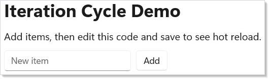

# Dev Tooling

Reactor's development workflow centers on `dotnet watch` and preview mode. You
edit code, save, and see changes in a running window — no manual restart.

## Preview Mode

Pass `preview: true` to `ReactorApp.Run` to enable preview mode. This connects
your app to the Reactor hot reload pipeline:

```csharp
// Program entry point — this is the entire App.cs file:
// ReactorApp.Run<DevToolingApp>("Dev Tooling Demo",
//     width: 600, height: 450
// #if DEBUG
//     , preview: true
// #endif
// );
//
// The preview flag enables hot reload via dotnet watch.
// In Release builds, preview is omitted entirely.
```

The `#if DEBUG` guard ensures preview mode is only active in debug builds.
Release builds skip it entirely — no overhead, no extra dependencies.

## Running with Hot Reload

Start your app with `dotnet watch`:

<!-- ai:lock -->
```
dotnet watch run
```
<!-- /ai:lock -->

This launches the app and watches your `.cs` files for changes. When you save,
`dotnet watch` recompiles and Reactor reloads the component tree. Your app state
resets, but the window stays open.

Here's what the preview app looks like running:

```csharp
class DevToolingApp : Component
{
    public override Element Render()
    {
        var (count, setCount) = UseState(0);
        var (message, setMessage) = UseState("Edit this code and save!");

        return VStack(16,
            Heading("Preview Mode Demo"),
            Text(message).FontSize(16),
            HStack(8,
                Button("Click me", () => setCount(count + 1)),
                Text($"Clicked {count} times").SemiBold()
            ),
            TextField(message, setMessage, placeholder: "Type something")
                .Width(300)
        ).Padding(24);
    }
}
```


Edit the `message` default value or add a new element, save the file, and
watch the window update.

## Function Component Entry Point

For quick experiments, skip the class entirely. Pass a lambda to
[`ReactorApp.Run`](components.md):

```csharp
// Alternative: inline function component, no class needed
// ReactorApp.Run("Quick Test", ctx =>
// {
//     var (n, setN) = ctx.UseState(0);
//     return VStack(12,
//         Text($"Count: {n}").FontSize(20),
//         Button("+1", () => setN(n + 1))
//     ).Padding(24);
// }, width: 400, height: 300);
```

This is useful for throwaway prototypes or testing a single interaction. You
get the same hot reload behavior — edit the lambda, save, see the result.

## The Iteration Cycle

The typical workflow looks like this:

1. **Run** `dotnet watch run` in your terminal.
2. **Edit** a component in your editor.
3. **Save** the file — `dotnet watch` detects the change and recompiles.
4. **See** the updated UI in the running window.

No build step to invoke manually. No "rebuild and relaunch" cycle. The app
stays running and the window stays positioned where you left it.

```csharp
class IterationDemo : Component
{
    public override Element Render()
    {
        var (items, updateItems) = UseReducer(new List<string>());
        var (input, setInput) = UseState("");

        return VStack(12,
            Heading("Iteration Cycle Demo"),
            Text("Add items, then edit this code and save to see hot reload."),
            HStack(8,
                TextField(input, setInput, placeholder: "New item")
                    .Width(200),
                Button("Add", () =>
                {
                    if (!string.IsNullOrWhiteSpace(input))
                    {
                        updateItems(list =>
                        {
                            var next = new List<string>(list) { input };
                            return next;
                        });
                        setInput("");
                    }
                })
            ),
            ForEach(items, item => Text($"  - {item}"))
        ).Padding(24);
    }
}
```



## VS Code Integration

Reactor has no special VS Code extension requirement. The standard C# Dev Kit
works well:

- **IntelliSense** — `using static Reactor.UI` brings all element factories
  (`Text`, `VStack`, `Button`, etc.) into scope. You get autocomplete on every
  element and modifier.
- **Terminal** — run `dotnet watch run` in the VS Code integrated terminal.
  The app window appears alongside your editor.
- **Errors** — compile errors appear in the Problems panel. Fix the error,
  save, and `dotnet watch` retries automatically.

## Debug vs Release

| | Debug | Release |
|---|---|---|
| Preview mode | Active (hot reload enabled) | Skipped |
| Optimizations | Off | On |
| Window behavior | Stays open on recompile | Normal launch |

Use `dotnet run -c Release` for a production build. The `#if DEBUG` guard
removes the `preview: true` parameter entirely, so there is no preview
infrastructure in release binaries.

## Tips

**Keep dotnet watch running.** Don't stop and restart it between edits. It
handles recompilation and reconnection automatically.

**Use small components.** Smaller components reload faster because less of the
tree needs to be rebuilt. Extract pieces early.

**Check the terminal.** When hot reload fails (usually a syntax error),
`dotnet watch` prints the error. Fix it and save — it retries.

**Use [function components](components.md) for experiments.** `ReactorApp.Run("Test", ctx => ...)`
is the fastest way to try an idea. No class boilerplate.

**ARM64 builds for benchmarks.** If you're on ARM64 hardware, build with
`dotnet run -r win-arm64` to get native performance numbers.

## Next Steps

- **[Getting Started](getting-started.md)** — Previous: create your first app and learn the basics
- **[Components](components.md)** — Next: component classes, props, function components, and composition
- **[Hooks](hooks.md)** — Learn the state management primitives used inside components
- **[Effects and Lifecycle](effects.md)** — Use `UseEffect` for timers, subscriptions, and async work
