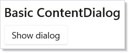
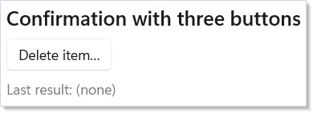
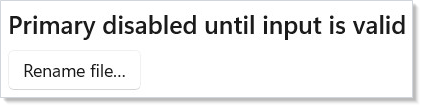
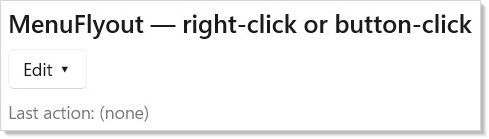
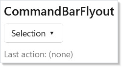
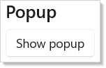

> **WinUI reference:** For the full property surface and design guidance, see [Dialogs And Flyouts](https://learn.microsoft.com/en-us/windows/apps/design/controls/dialogs-and-flyouts/).

Dialog and flyout surfaces interrupt the user. That makes them the most
costly UI primitive in the app's attention budget — every modal dialog
steals focus, every flyout dismisses on outside click, every popup
arrives without a route back. Microsoft.UI.Reactor (Reactor) treats dialogs and flyouts as
controlled components: you own the open/closed boolean, the component
tree always contains the dialog element, and the visibility is a state
flag the user-driven event handlers flip back. That is the same shape as
`TextBox` from [Forms](forms.md), and it makes the dialog testable —
the dialog is open if and only if its driving state says so. Read this
page when you are reaching for `ContentDialog` for a Save/Discard choice,
`MenuFlyout` for a right-click menu, `CommandBarFlyout` for a selection
toolbar, or `Popup` for the bespoke overlay that none of the above
covers. Pair every dialog with a corresponding entry in
[commanding.md](commanding.md) — the same `Command` should usually back
the trigger (button or menu) and the dialog's primary action.

# Dialogs and Flyouts

Four primitives sit on this page. Pick by shape, not by aesthetic:

| Control | Shape | Dismiss | Use when |
|---|---|---|---|
| `ContentDialog` | Modal, screen-centered, three buttons | Button click | The user has to make a choice before continuing. |
| `MenuFlyout` | Pop-up menu next to a target | Outside click / Esc | Right-click or chevron menu of discrete actions. |
| `CommandBarFlyout` | Mini-toolbar next to a target | Outside click / Esc | Selection context — "what to do with this thing". |
| `Popup` | Free-form overlay | Light-dismiss / explicit | Anything the three above can't render — color picker, in-place editor, custom tooltip. |

## ContentDialog

```csharp
ContentDialog(string title, Element content, string primaryButtonText = "OK")
```

```csharp
class BasicDialogDemo : Component
{
    public override Element Render()
    {
        var (open, setOpen) = UseState(false);

        return VStack(8,
            SubHeading("Basic ContentDialog"),
            Button("Show dialog", () => setOpen(true)),
            // Dialog lives in the tree at all times. IsOpen controls
            // visibility; OnClosed flips it back when the user dismisses.
            ContentDialog(
                "Welcome",
                TextBlock("Thank you for trying Reactor."),
                primaryButtonText: "OK") with
            {
                IsOpen = open,
                OnClosed = _ => setOpen(false),
            }
        ).Padding(24);
    }
}
```



`ContentDialog` is the modal. Pass a title, a content element, and the
primary button label. The factory returns a `ContentDialogElement`
record; you spread additional init-only properties (`IsOpen`,
`OnClosed`, secondary/close button text) with the `with { ... }`
expression. The dialog element lives in the tree at all times — it's a
record, not a method call. `IsOpen = false` keeps it hidden; flipping
`IsOpen = true` from a button handler opens it; the `OnClosed` callback
flips it back when the user dismisses.

| Property (via `with { ... }`) | Effect |
|---|---|
| `IsOpen` | The controlled visibility flag. |
| `PrimaryButtonText` | Default-action button label. Set via the factory argument. |
| `SecondaryButtonText` | Optional second button (left of primary). |
| `CloseButtonText` | Optional close button. The "X" / Esc dismiss. |
| `DefaultButton` | Which button gets the accent color and the Enter binding (`Primary` / `Secondary` / `Close`). |
| `OnClosed` | `Action<ContentDialogResult>` — `Primary` / `Secondary` / `None`. |
| `OnOpened` | Fires after the dialog finishes opening (useful for autofocus). |
| `IsPrimaryButtonEnabled` | Disable the primary action without removing it. |
| `IsSecondaryButtonEnabled` | Same for the secondary. |

### Three-button dialogs

The three-button shape (`Primary` + `Secondary` + `Close`) is the
default for destructive confirmations. The convention from
[Fluent UI](https://learn.microsoft.com/en-us/windows/apps/design/controls/dialogs-and-flyouts/dialogs)
and macOS HIG agrees: place the destructive action in `Primary`, the
non-destructive cancel in `Secondary`, and route Esc to whichever the
`DefaultButton` is set to:

```csharp
class ConfirmDialogDemo : Component
{
    public override Element Render()
    {
        var (open, setOpen) = UseState(false);
        var (result, setResult) = UseState("(none)");

        return VStack(8,
            SubHeading("Confirmation with three buttons"),
            Button("Delete item…", () => setOpen(true)),
            TextBlock($"Last result: {result}").Opacity(0.6),
            ContentDialog(
                "Delete this item?",
                TextBlock("This action cannot be undone."),
                primaryButtonText: "Delete") with
            {
                IsOpen = open,
                SecondaryButtonText = "Cancel",
                CloseButtonText = "Close",
                DefaultButton = ContentDialogButton.Close,
                OnClosed = r =>
                {
                    setResult(r.ToString());
                    setOpen(false);
                },
            }
        ).Padding(24);
    }
}
```



The `ContentDialogResult` value in `OnClosed` tells you which path the
user took. `Primary` and `Secondary` correspond to the labeled buttons;
`None` covers Esc, Close button, and click-on-scrim dismissal — treat
all three as Cancel.

### Gated primary

When the dialog content is itself a form (rename file, set password),
the primary button should be disabled until the form is valid. Use
`IsPrimaryButtonEnabled` rather than `.IsEnabled(false)` on a custom button
inside the content — the dialog primary keeps the accent color, the
keyboard binding to Enter, and the focus trap that the WinUI dialog
provides:

```csharp
class DialogGatedPrimaryDemo : Component
{
    public override Element Render()
    {
        var (open, setOpen) = UseState(false);
        var (name, setName) = UseState("");

        return VStack(8,
            SubHeading("Primary disabled until input is valid"),
            Button("Rename file…", () => setOpen(true)),
            ContentDialog(
                "Rename file",
                VStack(8,
                    TextBlock("New filename:"),
                    TextBox(name, setName, placeholder: "untitled.txt")
                        .Width(280)),
                primaryButtonText: "Rename") with
            {
                IsOpen = open,
                SecondaryButtonText = "Cancel",
                // .IsPrimaryButtonEnabled drives the inline primary
                // disabled state without taking it out of tab order.
                IsPrimaryButtonEnabled = !string.IsNullOrWhiteSpace(name),
                OnClosed = _ => setOpen(false),
            }
        ).Padding(24);
    }
}
```



> **Caveat:** `ContentDialog.ShowAsync` is single-instance per `XamlRoot` — the WinUI
> control raises `Show another ContentDialog before closing the previous`
> if two dialogs try to open at once. Reactor's controlled-`IsOpen`
> pattern routes through the same constraint: opening dialog B from
> dialog A's `Primary` handler runs B's `IsOpen = true` set before A's
> close completes, and the second show throws. Always close dialog A
> first (via `setOpenA(false)` and the dispatcher's commit), then open B
> in the next render — for example, queue B's open via a
> [`UseEffect`](effects.md) keyed on A's `IsOpen` going false.

WinUI design page: [Dialogs](https://learn.microsoft.com/en-us/windows/apps/design/controls/dialogs-and-flyouts/dialogs).

## MenuFlyout

```csharp
MenuFlyout(Element target, params MenuFlyoutItemBase[] items)
```

```csharp
class MenuFlyoutDemo : Component
{
    public override Element Render()
    {
        var (action, setAction) = UseState("(none)");

        return VStack(8,
            SubHeading("MenuFlyout — right-click or button-click"),
            MenuFlyout(
                Button("Edit ▾"),
                MenuItem("Cut",   () => setAction("Cut"),   icon: "Cut"),
                MenuItem("Copy",  () => setAction("Copy"),  icon: "Copy"),
                MenuItem("Paste", () => setAction("Paste"), icon: "Paste"),
                MenuSeparator(),
                MenuSubItem("Format",
                    ToggleMenuItem("Bold", isChecked: false),
                    ToggleMenuItem("Italic", isChecked: true)),
                MenuSeparator(),
                MenuItem("Delete…", () => setAction("Delete"))
            ),
            TextBlock($"Last action: {action}").Opacity(0.6)
        ).Padding(24);
    }
}
```



`MenuFlyout` attaches a popup menu to a target element. Click the
target — the menu opens at it. Click outside the menu — it dismisses.
The factory takes the target as the first argument and the items as a
variadic tail; the result wraps the target so it appears in the tree at
the target's position.

| Item factory | Shape |
|---|---|
| `MenuItem(label, onClick, icon?)` | Standard menu item with a click handler. |
| `MenuItem(Command)` | Bind to a command. Label, icon, enabled-state, accelerator come from the command. |
| `ToggleMenuItem(label, isChecked, onChanged?)` | Two-state check item. |
| `RadioMenuItem(label, groupName, isChecked, onClick?)` | One of a radio group. |
| `MenuSeparator()` | Horizontal divider. |
| `MenuSubItem(label, items...)` | Nested submenu. |

The same `Command` record that drives a `Button` plugs into
[`MenuItem(Command)`](commanding.md) — one declaration, three surfaces
(button, menu, keyboard shortcut). See the
[commanding integration pattern](#commanding-integration) below.

WinUI design page: [Menus and context menus](https://learn.microsoft.com/en-us/windows/apps/design/controls/menus).

## CommandBarFlyout

```csharp
CommandBarFlyout(
    Element target,
    AppBarItemBase[]? primaryCommands = null,
    AppBarItemBase[]? secondaryCommands = null)
```

```csharp
class CommandBarFlyoutDemo : Component
{
    public override Element Render()
    {
        var (action, setAction) = UseState("(none)");

        return VStack(8,
            SubHeading("CommandBarFlyout"),
            CommandBarFlyout(
                Button("Selection ▾"),
                primaryCommands: new AppBarItemBase[]
                {
                    AppBarButton("Cut",   () => setAction("Cut"),   icon: "Cut"),
                    AppBarButton("Copy",  () => setAction("Copy"),  icon: "Copy"),
                    AppBarButton("Paste", () => setAction("Paste"), icon: "Paste"),
                },
                secondaryCommands: new AppBarItemBase[]
                {
                    AppBarButton("Select All", () => setAction("Select All")),
                    AppBarButton("Find",       () => setAction("Find")),
                }),
            TextBlock($"Last action: {action}").Opacity(0.6)
        ).Padding(24);
    }
}
```



`CommandBarFlyout` is the selection-context toolbar — the Cut / Copy /
Paste row that floats over a text selection, the inline "actions on
this row" surface that some lists show. Primary commands render
inline as icon buttons; secondary commands collapse into the overflow
menu. The same `AppBarItemBase` records that fill a `CommandBar` fill
this surface — the entire item array is interchangeable.

| Item factory | Shape |
|---|---|
| `AppBarButton(label, onClick, icon?)` | Standard tool-strip button. |
| `AppBarButton(Command)` | Command-driven variant. |
| `AppBarToggleButton(...)` | Two-state. |
| `AppBarSeparator()` | Vertical divider. |

WinUI design page: [Command bar flyout](https://learn.microsoft.com/en-us/windows/apps/design/controls/command-bar-flyout).

## Popup

```csharp
Popup(Element child, bool isOpen = false, Action? onClosed = null)
```

```csharp
class PopupDemo : Component
{
    public override Element Render()
    {
        var (open, setOpen) = UseState(false);

        // Popup is a free-form positioned surface. Use it for overlays
        // that aren't dialogs or flyouts — color pickers, in-place
        // editors, custom tooltips.
        var popupContent = Border(
            VStack(8,
                TextBlock("This is a Popup.").Bold(),
                TextBlock("Click outside to dismiss.")
            ).Padding(12)
        ).Background("#FFFFFF").WithBorder("#888888").CornerRadius(6);

        return VStack(8,
            SubHeading("Popup"),
            Button(open ? "Hide popup" : "Show popup",
                () => setOpen(!open)),
            Popup(popupContent, isOpen: open,
                onClosed: () => setOpen(false))
                .IsLightDismissEnabled()
                .Offset(120, 0)
        ).Padding(24);
    }
}
```



`Popup` is the unstructured overlay — what you reach for when
`ContentDialog`, `MenuFlyout`, and `CommandBarFlyout` are all the wrong
shape. Color pickers, in-place rename editors, custom tooltips, dropdown
content that isn't a menu — all of them are popups.

| Fluent | Effect |
|---|---|
| `.IsLightDismissEnabled(bool)` | Close on outside click. Default `true`. |
| `.Offset(horizontal, vertical)` | Position relative to the popup's anchor point. |
| `.Opened(Action)` | Fires after the popup is on screen. |
| `.Closed(Action)` | Fires after the popup leaves the screen. |
| `.Set(p => p.PlacementTarget = ...)` | Anchor to a specific element. |

The popup itself does not provide a focus trap or an ARIA dialog role.
For modal-feeling popups, wrap the content in your own focus management
(`UseFocusTrap` from [accessibility.md](accessibility.md)) and set
`AutomationProperties.Role = Dialog` on the root through `.Set(...)`.
For non-modal popups (tooltips, hover cards), neither is needed.

WinUI primitives reference: [Popup class](https://learn.microsoft.com/en-us/windows/windows-app-sdk/api/winrt/microsoft.ui.xaml.controls.primitives.popup).

## Commanding integration

The cleanest way to keep dialog logic out of every surface that opens
it is to put the action behind a `Command`. The same record lights up
a button, a menu item, and (with `.Accelerator`) a keyboard shortcut —
authoring the dialog primary as `Command.Execute` is the natural
extension:

```csharp
class CommandingIntegrationDemo : Component
{
    public override Element Render()
    {
        // One Command drives the button, the menu item, and (via
        // .Accelerator) Ctrl+S. The same Command can light up an
        // AppBarButton in a CommandBarFlyout too — same declaration,
        // three surfaces.
        var (saved, setSaved) = UseState(false);

        var save = new Command
        {
            Label = "Save",
            Execute = () => setSaved(true),
            CanExecute = !saved,
            Icon = SymbolIcon("Save"),
        };

        return VStack(8,
            SubHeading("One Command, two surfaces"),
            Button(save),                          // primary CTA
            MenuFlyout(
                Button("File ▾"),
                MenuItem(save),                    // menu duplicate
                MenuSeparator(),
                MenuItem("Reset", () => setSaved(false))),
            TextBlock(saved ? "Saved." : "Unsaved changes.")
                .Opacity(0.6)
        ).Padding(24);
    }
}
```

`Command.CanExecute = false` greys out every surface bound to that
command — the menu item, the button, the keyboard binding all disable
in one place. Without commanding, you would duplicate the
`isEnabled` derivation per surface. See [commanding.md](commanding.md)
for the full pattern (async commands, parameterized `Command<T>`,
re-entrance guards).

## Focus and ARIA

WinUI's `ContentDialog` ships a focus trap and the `Dialog` ARIA role
out of the box. When the dialog opens, focus moves to the default
button; tabbing wraps within the dialog; Esc closes via the close
button. Screen readers announce the dialog title as the
`AutomationProperties.Name`. None of this needs configuration — pass
the title and content, and the accessibility surface is correct.

`MenuFlyout` and `CommandBarFlyout` apply the same focus rules at the
WinUI level: opening moves focus to the first enabled item, arrow keys
navigate, Esc dismisses, focus returns to the originating element on
close.

The exception is `Popup`. The popup has none of the above; it is a
positioning primitive. For a popup that should behave like a modal,
wrap its content with `UseFocusTrap` and apply the dialog role
explicitly:

```csharp
// Inside a popup that should behave modally:
var trap = UseFocusTrap();
return Popup(
    Border(content).WithFocusTrap(trap),
    isOpen: open);
```

The trap shape and the ARIA mapping are documented in
[accessibility.md](accessibility.md).

## Dismiss reasons

Every dialog and flyout can close five different ways. Treat them as
equivalent in your handlers — there is no "real cancel" vs. "implicit
cancel":

| Surface | Primary close paths |
|---|---|
| `ContentDialog` | Primary button, Secondary button, Close button, Esc, click-on-scrim (returns `None`). |
| `MenuFlyout` | Item click (the action), outside click, Esc. |
| `CommandBarFlyout` | Command click, outside click, Esc. |
| `Popup` | Outside click (when `LightDismiss = true`), explicit `IsOpen = false`. |

For `ContentDialog`, the `OnClosed` callback is the single dismiss
notification — read `ContentDialogResult` to discover which path the
user took, but accept that `None` is the user's right.

## Reference

| Element | Factory | Open/close | Lifecycle |
|---|---|---|---|
| `ContentDialogElement` | `ContentDialog(title, content, primaryButtonText)` | `IsOpen` (init), `OnClosed(result)` | `OnOpened`, `OnClosed` |
| `MenuFlyoutElement` | `MenuFlyout(target, items...)` | Auto on target click | n/a |
| `CommandBarFlyoutElement` | `CommandBarFlyout(target, primary?, secondary?)` | Auto on target click | n/a |
| `PopupElement` | `Popup(child, isOpen?, onClosed?)` | `isOpen` arg or `.IsOpen` init | `.Opened`, `.Closed` |

## Patterns

### Dialog-driven async command

Async confirmations — "Are you sure?" → "Doing it…" → "Done." — fit a
single `Command` with `ExecuteAsync`. The dialog primary triggers the
command; the command tracks `IsExecuting` via [`UseCommand`](commanding.md);
the dialog's primary disables itself while the action runs. The user
can't double-tap the destructive button:

```csharp
var delete = ctx.UseCommand(new Command
{
    Label = "Delete",
    ExecuteAsync = async () =>
    {
        await api.DeleteAsync(item.Id);
        setOpen(false);
    },
    CanExecute = !item.IsLocked,
});

ContentDialog("Delete?", body, primaryButtonText: "Delete") with
{
    IsOpen = open,
    SecondaryButtonText = "Cancel",
    IsPrimaryButtonEnabled = delete.IsEnabled,
    OnClosed = r =>
    {
        if (r == ContentDialogResult.Primary && delete.IsEnabled)
            delete.Execute?.Invoke();
        else
            setOpen(false);
    },
}
```

This mirrors the [`recipes/modal-dialog`](recipes/modal-dialog.md)
recipe, which builds the same shape out of an inline modal instead of
the WinUI control.

### Right-click on a list row

`MenuFlyout` attaches to its target. Inside a [`ListView`](collections.md)
row template, wrap the row in `MenuFlyout(rowContent, items...)` and
the menu binds to that row instance. Tie the menu items to the row's
data — `Command<T>` lets a single command apply to every row's
context:

```csharp
ListView(items, x => x.Id, (item, _) =>
    MenuFlyout(
        RowContent(item),
        MenuItem(deleteCommand, item),
        MenuItem(renameCommand, item),
        MenuSeparator(),
        MenuItem(propertiesCommand, item)))
```

## Common Mistakes

### Imperatively opening a dialog from an event handler

```csharp
// Don't:
Button("Save", async () =>
{
    var dialog = new ContentDialog { Title = "Confirm" };
    await dialog.ShowAsync();
})
```

```csharp
class BasicDialogDemo : Component
{
    public override Element Render()
    {
        var (open, setOpen) = UseState(false);

        return VStack(8,
            SubHeading("Basic ContentDialog"),
            Button("Show dialog", () => setOpen(true)),
            // Dialog lives in the tree at all times. IsOpen controls
            // visibility; OnClosed flips it back when the user dismisses.
            ContentDialog(
                "Welcome",
                TextBlock("Thank you for trying Reactor."),
                primaryButtonText: "OK") with
            {
                IsOpen = open,
                OnClosed = _ => setOpen(false),
            }
        ).Padding(24);
    }
}
```

The imperative path drops out of the Reactor render model — the dialog
isn't in the tree, so it can't be styled by the parent's theme, can't
be tested by the renderer fixture from [testing.md](testing.md), and
can't share state with the rest of the component. The controlled
`IsOpen` flag is the canonical pattern.

### Reusing a single dialog for unrelated decisions

```csharp
// Don't:
var (open, setOpen) = UseState(false);
var (dialogType, setDialogType) = UseState("");

// One dialog, branching on dialogType for title/body/buttons.
```

Two decisions, two dialogs. The branching version makes every dialog
state read the dialog-type string, which leaks dialog concerns into
your component's data model and makes the testing fixture fragile.
Each modal action gets its own dialog element with its own state pair
— the cost is two `useState` calls and an extra `ContentDialog`
declaration, both nearly free.

## Tips

**Pair every dialog trigger with a `Command`.** The trigger lives in
one or more surfaces (toolbar, menu, keyboard shortcut); the command
gives you one place to wire enabled-state, telemetry, and undo. The
dialog primary then routes through `command.Execute`.

**Treat `ContentDialogResult.None` as Cancel.** Esc, click-on-scrim,
and the close-X all return `None`. Don't try to distinguish them — if
the user didn't pick `Primary` or `Secondary`, they didn't pick.

**Don't reach for `Popup` until the three structured surfaces have
failed.** `ContentDialog`, `MenuFlyout`, and `CommandBarFlyout` carry
their own focus and ARIA semantics. `Popup` doesn't, and you have to
re-implement focus trapping yourself.

**Open the dialog once per decision, not once per render.** If
`open` is in your state, only the button handler should flip it true.
A `UseEffect` that does `setOpen(true)` on a condition will reopen the
dialog after every dismiss until the condition changes — gate the
effect with a "user-acknowledged" flag.

**Show a long-running action's progress *inside* the dialog, not
after.** Closing a dialog mid-action is jarring. Wire the dialog
primary to an async [`Command`](commanding.md), let `IsExecuting` swap
the primary label for a spinner, then close on completion.

## Next Steps

- **[Status and Info](status-and-info.md)** — Previous: non-interactive feedback (InfoBar, ProgressRing, TeachingTip).
- **[Data System](data-system.md)** — Next: DataGrid and the data-source pipeline.
- **[Commanding](commanding.md)** — The Command record that drives buttons, menu items, dialogs, and shortcuts.
- **[Accessibility](accessibility.md)** — Focus traps, ARIA roles, and dialog landmark behavior.
- **[Recipes: Modal dialog](recipes/modal-dialog.md)** — End-to-end recipe building a confirmation modal.
