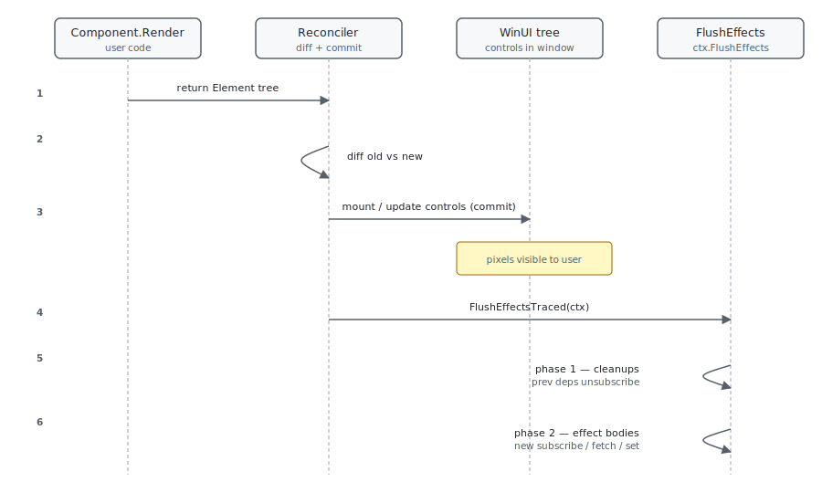

The thing that trips up most readers in Microsoft.UI.Reactor (Reactor) is the order. `UseEffect` does
not run during render — it runs *after* the reconciler has finished
committing the new tree to WinUI, on the UI thread, in hook-declaration
order, with the cleanup from the previous round of the same effect
running first. State you set inside an effect body schedules another
render; the next render's effects run after that one commits. This is
the same shape React's effect phase takes, and the trade-off is the
same: render stays a pure description of the next tree, side effects
run somewhere a write is safe, and you pay one extra render whenever an
effect writes state. The piece worth holding in your head is that
[reconciliation](reconciliation.md) and effect-flush are sequential —
when your effect body runs, the WinUI controls you described in this
render are already mounted and visible, and the previous round's
cleanup has already run.

# Effects Scheduling

This page is about when [`UseEffect`](hooks.md) fires and why.
Surface-level usage is on the [Effects](effects.md) page; the
async-resource pipeline — `UseResource`, `UseInfiniteResource`,
`Pending`, `QueryCache` — has its own deep walk in the
[async-system reference](../reference/async-system.md). What
follows is the render-loop view of the same callbacks.

## The render → commit → flush sequence

A render pass runs in three phases. The first is pure description —
`Render()` returns an [`Element`](components.md) tree and never touches
WinUI. The reconciler then walks the tree, mounts or updates real
controls, and only after that does it flush queued effects.

```csharp
public void UseEffect(Action effect, params object[] dependencies)
{
    if (_hookIndex >= _hooks.Count)
    {
        _hooks.Add(new EffectHookState { Dependencies = null, Effect = effect });
    }

    if (_hooks[_hookIndex] is not EffectHookState hook)
        throw new HookOrderException(
            $"Hook at index {_hookIndex} is {_hooks[_hookIndex].GetType().Name}, expected EffectHookState. " +
            "Hooks must be called in the same order every render.");
    _hookIndex++;

    if (hook.Dependencies is null || !DepsEqual(hook.Dependencies, dependencies))
    {
        hook.PendingCleanup = hook.Cleanup;
        hook.Cleanup = null;
        hook.Dependencies = dependencies.ToArray();
        hook.Effect = effect;
        hook.Pending = true;
    }
}
```

`UseEffect` does not call your callback. It checks the dependency
array against the previous render's deps and, if they differ, marks
the hook `Pending = true` and stashes the previous cleanup. The
reconciler's commit pass — see
[Reconciliation](reconciliation.md) — calls
`FlushEffectsTraced(ctx, …)` after every component's controls are in
place. Flush then runs all pending cleanups before any pending effect
bodies, both in hook-declaration order.



The cleanup-before-body ordering is the reason a `cts.Cancel()` /
`timer.Dispose()` cleanup actually disposes the *previous* timer
before a new one starts. If flush ran the body first and the cleanup
second, the cleanup would dispose the timer the body just created.

| Phase | What runs | Where in source |
|---|---|---|
| Render | `Component.Render()`, hook slots register | `Component.cs` `Render` override |
| Reconcile | Diff against previous tree, mount/update controls | `Reconciler.cs` `Reconcile` |
| Commit | WinUI tree visible | end of `Reconciler.Mount` / `Update` |
| Flush — phase 1 | Run all `PendingCleanup` callbacks (in slot order) | `RenderContext.FlushEffects` |
| Flush — phase 2 | Run pending effect bodies (in slot order) | `RenderContext.FlushEffects` |
| Unmount | `Cleanup` runs once, then hook list is dropped | `RenderContext.RunCleanups` |

> **Caveat:** The effect body sees the just-committed tree, not the tree it was
> described against. If your effect inspects an
> [`ElementRef`](hooks.md) or reads a DOM-equivalent property right after
> mount, the value reflects the WinUI control that came out of
> [reconciliation](reconciliation.md), which can differ from what you
> expected if the reconciler reused a pooled control or short-circuited
> the update via `CanSkipUpdate`. Don't reason from the props you passed
> to the factory — reason from the control the reconciler actually
> attached.

## Dependency equality is value equality, with one trap

Reactor compares dependency arrays with `EqualityComparer<T>.Default`.
For primitives and records that's value equality. For classes that
don't override `Equals`, it's reference equality — same identity
trap React's `useEffect` has.

```csharp
public (T Value, Action<T> Set) UseState<T>(T initialValue, bool threadSafe = false)
{
    if (_hookIndex >= _hooks.Count)
    {
        _hooks.Add(new ValueHookState<T>(initialValue, threadSafe));
    }

    var currentIndex = _hookIndex;
    _hookIndex++;

    if (_hooks[currentIndex] is not ValueHookState<T> hook)
        throw new HookOrderException(
            $"Hook at index {currentIndex} is {_hooks[currentIndex].GetType().Name}, expected ValueHookState<{typeof(T).Name}> (UseState). " +
            "Hooks must be called in the same order every render.");
```

`UseState` returns the *same* `Action<T>` setter instance across
renders for a given hook slot (the closure captures `currentIndex`,
which doesn't change). A `var (count, setCount) = UseState(0)` setter
is therefore safe to pass as a dependency — it compares equal between
renders and won't restart the effect.

A freshly constructed object on every render isn't. `new Options { ... }`
in a render body, passed as a dep, restarts the effect every render —
the object differs by reference even when its fields are identical.
Either move it outside the component, wrap it in
[`UseMemo`](hooks.md), or unpack the primitive fields and pass those.

## Cleanup ordering on update and on unmount

A re-render with changed deps runs the *previous* effect's cleanup
before the *new* effect body. An unmount runs cleanup with no
following body. The hook state carries both `Cleanup` (the live one)
and `PendingCleanup` (the one queued for the next flush) so the two
paths don't collide:

```csharp
public sealed class PendingScope
{
    private readonly Dictionary<object, bool> _loadingByToken = new(capacity: 4);
    private readonly object _lock = new();

    /// <summary>Fires when a resource joins, leaves, or changes its loading state.</summary>
    public event Action? Changed;

    /// <summary>
    /// Start tracking <paramref name="token"/> with the given initial <paramref name="isLoading"/>
    /// state. A hook typically uses its own <c>this</c>-equivalent as the token.
    /// </summary>
    public void Register(object token, bool isLoading)
    {
        lock (_lock) _loadingByToken[token] = isLoading;
        Changed?.Invoke();
    }
```

`PendingScope` is one place the cleanup contract is load-bearing. A
`UseResource` hook registers its token with the nearest ancestor
[`Pending`](async-resources-cookbook.md) scope at mount, updates
loading state through its lifecycle, and unregisters in cleanup.
Skip the unregister and the `Pending` fallback never clears — the
fallback subtree stays rendered after the resource resolves because
the scope still thinks something is loading. Always return a cleanup
from any effect that registers state outside the component.

## Async effects and cancellation

`UseEffect` takes an `Action`. Awaiting inside an `async void` lambda
is a footgun — the await machinery decouples the body from the flush
ordering, so the cleanup runs against an effect that may not have
completed. The shape that works is "kick off a task, return a
cleanup that cancels it":

```csharp
// Don't:
UseEffect(async () => {              // async void lambda
    var data = await Fetch(url);
    setData(data);                   // may run after unmount → cancellation cliff
});
```

```csharp
public sealed class QueryCache : IDisposable
{
    /// <summary>How often the eviction timer checks every slot for expiry. Default 1s.</summary>
    public static TimeSpan EvictionPollInterval { get; set; } = TimeSpan.FromSeconds(1);

    /// <summary>Injected marshaller for <see cref="EntryChanged"/>. Null → fires inline.</summary>
    public Action<Action>? DispatcherPost { get; set; }

    /// <summary>Clock override for deterministic tests.</summary>
    public Func<DateTime> UtcNow { get; set; } = () => DateTime.UtcNow;

    private readonly ConcurrentDictionary<string, Slot> _slots = new();
    private Timer? _evictionTimer;
    private readonly object _timerLock = new();
    private int _disposed;

    /// <summary>Fires when an entry is added, replaced, invalidated, or evicted.</summary>
    public event Action<string>? EntryChanged;
```

The async-resource hooks (`UseResource`, `UseInfiniteResource`,
`UseMutation`) wrap this pattern correctly — they own the cancellation
token, marshal completions back to the UI thread, and clean up their
[`QueryCache`](async-resources-cookbook.md) subscription on unmount.
Reach for them before writing async-effect glue by hand. When you do
need a raw `UseEffect` for an async operation, the cleanup function
is your only chance to cancel the in-flight task — capture a
`CancellationTokenSource`, return `() => cts.Cancel()`.

## Dependency-array reference

| Dep array shape | When the effect re-runs |
|---|---|
| omitted (`UseEffect(body)`) | after every commit |
| empty (`UseEffect(body, Array.Empty<object>())`) | once, after the first commit |
| primitives / records | when `EqualityComparer<T>.Default.Equals` flips |
| reference-typed object built in render | every commit (almost never what you want) |
| `setX` from `UseState` | never re-triggers — setter identity is stable |

## Patterns

### Subscribe in mount, unsubscribe in cleanup

The single most useful effect shape is "talk to something outside the
component for as long as I'm on screen, then release it". Reactor's
own [`Observable.cs#observable-bridge`](#) bridge follows this shape;
so does any timer, event subscription, or background task.

```csharp
UseEffect(() =>
{
    var cts = new CancellationTokenSource();
    _ = Task.Run(async () =>
    {
        using var timer = new PeriodicTimer(TimeSpan.FromSeconds(1));
        while (await timer.WaitForNextTickAsync(cts.Token))
            setSeconds(s => s + 1);
    });
    return () => cts.Cancel();
}, Array.Empty<object>());
```

The setter `setSeconds` auto-marshals back to the UI thread (see
[hooks](hooks.md) "Updating state from background work"). The cleanup
cancels the token; the timer's `using` disposes when the
`WaitForNextTickAsync` loop unblocks. No state leaks between mounts.

### Effect that observes a prop / state change

When you need to react to a value flipping — open a dialog, fetch
fresh data, broadcast a notification — pass the value as a dependency.
The cleanup runs the moment the value changes, before the new effect
body, so any work tied to the old value is torn down first.

```csharp
UseEffect(() =>
{
    if (!isOpen) return () => { };
    LogTelemetry("dialog_opened");
    return () => LogTelemetry("dialog_closed");
}, isOpen);
```

Telemetry stays balanced because flush runs the previous body's
cleanup (the "closed" log) before the new body's "opened" log — the
events arrive in the same order as the user's actions.

## Common Mistakes

### Setting state unconditionally inside an effect

```csharp
// Don't:
UseEffect(() => {
    setCount(c => c + 1);   // no deps → runs every commit → infinite loop
});
```

```csharp
void Setter(T newValue)
{
    var h = (ValueHookState<T>)_hooks[currentIndex];
    bool changed;
    if (h.ThreadSafe)
    {
        lock (h.Lock)
        {
            changed = !EqualityComparer<T>.Default.Equals(h.Value, newValue);
            if (changed) h.Value = newValue;
        }
        if (Diagnostics.ReactorEventSource.Log.IsEnabled(
                global::System.Diagnostics.Tracing.EventLevel.Verbose,
                Diagnostics.ReactorEventSource.Keywords.State))
            Diagnostics.ReactorEventSource.Log.StateChange("UseState", typeof(T).Name, changed);
        if (changed) _requestRerender?.Invoke();
    }
    else
    {
        if (MarshalIfOffUIThread("UseState", () => Setter(newValue))) return;
        changed = !EqualityComparer<T>.Default.Equals(h.Value, newValue);
        if (changed) h.Value = newValue;
        if (Diagnostics.ReactorEventSource.Log.IsEnabled(
                global::System.Diagnostics.Tracing.EventLevel.Verbose,
                Diagnostics.ReactorEventSource.Keywords.State))
            Diagnostics.ReactorEventSource.Log.StateChange("UseState", typeof(T).Name, changed);
        if (changed) _requestRerender?.Invoke();
    }
}
```

Every state setter schedules a re-render. An effect with no deps
re-runs after every commit, including the commit *its own setter
caused*, so the component renders in a tight loop until something else
breaks the cycle. Either gate the setter on a condition that can't
re-trigger, or pass the value the setter depends on as a dep so the
effect only fires when it actually changes.

### Building a dep object inside render

```csharp
// Don't:
var options = new ResourceOptions { Timeout = 5000 };
UseEffect(() => Fetch(url, options), url, options);  // options is new every render
```

```csharp
public sealed class PendingScope
{
    private readonly Dictionary<object, bool> _loadingByToken = new(capacity: 4);
    private readonly object _lock = new();

    /// <summary>Fires when a resource joins, leaves, or changes its loading state.</summary>
    public event Action? Changed;

    /// <summary>
    /// Start tracking <paramref name="token"/> with the given initial <paramref name="isLoading"/>
    /// state. A hook typically uses its own <c>this</c>-equivalent as the token.
    /// </summary>
    public void Register(object token, bool isLoading)
    {
        lock (_lock) _loadingByToken[token] = isLoading;
        Changed?.Invoke();
    }
```

`options` is a fresh allocation every render, so the dep array fails
`EqualityComparer<ResourceOptions>.Default.Equals` and the effect
restarts. Hoist the literal into a `static readonly` field, wrap it in
[`UseMemo`](hooks.md), or pass its primitive fields directly:
`UseEffect(..., url, 5000)`.

## Tips

**Match every "subscribe" with the cleanup that undoes it.** Timer,
event handler, cache subscription, focus trap registration — the
effect that creates one must return a cleanup that releases it, or
the next render leaks the resource.

**Don't await directly in the lambda.** `UseEffect(async () => ...)`
detaches from the flush ordering; capture a `CancellationTokenSource`,
kick off a `Task.Run`, and cancel in cleanup. Or use
[`UseResource`](async-resources-cookbook.md), which already does this.

**Treat the dep array as a value-equality contract.** Records,
primitives, and stable setter identities are safe. Freshly-allocated
classes and `new int[] { … }` are not — they change every render and
restart the effect.

**Read the source when timing surprises you.** `FlushEffects` in
`RenderContext.cs` is fifty lines; the two-phase cleanup-then-body
ordering is right there and explains every "why did my cleanup run
before my body did?" question.

## Next Steps

- **[Effects](effects.md)** — Previous: the surface lifecycle of `UseEffect`.
- **[Reconciliation](reconciliation.md)** — Next: the commit phase that flush runs after.
- **[Async resources](async-resources-cookbook.md)** — Hooks built on top of this scheduling.
- **[async-system reference](../reference/async-system.md)** — Deep walk through cache, refcount, and revalidation.
- **[Threading and dispatch](threading-and-dispatch.md)** — Why effect bodies always run on the UI thread.
