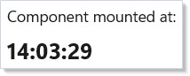
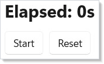

# Effects and Lifecycle

`UseEffect` runs side effects — code that reaches outside the
[component's](components.md) render function. Timers, data fetching,
subscriptions, and DOM manipulation all belong in effects, not in `Render()`.

## Running Once on Mount

Pass an empty dependency array to run an effect once when the component mounts:

```csharp
class MountEffectExample : Component
{
    public override Element Render()
    {
        var (loadedAt, setLoadedAt) = UseState("");

        UseEffect(() =>
        {
            setLoadedAt(DateTime.Now.ToString("HH:mm:ss"));
        }, Array.Empty<object>());

        return VStack(8,
            TextBlock("Component mounted at:"),
            TextBlock(loadedAt).FontSize(20).Bold()
        ).Padding(24);
    }
}
```



The empty `Array.Empty<object>()` dependency array tells Reactor this effect has
no external dependencies. It runs once after the first render and never again.

## Running When Dependencies Change

Pass values in the dependency array to re-run the effect when those values
change:

```csharp
class DependencyEffectExample : Component
{
    public override Element Render()
    {
        var (query, setQuery) = UseState("");
        var (results, setResults) = UseState("Type to search...");

        UseEffect(() =>
        {
            if (string.IsNullOrWhiteSpace(query))
                setResults("Type to search...");
            else
                setResults($"Found 3 results for \"{query}\"");
        }, query);

        return VStack(12,
            TextField(query, setQuery, placeholder: "Search...").Width(300),
            TextBlock(results).Foreground(Theme.SecondaryText)
        ).Padding(24);
    }
}
```


Every time `query` changes, the effect runs again. Reactor compares the current
dependencies to the previous ones using structural equality. If nothing
changed, the effect is skipped.

## Cleanup with Timers

When an effect creates a resource (timer, subscription, event handler), return
a cleanup function. Reactor calls it before re-running the effect and when the
component unmounts:

```csharp
class TimerCleanupExample : Component
{
    public override Element Render()
    {
        var (seconds, updateSeconds) = UseReducer(0);
        var (isRunning, setIsRunning) = UseState(false);

        UseEffect(() =>
        {
            if (!isRunning) return () => { };
            var timer = new PeriodicTimer(TimeSpan.FromSeconds(1));
            var cts = new CancellationTokenSource();
            _ = Task.Run(async () =>
            {
                while (await timer.WaitForNextTickAsync(cts.Token))
                    updateSeconds(s => s + 1);
            });
            return () => { cts.Cancel(); timer.Dispose(); };
        }, isRunning);

        return VStack(12,
            TextBlock($"Elapsed: {seconds}s").FontSize(24).Bold(),
            HStack(8,
                Button(isRunning ? "Stop" : "Start", () => setIsRunning(!isRunning)),
                Button("Reset", () => updateSeconds(_ => 0))
            )
        ).Padding(24);
    }
}
```



The `Func<Action>` overload of `UseEffect` returns a cleanup function. Here
the cleanup disposes the timer, preventing leaks when the component unmounts
or when `isRunning` changes.

The timer body runs on a background thread (it's inside `Task.Run`) and calls
the `updateSeconds` reducer from there. Once the host is bootstrapped, that
works out of the box — every `UseState` / `UseReducer` setter automatically
marshals onto the captured UI dispatcher when called from a non-UI thread, so
timers, `PeriodicTimer`, network callbacks, and code after
`await ... ConfigureAwait(false)` can all call the returned setter without any
extra opt-in. Pass `threadSafe: true` to the hook only when you need many
concurrent setters to apply in-place (locked) instead of being queued one-by-one
onto the UI thread. The setter throws `InvalidOperationException` if it's
called cross-thread before any host has bootstrapped (no UI dispatcher
captured) or after the dispatcher has begun shutting down — make sure the
effect cleanup cancels the background producer so it stops with the component.

## Async Data Loading

Use `UseEffect` with [`UseState`](hooks.md) to load data asynchronously:

```csharp
class AsyncLoadingExample : Component
{
    public override Element Render()
    {
        var (items, setItems) = UseState<string[]?>(null);

        UseEffect(() =>
        {
            _ = Task.Run(async () =>
            {
                await Task.Delay(1500); // simulate network call
                setItems(new[] { "Alice", "Bob", "Charlie" });
            });
        }, Array.Empty<object>());

        if (items is null)
            return TextBlock("Loading...").Padding(24);

        return VStack(8,
            Heading("Loaded Users"),
            VStack(4, items.Select(name => TextBlock(name)).ToArray())
        ).Padding(24);
    }
}
```


The effect fires on mount, starts an async task, and updates state when it
completes. The component re-renders automatically when `setItems` is called.

## Avoiding Infinite Loops

A common mistake is calling a state setter unconditionally inside an effect
with that state in its dependency array:

```csharp
class InfiniteLoopWarning : Component
{
    public override Element Render()
    {
        var (count, setCount) = UseState(0);

        // BAD: this creates an infinite loop!
        // UseEffect(() => { setCount(count + 1); }, count);

        // GOOD: guard with a condition
        UseEffect(() =>
        {
            if (count < 5) setCount(count + 1);
        }, count);

        return TextBlock($"Count stopped at: {count}").Padding(24);
    }
}
```

This would re-render, re-run the effect, set state again, re-render, and
loop forever. Always guard state updates with a condition, or remove the
changing value from the dependency array.

## Tips

**Use empty deps for one-time setup.** `UseEffect(action, Array.Empty<object>())`
is the equivalent of "run on mount." Use it for initial data fetching, event
registration, or logging.

**Always clean up resources.** If your effect creates a timer, subscription, or
event handler, return a cleanup function. Leaked resources cause bugs that are
hard to trace.

**Keep dependency arrays honest.** Include every value the effect reads from
component state. Omitting a dependency doesn't prevent the read — it prevents
the re-run, leading to stale closures.

**Don't call setState unconditionally in an effect that depends on that state.**
This creates an infinite loop. Guard with a condition or restructure the logic.

**Prefer [`UseReducer`](hooks.md) for complex effect-driven state.** When an
effect needs to update multiple related values, a reducer keeps the logic in
one place and avoids cascading re-renders.

## Next Steps

- **[Styling and Theming](styling.md)** — Previous: apply theme tokens, colors, and dark/light mode
- **[Commanding](commanding.md)** — Next: bundle actions with labels, icons, and accelerators
- **[Hooks](hooks.md)** — Deep dive into UseState, UseReducer, and other hooks used by effects
- **[Advanced Patterns](advanced.md)** — Combine effects with other hooks for complex scenarios
