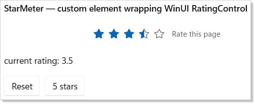

Microsoft.UI.Reactor (Reactor) ships handlers for the built-in WinUI
control gallery, but the protocol that drives them is the same surface
authors use to add their own native controls. The contract you wire
up — an immutable element record, a descriptor or hand-coded handler,
a registration call against the reconciler — gives a custom control
the same lifecycle, the same diff-and-write efficiency, the same pool
reuse, and the same echo-safe two-way binding as `Button`,
[`TextBox`](forms.md), and `TabView`. This page is the cookbook for
that flow. By the end you will have added a `StarMeter` element to a
Reactor app, wired it to WinUI's `RatingControl`, and matched the
built-in performance bar without writing a line of imperative
interpreter code. Read the reference companion
[The V1 Handler Protocol](v1-protocol.md) for the model the steps here
plug into.

# Extending Reactor with Native Controls

The audience is anyone wrapping a native Windows control — a third-
party WinUI control, a custom `Control` subclass, or an existing WinUI
control that the built-in catalog has not yet covered. The walk-through
ports `Microsoft.UI.Xaml.Controls.RatingControl` end-to-end so the
shape of every step is concrete; the patterns transfer to anything
that descends from `FrameworkElement`. Cross-reference the built-in
descriptors in `src/Reactor/Core/V1Protocol/Descriptor/Descriptors/`
as you adapt the example — they are the production examples of every
shape this page mentions.

## The five-step playbook

The whole flow is five steps, plus an optional sixth for control
families that need a derived-type registration. The same five steps
cover every leaf control in the built-in catalog; you can do them in
any order, but the listing order is the order they typically come up.

| Step | What you write | Where it lives |
|---|---|---|
| 1 | An `Element` record subclass with one field per prop and one field per event callback | App code, next to the component that uses it |
| 2 | A `ControlDescriptor<TElement, TControl>` (or `IElementHandler<TElement, TControl>`) wiring each field to a WinUI property or event | A `static class` in the same file or a sibling |
| 3 | A `Register` extension method that calls `reconciler.RegisterHandler(...)` | Co-located with the descriptor |
| 4 | A call to `Register` against your host's reconciler at startup | App bootstrap, before the first render |
| 5 | A factory (`new MyElement { ... }` or a `static Element` helper) | Anywhere — usage shape is up to you |

A sixth step — `RegisterHandlerForDerivedTypes` against a non-generic
intermediate base — lets one registration catch every closed-T
variant of a generic element family. It is what the typed templated-
list ports use; you only need it if you are adding a similar family.

## Step 1 — Define the Element record

```csharp
// An Element subclass with one controlled prop (Value), three one-way
// props (MaxRating, Caption, IsClearEnabled), and one callback (OnValueChanged).
// Records give the reconciler value-equality for free — two StarMeterElement
// instances with identical fields compare equal and Update becomes a no-op.
public sealed record StarMeterElement : Element
{
    public double Value { get; init; }
    public int MaxRating { get; init; } = 5;
    public string? Caption { get; init; }
    public bool IsClearEnabled { get; init; } = true;
    public System.Action<double>? OnValueChanged { get; init; }
}
```

The record encodes everything the element exposes — controlled props,
one-way props, the optional caption, and the user's
`OnValueChanged` callback. The choice of `record` matters: the
reconciler diffs elements with value equality, so two
`StarMeterElement` instances with identical fields compare equal and
the descriptor's Update path becomes a no-op. Reach for `record class`
when the element will be created millions of times per second (so the
sealed-record allocation is the dominant cost); reach for `record
struct` only after profiling shows the heap pressure matters — most
custom controls are well-served by the default sealed-record shape.

The fields below are the only thing your component author touches.
Every named property maps to one descriptor entry in Step 2.

| Field | Kind | Why |
|---|---|---|
| `Value` | controlled `double` | The user can edit it; the framework writes it; the callback echoes the user's edits. |
| `MaxRating` | one-way `int` | Driven by the element, never edited on the WinUI side. |
| `Caption` | optional one-way `string?` | Should leave the control's default when the element didn't supply one. |
| `IsClearEnabled` | one-way `bool` | Same as MaxRating — declarative knob. |
| `OnValueChanged` | callback `Action<double>?` | Subscribes only when non-null; the descriptor gates the trampoline on it. |

Inherit from `Element` (not `FrameworkElement`, not `Control`) — this
is the Reactor record, not the WinUI control. The built-in fluent
modifier chain (`.Width(...)`, `.Margin(...)`, `.Foreground(...)`)
applies to the built-in element types it was authored against; a
custom element does not get those modifiers for free. Authors who
want chainable modifiers on their own element add an
`Action<TControl>[] Setters` field and an extension-method namespace
that appends to it, then point the descriptor's `GetSetters` selector
at the field. The
[Modifier System](modifier-system.md) page walks through the chain
shape; keeping the demo focused, the cookbook below omits it.

## Step 2 — Choose a shape (descriptor vs hand-coded)

Reactor's handler protocol has two surfaces — declarative
([`ControlDescriptor`](v1-protocol.md#descriptors--declarative-handlers))
and imperative
([`IElementHandler`](v1-protocol.md#the-handler-contract)) — that
land on the same dispatch table. New controls should default to a
descriptor; reach for a hand-coded handler only when the descriptor
escape hatches (`.Imperative`, `.HandCoded…`) still cannot express
the diff.

| Use a descriptor when | Reach for a hand-coded handler when |
|---|---|
| Props map 1:1 to WinUI properties, or jointly through a tuple `get` | Mount has irreducible imperative logic (template-part lookups via `OnApplyTemplate`, multi-control composition) |
| Events follow `subscribe(handler) ↔ readBack(control)` | Events route through non-CLR shapes (raw routed events, native callbacks) |
| The control fits one of the standard `ChildrenStrategy` shapes | The control has a children-realization model the strategy set does not cover (custom virtualization, mixed item types per slot) |
| You want the next reader to skim the spec, not the code | You are wrapping a control whose contract the framework cannot yet express declaratively, and adding a new entry shape would not pay back |

Every built-in port in `src/Reactor/Core/V1Protocol/Descriptor/Descriptors/`
is a descriptor. The few hand-coded `IElementHandler` implementations
in `src/Reactor/Core/V1Protocol/Handlers/` are the ones whose diff
shape genuinely does not fit a declarative entry list — read them as
the bar for "complicated enough to write by hand."

## Step 3 — Wire props

```csharp
public static class StarMeterDescriptor
{
    public static readonly ControlDescriptor<StarMeterElement, WinUI.RatingControl> Descriptor =
        new ControlDescriptor<StarMeterElement, WinUI.RatingControl>
        {
            // Leaf control — no children. (See ChildrenStrategy survey for
            // the other shapes: SingleContent, Panel, NamedSlots, ItemsHost…)
            Children = new None<StarMeterElement, WinUI.RatingControl>(),
        }
        // OneWay props: written on Mount, diff-and-written on Update.
        .OneWay(
            get: static e => e.MaxRating,
            set: static (c, v) => c.MaxRating = v)
        .OneWay(
            get: static e => e.IsClearEnabled,
            set: static (c, v) => c.IsClearEnabled = v)
        // OneWayConditional skips the write when the predicate is false —
        // leaves Caption at the control's default for elements that didn't
        // supply one, rather than forcing it to null and losing a style.
        .OneWayConditional(
            get:         static e => e.Caption,
            set:         static (c, v) => c.Caption = v!,
            shouldWrite: static e => e.Caption is not null)
        // Controlled is the two-way binding shape: the framework writes the
        // element's value at Mount (and on diff), suppresses the echo when
        // the framework is the writer, and forwards user input back through
        // OnValueChanged. Subscription is gated on the callback being non-
        // null — if the caller didn't pass OnValueChanged, no trampoline
        // is wired and the per-fire dispatch cost stays at zero.
        .Controlled<double, object>(
            get:         static e => e.Value,
            set:         static (c, v) => c.Value = v,
            subscribe:   static (fe, h) => ((WinUI.RatingControl)fe).ValueChanged += (s, e) => h(s, e!),
            unsubscribe: static (fe, h) => { /* trampoline anchored for control lifetime */ },
            callback:    static e => e.OnValueChanged,
            readBack:    static c => c.Value);
}
```

Each fluent builder call adds one
[`PropEntry`](v1-protocol.md#propentry-shapes--the-prop-binding-vocabulary)
to the descriptor. The interpreter iterates them in declaration order
during Mount and Update. The descriptor above uses three of the
common shapes:

`.OneWay(get, set)` — `MaxRating` and `IsClearEnabled`. The
interpreter writes the value at Mount; on Update it compares the old
element's value against the new and writes only when the values
differ. The default comparer is `EqualityComparer<TValue>.Default`;
pass an explicit comparer to the optional `comparer` parameter for
floating-point tolerance or custom-type equality.

`.OneWayConditional(get, set, shouldWrite)` — `Caption`. When the
element does not set a caption, the predicate returns `false` and the
write is skipped, leaving the control's default in place. This is the
shape to reach for whenever "no value" is a meaningful state — every
nullable / optional prop in the built-in catalog uses it.

`.Controlled<TValue, TArgs>(...)` — `Value`. The framework writes
the element's value on Mount (bare, no echo possible because the
trampoline is not yet wired). On Update it writes through
`ReactorBinding.WriteSuppressed` so the WinUI side's synchronous
`ValueChanged` echo is dropped. On user interaction the trampoline
reads the live element off the control via the tag, drains the
suppress counter (which is zero when the user is the writer), and
calls `OnValueChanged` with the new value. The `subscribe` lambda's
shape is `(FrameworkElement, EventHandler<TArgs>) → void`; the
engine boxes the control identity through `FrameworkElement` to keep
the entry generic across closed-T tuples. `TArgs` is whatever the
WinUI event carries — for `RatingControl.ValueChanged` the args type
is `object` because WinUI authors the event with
`TypedEventHandler<RatingControl, object>`. Subscription is **gated
on `callback` returning non-null** — if the element doesn't carry
`OnValueChanged`, no trampoline is wired and the dispatch cost for
that prop stays at zero.

> **Caveat:** The `unsubscribe` lambda is intentionally a no-op body — descriptor
> trampolines anchor to the control's lifetime, not the element's. The
> control returns to the pool, the pool reset contract clears the
> trampoline slot on the typed event-payload box, and the next Mount
> finds an empty slot and re-subscribes. Writing a real unsubscribe
> into the lambda double-frees the subscription when the control pools
> and is the most common source of "the event stops firing after a
> re-render" bugs. If your control genuinely needs explicit unsubscribe
> on unmount, override `IElementHandler.Unmount` and tear down there.

## Step 4 — Wire events (the non-DP case)

`StarMeterElement.Value` is bound to a property and an event together,
so it uses the `.Controlled` shape above. Events that **do not**
round-trip a DP — `Button.Click`, `Image.ImageOpened`,
`TextBox.SelectionChanged` — use a sibling builder:

| Builder | Use when |
|---|---|
| `.HandCodedEvent<TPayload, TDelegate>(subscribe, callbackPresent, trampoline, slotIsNull, setSlot)` | Fire-and-forget event with no associated DP. The `trampoline` is a `static` delegate that closes over no per-instance state; per-control state goes on the `TPayload` slot. |
| `binding.OnCustomEvent<TArgs>(subscribe, unsubscribe, handler)` inside a hand-coded handler | When you have already chosen the hand-coded shape and want the simpler closure-based trampoline. Allocates a closure per Mount instead of reusing a static delegate. |

The `ButtonDescriptor` source (in
`src/Reactor/Core/V1Protocol/Descriptor/Descriptors/ButtonDescriptor.cs`)
is the canonical example of `.HandCodedEvent` — including the
short-circuit for `IsDisabledFocusable` and the
`Reconciler.GetElementTag` tag refresh.

## Step 5 — Declare a child strategy

`StarMeterElement` is a leaf, so the descriptor declares
`Children = new None<…>()`. The dispatch surface is the same as the
[ChildrenStrategy survey](v1-protocol.md#children-strategies); the
right strategy is whichever matches your WinUI control's structural
contract:

| Your WinUI control's child shape | Strategy |
|---|---|
| No children | `None` |
| One `Content` / `Child` slot | `SingleContent(GetChild, SetChild) { GetCurrentChild = … }` |
| `Children` collection on a `Panel` | `Panel(GetChildren, GetCollection)` |
| Named slots (`Header`, `Content`, `Footer`) | `NamedSlots([NamedSlot("Header", …), …])` |
| Flat items collection (`Items`) of values or pre-built elements | `ItemsHost(GetItems, GetCollection)` |
| Typed templated list with keyed reconcile | `TemplatedItems<TItem, TElement, TControl>(GetItems, KeySelector, BuildItemView)` |
| Hierarchical tree | `TreeChildren(GetNodes)` |
| Tabs / pivots with per-item containers | `TabItemsHost(GetItems, GetCollection, GetContent, CreateContainer)` |

The standard strategies cover everything in the built-in catalog. The
`Imperative<TElement, TControl>` escape hatch exists for the case
where none of them fit — for example, a control whose children live
on three different non-collection properties that must reconcile
together. Reach for it last; you give up the engine's keyed reconcile
and lose descendant component state across re-renders that touch the
imperative slot.

## Step 6 — Register and use

```csharp
public static class StarMeterInterop
{
    // One call per Reactor host. RegisterHandler accepts any IElementHandler,
    // and DescriptorHandler<TElement,TControl> is the canonical interpreter
    // for a ControlDescriptor. Duplicate registration for the same element
    // type throws — register exactly once on each host you mount.
    public static void Register(Reconciler reconciler) =>
        reconciler.RegisterHandler<StarMeterElement, WinUI.RatingControl>(
            new DescriptorHandler<StarMeterElement, WinUI.RatingControl>(
                StarMeterDescriptor.Descriptor));
}
```

The `Register` call is the single bridge between your descriptor and
the Reactor host. Call it once per `ReactorHost` instance, before the
first render against that host — typically from your app bootstrap,
next to any other interop registrations
(`DockingNativeInterop.Register`, `XamlInterop.Register`, etc.). The
call shape is the same whether you registered a descriptor or a hand-
coded handler; both land on the same dispatch table.

```csharp
class ExtendingApp : Component
{
    public override Element Render()
    {
        var (rating, setRating) = UseState(3.5);

        return VStack(16,
            TextBlock("StarMeter — custom element wrapping WinUI RatingControl")
                .FontSize(14).SemiBold(),

            new StarMeterElement
            {
                Value = rating,
                MaxRating = 5,
                Caption = "Rate this page",
                OnValueChanged = setRating,
            },

            TextBlock($"current rating: {rating:0.0}"),

            HStack(8,
                Button("Reset", () => setRating(0)),
                Button("5 stars", () => setRating(5)))
        ).Padding(20);
    }
}
```



That is the entire path from `setRating(5)` to a frame. The
component sets state, the reconciler walks the new element tree, the
registered descriptor is invoked for `StarMeterElement`, the
interpreter diffs against the previous element (only `Value`
changed), writes through `WriteSuppressed`, the trampoline drains
the suppress counter on the next echo, and the loop ends with the
control at 5 stars. The rest of the app's controls dispatch through
the built-in handlers in lockstep.

## Patterns

A few recurring shapes turn up across most custom-control ports:

**Match a built-in's perf bar without thinking about it.** Use a
descriptor; let `RentControl` pool the WinUI control; let `Controlled`
suppress its own echoes. The interpreter's per-entry diff is a single
equality check against the previous element's value — unchanged
props pay one comparison and zero writes. Pool reuse, echo
suppression, and static trampolines are defaults of the protocol, not
opt-ins.

**Bundle related fields into one prop entry.** A control that
exposes `(Color, IsOn) → Background` is one entry, not two — the
`get` returns a tuple and the `set` reads both fields. The diff fires
exactly when either input changes. This is how the LED indicator in
[the V1 Protocol reference](v1-protocol.md#descriptors--declarative-handlers)
collapses two element fields into one WinUI write.

**Layer in a Reactor-friendly default for an awkward control.** Many
WinUI controls require an initial property write to "behave"
(`TextBox.PlaceholderText`, `RatingControl.MaxRating`). Use
`.Initial(get, set)` to seed those once at Mount without paying the
diff-and-write cost on Update. The interpreter ignores Initial entries
on the Update path.

**Wrap a third-party control whose API is unstable.** Put the
descriptor in a sealed `static class`, mark every reference to the
third-party type `internal`, and re-export an `Element`-typed
factory. Your component authors depend on the element, not the
control. When the third-party control breaks compatibility, you
update one file; every component keeps compiling.

**Pre-flight the perf bar with the bench harness.** The Reactor repo
includes a `perf_bench` project (`tests/perf_bench/`) that exercises
descriptors against the M1 / M2 / M5 / M7 / M10 micro-benches the
spec uses to validate the descriptor model. Drop your descriptor into
the harness and run the relevant bench before locking your port in.

## Common Mistakes

**Subscribing in `Update` instead of `Mount`.** A descriptor's
`Controlled` entry already gates subscription on the
mount-then-subscribe ordering — the interpreter calls
`EnsureSubscribed` once after the Mount loop and again on each Update
to catch null→non-null callback transitions. If you are hand-coding a
handler and forget to centralize subscription in `Mount`, every
re-render double-subscribes the event.

**Forgetting `WriteSuppressed` in a hand-coded `Update`.** A
controlled prop write from `Update` echoes through the trampoline
back into the user's state setter. The descriptor's `Controlled`
entry wraps the write for you; a hand-coded handler must mirror it
with `binding.WriteSuppressed(() => ctrl.Value = newValue)`.
Forgetting it is the single most common cause of "the value snaps
back when I edit it" bugs.

**Stashing per-control state on the descriptor / handler.** The
descriptor and the handler instance are registered once per host.
Per-control state needs to live on the **control** — either on the
attached state DP (use `Reconciler.SetElementTag` / `GetElementTag`)
or on the typed event payload box (use
`Reconciler.GetOrCreateControlEventPayload<TPayload>`). The pool
reset contract clears both on `ReturnControl`; descriptor-level state
survives pool rent and corrupts the next mount.

**Registering against the wrong reconciler.** If your app uses
multiple `ReactorHost` instances (a tray icon host, a settings
window, an interop host inside XAML islands), each host has its own
reconciler. Register on every host that will render your element.
The exact-type dispatch will throw `Mount` for an unregistered
element type — it does not fall back to a base type.

**Capturing the element in a static trampoline.** The static
trampoline pattern works because it reads the live element on every
fire. Capturing the element in the static closure is a contradiction
in terms — there is no closure on a static — but the equivalent
mistake on a hand-coded trampoline that closes over the element
instance does exactly that, and the trampoline observes the element
that existed at Mount forever.

## Tips

**Start from the closest built-in descriptor.** Copy the most
similar descriptor in `src/Reactor/Core/V1Protocol/Descriptor/Descriptors/`,
strip what does not apply, and adapt. The built-ins encode the
production patterns for every shape you are likely to need —
including the coercion edge cases (`Slider.Min`, `NumberBox.Max`) and
the multi-event control patterns (`TextBox`'s `Text` +
`SelectionChanged`).

**Keep the element record minimal.** Every field is a public
contract — once consumers depend on it, you cannot drop or rename it
without churn. Add fields as components need them, not preemptively.

**Test the round trip with the existing fixture harness.** Add a
fixture in `tests/Reactor.AppTests.Host/SelfTest/Fixtures/` that
drives your control via an automation peer
(`IInvokeProvider`/`IValueProvider`) and asserts the callback fires
the right number of times for the right values. The pattern is
established and the fixture runner gives you a stable stable cross-
process test rig for free.

**Document the perf shape inline.** If your control has non-obvious
performance characteristics — pool opt-out, custom comparer for
floating-point tolerance, deliberately imperative entry — capture
the reason in a comment on the descriptor field, not on the calling
component. The descriptor is where future maintainers will look.

**Read the V1 Protocol reference once end-to-end.** Steps 1 through 6
above are the recipe; [the protocol page](v1-protocol.md) is the
specification it implements. The two pages together are the complete
contract — bookmark both.

## Next Steps

- [The V1 Handler Protocol](v1-protocol.md) — the model the steps on this page plug into.
- [Reconciliation](reconciliation.md) — what happens before the registered handler is invoked, and how Mount vs Update vs Unmount get chosen.
- [Element Pool](element-pool.md) — what `RentControl` actually does, and how the per-type pool keeps `Mount` allocation-free.
- [Modifier System](modifier-system.md) — how the `Setters` chain a descriptor applies after its own prop loop works.
- [Hooks Internals](hooks-internals.md) — how state changes turn into Render calls, which is the upstream half of every loop the protocol on this page is the downstream half of.
