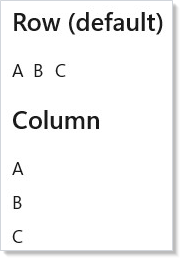
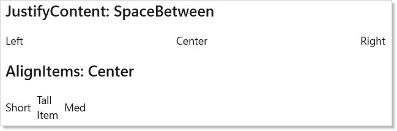
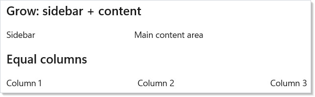
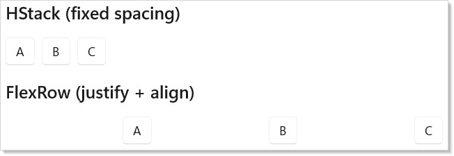

Microsoft.UI.Reactor (Reactor)'s flex layout reasons about two axes at once. The main axis distributes
children across available space — that's where `JustifyContent`,
`Flex(grow:)`, `Flex(shrink:)`, and `Flex(basis:)` apply. The cross
axis aligns each child against the container's other dimension — that's
where `AlignItems` and per-child `AlignSelf` apply. The same `FlexPanel`
composes both, and that combination is what unlocks the layouts that
`VStack` and `HStack` cannot express. A toolbar with a flexible spacer,
an app shell with a fixed sidebar and a fluid content area, a wrap-on-
overflow tag row — all three are FlexPanels with different
main-axis / cross-axis rules. Read this page before reaching for `Grid`
on a problem that's really "distribute these items along one axis with
alignment on the other" — that's the FlexPanel shape, and the moment a
grid feels overkill is the moment Flex is right.

# Flex Layout

Reactor's `FlexPanel` (exposed through the [`FlexRow`](#direction) and
[`FlexColumn`](#direction) factories) is a Yoga-backed CSS Flexbox
implementation. Reach for it when the layout needs alignment control,
wrapping, or proportional sizing that [`VStack` and `HStack`](layout.md)
cannot express. Add `using Microsoft.UI.Reactor.Layout;` (or import
`FlexDirection`, `FlexJustify`, `FlexAlign`, `FlexWrap`) to access the
enum types.

## At-a-glance reference

| Property | Set on | Effect |
|---|---|---|
| `JustifyContent` | container (`with { ... }`) | Main-axis distribution: `FlexStart` / `Center` / `FlexEnd` / `SpaceBetween` / `SpaceAround` / `SpaceEvenly` |
| `AlignItems` | container (`with { ... }`) | Cross-axis alignment: `Stretch` / `FlexStart` / `Center` / `FlexEnd` / `Baseline` |
| `AlignContent` | container (`with { ... }`) | Cross-axis alignment of **wrapped lines** — only matters when `Wrap` is on and lines have leftover space |
| `Wrap` | container (`with { ... }`) | `NoWrap` (single-line, overflow) / `Wrap` / `WrapReverse` |
| `ColumnGap` / `RowGap` | container (`with { ... }`) | Spacing between children — applies between wrapped lines too |
| `FlexPadding` | container (`with { ... }`) | Inside-container padding measured by Yoga (distinct from the `.Padding(...)` modifier) |
| `.Flex(grow:, shrink:, basis:)` | child | Main-axis sizing |
| `.Flex(minWidth:, minHeight:)` | child | Override CSS §4.5 auto-min on the main axis (`null` = CSS `auto`; `0` = no floor; positive = hard floor). See the [Min sizing](#min-sizing-css-45) table for how `auto` resolves. |
| `.Flex(alignSelf:)` | child | Override the container's `AlignItems` for one child |

## Direction

`FlexRow` lays children along the horizontal main axis; `FlexColumn`
lays them along the vertical main axis. The cross axis is whichever
direction is left. Set spacing through `ColumnGap` (between row
children) or `RowGap` (between column children):

```csharp
class FlexDirectionDemo : Component
{
    public override Element Render()
    {
        return VStack(16,
            SubHeading("Row (default)"),
            FlexRow(
                TextBlock("A").Padding(12).Background("#e0e0ff"),
                TextBlock("B").Padding(12).Background("#ffe0e0"),
                TextBlock("C").Padding(12).Background("#e0ffe0")
            ) with { ColumnGap = 8 },

            SubHeading("Column"),
            FlexColumn(
                TextBlock("A").Padding(12).Background("#e0e0ff"),
                TextBlock("B").Padding(12).Background("#ffe0e0"),
                TextBlock("C").Padding(12).Background("#e0ffe0")
            ) with { RowGap = 8 }
        ).Padding(24);
    }
}
```



A `FlexRow` looks like [`HStack`](layout.md) at first glance, but a
FlexPanel additionally exposes justification, cross-axis alignment,
wrapping, and proportional sizing — `HStack` does none of those.

## Justify and Align

`JustifyContent` distributes children along the **main** axis;
`AlignItems` aligns them on the **cross** axis. These are independent
knobs on the same container — read them as two separate sentences:

```csharp
class JustifyAlignDemo : Component
{
    public override Element Render()
    {
        return VStack(16,
            SubHeading("JustifyContent: SpaceBetween"),
            FlexRow(
                TextBlock("Left").Padding(8).Background("#e0e0ff"),
                TextBlock("Center").Padding(8).Background("#ffe0e0"),
                TextBlock("Right").Padding(8).Background("#e0ffe0")
            ) with { JustifyContent = FlexJustify.SpaceBetween },

            SubHeading("AlignItems: Center"),
            FlexRow(
                TextBlock("Short").Padding(8).Background("#e0e0ff"),
                TextBlock("Tall\nItem").Padding(8).Background("#ffe0e0"),
                TextBlock("Med").Padding(8).Background("#e0ffe0")
            ) with {
                AlignItems = FlexAlign.Center,
                ColumnGap = 8
            }
        ).Padding(24).Height(300);
    }
}
```



| `JustifyContent` | Effect (main axis) |
|---|---|
| `FlexStart` | Pack to start (default) |
| `Center` | Center along main axis |
| `FlexEnd` | Pack to end |
| `SpaceBetween` | Equal space between items, none at edges |
| `SpaceAround` | Equal space around items |
| `SpaceEvenly` | Equal space between and at edges |

| `AlignItems` | Effect (cross axis) |
|---|---|
| `Stretch` | Fill cross axis (default) |
| `FlexStart` | Align to cross-axis start |
| `Center` | Center on cross axis |
| `FlexEnd` | Align to cross-axis end |
| `Baseline` | Align text baselines |

## Wrap and gap

When children would overflow the container on the main axis, set
`Wrap = FlexWrap.Wrap` to flow them onto a second line. `ColumnGap` and
`RowGap` apply consistently — between children on a line **and** between
wrapped lines:

```csharp
class WrapGapDemo : Component
{
    public override Element Render()
    {
        var tags = new[] {
            "C#", "WinUI", "Reactor", ".NET", "XAML",
            "Flex", "Layout", "Desktop", "Native"
        };

        return VStack(12,
            SubHeading("Wrapping Tags"),
            FlexRow(
                tags.Select(tag =>
                    TextBlock(tag)
                        .Padding(horizontal: 6, vertical: 12)
                        .Background("#e8e8e8")
                        .CornerRadius(12)
                ).ToArray()
            ) with {
                Wrap = FlexWrap.Wrap,
                ColumnGap = 8,
                RowGap = 8
            }
        ).Padding(24);
    }
}
```


Tag clouds, chip rows, breadcrumb overflow, filter pills — anywhere the
item count varies and the container width can shrink — are wrap-target
shapes. For rendering long item collections with virtualization, see
[Collections](collections.md).

## Grow, shrink, basis

`.Flex(grow:, shrink:, basis:)` on a child controls how that child
shares main-axis space with its siblings:

- **`grow`** — share of the **extra** space the child claims after all
  basis sizes are placed (default `0` — the child holds its content
  size).
- **`shrink`** — share of the **deficit** the child gives up when the
  total basis exceeds the container (default `1` — the child shrinks
  proportionally).
- **`basis`** — the starting size in pixels before grow/shrink apply.
  `null` means "measure my content first" (Yoga's `auto`).
- **`minWidth` / `minHeight`** — explicit floor for the child's main-axis
  size. `null` (default) means *auto* — see "Min sizing (CSS §4.5)"
  below.

```csharp
class GrowShrinkDemo : Component
{
    public override Element Render()
    {
        return VStack(16,
            SubHeading("Grow: sidebar + content"),
            FlexRow(
                TextBlock("Sidebar")
                    .Padding(16).Background("#e0e0ff")
                    .Flex(basis: 200, shrink: 0),
                TextBlock("Main content area")
                    .Padding(16).Background("#f0f0f0")
                    .Flex(grow: 1)
            ) with { ColumnGap = 8 },

            SubHeading("Equal columns"),
            FlexRow(
                TextBlock("Column 1").Padding(16).Background("#ffe0e0").Flex(grow: 1),
                TextBlock("Column 2").Padding(16).Background("#e0ffe0").Flex(grow: 1),
                TextBlock("Column 3").Padding(16).Background("#e0e0ff").Flex(grow: 1)
            ) with { ColumnGap = 8 }
        ).Padding(24);
    }
}
```



The sidebar uses `basis: 200, shrink: 0` to fix its width; the content
column uses `grow: 1` to absorb whatever remains. The equal-columns row
gives every child `grow: 1` so the available space splits evenly.

> **Caveat:** `Flex(grow: 0)` + `Flex(shrink: 1)` with no `basis` defaults to
> `basis: auto` — Yoga measures the child's content size in a first pass,
> then runs distribution in a second. For a row of 200 list cells, that
> first measurement pass dominates layout cost: the panel asks each cell
> for its preferred size before doing any distribution. Setting an
> explicit `basis: 0` (or any pixel value) collapses the two passes into
> one: distribution alone, no content measurement. The difference is
> invisible on a 5-button toolbar and load-bearing on a 200-row table
> header that rebuilds on every column resize.

## Min sizing (CSS §4.5)

By default, a flex child with `basis: auto` will not shrink below its
**min-content** size — the smallest size it can occupy without
overflowing its own content. This matches the [CSS Flexbox
specification §4.5](https://www.w3.org/TR/css-flexbox-1/#min-size-auto)
("Automatic Minimum Size of Flex Items") and is what most developers
intuitively expect when laying out a row of cards or a column of
sections: items don't squish smaller than their text or icons.

Reactor's FlexPanel implements the auto-min rule as follows:

| basis | minWidth / minHeight | Resulting floor |
|---|---|---|
| `auto` (default) | `null` (default) | `min-content` |
| `0` | `null` | `0` (short-circuit — basis already opts out of content) |
| pixel value `N > 0` | `null` | `min(N, min-content)` |
| any | explicit `0` | `0` (you opt out of the floor) |
| any | explicit `N > 0` | `N` (your hard floor) |

The auto-min rule applies **only to the main axis** (width for
`Direction.Row`, height for `Direction.Column`). On the cross axis,
items shrink freely to 0 unless you set `minWidth`/`minHeight`
explicitly.

```csharp
// Default behavior — items keep their min-content size:
FlexPanel(
    Border("Long text that won't truncate").Flex(shrink: 1),
    Border("Short").Flex(shrink: 1),
).Direction(FlexDirection.Row);

// Opt out — let items shrink below content (text will clip):
FlexPanel(
    Border("Long text that may be clipped").Flex(shrink: 1, minWidth: 0),
    Border("Short").Flex(shrink: 1, minWidth: 0),
).Direction(FlexDirection.Row);

// Explicit floor — never below 80px regardless of content:
Border(content).Flex(shrink: 1, minWidth: 80)
```

> **Caveat:** **Performance:** computing `min-content` requires a WinUI
> `Measure(width: marginH, height: ∞)` pass on each affected child before
> the main flex algorithm runs. This is fine for typical UIs but can
> matter for very large lists. Two ways to skip the pre-measure:
> 
> - Set `basis: 0` explicitly — the auto-min collapses to 0 with no
>   measurement.
> - Set `minWidth: 0` (or `minHeight: 0`) explicitly — you've opted out
>   of the floor.
> 
> Children that are `ScrollView` or `ScrollViewer` always get a `0`
> floor: their min-content would force their virtualized contents to
> realize, which defeats the point of virtualization.

> **Caveat:** **CSS vs WinUI mismatch on explicit `Width`.** In CSS, an item with
> `width: 200px; flex-shrink: 1; min-width: 0` is allowed to shrink
> below 200. In WinUI, `FrameworkElement.Width = 200` is a hard size
> constraint — the control will report `DesiredSize.Width = 200`
> regardless of available space and will arrange at 200 inside its
> allocated slot. Inside a FlexPanel, prefer `.Flex(basis: 200, ...)`
> over `.Width(200)` for any item you want to shrink. Yoga reads the
> basis; WinUI's `Width` doesn't participate in flex distribution the
> way CSS's `width` does.

## Practical example: toolbar with flexible spacer

A toolbar with a left-aligned title and right-aligned buttons is the
canonical flex shape. Use `Empty().Flex(grow: 1)` as a flexible spacer —
it absorbs every spare pixel and pushes the buttons to the trailing
edge:

```csharp
class ToolbarDemo : Component
{
    public override Element Render()
    {
        var (selected, setSelected) = UseState("Home");

        return VStack(0,
            FlexRow(
                TextBlock("MyApp").Bold().Flex(shrink: 0),
                Empty().Flex(grow: 1),
                Button("Home", () => setSelected("Home")),
                Button("Settings", () => setSelected("Settings")),
                Button("About", () => setSelected("About"))
            ) with {
                AlignItems = FlexAlign.Center,
                ColumnGap = 8,
                FlexPadding = new Thickness(16, 8, 16, 8)
            },
            TextBlock($"Current page: {selected}")
                .Padding(24).FontSize(18)
        );
    }
}
```


The spacer pattern composes — three spacers between three buttons
distribute them evenly without `SpaceBetween` on the container, which
matters when only some children should flex.

## Flex vs VStack/HStack vs Grid

Pick a container by what its shape promises, not by what looks
expedient:

```csharp
class FlexVsStackDemo : Component
{
    public override Element Render()
    {
        return VStack(16,
            SubHeading("HStack (fixed spacing)"),
            HStack(8,
                Button("A"), Button("B"), Button("C")
            ),

            SubHeading("FlexRow (justify + align)"),
            FlexRow(
                Button("A"), Button("B"), Button("C")
            ) with {
                JustifyContent = FlexJustify.SpaceEvenly,
                AlignItems = FlexAlign.Center
            }
        ).Padding(24);
    }
}
```



| Feature | `VStack` / `HStack` | `FlexRow` / `FlexColumn` | `Grid` |
|---|---|---|---|
| Fixed inter-child spacing | yes | yes (`ColumnGap` / `RowGap`) | yes |
| Justify along main axis | no | yes | row/column at a time |
| Cross-axis alignment | no | yes | `VAlign` per cell |
| Wrap on overflow | no | yes | implicit row/column matrix |
| Proportional sizing | no | yes (`Flex(grow:)`) | yes (`GridSize.Star`) |
| Two-dimensional layout | no | no | yes |

If the layout has a row-and-column structure (a form, a settings grid,
anything where columns line up across rows), reach for
[`Grid`](layout.md). If it's "distribute children along one axis with
alignment on the other," FlexPanel is the right shape.

## Patterns

### App shell — fixed sidebar, fluid content

A two-column layout with a fixed-width nav rail and a content pane that
absorbs the rest is the most common flex shape in production apps. The
key is `basis: 220, shrink: 0` on the sidebar (locks the width and
prevents collapse) paired with `grow: 1, basis: 0` on the content
(grabs the remainder in a single distribution pass):

```csharp
class AppShellDemo : Component
{
    public override Element Render()
    {
        return FlexRow(
            // Sidebar — fixed 220px, never shrinks below it.
            VStack(8,
                TextBlock("Inbox").Padding(8),
                TextBlock("Drafts").Padding(8),
                TextBlock("Sent").Padding(8)
            ).Background("#f3f3f3")
             .Flex(basis: 220, shrink: 0),

            // Content — explicit basis: 0 + grow: 1 gives a single distribution
            // pass instead of measuring the inner text first.
            VStack(12,
                Heading("Inbox"),
                TextBlock("Three messages, one starred. The sidebar stays 220px wide; this column absorbs every spare pixel.")
            ).Padding(16)
             .Flex(grow: 1, basis: 0)
        ) with { ColumnGap = 1 };
    }
}
```

The explicit `basis: 0` on content matches the caveat above — no
content-measurement pass, just distribution. The sidebar's `shrink: 0`
keeps the rail at 220 pixels even when the window narrows below the
content's intrinsic minimum.

### Responsive nav rail with wrap-on-overflow

Above a breakpoint, the nav rail is a single row; below the breakpoint,
items wrap onto a second line. `FlexWrap.Wrap` + `RowGap` + `ColumnGap`
is the entire mechanism — no media-query equivalent needed:

```csharp
class ResponsiveNavDemo : Component
{
    public override Element Render()
    {
        // Wrap kicks in when the narrow viewport can no longer fit one row.
        // RowGap and ColumnGap apply between wrapped lines too — no manual margin.
        return FlexRow(
            TextBlock("Home").Padding(8).Background("#e0e0ff"),
            TextBlock("Catalog").Padding(8).Background("#e0e0ff"),
            TextBlock("Pricing").Padding(8).Background("#e0e0ff"),
            TextBlock("Docs").Padding(8).Background("#e0e0ff"),
            TextBlock("About").Padding(8).Background("#e0e0ff"),
            TextBlock("Contact").Padding(8).Background("#e0e0ff"),
            TextBlock("Status").Padding(8).Background("#e0e0ff")
        ) with {
            Wrap = FlexWrap.Wrap,
            ColumnGap = 8,
            RowGap = 8,
            AlignItems = FlexAlign.Center
        };
    }
}
```

The same shape works for tag rows, breadcrumb overflow, and toolbar
overflow. Pair with [`UseWindowSize`](hooks.md) if the breakpoint
should drive a different layout entirely (e.g., collapsing to a
hamburger menu), but for in-place wrap the Flex container alone is
sufficient.

### Toolbar with flexible spacer

Already shown above — repeating here because the pattern crystallizes
the main-axis vs cross-axis split. `AlignItems = FlexAlign.Center`
vertically centers buttons of mixed heights; `Empty().Flex(grow: 1)`
pushes the trailing buttons to the right edge. Two unrelated knobs, one
container.

## Common Mistakes

### Using FlexPanel for grid-shape layouts

```csharp
// Don't — two-dimensional alignment between rows is not what Flex does.
FlexColumn(
    FlexRow(TextBlock("Name:"), TextBox(name, setName)) with { ColumnGap = 8 },
    FlexRow(TextBlock("Email:"), TextBox(email, setEmail)) with { ColumnGap = 8 },
    FlexRow(TextBlock("Phone:"), TextBox(phone, setPhone)) with { ColumnGap = 8 }
)
```

The labels won't line up — each row's flex distribution is independent.
Use [`Grid`](layout.md) for any layout where columns align across rows
(forms, settings grids, data tables). FlexPanel only knows one axis at a
time.

### Mixing `.Width(...)` with `.Flex(grow:)`

```csharp
class WidthVsGrowWrong : Component
{
    public override Element Render()
    {
        // Don't: .Width(200) sets the WinUI Width, but inside a FlexPanel
        // child sizing is governed by Flex(basis/grow/shrink). The 200 is
        // silently ignored when grow > 0 fills available space.
        return FlexRow(
            TextBlock("Stays 200?")
                .Width(200)              // ignored — grow wins
                .Flex(grow: 1)
                .Background("#ffe0e0")
        ) with { ColumnGap = 8 };
    }
}
```

`.Width(200)` sets the underlying `FrameworkElement.Width`, but inside a
FlexPanel the child's main-axis size comes from `Flex(basis:, grow:,
shrink:)` — and `grow: 1` will fill available space regardless of
`Width`. The 200 is silently ignored. Encode the intended size as
`basis`:

```csharp
class WidthVsGrowRight : Component
{
    public override Element Render()
    {
        // Do: encode the intended size as basis with shrink: 0 — Flex
        // owns the sizing math, so no surprise overrides.
        return FlexRow(
            TextBlock("Exactly 200")
                .Flex(basis: 200, shrink: 0)
                .Background("#e0ffe0")
                .Padding(8)
        ) with { ColumnGap = 8 };
    }
}
```

The general rule: inside a FlexPanel, prefer `.Flex(basis: N)` over
`.Width(N)`. The basis is what Yoga's algorithm reads; the width is
what WinUI's measure pass reads, and they only sometimes agree.

### Forgetting `Wrap` then overflowing on narrow widths

```csharp
// Don't — a default FlexPanel is NoWrap. On a 600px window this
// row overflows and clips the trailing items.
FlexRow(/* 7 nav items */) with { ColumnGap = 8 }
```

Default `FlexWrap.NoWrap` produces a single line that overflows the
container when total child width exceeds available space. Set
`Wrap = FlexWrap.Wrap` for any row whose item count or window width can
vary. The cost is zero on rows that don't actually need to wrap — Yoga
short-circuits when one line fits.

### Reaching for `FlexPadding` when you wanted `.Padding`

`FlexPadding` is a property on the FlexPanel itself, measured by Yoga
inside the same algorithm that distributes children. The `.Padding(...)`
modifier sets the underlying WinUI `FrameworkElement.Margin` /
`Padding`, which WinUI applies in its own pass. For consistent
inside-container spacing — especially when wrapping or `JustifyContent`
is involved — use `FlexPadding`. Reserve `.Padding(...)` for elements
that aren't FlexPanels.

## Tips

**Start with VStack/HStack.** They produce simpler element trees and
cover most layouts. Reach for FlexPanel when you specifically need
justification, alignment, wrap, or proportional sizing.

**Use `ColumnGap` and `RowGap` instead of per-child margins.** Gap
applies between children automatically — no first-child / last-child
asymmetry, and it composes correctly with wrapping.

**Set `shrink: 0` on every fixed-width item.** A sidebar, icon column,
or pinned action button without `shrink: 0` will collapse when the
window narrows. Pair `shrink: 0` with `basis` to lock the exact size.

**Use `Empty().Flex(grow: 1)` as a flexible spacer.** This is the flex
equivalent of a spring — it absorbs all remaining space and pushes
siblings to the opposite edge. Composes correctly with mixed-flex
siblings.

**Remember `with { }` syntax for container props.** `FlexElement` is a
C# record, so set `JustifyContent`, `AlignItems`, `Wrap`, `ColumnGap`,
and `RowGap` via `FlexRow(...) with { JustifyContent = FlexJustify.Center }`.

## Next Steps

- **[Layout](layout.md)** — Previous: VStack, HStack, Grid, ScrollView, and other core containers
- **[Forms and Input](forms.md)** — Next: controlled input controls, validation, and form composition
- **[Collections](collections.md)** — render dynamic lists and grids with virtualization
- **[Styling and Theming](styling.md)** — theme tokens, dark/light mode, and lightweight styling for flex containers
- **[Input and Gestures](input-and-gestures.md)** — pointer and keyboard events on flex children
