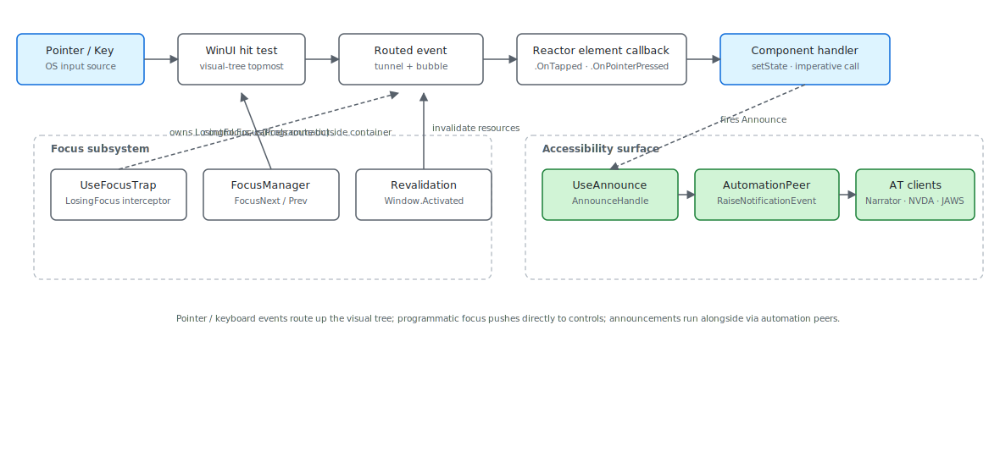

Reactor's focus and input surfaces are thin wrappers over WinUI's
routed-event system — every pointer event, every key press, every
gesture starts in WinUI's hit-test, walks the visual tree as a routed
event, and lands at a Reactor element modifier like
[`.OnTapped`](input-and-gestures.md) or [`.OnKeyDown`](input-and-gestures.md).
Three subsystems sit alongside the event flow. `UseFocusTrap` rides
on `LosingFocus` to cancel focus changes that would leave the trap
container. `FocusManager` registers fields and drives
[enter-to-advance](forms.md) on form input. `UseAnnounce` takes a
shortcut around focus entirely — it raises an automation-peer
notification, not a focus event, so the announcement reaches a screen
reader even when nothing visible changes. The most common mistake is
treating focus as a property you set: `control.Focus(...)` *requests*
focus, and the request loses to anything else competing on the same
dispatcher tick. Route programmatic focus through `FocusManager` so
the request runs at the right point in the lifecycle.

# Focus and Input Internals

This page covers the input subsystem from the routed-event boundary
through the Reactor hooks that observe it. User-facing API is on
[Input and Gestures](input-and-gestures.md) and
[Accessibility](accessibility.md); this is the internals view.

## The event flow



WinUI owns the early stages: hit-testing under the pointer, the
tunneling preview events, the bubbling action events. By the time a
Reactor modifier sees an event, WinUI has already picked the target
and tunneled / bubbled the event through the visual tree. Reactor's
job at that boundary is two things — wire a `RoutedEventHandler` to
the materialized control during the reconciler's mount pass, and
attach the Reactor element's user callback to that handler. There's
no parallel event tree; the routes you see in
[`.OnPointerPressed`](input-and-gestures.md) are the WinUI routes,
plus a small layer that translates `RoutedEventArgs` into Reactor's
event-args records.

## Reference

| Surface | Hook / type | Wired to | Primary use |
|---|---|---|---|
| Pointer event | `.OnPointerPressed(...)` | WinUI `PointerPressed` routed event | Low-level pointer (mouse / pen / touch) |
| Tap | `.OnTapped(...)` | WinUI `Tapped` routed event | Discrete click / tap with WinUI's gesture recognizer |
| Pan / pinch / rotate | `.OnPan(...)` | WinUI `Manipulation*` events | Continuous gestures with phase machine |
| Focus management | `UseFocus()` → `FocusManager` | `control.Focus(Programmatic)` | Form field ordering + enter-to-advance |
| Focus trap | `UseFocusTrap(active)` | `UIElement.LosingFocus` | Modal / flyout containment |
| Live region | `UseAnnounce()` | `FrameworkElementAutomationPeer.RaiseNotificationEvent` | Screen-reader announcements |
| Element focus | `UseElementFocus()` | `Control.Focus()` via dispatcher | Imperative focus on a single element |
| Window-focus revalidation | `FocusRevalidationService` | `Window.Activated` | Refetch stale [`UseResource`](hooks.md) data |

## The FocusManager

```csharp
public void FocusNext(string? currentField = null)
{
    if (_fieldOrder.Count == 0) return;

    if (currentField is null)
    {
        FocusField(_fieldOrder[0]);
        return;
    }

    var index = _fieldOrder.IndexOf(currentField);
    if (index < 0) return;

    if (index + 1 < _fieldOrder.Count)
    {
        FocusField(_fieldOrder[index + 1]);
    }
    else
    {
        _onSubmit?.Invoke();
    }
}
```

[`FocusManager`](forms.md) is the form-side companion to WinUI's
focus system. Components call `useFocus.Register(name)` on each input
during render, and the manager keeps a `List<string>` of field names
in order. `FocusNext` and `FocusPrevious` walk that list — the
common pattern is `<TextField>.OnEnter(() => fm.FocusNext(name))` so
pressing Enter on a field advances to the next one, and Enter on the
last field calls the registered submit handler. The `_controls`
dictionary maps each field name to the live WinUI `Control`; when
[`.Set("name")`](forms.md) runs on mount, it stashes the control in
the manager. Programmatic focus calls
`control.Focus(FocusState.Programmatic)`, which is the WinUI
mechanism for "I, the app, decided to move focus" rather than a
user-initiated tab.

> **Caveat:** `Register` is called in render order, on every render. That means
> adding a field at index 1 (between two existing fields) requires a
> clean re-register cycle — the manager's `Contains` check makes
> re-registration idempotent for existing names, but it can't reorder.
> For dynamic forms that reorder fields, call `Clear()` at the top of
> the render and re-register; for forms with conditional fields,
> prefer rendering all fields and toggling `.IsVisible` over removing
> them from the tree, because removal also un-registers focus.

## The focus trap

```csharp
private void OnLosingFocus(UIElement sender, LosingFocusEventArgs args)
{
    if (!_isActive || _container is null) return;

    // SECURITY (TASK-100): refuse to trap when the container has fallen
    // out of the visual state where trapping is sensible. Without these
    // gates, a hidden / collapsed / unloaded container wedges keyboard
    // navigation: the user can't focus anything else and Esc / Tab
    // bounce back uselessly.
    if (_container is FrameworkElement fe)
    {
        if (!fe.IsLoaded) return;
        if (fe.Visibility != Visibility.Visible) return;
    }
    if (!_container.IsHitTestVisible) return;
```

`UseFocusTrap` lives on the `LosingFocus` routed event. When the
trap is active, the handler runs before WinUI commits the focus
change, walks from the proposed new-focus element back up the visual
tree, and cancels the change if the target isn't a descendant of the
trap container. That's the trap. The four gates at the top of the
snippet are what make it safe — without them, a trap attached to a
container that has since become hidden, unloaded, or collapsed
wedges the user's keyboard: every Tab keystroke loses focus, the
trap cancels every loss, and focus has no valid target inside the
trap either. Each guard names a specific failure mode the trap has
caused in the past.

Cross-window navigation gets special treatment. A `LosingFocus` event
whose `NewFocusedElement` has a different `XamlRoot` is a different
window entirely; the trap deliberately doesn't try to drag the user
back. That matters for dialogs that open a child window — the trap
on the parent must not block focus moving into the child.

## Live-region announcements

```csharp
public void Announce(string message, bool assertive)
{
    if (_textBlock is null) return;

    // Primary path: RaiseNotificationEvent (WinUI 1.4+, best Narrator/NVDA support).
    var peer = FrameworkElementAutomationPeer.FromElement(_textBlock);
    if (peer is not null)
    {
        peer.RaiseNotificationEvent(
            AutomationNotificationKind.ActionCompleted,
            assertive
                ? AutomationNotificationProcessing.ImportantAll
                : AutomationNotificationProcessing.ImportantMostRecent,
            message,
            "ReactorAnnounce");
        return;
    }

    // Fallback: update the live-region TextBlock text. Screen readers that
    // monitor LiveSetting changes will pick this up.
    _textBlock.Text = message;
}
```

[`UseAnnounce`](accessibility.md) goes around the focus path entirely.
The primary mechanism is `RaiseNotificationEvent` (WinUI 1.4+) on a
hidden `TextBlock` that the handle keeps materialized. Screen readers
hooked into UI Automation receive the notification with a processing
hint — `ImportantAll` for assertive announcements that interrupt
current speech, `ImportantMostRecent` for polite announcements that
queue. The fallback path updates `TextBlock.Text` directly; screen
readers monitoring `LiveSetting` changes pick that up as a live-region
update.

The `Region` element the handle exposes is invisible, zero-sized, and
mounts to a real `TextBlock`. Components include it once in their
tree and call `handle.Announce(...)` from event handlers. The pattern
mirrors WAI-ARIA's `aria-live` region: a stable element that exists
solely so assistive tech has a stable target for live updates.

## Continuous gesture phases

```csharp
public enum GesturePhase
{
    /// <summary>Gesture has just become recognized and its parameters are stable.</summary>
    Began,
    /// <summary>Gesture is in progress; deltas are being reported.</summary>
    Changed,
    /// <summary>Gesture completed normally.</summary>
    Ended,
    /// <summary>Gesture was cancelled (pointer capture lost, window focus lost, …).</summary>
    Cancelled,
}
```

Pan, pinch, rotate, and long-press are continuous gestures — they
fire once at `Began`, zero or more times at `Changed` as the user's
finger moves, and exactly once at either `Ended` (normal release) or
`Cancelled` (pointer capture lost, escape, window deactivation). The
contract matters because component code routinely allocates state on
`Began` (record the start position, snapshot the model under the
pointer) and tears it down on the terminal phase. A handler that
skips `Cancelled` leaks the snapshot the next time the user is
mid-gesture and switches windows.

The four phases map directly onto WinUI's `ManipulationStarted` /
`ManipulationDelta` / `ManipulationCompleted` cycle, with the
addition of an explicit `Cancelled` phase that WinUI emits as a
completed manipulation with `IsInertial = false` and a pointer
capture loss. The gesture wrappers
[`.OnPan`](input-and-gestures.md) / `.OnPinch` / `.OnRotate` are the
shim that converts that pair of WinUI events into a clean Reactor
callback signature.

## Focus revalidation

```csharp
public IReadOnlyList<string> RevalidateNow()
{
    var now = UtcNow();
    lock (_lock)
    {
        if (now - _lastSweepUtc < ThrottleWindow)
            return Array.Empty<string>();
        _lastSweepUtc = now;
    }
```

[`FocusRevalidationService`](async-resources.md) is a different
sense of "focus" — it's the window-focus event, not the keyboard one.
When the user Alt-Tabs back to a Reactor app, any
[`UseResource`](hooks.md) hook that opted in via
`ResourceOptions.RefetchOnWindowFocus = true` gets its cache entry
invalidated, which fires a re-fetch on next render. The 30-second
throttle is what keeps a quick Alt-Tab in and out from triggering a
storm of refetches across every enrolled resource — without it, an
app open in five windows during a normal alt-tab cycle would refetch
every resource in every window each time the user crossed any of
them.

## Patterns

### Trapping focus in a modal

A modal dialog is the canonical use of `UseFocusTrap` and
[`UseAnnounce`](accessibility.md) together. The trap keeps Tab
inside the dialog; the announcement tells the screen reader the
dialog opened.

```csharp
public override Element Render()
{
    var (open, setOpen) = UseState(false);
    var trap = UseFocusTrap(isActive: open);
    var announce = UseAnnounce();

    return Layer(
        announce.Region,
        MainContent(),
        open
            ? Dialog(
                Text("Are you sure?"),
                HStack(
                    Button("Cancel", () => setOpen(false)),
                    Button("Delete", () => { Delete(); setOpen(false); })
                )
              )
              .FocusTrap(trap)
              .OnMount(() => announce.Announce("Confirm delete dialog opened", assertive: true))
            : null
    );
}
```

The `UseFocusTrap(open)` call evaluates the active flag on every
render — flip `open` to false and the trap deactivates on the next
reconcile pass; flip it back to true and the trap reattaches. The
[reconciliation](reconciliation.md) page describes the mount /
unmount machinery that drives the `OnMount` callback.

## Common Mistakes

### Calling control.Focus() directly from an event handler

```csharp
// Don't:
Button("Edit", () => {
    setEditing(true);
    inputControl.Focus(FocusState.Programmatic);  // dispatcher race
});
```

```csharp
public void FocusNext(string? currentField = null)
{
    if (_fieldOrder.Count == 0) return;

    if (currentField is null)
    {
        FocusField(_fieldOrder[0]);
        return;
    }

    var index = _fieldOrder.IndexOf(currentField);
    if (index < 0) return;

    if (index + 1 < _fieldOrder.Count)
    {
        FocusField(_fieldOrder[index + 1]);
    }
    else
    {
        _onSubmit?.Invoke();
    }
}
```

The setState call queues a re-render; the focus call runs
immediately. On the next dispatcher tick the reconciler may
re-create the input control (if the conditional rendering paths
differ enough), at which point the old reference is unmounted and
the new control hasn't been focused. Route programmatic focus
through `UseFocus()` (which captures the control during the
reconciler's set pass) or [`UseElementFocus()`](hooks.md) (which
schedules the focus call on the dispatcher after the render
commits) and the race goes away.

## Tips

**Set the trap's `active` flag, never call `Attach` / `Detach`.**
The handle's `IsActive` setter is the only public mutation point. It
runs the attach / detach internally and idempotently — calling it
with the same value is a no-op, calling it true / false on
consecutive renders correctly cycles the `LosingFocus` subscription.

**`UseElementFocus` is the dispatcher-safe focus call.** When the
target is one specific element rather than one of several form
fields, prefer `UseElementFocus()` over storing a control reference.
The returned `RequestFocus` action schedules its call through the
dispatcher trampoline so it runs after the current render commits.

**Continuous gestures must handle `Cancelled`.** Every snapshot
allocated in `Began` must be released in either `Ended` or
`Cancelled`. Match on `gesture.Phase` with all four arms — the
compiler won't warn on a missing case, and the leak only shows up
when a user backgrounds the app mid-drag.

## Next Steps

- **[Input and Gestures](input-and-gestures.md)** — Surface-level event API.
- **[Accessibility](accessibility.md)** — User-facing accessibility hooks and conventions.
- **[Forms](forms.md)** — How `UseFocus` plugs into the form authoring story.
- **[Reconciliation](reconciliation.md)** — Mount / update lifecycle that drives `OnMount` callbacks.
- **[Animation Pipeline](animation-pipeline.md)** — Previous under-the-hood page.
