> **WinUI reference:** For the full property surface and design guidance, see [Forms](https://learn.microsoft.com/en-us/windows/apps/design/controls/forms).

Forms are the Reactor surface most apps spend most of their UI time inside.
Every input control on this page follows the same controlled-input
contract: you own the current value, you provide a change handler, the
control renders what you pass and calls your handler when the user edits.
There is no two-way `Binding`, no `INotifyPropertyChanged`, no
`DependencyProperty.SetValue` — the value flows one direction
(state → control) and edits flow one direction back
(handler → state). That shape comes from
[hooks](hooks.md) and [components](components.md), and it makes every
form testable: the form is whatever the
[`UseState`](hooks.md) snapshot says it is. Validation layers on top
through [`UseValidationContext`](hooks.md) and the `.Validate(...)`
modifier — the validators run on every render, the
[`FormField`](#formfield-helper) wrapper handles label / required marker /
error display, and the `ValidationContext` tracks touched/dirty per
field so errors only appear when the user has interacted. Read the
controlled-input section first; everything else on this page is a
specialization.

# Forms and Input

Every form control in Reactor follows the controlled-input pattern: you own the
value, you provide the change handler, and the control reflects your state.
There is no two-way binding. The data always flows one direction.

## The Controlled-Input Pattern

Pass the current value and a setter. When the user types, `onChange` fires
with the new value. You call the setter, Reactor re-renders, and the control
shows the updated text:

```csharp
class ControlledInputDemo : Component
{
    public override Element Render()
    {
        var (name, setName) = UseState("");

        return VStack(12,
            SubHeading("Controlled Input"),
            TextField(name, setName, placeholder: "Type your name"),
            TextBlock($"You typed: {name}").Opacity(0.6)
        ).Padding(24);
    }
}
```

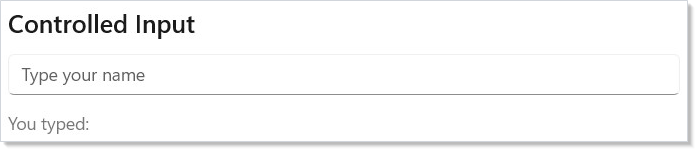

This is the same [`UseState`](hooks.md) pattern from [Getting Started](getting-started.md),
applied to form inputs. The control never holds its own state — your component
is the single source of truth.

## Input Control Types

Reactor provides controls for every common input type. Each follows the same
pattern: current value in, change handler out.

```csharp
class InputTypesDemo : Component
{
    public override Element Render()
    {
        var (text, setText) = UseState("");
        var (password, setPassword) = UseState("");
        var (volume, setVolume) = UseState(50.0);
        var (count, setCount) = UseState(1.0);
        var (agree, setAgree) = UseState(false);
        var (notify, setNotify) = UseState(true);
        var (role, setRole) = UseState(0);
        var (priority, setPriority) = UseState(0);

        return VStack(12,
            TextField(text, setText, placeholder: "Email",
                header: "Email"),
            PasswordBox(password, setPassword,
                placeholderText: "Enter password"),
            Slider(volume, 0, 100, setVolume),
            NumberBox(count, setCount, header: "Quantity"),
            CheckBox(agree, setAgree, label: "I agree to the terms"),
            ToggleSwitch(notify, setNotify,
                header: "Notifications"),
            ComboBox(["Admin", "Editor", "Viewer"],
                role, setRole),
            RadioButtons(["Low", "Medium", "High"],
                priority, setPriority)
        ).Padding(24);
    }
}
```

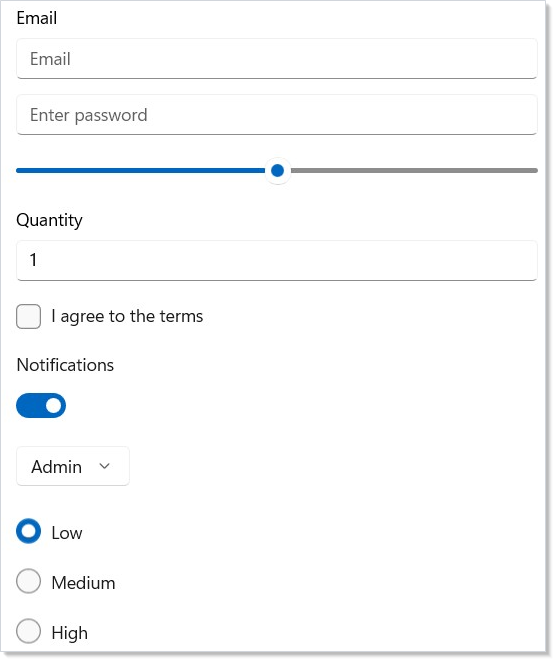

| Control | Value type | Change handler |
|---------|-----------|---------------|
| `TextField` | `string` | `Action<string>` |
| `PasswordBox` | `string` | `Action<string>` |
| `Slider` | `double` | `Action<double>` |
| `NumberBox` | `double` | `Action<double>` |
| `CheckBox` | `bool` | `Action<bool>` |
| `ToggleSwitch` | `bool` | `Action<bool>` |
| `ComboBox` | `int` (index) | `Action<int>` |
| `RadioButtons` | `int` (index) | `Action<int>` |

All controls accept optional parameters for labels, headers, and placeholder
text. Check the API reference for each control's full signature.

## Configuring TextField

`TextField` covers the common WinUI `TextBox` knobs through dedicated fluents
so you rarely need `.Set(...)`. The named-input shapes set the appropriate
`InputScope` for soft-keyboard and IME hinting:

```csharp
class TextFieldConfigDemo : Component
{
    public override Element Render()
    {
        var (qty, setQty) = UseState("");
        var (email, setEmail) = UseState("");
        var (url, setUrl) = UseState("");
        var (phone, setPhone) = UseState("");
        var (search, setSearch) = UseState("");
        var (note, setNote) = UseState("");

        return VStack(12,
            TextField(qty, setQty, header: "Quantity")
                .NumericInput(),
            TextField(email, setEmail, header: "Email")
                .EmailInput(),
            TextField(url, setUrl, header: "URL")
                .UrlInput(),
            TextField(phone, setPhone, header: "Phone")
                .PhoneInput(),
            TextField(search, setSearch, placeholder: "Search…")
                .SearchInput(),
            TextField(note, setNote, header: "Reference code")
                .MaxLength(8)
                .CharacterCasing(CharacterCasing.Upper)
                .TextAlignment(TextAlignment.Center)
                .IsSpellCheckEnabled(false)
                .Description("Eight characters, automatically uppercased.")
        ).Padding(24);
    }
}
```

| Fluent | Effect |
|--------|--------|
| `.NumericInput()` | InputScope = Number — numeric soft keyboard |
| `.EmailInput()` | InputScope = EmailSmtpAddress |
| `.UrlInput()` | InputScope = Url |
| `.PhoneInput()` | InputScope = TelephoneNumber |
| `.SearchInput()` | InputScope = Search |
| `.MaxLength(n)` | Caps input length at `n` characters |
| `.IsSpellCheckEnabled(bool)` | Toggles the squiggle underline |
| `.CharacterCasing(casing)` | `Normal` / `Upper` / `Lower` |
| `.TextAlignment(alignment)` | Aligns text within the field |
| `.Description(text)` | Helper text rendered below the field |

These fluents chain freely; the named-input shapes are the canonical way to
hint mobile / touch keyboards instead of reaching for `.Set(c => c.InputScope = ...)`.
See [spec 039](../specs/039-property-and-event-scrub.md) §2.3 and §4.7 for the
rationale.

## Simple Validation

For quick forms, derive validation from state. Compute booleans on every
render, show inline error messages, and re-check the booleans inside the
submit handler:

```csharp
class ValidationDemo : Component
{
    public override Element Render()
    {
        var (email, setEmail) = UseState("");
        var (age, setAge) = UseState(0.0);
        var (showErrors, setShowErrors) = UseState(false);

        var emailValid = email.Contains('@') && email.Contains('.');
        var ageValid = age >= 18 && age <= 120;
        var formValid = emailValid && ageValid
            && !string.IsNullOrWhiteSpace(email);

        return VStack(12,
            SubHeading("Simple Validation"),
            TextField(email, setEmail, placeholder: "user@example.com",
                header: "Email"),
            When(!string.IsNullOrEmpty(email) && !emailValid, () =>
                TextBlock("Enter a valid email address")
                    .Foreground(Theme.SystemCritical).FontSize(12)),
            NumberBox(age, setAge, header: "Age"),
            When((showErrors || age > 0) && !ageValid, () =>
                TextBlock("Age must be between 18 and 120")
                    .Foreground(Theme.SystemCritical).FontSize(12)),
            Button("Submit", () =>
            {
                setShowErrors(true);
                if (!formValid) return;
                // submit...
            }).Margin(0, 8, 0, 0)
        ).Padding(24);
    }
}
```

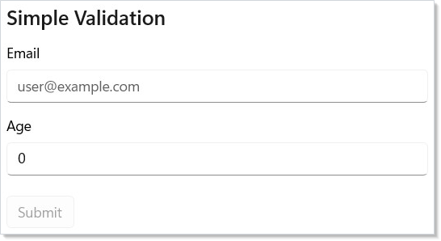

This works well for small forms. For larger forms with cross-field rules,
touched/dirty tracking, and error display policies, use the validation
framework described next.

## Keeping Submit Reachable

A common form pattern — *disable the Submit button until the form is valid* —
is a keyboard accessibility trap when combined with controls like `NumberBox`,
`DatePicker`, and `CalendarDatePicker`, which commit their value on blur
rather than per keystroke. The user fixes the last invalid field, presses
Tab to reach Submit, and focus skips the still-disabled button. By the time
the field commits and Submit becomes enabled, focus has already moved on.
The user is stranded with no keyboard route to a button they can now press.

Reactor offers two opt-in fixes for this. They compose:

```csharp
class KeepSubmitReachableDemo : Component
{
    public override Element Render()
    {
        var (email, setEmail) = UseState("");
        var (age, setAge) = UseState(0.0);

        var emailValid = email.Contains('@') && email.Contains('.');
        var ageValid = age >= 18 && age <= 120;
        var formValid = emailValid && ageValid;

        return VStack(12,
            SubHeading("Keeping Submit Reachable"),
            TextField(email, setEmail, header: "Email",
                placeholder: "user@example.com"),

            // .Immediate() switches NumberBox from commit-on-blur to
            // commit-on-keystroke, so validation reacts as the user types.
            NumberBox(age, setAge, header: "Age").Immediate(),

            // .IsDisabledFocusable() keeps the button tab-reachable and
            // visually dimmed while preventing invocation. Pattern mirrors
            // Fluent UI's `disabledFocusable` and ARIA `aria-disabled`.
            Button("Submit", () => { /* submit */ })
                .IsDisabledFocusable(!formValid)
                .Margin(0, 8, 0, 0)
        ).Padding(24);
    }
}
```

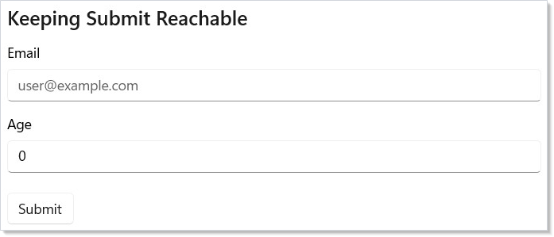

**`.IsDisabledFocusable(bool)` on Button** keeps the button keyboard-focusable
and tab-reachable while presenting it as disabled (dimmed; the click is
suppressed). Mirrors Fluent UI React's `disabledFocusable` and ARIA's
`aria-disabled`. Use it for any Submit gated on validation, busy state, or
other derived conditions.

**`.Immediate()` on NumberBox** (in `Microsoft.UI.Reactor.Controls.Validation`)
switches the control from commit-on-blur to commit-on-keystroke, so
validation reacts to every parseable digit instead of waiting for focus to
leave the field. Opt-in by design — commit-on-blur is the WinUI default and
the right choice when an intermediate value would be expensive or surprising
(snapping `2.50` to `2.5` mid-edit). Apply when validation gates UI state
and you want it to feel live.

Use `.IsDisabledFocusable()` whenever a button is conditionally disabled in a
form — even if you've also applied `.Immediate()` to every commit-on-blur
input. The two cover different failure modes: `.Immediate()` keeps validity
in sync with typing; `.IsDisabledFocusable()` keeps the button discoverable
when validity is gated on async checks, required-but-untouched fields,
cross-field rules, or any derived condition that can't be made instantaneous.

> **Where not to use `.IsDisabledFocusable()`:** only buttons. For data-entry
> controls (`TextField`, `NumberBox`, `CheckBox`, etc.), `IsEnabled=false`
> usually means "this field isn't part of your current task" (cascading
> from another input), and tab-skipping is the correct UX. Use
> `IsReadOnly` if you need a visible-but-non-editable text control.

## Validation Context

`UseValidationContext()` creates a `ValidationContext` that tracks messages,
touched/dirty state, and field registration. Attach validators to controls
with `.Validate()`:

```csharp
class ValidationContextDemo : Component
{
    public override Element Render()
    {
        var ctx = this.UseValidationContext();
        var (email, setEmail) = UseState("");
        var (password, setPassword) = UseState("");
        var (submitted, setSubmitted) = UseState(false);

        return VStack(12,
            SubHeading("Validation Context"),
            TextField(email, v => { setEmail(v); ctx.NotifyValueChanged("email", v); },
                placeholder: "user@example.com", header: "Email")
                .Validate("email", email,
                    Validate.Required(),
                    Validate.Email()),
            When(ctx.IsTouched("email") && ctx.HasError("email"), () =>
                TextBlock(ctx.GetMessages("email").First().Text)
                    .Foreground(Theme.SystemCritical).FontSize(12)),
            PasswordBox(password, v => { setPassword(v); ctx.NotifyValueChanged("password", v); },
                placeholderText: "Min 8 characters")
                .Validate("password", password,
                    Validate.Required(),
                    Validate.MinLength(8)),
            When(ctx.IsTouched("password") && ctx.HasError("password"), () =>
                TextBlock(ctx.GetMessages("password").First().Text)
                    .Foreground(Theme.SystemCritical).FontSize(12)),
            Button("Register", () =>
            {
                ctx.MarkAllTouched();
                if (ctx.IsValid()) setSubmitted(true);
            }).IsEnabled(!submitted),
            When(submitted, () =>
                TextBlock("Registration successful!")
                    .Foreground(Theme.SystemSuccess).SemiBold())
        ).Padding(24);
    }
}
```

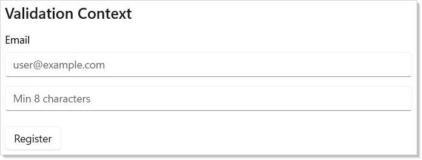

Key pieces:

- **`UseValidationContext()`** creates or retrieves the nearest validation context.
- **`.Validate(fieldName, value, validators...)`** attaches validators to a control.
- **`Validate.Required()`, `Validate.Email()`, etc.** are the 11 built-in validators.
- **`ctx.IsValid()`** returns `true` when no error-severity messages exist.
- **`ctx.MarkAllTouched()`** reveals all errors on submit attempt.

## FormField Helper

`FormField()` wraps a control with a label, required indicator, description
text, and inline error display:

```csharp
class FormFieldDemo : Component
{
    public override Element Render()
    {
        var ctx = this.UseValidationContext();
        var (name, setName) = UseState("");
        var (email, setEmail) = UseState("");

        return VStack(12,
            SubHeading("FormField Helper"),
            FormField(
                TextField(name, v => { setName(v); ctx.NotifyValueChanged("name", v); })
                    .Validate("name", name, Validate.Required()),
                label: "Full Name",
                required: true,
                description: "As it appears on your ID"),
            FormField(
                TextField(email, v => { setEmail(v); ctx.NotifyValueChanged("email", v); })
                    .Validate("email", email,
                        Validate.Required(), Validate.Email()),
                label: "Email Address",
                required: true)
        ).Padding(24);
    }
}
```

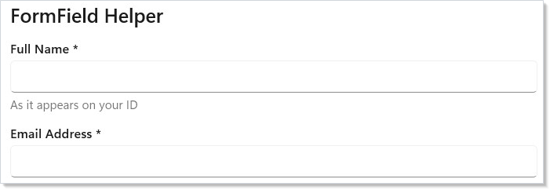

`FormField` auto-detects the field name from the `.Validate()` attachment on
its content. Errors appear below the field after the field is touched (focus
then blur). The `ShowWhen` parameter controls when errors become visible:
`WhenTouched` (default), `WhenDirty`, `AfterFirstSubmit`, `Always`, or `Never`.

## Built-in Validators

| Validator | Purpose |
|----------|---------|
| `Validate.Required()` | Non-null, non-empty, non-default |
| `Validate.MinLength(n)` | String length >= n |
| `Validate.MaxLength(n)` | String length <= n |
| `Validate.Range(min, max)` | Numeric value in range |
| `Validate.Match(regex)` | Regex pattern match |
| `Validate.Email()` | Valid email address |
| `Validate.Url()` | Valid URL (http/https) |
| `Validate.Must<T>(predicate, message)` | Custom predicate |
| `Validate.MustAsync<T>(predicate, message)` | Async predicate |
| `Validate.MustBeTrue()` | Boolean is true (checkboxes) |
| `Validate.EqualTo<T>(value)` | Equality check (password confirm) |

Every validator accepts an optional custom error message as its last parameter.

## Masked Input

`MaskEngine` applies input masks with auto-inserted literals. Use the built-in
presets or define your own pattern:

```csharp
class MaskedInputDemo : Component
{
    public override Element Render()
    {
        var phoneMask = UseMemo(() => new MaskEngine(MaskPreset.PhoneUS));
        var dateMask = UseMemo(() => new MaskEngine(MaskPreset.Date));
        var (phone, setPhone) = UseState("");
        var (date, setDate) = UseState("");

        return VStack(12,
            SubHeading("Masked Input"),
            TextField(phoneMask.Apply(phone), v => setPhone(phoneMask.GetRawValue(v)),
                placeholder: "(___) ___-____", header: "Phone"),
            TextBlock($"Raw: {phone}").FontSize(12).Opacity(0.6),
            TextField(dateMask.Apply(date), v => setDate(dateMask.GetRawValue(v)),
                placeholder: "__/__/____", header: "Date"),
            TextBlock($"Raw: {date}").FontSize(12).Opacity(0.6)
        ).Padding(24);
    }
}
```

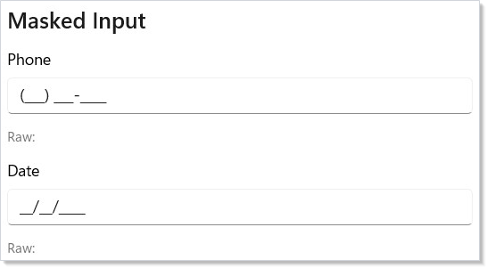

Mask tokens: `0` = required digit, `9` = optional digit, `A` = required
letter, `a` = optional letter, `*` = required alphanumeric. All other
characters are literals inserted automatically.

| Preset | Pattern |
|--------|---------|
| `MaskPreset.PhoneUS` | `(000) 000-0000` |
| `MaskPreset.SSN` | `000-00-0000` |
| `MaskPreset.CreditCard` | `0000 0000 0000 0000` |
| `MaskPreset.Date` | `00/00/0000` |
| `MaskPreset.ZipCode` | `00000` |
| `MaskPreset.IPv4` | `099.099.099.099` |

## Input Formatters

`InputFormatter` transforms text as the user types. Chain formatters into a
pipeline for complex formatting:

```csharp
class InputFormattersDemo : Component
{
    public override Element Render()
    {
        var (currency, setCurrency) = UseState("");
        var (upper, setUpper) = UseState("");

        var currencyFmt = UseMemo(() => InputFormatter.Currency());
        var upperFmt = UseMemo(() => InputFormatter.UpperCase);

        return VStack(12,
            SubHeading("Input Formatters"),
            TextField(currencyFmt.Format(currency, 0).Output,
                v => setCurrency(currencyFmt.Parse(v)),
                placeholder: "$0.00", header: "Amount"),
            TextField(upperFmt.Format(upper, 0).Output,
                v => setUpper(upperFmt.Parse(v)),
                placeholder: "UPPERCASE", header: "Code")
        ).Padding(24);
    }
}
```

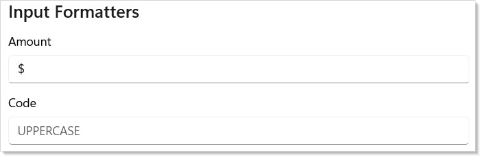

Built-in formatters: `PhoneUS`, `Currency()`, `UpperCase`, `LowerCase`,
`TitleCase`, `TrimWhitespace`, `MaxLength(n)`, `AllowOnly(regex)`,
`DenyOnly(regex)`, and `Custom(format, parse)`.

## AutoSuggestBox

`AutoSuggestBox` is the search-with-suggestions input — type a prefix,
see a filtered list, pick one or submit free-form. The factory takes
the text value, an `onTextChanged` handler, and an optional
`onQuerySubmitted` handler that fires on Enter or suggestion pick:

```csharp
class AutoSuggestDemo : Component
{
    static readonly string[] Catalog =
    [
        "Aardvark", "Albatross", "Antelope", "Badger",
        "Beaver", "Buffalo", "Camel", "Capybara"
    ];

    public override Element Render()
    {
        var (text, setText) = UseState("");

        var matches = string.IsNullOrEmpty(text)
            ? Array.Empty<string>()
            : Catalog.Where(c =>
                c.StartsWith(text, StringComparison.OrdinalIgnoreCase))
                .ToArray();

        return VStack(8,
            SubHeading("AutoSuggestBox"),
            AutoSuggestBox(text, setText,
                onQuerySubmitted: q => setText(q))
                .Header("Animal")
                .QueryIcon(SymbolIcon("Find"))
                .Width(280),
            // Suggestion list — bind to AutoSuggestBox.ItemsSource via .Set
            // when you need the in-control dropdown; the inline list below
            // is a custom presentation that gives full styling control.
            When(matches.Length > 0, () =>
                VStack(2,
                    ForEach(matches, m =>
                        TextBlock(m).Padding(8, 4))
                ).Background("#F5F5F5").Width(280))
        ).Padding(24);
    }
}
```

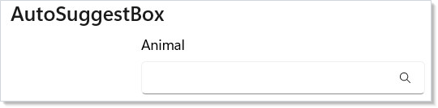

| Fluent | Effect |
|---|---|
| `.Header(string)` | Label rendered above the box. |
| `.QueryIcon(IconData)` | Trailing icon (a search glyph is typical). |
| `.IsSuggestionListOpen(bool)` | Force the dropdown open/closed. |
| `.SuggestionChosen(Action<string>)` | Fires when the user picks an item from the underlying dropdown. |
| `.Set(b => b.ItemsSource = ...)` | Bind to the WinUI suggestion list. |

The snippet above renders an inline suggestion list as a custom
presentation — more layout freedom than the built-in dropdown, at the
cost of writing the visual surface yourself. For the canonical
search-results recipe see [recipes/search-with-suggestions](recipes/search-with-suggestions.md).

WinUI design page: [Auto-suggest box](https://learn.microsoft.com/en-us/windows/apps/design/controls/auto-suggest-box).

## Date and time controls

Reactor exposes three date/time inputs and a calendar surface, each
covering a different shape of the same problem:

| Control | Value | Shape | Use when |
|---|---|---|---|
| `DatePicker` | `DateTimeOffset` (non-null) | Inline three-spinner picker | The date is always required and inline real estate is available. |
| `CalendarDatePicker` | `DateTimeOffset?` | Button that opens a popup calendar | Date is optional; you want a compact trigger. |
| `CalendarView` | `IReadOnlyList<DateTimeOffset>` | Full month grid | Single, multiple, or range selection from a grid. |
| `TimePicker` | `TimeSpan` | Hours / minutes / am-pm spinner | Time-of-day independent of a date. |

```csharp
class DatePickerDemo : Component
{
    public override Element Render()
    {
        var (date, setDate) = UseState(DateTimeOffset.Now);
        var (optionalDate, setOptionalDate) = UseState<DateTimeOffset?>(null);

        return VStack(8,
            SubHeading("DatePicker — always-set value"),
            DatePicker(date, setDate)
                .DayFormat("{day.integer(2)}")
                .MonthFormat("{month.abbreviated}")
                .YearFormat("{year.full}"),
            TextBlock($"Selected: {date:yyyy-MM-dd}").Opacity(0.6),
            SubHeading("CalendarDatePicker — nullable, popup calendar"),
            CalendarDatePicker(optionalDate, setOptionalDate)
                .DateFormat("{month.abbreviated} {day.integer(2)}, {year.full}")
                .IsTodayHighlighted(),
            TextBlock(optionalDate is null
                ? "No date selected."
                : $"Selected: {optionalDate:yyyy-MM-dd}").Opacity(0.6)
        ).Padding(24);
    }
}
```

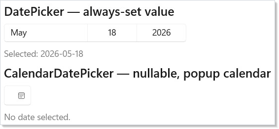

```csharp
class TimePickerDemo : Component
{
    public override Element Render()
    {
        var (time, setTime) = UseState(TimeSpan.FromHours(9));

        return VStack(8,
            SubHeading("TimePicker"),
            TimePicker(time, setTime),
            TextBlock($"Selected: {time:hh\\:mm}").Opacity(0.6)
        ).Padding(24);
    }
}
```

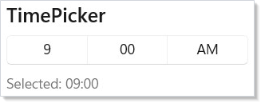

```csharp
class CalendarViewDemo : Component
{
    public override Element Render()
    {
        var (dates, setDates) = UseState<IReadOnlyList<DateTimeOffset>>(
            Array.Empty<DateTimeOffset>());

        return VStack(8,
            SubHeading("CalendarView — month grid"),
            CalendarView()
                .MinDate(DateTimeOffset.Now.AddYears(-1))
                .MaxDate(DateTimeOffset.Now.AddYears(1))
                .NumberOfWeeksInView(6)
                .SelectedDatesChanged(setDates)
                .SelectedDates(dates),
            TextBlock($"{dates.Count} day(s) selected").Opacity(0.6)
        ).Padding(24);
    }
}
```

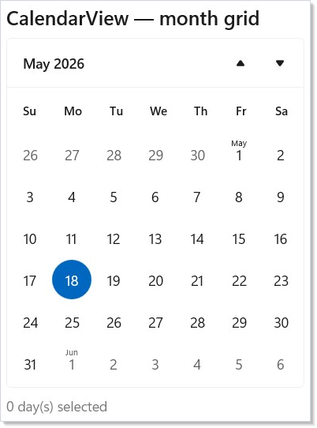

DatePicker / TimePicker / CalendarDatePicker share their format strings
with the underlying WinUI `DateTimeFormatter` — `"{day.integer(2)}"`,
`"{month.abbreviated}"`, `"{year.full}"`, and friends. `CalendarView`
exposes `.MinDate` / `.MaxDate` for range constraint and
`.NumberOfWeeksInView` to compress the grid. For multi-day selection,
pair `.SelectedDates(...)` with `.SelectedDatesChanged(...)` — the
event hands you the full snapshot of the current selection, not
add/remove deltas (same shape as
[`ListView` multi-select](collections.md)).

WinUI design pages: [Date picker](https://learn.microsoft.com/en-us/windows/apps/design/controls/date-picker),
[Time picker](https://learn.microsoft.com/en-us/windows/apps/design/controls/time-picker),
[Calendar view](https://learn.microsoft.com/en-us/windows/apps/design/controls/calendar-view).

## ColorPicker

`ColorPicker` takes a `Windows.UI.Color` and a change handler — same
controlled pattern as `Slider`. Its surface is the largest of any input
on this page; configure it for the shape of the chooser you need:

```csharp
class ColorPickerDemo : Component
{
    public override Element Render()
    {
        var (color, setColor) = UseState(
            global::Windows.UI.Color.FromArgb(255, 0, 120, 215));

        return VStack(8,
            SubHeading("ColorPicker"),
            ColorPicker(color, setColor)
                .AlphaEnabled()
                .HexInputVisible(true)
                .ColorSpectrumShape(
                    Microsoft.UI.Xaml.Controls.ColorSpectrumShape.Ring),
            // Preview swatch driven by the picker.
            Border(Empty())
                .Background(
                    new Microsoft.UI.Xaml.Media.SolidColorBrush(color))
                .Width(80).Height(40)
                .WithBorder("#888888")
        ).Padding(24);
    }
}
```

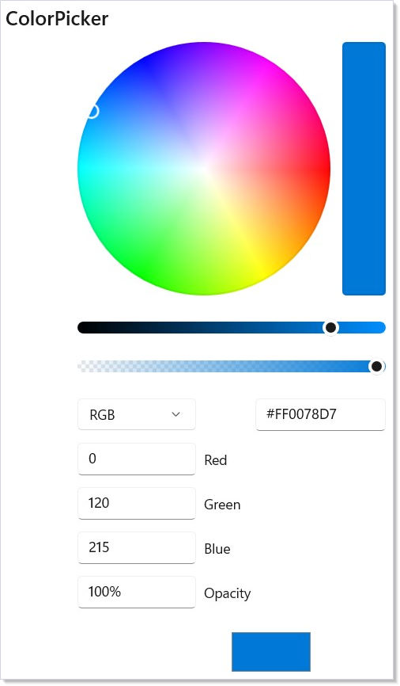

| Fluent | Effect |
|---|---|
| `.AlphaEnabled(bool)` | Show the alpha slider and pre-multiply by the alpha value. |
| `.ColorSpectrumShape(shape)` | `Box` (default) or `Ring`. |
| `.HexInputVisible(bool)` | Toggle the hex-input field. |
| `.ColorSpectrumVisible(bool)` | Toggle the main 2D spectrum. |
| `.ColorSliderVisible(bool)` | Toggle the hue slider. |
| `.ColorChannelTextInputVisible(bool)` | Toggle RGB number inputs. |
| `.HueRange(min, max)` / `.SaturationRange(min, max)` / `.ValueRange(min, max)` | Constrain pickable hue / sat / value. |
| `.MoreButtonVisible(bool)` | "More" chevron that expands the picker. |

For palette pickers (Material-style swatch grids), build the surface
out of `Button`s and `Background(color)` rather than this control —
`ColorPicker` is the right shape only when the user needs continuous
selection from the full color space.

WinUI design page: [Color picker](https://learn.microsoft.com/en-us/windows/apps/design/controls/color-picker).

> **Caveat:** Commit-on-blur inputs (`NumberBox`, `DatePicker`, `CalendarDatePicker`,
> `TimePicker`) do **not** fire their change handlers per keystroke —
> they fire when focus leaves the field. Validation derived from these
> controls' values is therefore stale until the user tabs out. The
> classic failure mode: a Submit button disabled until the form is valid
> stays disabled while the user is still inside a `NumberBox` that
> already contains a valid value. The user fixes the last field, presses
> Tab to reach Submit, focus skips the still-disabled button, and the
> user is stranded. Two fixes compose: `.Immediate()` on the input
> switches it to per-keystroke commit (see
> [Keeping Submit Reachable](#keeping-submit-reachable)), and
> `.IsDisabledFocusable()` on the Submit button keeps it keyboard-focusable
> while it's gated.

## Patterns

### Multi-step form with shared ValidationContext

A wizard-style form spans multiple pages but the validation lives in
one place. Hoist `UseValidationContext()` to the wizard component and
pass it down via [context](context.md) — every step's
`.Validate(...)` writes to the same store, and the final Submit checks
`ctx.IsValid()` across all steps. The
[`recipes/multi-step-form`](recipes/multi-step-form.md) recipe walks
the full pattern; the key shape is one context per **form**, not one
per page.

### Submit on Enter

For a single-field form (search box, comment input), wire submission
to Enter rather than a Submit button. `AutoSuggestBox` does this
automatically via `onQuerySubmitted`. For `TextField`, route through
`.KeyDown` or wrap the field in an `[ai:lock]` form panel; see
[input-and-gestures](input-and-gestures.md) for the routed-events
surface.

### Validating async (uniqueness checks)

`Validate.MustAsync<T>(...)` runs a predicate that returns
`Task<bool>`. The `ValidationContext` tracks the in-flight async work
and reports `IsValidating` per field, so the Submit button can disable
while async validation runs. Pair with `DisabledFocusable()` so the
button stays in tab order while validating — same accessibility
concern as [Keeping Submit Reachable](#keeping-submit-reachable).

## Common Mistakes

### Letting the control hold its own state

```csharp
// Don't:
TextField(initial: "default value")
```

```csharp
class ControlledInputDemo : Component
{
    public override Element Render()
    {
        var (name, setName) = UseState("");

        return VStack(12,
            SubHeading("Controlled Input"),
            TextField(name, setName, placeholder: "Type your name"),
            TextBlock($"You typed: {name}").Opacity(0.6)
        ).Padding(24);
    }
}
```

Uncontrolled inputs work in trivial demos but break the moment the
parent component needs to read, reset, or pre-fill the value. Reactor
inputs all take `(value, onChanged)` — the control is always a passive
view of state.

### Validating in the click handler

```csharp
// Don't:
Button("Submit", () =>
{
    if (string.IsNullOrEmpty(email)) { setError("…"); return; }
    if (!email.Contains('@'))         { setError("…"); return; }
    if (age < 18)                      { setError("…"); return; }
    // submit…
})
```

Imperative checks duplicate every field's validation in the submit
handler, drift from the inline error display, and fall out of date
when fields are added. Use [`UseValidationContext`](hooks.md)
+ `.Validate(...)` so each field carries its rules with it; the
submit handler becomes one `ctx.IsValid()` call.

## Tips

**Always use controlled inputs.** Never let a control manage its own state.
Your `Render()` method is the single source of truth — if you need to
pre-fill, validate, or reset a field, you just set the state value.

**Use `FormField` for production forms.** It handles labels, required
indicators, and error display with consistent styling. Avoid building your
own field wrapper.

**Use `Validate.Must<T>()` for custom rules.** When built-in validators
don't cover your case, `Must` takes any `Func<T, bool>` predicate.

**Call `ctx.MarkAllTouched()` on submit.** This reveals all validation errors
at once, so the user sees everything that needs fixing.

**Reset forms with `ctx.ResetAll()`.** It returns all fields to their initial
values, clears touched/dirty state, and removes all messages.

## Next Steps

- **[Flex Layout](flex-layout.md)** — Previous: flexible box layout for adaptive UIs
- **[Collections](collections.md)** — Next: render lists, grids, and virtualized data sets
- **[Hooks](hooks.md)** — UseState, UseMemo, and other hooks that power form logic
- **[Commanding](commanding.md)** — wire submit buttons to async commands with busy/error handling
- **[Styling and Theming](styling.md)** — theme your forms with tokens and lightweight styling
