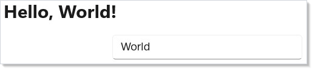
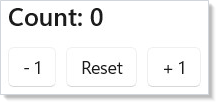
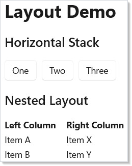
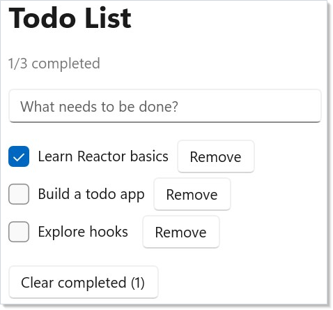
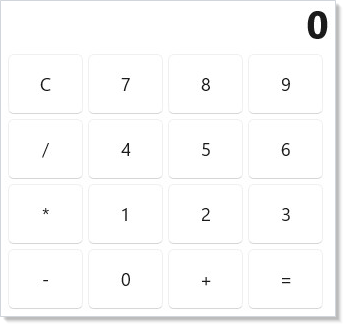

# Getting Started with Reactor

<!-- ai:lock -->
> **Prerequisites:** .NET 10+ and the Windows App SDK.
<!-- /ai:lock -->

Reactor is a declarative UI framework for building native Windows apps in pure C#.
No XAML, no data binding, no view models. You describe your UI as a function of
state and Reactor keeps the screen in sync.

## Creating a Project

Create a new console project and convert it to a WinUI desktop app:

```
dotnet new console -n MyApp
cd MyApp
```

Edit your `.csproj` to target WinUI:

<!-- ai:lock -->
```xml
<Project Sdk="Microsoft.NET.Sdk">
  <PropertyGroup>
    <OutputType>WinExe</OutputType>
    <TargetFramework>net10.0-windows10.0.22621.0</TargetFramework>
    <UseWinUI>true</UseWinUI>
    <WindowsPackageType>None</WindowsPackageType>
  </PropertyGroup>
  <ItemGroup>
    <PackageReference Include="Microsoft.WindowsAppSDK" Version="2.0.*" />
    <ProjectReference Include="..\Reactor\Reactor.csproj" />
  </ItemGroup>
</Project>
```
<!-- /ai:lock -->

## Your First App

Replace the contents of `App.cs` with this:

```csharp
class GettingStartedApp : Component
{
    public override Element Render()
    {
        var (name, setName) = UseState("World");

        return VStack(16,
            TextBlock($"Hello, {name}!").FontSize(24).Bold(),
            TextField(name, setName, placeholder: "Enter your name").Width(250)
        ).Padding(24);
    }
}
```

Run it with `dotnet run` and you'll see this:



Here's what's happening:

- **`ReactorApp.Run<T>`** launches a window and mounts your root component.
- **[`UseState`](hooks.md)** returns the current value and a setter. When you call the
  setter, Reactor re-renders the component with the new value.
- **[`VStack`](layout.md)** stacks children vertically. The number `16` is the pixel spacing.
- **`Text(...).FontSize(24).Bold()`** is the fluent modifier pattern — every
  element supports chainable modifiers for styling and layout.

Type in the text box and the greeting updates instantly. There's no event
wiring or property notification — just state in, UI out.

## Understanding State

Every interactive UI needs state. In Reactor, `UseState` is the primary hook for
managing values that change over time.

### Counter Example

Here's a counter that tracks a single number:

```csharp
class CounterExample : Component
{
    public override Element Render()
    {
        var (count, setCount) = UseState(0);

        return VStack(12,
            TextBlock($"Count: {count}").FontSize(20).SemiBold(),
            HStack(8,
                Button("- 1", () => setCount(count - 1)),
                Button("Reset", () => setCount(0)),
                Button("+ 1", () => setCount(count + 1))
            )
        ).Padding(24);
    }
}
```



Each call to `setCount` triggers a re-render. Reactor diffs the old and new
element trees and updates only the WinUI controls that actually changed.

### Multiple State Values

Components can call `UseState` multiple times — each call tracks an independent
value:

```csharp
class MultipleStateExample : Component
{
    public override Element Render()
    {
        var (firstName, setFirstName) = UseState("");
        var (lastName, setLastName) = UseState("");
        var (fontSize, setFontSize) = UseState(16.0);

        var fullName = string.IsNullOrWhiteSpace(firstName) && string.IsNullOrWhiteSpace(lastName)
            ? "Anonymous"
            : $"{firstName} {lastName}".Trim();

        return VStack(12,
            TextBlock($"Hello, {fullName}!").FontSize(fontSize).Bold(),
            TextField(firstName, setFirstName, placeholder: "First name").Width(200),
            TextField(lastName, setLastName, placeholder: "Last name").Width(200),
            HStack(8,
                TextBlock("Font size:"),
                Slider(fontSize, 10, 40, setFontSize).Width(200),
                TextBlock($"{fontSize:F0}px")
            )
        ).Padding(24);
    }
}
```

The `fullName` variable is derived from `firstName` and `lastName` on every
render. In Reactor, you don't need computed properties or bindings — plain C#
expressions work because `Render()` runs every time state changes.

## Layout Basics

Reactor provides a small set of layout primitives that compose together:

```csharp
class LayoutBasicsExample : Component
{
    public override Element Render()
    {
        return VStack(16,
            Heading("Layout Demo"),

            SubHeading("Horizontal Stack"),
            HStack(8,
                Button("One"),
                Button("Two"),
                Button("Three")
            ),

            SubHeading("Nested Layout"),
            HStack(16,
                VStack(4,
                    TextBlock("Left Column").Bold(),
                    TextBlock("Item A"),
                    TextBlock("Item B")
                ),
                VStack(4,
                    TextBlock("Right Column").Bold(),
                    TextBlock("Item X"),
                    TextBlock("Item Y")
                )
            )
        ).Padding(24);
    }
}
```



| Element | Purpose |
|---------|---------|
| `VStack` | Vertical stack (children top to bottom) |
| `HStack` | Horizontal stack (children left to right) |
| `Grid` | Row/column grid with proportional sizing |
| `ScrollView` | Scrollable wrapper for overflow content |
| `Border` | Container with background, corner radius, stroke |

All layout elements accept an optional spacing parameter as their first
argument: `VStack(12, child1, child2)` adds 12px between children.

## Building a Todo App

Let's put these pieces together into something real. A todo app needs a list
of items, a way to add new ones, and checkboxes to mark them done.

First, define a simple record for items:

```csharp
record TodoItem(string Text, bool Done);
```

Now the full component:

```csharp
class TodoApp : Component
{
    public override Element Render()
    {
        var (items, updateItems) = UseReducer(new List<TodoItem>
        {
            new("Learn Reactor basics", true),
            new("Build a todo app", false),
            new("Explore hooks", false),
        });
        var (newText, setNewText) = UseState("");

        var doneCount = items.Count(i => i.Done);

        return VStack(16,
            Heading("Todo List"),
            TextBlock($"{doneCount}/{items.Count} completed").Opacity(0.6),

            // Input row
            HStack(8,
                TextField(newText, setNewText, placeholder: "What needs to be done?")
                    .Width(300),
                Button("Add", () =>
                {
                    if (!string.IsNullOrWhiteSpace(newText))
                    {
                        updateItems(list => [.. list, new TodoItem(newText.Trim(), false)]);
                        setNewText("");
                    }
                }).Disabled(string.IsNullOrWhiteSpace(newText))
            ),

            // Item list
            VStack(4,
                items.Select((item, index) =>
                    HStack(8,
                        CheckBox(item.Done, done =>
                            updateItems(list =>
                            {
                                var copy = new List<TodoItem>(list);
                                copy[index] = item with { Done = done };
                                return copy;
                            }),
                            label: item.Text
                        ),
                        Button("Remove", () =>
                            updateItems(list =>
                            {
                                var copy = new List<TodoItem>(list);
                                copy.RemoveAt(index);
                                return copy;
                            })
                        )
                    ).WithKey($"todo-{index}")
                ).ToArray()
            ),

            // Clear completed button
            When(doneCount > 0, () =>
                Button($"Clear completed ({doneCount})", () =>
                    updateItems(list => list.Where(i => !i.Done).ToList())
                )
            )
        ).Padding(24);
    }
}
```



Key patterns to notice:

- **[`UseReducer`](hooks.md)** is like `UseState` but the setter receives a function
  `Func<T, T>` — you transform the previous value into the next value. This
  is the right tool when your new state depends on the old state (like
  appending to a list).
- **`items.Select(...).ToArray()`** maps data into elements. Reactor reconciles
  the list efficiently using keys.
- **`WithKey`** gives each item a stable identity so Reactor can reorder, add,
  and remove items without rebuilding the entire list.
- **`When(condition, () => element)`** conditionally renders content without
  an if/else cluttering the tree.

## Building a Calculator

Here's a more complex example that manages multiple pieces of related state:

```csharp
class CalculatorApp : Component
{
    public override Element Render()
    {
        var (display, setDisplay) = UseState("0");
        var (operand, setOperand) = UseState<double?>(null);
        var (op, setOp) = UseState<string?>(null);
        var (resetNext, setResetNext) = UseState(false);

        void PressDigit(string digit)
        {
            if (resetNext || display == "0")
            {
                setDisplay(digit);
                setResetNext(false);
            }
            else
            {
                setDisplay(display + digit);
            }
        }

        void PressOp(string nextOp)
        {
            var current = double.Parse(display);
            if (operand.HasValue && op != null)
            {
                var result = Calculate(operand.Value, current, op);
                setDisplay(FormatResult(result));
                setOperand(result);
            }
            else
            {
                setOperand(current);
            }
            setOp(nextOp);
            setResetNext(true);
        }

        void PressEquals()
        {
            if (operand.HasValue && op != null)
            {
                var current = double.Parse(display);
                var result = Calculate(operand.Value, current, op);
                setDisplay(FormatResult(result));
                setOperand(null);
                setOp(null);
                setResetNext(true);
            }
        }

        void PressClear()
        {
            setDisplay("0");
            setOperand(null);
            setOp(null);
            setResetNext(false);
        }

        Element NumButton(string digit) =>
            Button(digit, () => PressDigit(digit))
                .Width(60).Height(48);

        Element OpButton(string label, string opCode) =>
            Button(label, () => PressOp(opCode))
                .Width(60).Height(48);

        return VStack(4,
            // Display
            TextBlock(display)
                .FontSize(32).Bold()
                .HAlign(HorizontalAlignment.Right)
                .Padding(horizontal: 12, vertical: 8),

            // Button grid
            HStack(4, Button("C", PressClear).Width(60).Height(48),
                       NumButton("7"), NumButton("8"), NumButton("9")),
            HStack(4, OpButton("/", "/"),
                       NumButton("4"), NumButton("5"), NumButton("6")),
            HStack(4, OpButton("*", "*"),
                       NumButton("1"), NumButton("2"), NumButton("3")),
            HStack(4, OpButton("-", "-"),
                       NumButton("0"), OpButton("+", "+"),
                       Button("=", PressEquals).Width(60).Height(48))
        ).Padding(16);
    }

    static double Calculate(double a, double b, string op) => op switch
    {
        "+" => a + b,
        "-" => a - b,
        "*" => a * b,
        "/" => b != 0 ? a / b : 0,
        _ => b,
    };

    static string FormatResult(double value) =>
        value == Math.Floor(value) ? $"{value:F0}" : $"{value:G10}";
}
```



This demonstrates how plain C# control flow (methods, switch expressions,
local functions) works naturally inside Reactor components. There's no special
command pattern needed — just call `setDisplay(...)` and the UI updates.

## Tips for New Reactor Developers

**Think in functions, not objects.** Your `Render()` method is a pure function
from state to UI. Every time state changes, it runs again from the top. Don't
try to mutate the UI imperatively.

**Keep state as high as it needs to be, but no higher.** If only one component
uses a value, `UseState` in that component. If siblings need to share state,
lift it to their parent.

**Use records for data.** C# records give you immutable data with value
equality for free. Reactor uses this for efficient memoization — if your props
haven't changed structurally, the component skips re-rendering.

**Prefer composition over inheritance.** Build small components that each do
one thing, then compose them in parent components. You'll rarely need more than
`Component` or `Component<TProps>` as a base class.

**Fluent modifiers are your friend.** Instead of wrapping elements in layout
containers for simple styling, chain modifiers: `Text("hi").Margin(8).Bold()`
reads cleanly and avoids unnecessary nesting.

## Next Steps

- **[Dev Tooling](dev-tooling.md)** — Set up hot reload and preview mode for a faster development loop
- **[Components](components.md)** — Break your app into reusable pieces with `Component<TProps>` and typed record props
- **[Hooks](hooks.md)** — Deep dive into UseState, UseReducer, UseEffect, UseMemo, and more
- **[Layout](layout.md)** — Master VStack, HStack, Grid, and responsive patterns
- **[Effects and Lifecycle](effects.md)** — Use `UseEffect` for side effects like timers, file I/O, and API calls
