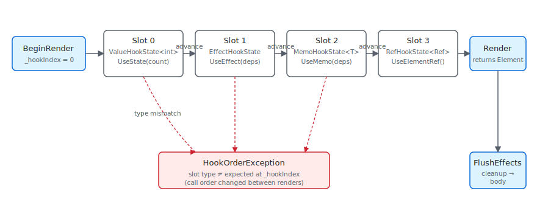

A hook in Reactor is a position. When `Render()` runs, the framework
counts each hook call in order — `UseState` is slot 0, then `UseEffect`
is slot 1, then `UseMemo` is slot 2 — and stores whatever each hook
needs in a `List<HookState>` on the owning `RenderContext`. The next
render starts from `_hookIndex = 0` again and walks the same list in
the same order. The slot at position 0 had better still be the one
`UseState` expects to find there, because the setter closure
`UseState` returned on the first render captured the literal index
`0` and writes back to that slot when you call it. This is the entire
mechanical foundation of every hook rule you've ever read: "same hooks
in the same order every render" is the runtime invariant the slot
table enforces. Get it wrong — a conditional `UseState` inside an
`if`, a hook inside a loop whose iteration count changed — and the
type check on the slot throws `HookOrderException` because the slot
that used to hold `ValueHookState<int>` now sees a `EffectHookState`
asking for its bucket.

# Hooks Internals

This page absorbs the legacy `docs/reference/state-and-hooks.md` and
sits underneath the surface-level [Hooks](hooks.md) reference. The
goal is one description of the storage shape behind every hook —
enough to debug a `HookOrderException`, predict whether `UseState`
returns a stable setter, and know when reaching for `UseRef` is
correct.

## The slot table



| Slot type | Holds | Created by |
|---|---|---|
| `ValueHookState<T>` | Value, optional lock | `UseState`, `UseReducer` |
| `EffectHookState` | Deps, body, cleanup, pending flag | `UseEffect` |
| `MemoHookState<T>` | Deps, cached value | `UseMemo`, `UseCallback`, `UseElementRef` |
| `RefHookState<T>` | Mutable cell | `UseRef` |
| `ResourceHookState<T>` | Cache key, state, cleanup | `UseResource`, `UseInfiniteResource` |
| `ContextHookState` | Subscribed context keys | `UseContext` |

Each subsection below covers one row of that table and the contract
its hook surface depends on.

## RenderContext owns the table

```csharp
public (T Value, Action<T> Set) UseState<T>(T initialValue, bool threadSafe = false)
{
    if (_hookIndex >= _hooks.Count)
    {
        _hooks.Add(new ValueHookState<T>(initialValue, threadSafe));
    }

    var currentIndex = _hookIndex;
    _hookIndex++;

    if (_hooks[currentIndex] is not ValueHookState<T> hook)
        throw new HookOrderException(
            $"Hook at index {currentIndex} is {_hooks[currentIndex].GetType().Name}, expected ValueHookState<{typeof(T).Name}> (UseState). " +
            "Hooks must be called in the same order every render.");
```

`RenderContext` holds the `List<HookState> _hooks` and an `int
_hookIndex`. `BeginRender(requestRerender)` sets `_hookIndex = 0` and
captures the UI thread ID; the component's `Render()` runs, hooks
advance `_hookIndex` as they go, and after `Render()` returns the
reconciler reads `_hooks` to know which effects to flush. There is
one `RenderContext` per `Component` instance (and one per `Func(ctx
=> …)` function-component invocation — function components get their
own context per parent's render, with state preserved across that
parent's re-renders via positional matching just like any other
element).

The slot-type check at the top of each hook is the runtime guard:

```csharp
if (_hooks[currentIndex] is not ValueHookState<T> hook)
    throw new HookOrderException(...);
```

That check is the reason hook rules exist. A conditional hook
(`if (cond) UseState(...)`) advances the slot table on some renders
but not others, so a later hook in the same `Render()` reads a slot
holding a different state type, and the cast fails. The
[REACTOR_HOOKS_001..007](rules-of-reactor.md) analyzer family flags
the most common shapes at build time so the runtime check stays an
assertion of last resort.

## UseState — the canonical slot

```csharp
public (T Value, Action<T> Set) UseState<T>(T initialValue, bool threadSafe = false)
{
    if (_hookIndex >= _hooks.Count)
    {
        _hooks.Add(new ValueHookState<T>(initialValue, threadSafe));
    }

    var currentIndex = _hookIndex;
    _hookIndex++;

    if (_hooks[currentIndex] is not ValueHookState<T> hook)
        throw new HookOrderException(
            $"Hook at index {currentIndex} is {_hooks[currentIndex].GetType().Name}, expected ValueHookState<{typeof(T).Name}> (UseState). " +
            "Hooks must be called in the same order every render.");
```

`UseState` allocates a `ValueHookState<T>` on first render (`_hookIndex
>= _hooks.Count` means "this slot doesn't exist yet"), captures
`currentIndex = _hookIndex`, increments, and reads the value. The
returned setter is a local function `Setter` closed over
`currentIndex` and the context's `_hooks` field — the index never
changes for the lifetime of the component, which is why setter
identity is stable across renders.

```csharp
void Setter(T newValue)
{
    var h = (ValueHookState<T>)_hooks[currentIndex];
    bool changed;
    if (h.ThreadSafe)
    {
        lock (h.Lock)
        {
            changed = !EqualityComparer<T>.Default.Equals(h.Value, newValue);
            if (changed) h.Value = newValue;
        }
        if (Diagnostics.ReactorEventSource.Log.IsEnabled(
                global::System.Diagnostics.Tracing.EventLevel.Verbose,
                Diagnostics.ReactorEventSource.Keywords.State))
            Diagnostics.ReactorEventSource.Log.StateChange("UseState", typeof(T).Name, changed);
        if (changed) _requestRerender?.Invoke();
    }
    else
    {
        if (MarshalIfOffUIThread("UseState", () => Setter(newValue))) return;
        changed = !EqualityComparer<T>.Default.Equals(h.Value, newValue);
        if (changed) h.Value = newValue;
        if (Diagnostics.ReactorEventSource.Log.IsEnabled(
                global::System.Diagnostics.Tracing.EventLevel.Verbose,
                Diagnostics.ReactorEventSource.Keywords.State))
            Diagnostics.ReactorEventSource.Log.StateChange("UseState", typeof(T).Name, changed);
        if (changed) _requestRerender?.Invoke();
    }
}
```

The setter is also where the auto-marshal, the equality check, and
the rerender request live. Calling it on a background thread takes
the `MarshalIfOffUIThread` branch and re-enqueues the setter on the
UI dispatcher; calling it from the UI thread runs the body inline.
Either way, the slot is written with the new value, an ETW
`StateChange` event fires if state-keyword tracing is enabled, and
`_requestRerender` triggers the host to render again on the next
dispatcher tick. The reactivity contract — equality short-circuit,
single signal — is described end-to-end on the [Reactivity
Model](reactivity-model.md) page; the implementation lives here.

> **Caveat:** The setter's closure captures the `currentIndex` *value*, not the
> `hookIndex` *variable*. That means it points at slot N forever, even
> if a future render adds hooks before it — adding a hook before this
> one shifts every subsequent slot's intended type, and the next render
> will throw `HookOrderException` from the type cast. There's no
> recovery path; the component has to be unmounted (or the source fixed
> and hot-reload triggered, which remounts).

## UseEffect — the slot that runs later

```csharp
public void UseEffect(Action effect, params object[] dependencies)
{
    if (_hookIndex >= _hooks.Count)
    {
        _hooks.Add(new EffectHookState { Dependencies = null, Effect = effect });
    }

    if (_hooks[_hookIndex] is not EffectHookState hook)
        throw new HookOrderException(
            $"Hook at index {_hookIndex} is {_hooks[_hookIndex].GetType().Name}, expected EffectHookState. " +
            "Hooks must be called in the same order every render.");
    _hookIndex++;

    if (hook.Dependencies is null || !DepsEqual(hook.Dependencies, dependencies))
    {
        hook.PendingCleanup = hook.Cleanup;
        hook.Cleanup = null;
        hook.Dependencies = dependencies.ToArray();
        hook.Effect = effect;
        hook.Pending = true;
    }
}
```

`UseEffect` doesn't run the body during `Render()`. It allocates an
`EffectHookState` if needed, compares the dependencies against the
previous render's deps (`DepsEqual` uses `object.Equals` element-wise),
and if they differ — or if this is the first render — it stashes the
old cleanup as `PendingCleanup`, replaces the deps and body, and
flips `Pending = true`. The reconciler calls `FlushEffectsTraced`
after commit; flush runs all `PendingCleanup` callbacks first, then
all `Effect` bodies, both in slot order.

The cleanup-before-body ordering is load-bearing: a `cts.Cancel()` /
`timer.Dispose()` cleanup actually disposes the previous timer
before the new body creates a new one. The
[Effects Scheduling](effects-scheduling.md) page covers the timing
contract; this is the slot-shape that implements it.

The reason `UseEffect(body, deps)` returns nothing and the cleanup
mechanism uses a closure-returned `Func<Action>` (the overload
`UseEffect(Func<Action>)`) is to avoid eagerly walking through every
hook's "what if this cleans up" plumbing. Effects that need cleanup
opt in by returning an action; the slot holds a `null` cleanup
otherwise.

## UseMemo — the cached-value slot

```csharp
public static ElementRef<T> UseElementRef<T>(this RenderContext ctx)
    where T : FrameworkElement
{
    if (ctx is null) throw new ArgumentNullException(nameof(ctx));

    // UseMemo with empty deps allocates the typed+inner ref on the first
    // render only; subsequent renders return the cached instance. Using
    // UseState here would eagerly evaluate `new ElementRef<T>(new ElementRef())`
    // on every render and throw the result away (UseState only consults
    // the initial value on first call), which would defeat the point of a
    // cheap stable ref hook.
    return ctx.UseMemo(static () => new ElementRef<T>(new ElementRef()), Array.Empty<object>());
}
```

`UseMemo<T>(factory, deps)` allocates a `MemoHookState<T>` and stores
the computed value plus the deps it was computed against. Subsequent
renders compare deps; on miss, run the factory and store; on hit,
return the cached value. The factory is *not* an effect — it runs
inside `Render()`, on the render path, so it must be pure (no
setters, no side effects).

`UseElementRef` is the canonical example of building a hook out of
`UseMemo` with empty deps. The static lambda `() => new ElementRef<T>(new ElementRef())`
runs on the first render only; every subsequent render returns the
same `ElementRef<T>` instance. Storing the ref in `UseState` would
re-allocate on every render and throw the result away — `UseState`'s
initial value is consulted only on first call, but the allocation
happens unconditionally.

This is the general pattern for custom hooks. Compose existing hooks
inside a regular method; the slot table doesn't care whether the
hook call comes from the component's `Render()` directly or from a
helper called by `Render()`, as long as call order is stable.

## UseRef — the mutable cell

`UseRef<T>(initial)` allocates a `RefHookState<T>` holding a `Ref<T>`
wrapper. The wrapper exposes `Value` as a get/set property; mutating
it does *not* schedule a re-render — that's the entire point.
Reach for `UseRef` when you need a value that persists across renders
but the UI doesn't depend on it: a counter you log, a debounce
timer ID, the previous value of a state cell, a stable target for an
external library that wants a long-lived reference.

```csharp
var renderCount = UseRef(0);
renderCount.Value++;  // does NOT re-render

var prev = UseRef("");
UseEffect(() => { prev.Value = name; }, name);
```

If you find yourself wanting `UseRef` to trigger re-renders, you
probably want `UseState` instead. `UseRef`'s value is an escape hatch
for state that shouldn't drive UI.

## UseObservable, UseResource, UseContext

```csharp
public sealed class PendingScope
{
    private readonly Dictionary<object, bool> _loadingByToken = new(capacity: 4);
    private readonly object _lock = new();

    /// <summary>Fires when a resource joins, leaves, or changes its loading state.</summary>
    public event Action? Changed;

    /// <summary>
    /// Start tracking <paramref name="token"/> with the given initial <paramref name="isLoading"/>
    /// state. A hook typically uses its own <c>this</c>-equivalent as the token.
    /// </summary>
    public void Register(object token, bool isLoading)
    {
        lock (_lock) _loadingByToken[token] = isLoading;
        Changed?.Invoke();
    }
```

`UseObservable<T>` subscribes the current component to an
`INotifyPropertyChanged` source. Internally it builds an effect that
attaches `PropertyChanged += ...` and stores the latest value in a
local `UseState`. Cleanup unsubscribes.

`UseResource<T>` (and `UseInfiniteResource`, `UseMutation`) walks a
fuller slot shape — a `ResourceHookState<T>` carrying the cache key,
the latest value, the in-flight cancellation token, and a registration
with the nearest [`PendingScope`](async-resources-cookbook.md)
ancestor. The async-resource hooks are documented end-to-end in the
[async-system reference](../reference/async-system.md); the slot is
the same shape category — a thing the component renders against, with
cleanup that releases external state on unmount.

`UseContext<T>` reads from the [Context](context.md) value the
nearest ancestor pushed via a `.With(...)` modifier. The slot holds
the subscription so a change to the context value (via the publishing
parent's re-render) marks the consuming component dirty.

## Function components

```csharp
public abstract class Component
{
    internal RenderContext Context { get; } = new();

    /// <summary>
    /// Override to describe the UI. Use UseState, UseEffect, etc. from the context.
    /// Must call hooks in the same order every render.
    /// </summary>
    public abstract Element Render();

    /// <summary>
    /// Controls whether this propless component should re-render when its parent re-renders.
    /// Default: false — propless components only re-render from their own state changes or context changes.
    /// Override and return true to always re-render when the parent re-renders.
    /// </summary>
    protected internal virtual bool ShouldUpdate() => false;
```

`Func(ctx => Render(ctx))` materializes as a function-component
element. The reconciler treats it like any other component — element
record on the tree, mounted into a slot in the parent — but the
"component instance" is an internal wrapper holding its own
`RenderContext`. The wrapper instance is keyed by position in the
parent's render output (or by `.WithKey(...)` if set), so its hook
state persists across the parent's re-renders the same way a `class
MyComponent : Component` would.

The implication is that hooks called inside the `ctx => ...` lambda
must follow the same rules as hooks in a class component's
`Render()`. The lint and analyzer rules don't distinguish: same call
order, no conditionals, no varying-count loops.

## Patterns

### Building a custom hook

A custom hook is a regular method that calls existing hooks. The
slot table doesn't care; only call order matters. The convention is
the `Use` prefix so the analyzer can apply hook-rules at the call
site:

```csharp
public static (string Value, Action<string> Set) UseDebouncedText(
    this RenderContext ctx, string initial, TimeSpan delay)
{
    var (value, setValue) = ctx.UseState(initial);
    var (debounced, setDebounced) = ctx.UseState(initial);
    ctx.UseEffect(() =>
    {
        var cts = new CancellationTokenSource();
        _ = Task.Delay(delay, cts.Token).ContinueWith(
            _ => setDebounced(value),
            TaskContinuationOptions.OnlyOnRanToCompletion);
        return () => cts.Cancel();
    }, value);
    return (debounced, setValue);
}
```

```csharp
public static ElementRef<T> UseElementRef<T>(this RenderContext ctx)
    where T : FrameworkElement
{
    if (ctx is null) throw new ArgumentNullException(nameof(ctx));

    // UseMemo with empty deps allocates the typed+inner ref on the first
    // render only; subsequent renders return the cached instance. Using
    // UseState here would eagerly evaluate `new ElementRef<T>(new ElementRef())`
    // on every render and throw the result away (UseState only consults
    // the initial value on first call), which would defeat the point of a
    // cheap stable ref hook.
    return ctx.UseMemo(static () => new ElementRef<T>(new ElementRef()), Array.Empty<object>());
}
```

Every call to `UseDebouncedText` consumes three slots
(`UseState`, `UseState`, `UseEffect`). Calling it conditionally
breaks the same way an inline conditional `UseState` would.

### Reading the previous value of a state

`UseRef` plus `UseEffect` gives you the previous render's value:

```csharp
var (count, setCount) = UseState(0);
var prevCount = UseRef(0);
var previous = prevCount.Value;
UseEffect(() => { prevCount.Value = count; }, count);
```

`previous` carries the value `count` had before the most recent
update. The mutation inside the effect doesn't re-render; the next
render reads the new value via the `Ref<T>` cell.

## Common Mistakes

### Conditional hook

```csharp
// Don't:
public override Element Render()
{
    if (showCounter)
    {
        var (count, setCount) = UseState(0);   // slot count varies per render
        return Button($"{count}", () => setCount(count + 1));
    }
    return Text("hidden");
}
```

```csharp
public (T Value, Action<T> Set) UseState<T>(T initialValue, bool threadSafe = false)
{
    if (_hookIndex >= _hooks.Count)
    {
        _hooks.Add(new ValueHookState<T>(initialValue, threadSafe));
    }

    var currentIndex = _hookIndex;
    _hookIndex++;

    if (_hooks[currentIndex] is not ValueHookState<T> hook)
        throw new HookOrderException(
            $"Hook at index {currentIndex} is {_hooks[currentIndex].GetType().Name}, expected ValueHookState<{typeof(T).Name}> (UseState). " +
            "Hooks must be called in the same order every render.");
```

When `showCounter` flips from true to false, slot 0 (which had been
`ValueHookState<int>`) is gone from the slot table on that render —
or rather, the slot-table position 0 is now whatever hook the next
`Render()` happens to call first. The runtime check throws
`HookOrderException` on the first hook whose slot type no longer
matches. Hoist the `UseState` to unconditional, branch on the value
*inside* the returned tree:

```csharp
var (count, setCount) = UseState(0);
return showCounter ? Button($"{count}", () => setCount(count + 1)) : Text("hidden");
```

## Tips

**`HookOrderException` is a structural error.** Read the message,
find the hook whose slot type the runtime saw — that hook's call
site is where the slot table went out of sync. Often the actual
offender is an earlier hook that ran on one render and not on
another; the visible failure is downstream.

**Custom hooks don't need framework cooperation.** Any extension
method on `RenderContext` (or `Component`) that calls existing hooks
is a hook. The `Use` prefix is convention plus what the
[analyzer](rules-of-reactor.md) recognizes; the framework itself
treats hook calls uniformly.

**Setters and refs are identity-stable.** Setter closures, `Ref<T>`
instances from `UseRef`, and the `ElementRef<T>` from `UseElementRef`
all return the *same* instance across renders. Pass them as effect
dependencies safely; they won't trigger a restart.

**`UseMemo` runs during render — it is not a deferred computation.**
If the factory does I/O, sleeps, or sets state, you wrote an effect
by mistake. Move it to `UseEffect`.

## Next Steps

- **[Hooks](hooks.md)** — Previous: the public hook surface.
- **[Reactivity Model](reactivity-model.md)** — Why the setter is the signal.
- **[Effects Scheduling](effects-scheduling.md)** — Next: the FlushEffects pass after reconcile.
- **[Architecture Overview](architecture-overview.md)** — The full render loop.
- **[Rules of Reactor](rules-of-reactor.md)** — The lint-enforced hook-call-order rules.
