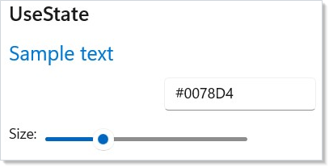
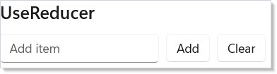
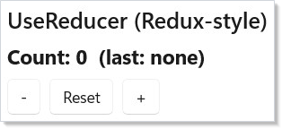
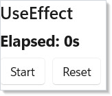
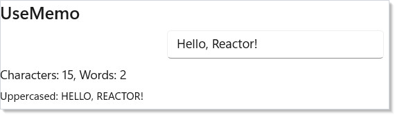
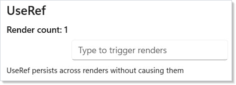
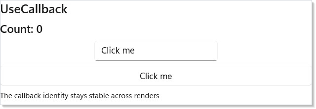

# Hooks

Hooks are functions you call inside [`Render()`](components.md) to manage state, side effects,
and memoization. They replace the need for view models, event handlers, and
lifecycle methods.

## UseState

The most common hook. Returns the current value and a setter function:

```csharp
class StateDemo : Component
{
    public override Element Render()
    {
        var (color, setColor) = UseState("#0078D4");
        var (size, setSize) = UseState(20.0);

        return VStack(12,
            SubHeading("UseState"),
            Text("Sample text").FontSize(size).Foreground(color),
            TextField(color, setColor, placeholder: "#hex color")
                .Width(150),
            HStack(8,
                Text("Size:"),
                Slider(size, 10, 48, setSize).Width(200)
            )
        );
    }
}
```



Call `setColor("#FF0000")` and Reactor re-renders the component with the new
value. The setter also accepts a function: `setSize(s => s + 1)` — this is
safer when the update depends on the previous value.

## UseReducer (Functional)

When your new state depends on the old state, `UseReducer` is cleaner than
`UseState`. The updater receives a `Func<T, T>` — a function that transforms
the previous value:

```csharp
class ReducerDemo : Component
{
    public override Element Render()
    {
        var (items, updateItems) = UseReducer(new List<string>());
        var (input, setInput) = UseState("");

        return VStack(12,
            SubHeading("UseReducer"),
            HStack(8,
                TextField(input, setInput, placeholder: "Add item")
                    .Width(180),
                Button("Add", () =>
                {
                    if (string.IsNullOrWhiteSpace(input)) return;
                    updateItems(list =>
                        new List<string>(list) { input });
                    setInput("");
                }),
                Button("Clear", () =>
                    updateItems(_ => new List<string>()))
            ),
            ForEach(items, item => Text($"  - {item}"))
        );
    }
}
```



`updateItems(list => new List<string>(list) { input })` appends to the list
by creating a new copy. This avoids mutation bugs — you always produce a new
value from the old one.

## UseReducer (Redux-Style)

For complex state with multiple action types, use the Redux-style overload.
Define a state record, action types, and a reducer function:

```csharp
record CounterState(int Count, string LastAction);
abstract record CounterAction;
record Increment : CounterAction;  record Decrement : CounterAction;
record Reset : CounterAction;

class ReduxReducerDemo : Component
{
    public override Element Render()
    {
        var (state, dispatch) = UseReducer(
            (CounterState s, CounterAction a) => a switch {
                Increment => s with { Count = s.Count + 1, LastAction = "+" },
                Decrement => s with { Count = s.Count - 1, LastAction = "-" },
                Reset => new(0, "reset"), _ => s
            }, new CounterState(0, "none"));

        return VStack(8,
            SubHeading("UseReducer (Redux-style)"),
            Text($"Count: {state.Count}  (last: {state.LastAction})")
                .FontSize(18).Bold(),
            HStack(8,
                Button("-", () => dispatch(new Decrement())),
                Button("Reset", () => dispatch(new Reset())),
                Button("+", () => dispatch(new Increment()))
            )
        );
    }
}
```



The reducer `(state, action) => newState` is a pure function. Each action type
maps to a state transformation. This pattern scales well — adding new actions
doesn't change existing logic.

## UseEffect

Run side effects (timers, subscriptions, async work) after a render. The
dependencies array controls when the effect re-runs:

```csharp
class EffectDemo : Component
{
    public override Element Render()
    {
        var (seconds, updateSeconds) = UseReducer(0);
        var (running, setRunning) = UseState(false);

        UseEffect(() =>
        {
            if (!running) return () => { };
            var cts = new CancellationTokenSource();
            var timer = new PeriodicTimer(TimeSpan.FromSeconds(1));
            _ = Task.Run(async () =>
            {
                while (await timer.WaitForNextTickAsync(cts.Token))
                    updateSeconds(s => s + 1);
            });
            return () => { cts.Cancel(); timer.Dispose(); };
        }, running);

        return VStack(8,
            SubHeading("UseEffect"),
            Text($"Elapsed: {seconds}s").FontSize(18),
            HStack(8,
                Button(running ? "Stop" : "Start", () => setRunning(!running)),
                Button("Reset", () => updateSeconds(_ => 0))
            )
        );
    }
}
```



Key details:

- The effect runs **after** the render completes, not during.
- Return a **cleanup function** to dispose resources. Reactor calls it before
  re-running the effect and when the component unmounts.
- **Empty dependencies** `UseEffect(() => { ... })` — runs once on mount.
- **With dependencies** `UseEffect(() => { ... }, running)` — runs when
  `running` changes.

## UseMemo

Cache an expensive computation so it only recalculates when its inputs change:

```csharp
class MemoDemo : Component
{
    public override Element Render()
    {
        var (input, setInput) = UseState("Hello, Reactor!");

        var stats = UseMemo(() => new
        {
            Chars = input.Length,
            Words = input.Split(' ',
                StringSplitOptions.RemoveEmptyEntries).Length,
            Upper = input.ToUpperInvariant()
        }, input);

        return VStack(8,
            SubHeading("UseMemo"),
            TextField(input, setInput).Width(250),
            Text($"Characters: {stats.Chars}, Words: {stats.Words}"),
            Caption($"Uppercased: {stats.Upper}")
        );
    }
}
```



`UseMemo` compares the dependency values between renders. If they haven't
changed, it returns the cached result. Use it for string processing, filtering
large lists, or any computation you don't want to repeat every render.

## UseRef

Store a mutable value that persists across renders without triggering
re-renders:

```csharp
class RefDemo : Component
{
    public override Element Render()
    {
        var (value, setValue) = UseState("");
        var renderCount = UseRef(0);
        renderCount.Current++;

        return VStack(8,
            SubHeading("UseRef"),
            Text($"Render count: {renderCount.Current}").SemiBold(),
            TextField(value, setValue, placeholder: "Type to trigger renders")
                .Width(250),
            Caption("UseRef persists across renders without causing them")
        );
    }
}
```



`UseRef` returns a `Ref<T>` with a `.Current` property. Changing `.Current`
does **not** cause a re-render. This is useful for:

- Counting renders
- Storing previous values for comparison
- Holding references to timers or cancellation tokens

## UseCallback

Stabilize a callback reference so child components don't re-render
unnecessarily:

```csharp
class CallbackDemo : Component
{
    public override Element Render()
    {
        var (count, updateCount) = UseReducer(0);
        var (label, setLabel) = UseState("Click me");

        var stableIncrement = UseCallback(
            () => updateCount(c => c + 1), Array.Empty<object>());

        return VStack(8,
            SubHeading("UseCallback"),
            Text($"Count: {count}").FontSize(18),
            TextField(label, setLabel, placeholder: "Button label")
                .Width(200),
            Button(label, stableIncrement),
            Caption("The callback identity stays stable across renders")
        );
    }
}
```



Without `UseCallback`, the lambda `() => setCount(c => c + 1)` would be a new
object every render. `UseCallback` returns the same delegate instance as long
as the dependencies haven't changed. This matters when passing callbacks to
memoized [child components](components.md).

## Hook Rules

Hooks must be called **in the same order** every render. Reactor tracks hooks by
their position in the call sequence — the first `UseState` call always maps to
the first state slot, the second to the second, and so on.

**Do:**
<!-- ai:lock -->
```csharp
public override Element Render()
{
    var (a, setA) = UseState(0);     // always first
    var (b, setB) = UseState("");    // always second
    UseEffect(() => { ... }, a);     // always third
    return Text($"{a} {b}");
}
```
<!-- /ai:lock -->

**Don't:**
<!-- ai:lock -->
```csharp
public override Element Render()
{
    var (a, setA) = UseState(0);
    if (a > 0)
        UseEffect(() => { ... }, a);  // WRONG: conditional hook
    return Text($"{a}");
}
```
<!-- /ai:lock -->

Put the condition **inside** the hook instead:
<!-- ai:lock -->
```csharp
UseEffect(() => { if (a > 0) { /* ... */ } }, a);
```
<!-- /ai:lock -->

## Tips

**Use the functional setter for derived updates.** `setCount(c => c + 1)` is
safer than `setCount(count + 1)` when multiple updates might batch together.

**Always return cleanup from effects that create resources.** Timers,
subscriptions, and event handlers must be disposed. The cleanup function is
your only chance to do it.

**Don't overuse UseMemo.** Simple expressions like `$"{first} {last}"` are
cheap. Only memoize when the computation is genuinely expensive or the result
is passed as a dependency elsewhere.

**UseRef is not for UI values.** If changing a value should update the screen,
use `UseState`. `UseRef` is for bookkeeping that doesn't affect rendering.

**Keep effects focused.** One effect per concern. Don't combine a timer and an
API call in the same `UseEffect` — split them into separate hooks with their
own dependency arrays. See [Effects and Lifecycle](effects.md) for advanced patterns.

## Next Steps

- **[Layout](layout.md)** — Next: arrange your UI with VStack, HStack, Grid, and responsive patterns
- **[Components](components.md)** — Previous: component classes, props, and composition
- **[Effects and Lifecycle](effects.md)** — Advanced UseEffect patterns, cleanup, and async work
- **[Context](context.md)** — Share state across the tree without prop drilling
