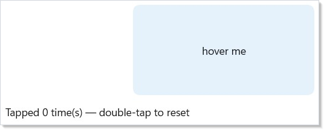
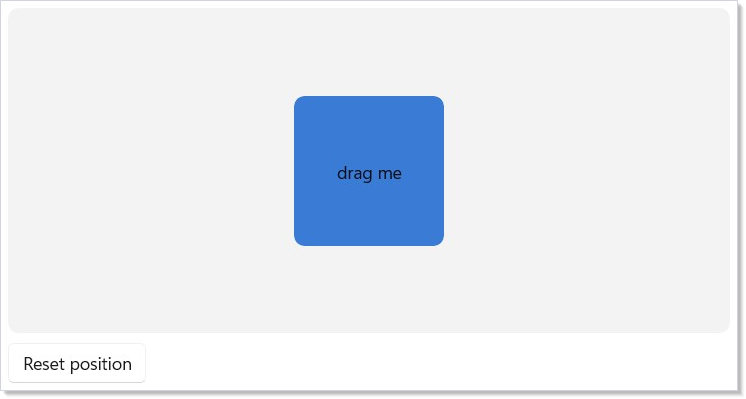
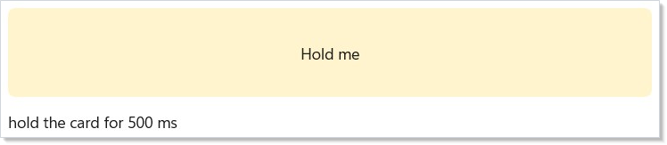
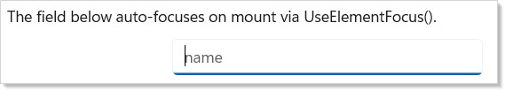
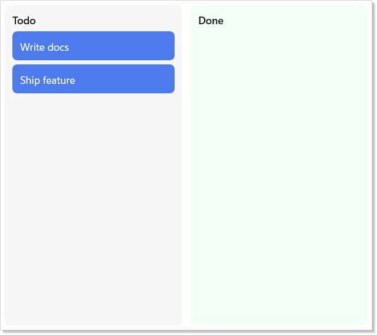

> **WinUI reference:** For the full property surface and design guidance, see [Input](https://learn.microsoft.com/en-us/windows/apps/design/input/).

Input flows from raw pointer and keyboard events through Reactor's
modifier tower into your component's render logic, with gesture
recognizers and focus state stacked on top. The bottom layer is the
raw `.OnPointerPressed` / `.OnKeyDown` / `.OnGotFocus` etc. surface,
which mirrors WinUI's routed events one-to-one and uses bubbling by
default — events start at the deepest element and propagate up the
tree. Above that sit the high-level recognizers: `.OnTapped`,
`.OnDoubleTapped`, `.OnPan`, `.OnPinch`, `.OnRotate`, `.OnLongPress`
— each auto-enables the underlying WinUI flag (e.g.
`IsDoubleTapEnabled`) and installs a single stable trampoline so
re-rendering with a new handler closure costs no re-subscription.
Focus is the third tower: declarative `.TabIndex` / `.AccessKey` /
`.IsTabStop` modifiers, the [`UseElementFocus`](hooks.md) /
[`UseElementRef`](hooks.md) hooks for imperative focus, and
[`UseFocusTrap`](accessibility.md) for modal containment. Everything
is re-render-safe by design; the [focus-and-input-internals](focus-and-input-internals.md)
page covers the dispatcher and trampoline mechanics for readers who
want the implementation details.

# Input and gestures

Reactor's input surface is declarative: attach handlers via `.On*` modifiers and
the reconciler wires WinUI events, auto-enables the matching flags (for example
`IsDoubleTapEnabled`), and survives re-renders without re-subscribing the
underlying WinUI event.

This page covers the modifiers you'll reach for on most screens, the higher-level
gesture recognizers for continuous input, and the imperative escape hatches —
ref-based focus and access keys — that round out the commanding story.

## Reference

| Modifier / hook | Purpose |
|---|---|
| `.OnPointerPressed` / `.OnPointerReleased` / `.OnPointerEntered` / `.OnPointerExited` / `.OnPointerMoved` | Raw pointer events. Bubble by default. |
| `.OnTapped` / `.OnDoubleTapped` / `.OnRightTapped` / `.OnHolding` | High-level tap recognizers. Auto-enable the matching `IsXEnabled` flag. |
| `.OnPan` / `.OnPinch` / `.OnRotate` / `.OnLongPress` | Continuous-gesture recognizers. Take `onBegan` / `onChanged` / `onEnded`. |
| `.OnKeyDown` / `.OnKeyUp` / `.OnPreviewKeyDown` / `.OnPreviewKeyUp` / `.OnCharacterReceived` | Keyboard events. Preview-pair tunnels; the unprefixed pair bubbles. |
| `.OnGotFocus` / `.OnLostFocus` | Focus events; bubble by default. |
| `.OnDragStart<TEl,T>` / `.OnDrop<TEl,T>` / `.OnDragOver` | Drag-and-drop sources and targets with typed in-process payloads. |
| `.TabIndex(n)` / `.IsTabStop()` / `.AccessKey("S")` / `.TabNavigation(...)` | Declarative focus order and keyboard navigation. |
| [`UseElementFocus`](hooks.md) | Untyped element ref + dispatcher-scheduled `RequestFocus()` action. |
| [`UseElementRef<T>`](hooks.md) | Typed element ref for calling methods on the underlying control. |
| [`UseFocusTrap`](accessibility.md) | Keyboard focus trapping for modals and flyouts. |

## Pointer, tap, and keyboard modifiers

Every [component](components.md) exposes the full WinUI input event surface as
`.On*` modifiers. Attach a handler; Reactor auto-enables the matching flag and
installs a trampoline so re-renders don't re-subscribe the underlying event.

```csharp
class PointerModifiersExample : Component
{
    public override Element Render()
    {
        var (hover, setHover) = UseState(false);
        var (tapCount, setTapCount) = UseState(0);

        return VStack(12,
            Border(TextBlock(hover ? "hovered" : "hover me")
                .HAlign(HorizontalAlignment.Center).VAlign(VerticalAlignment.Center))
                .Width(240).Height(120)
                .Background(hover ? "#BFE3FF" : "#E5F1FB")
                .CornerRadius(8)
                .OnPointerEntered((_, _) => setHover(true))
                .OnPointerExited((_, _) => setHover(false))
                .OnTapped((_, _) => setTapCount(tapCount + 1))
                .OnDoubleTap(() => setTapCount(0)),

            TextBlock($"Tapped {tapCount} time(s) — double-tap to reset")
        ).Padding(24);
    }
}
```



Auto-enablement keeps handlers honest: attaching `.OnDoubleTapped(...)` sets
`IsDoubleTapEnabled = true` on the mounted control so the WinUI event actually
fires. Remove the handler on a later render and the flag goes back to its
default. Shape subclasses (for example `Rectangle` and `Ellipse`) also get a
transparent `Fill` auto-assigned when a pointer handler is attached and no fill
was set — otherwise hit-testing would miss the unfilled shape entirely.

### Keyboard events

```csharp
TextField(value, setValue)
    .OnKeyDown((_, e) => { if (e.Key == VirtualKey.Enter) Submit(); })
    .OnPreviewKeyDown((_, e) => Trace("preview"))
    .OnCharacterReceived((_, e) => Validate(e.Character));
```

`OnPreviewKeyDown` / `OnPreviewKeyUp` map to the WinUI tunneling events and fire
before the bubbling `OnKeyDown` / `OnKeyUp` pair, which is the right spot for
shortcut interception that needs to suppress further routing.

### Focus events

```csharp
TextField(value, setValue)
    .OnGotFocus((_, _) => ShowValidationHint())
    .OnLostFocus((_, _) => HideValidationHint());
```

Focus events flow through the same trampoline pattern as pointer events, so the
handler closure is updated in-place on each render and the WinUI subscription is
installed exactly once per element.

## Continuous gestures

Pan, pinch, and rotate are continuous gestures: a single user interaction
produces a stream of callbacks with deltas relative to the gesture start. Each
gesture takes an `onChanged` action plus optional `onBegan` / `onEnded`
callbacks that fire exactly once per interaction.

### Pan

```csharp
Rectangle()
    .OnPan(
        onChanged: g => Translate(g.Translation),
        onEnded: g => SnapToGrid(g.Translation),
        minimumDistance: 8.0,
        axis: PanAxis.Both,
        withInertia: true);
```

`minimumDistance` gates callbacks: until the cumulative translation exceeds the
threshold, nothing dispatches. On first crossing the reconciler emits `onBegan`
(with `Phase = Began`) followed by the current delta as `Phase = Changed`. If
the manipulation completes before the threshold is crossed, neither `onBegan`
nor `onEnded` fire.

`PanGesture.Translation` is cumulative since `Began`; `PanGesture.Delta` is
per-callback.

### Keep pans at 60 Hz: write Translation directly

Reactor's render loop re-enqueues at `DispatcherQueuePriority.Low` on every
tick so layout and paint aren't starved by back-to-back setState calls. That's
correct for general UI, but it means a per-event `setState` during pan drops
frames — by the time the Low-priority render drains, several manipulation
events have already piled up. `setOffset(offset + g.Delta)` would also read a
stale `offset` closure, compounding the problem.

For smooth 60 Hz panning, grab a ref to the mounted element and write
`Translation` directly inside `onChanged`. No reconciler round-trip; the
compositor property update is cheap enough to run on every tick. Only call
setState at gesture end — once per drag, not 60× per second.

```csharp
class PanGestureExample : Component
{
    public override Element Render()
    {
        // For 60 Hz smooth panning, write directly to the mounted element's
        // Translation inside onChanged. Going through setState would queue
        // Low-priority re-renders that get starved by the manipulation event
        // stream itself, producing a laggy drag. The committedRef holds the
        // position at the last gesture end so successive drags accumulate.
        // Reset lives on a sibling Button because WinUI suppresses the tap
        // recognizer when ManipulationMode ≠ System — .OnDoubleTap on the same
        // element as .OnPan wouldn't fire.
        var cardRef = UseRef<FrameworkElement?>(null);
        var committedRef = UseRef(Vector2.Zero);
        var (offset, setOffset) = UseState(Vector2.Zero);

        void Reset()
        {
            committedRef.Current = Vector2.Zero;
            setOffset(Vector2.Zero);
            if (cardRef.Current is { } fe)
                fe.Translation = System.Numerics.Vector3.Zero;
        }

        return VStack(8,
            Border(
                Border(TextBlock("drag me")
                    .HAlign(HorizontalAlignment.Center).VAlign(VerticalAlignment.Center))
                    .Width(120).Height(120)
                    .Background("#3A7BD5")
                    .Foreground("#ffffff")
                    .CornerRadius(8)
                    .Translation(offset.X, offset.Y, 0)
                    .OnMount(fe => cardRef.Current = fe)
                    .OnPan(
                        onChanged: g =>
                        {
                            var next = committedRef.Current +
                                new Vector2((float)g.Translation.X, (float)g.Translation.Y);
                            if (cardRef.Current is { } fe)
                                fe.Translation = new System.Numerics.Vector3(next.X, next.Y, 0);
                        },
                        onEnded: g =>
                        {
                            committedRef.Current += new Vector2((float)g.Translation.X, (float)g.Translation.Y);
                            setOffset(committedRef.Current);
                        },
                        withInertia: true)
            ).Height(260).Background("#f3f3f3").CornerRadius(8).Padding(16),

            Button("Reset position", Reset)
        );
    }
}
```



If the panned position doesn't drive anything else on the screen (no adjacent
counter, no snap-to-grid indicator), you can even skip the setState at
gesture end and treat the ref as the single source of truth.

### Can I combine `.OnPan` with `.OnTapped` / `.OnDoubleTapped` on the same element?

Not reliably. WinUI suppresses the tap, double-tap, right-tap, and hold
recognizers whenever `ManipulationMode` is set to anything other than `System`
— adding `.OnPan` (or `.OnPinch` / `.OnRotate`) flips the mode to the
specific gesture bits, so taps stop firing on the same element. If you need
"drag, but also click to reset," put the click target on a separate sibling
(a Reset button, an overlay, a parent Border) rather than the drag surface
itself.

`axis: PanAxis.Horizontal` restricts to X-axis translation; `withInertia: true`
adds the inertia flag so WinUI continues to emit callbacks after the pointer
lifts.

### Pinch and rotate

```csharp
Image(uri)
    .OnPinch(
        onChanged: g => Scale(g.Scale),
        withInertia: true)
    .OnRotate(
        onChanged: g => Rotate(g.Angle));
```

Both gestures share the same `Phase` lifecycle as pan. `ScaleDelta` and
`AngleDelta` report the per-callback delta; `Scale` and `Angle` are cumulative
since `Began`. Combining gestures on one element is expected — the reconciler
unions the required `ManipulationModes` flags.

### Long press

```csharp
class LongPressExample : Component
{
    public override Element Render()
    {
        var (log, setLog) = UseState("hold the card for 500 ms");

        return VStack(12,
            Border(TextBlock("Hold me")
                .HAlign(HorizontalAlignment.Center).VAlign(VerticalAlignment.Center))
                .Height(80).Background("#FFF4CE").CornerRadius(6).Padding(12)
                .OnLongPress(
                    g => setLog($"long-press after {g.Duration.TotalMilliseconds:F0}ms"),
                    enableMouseEmulation: true),

            TextBlock(log)
        ).Padding(24);
    }
}
```



Long-press is touch-and-pen first: the reconciler routes `Holding` events into
the callback and sets `IsHoldingEnabled = true`. Mouse long-press is off by
default because WinUI's `Holding` event doesn't fire for mouse pointers; opt in
with `enableMouseEmulation: true` and the reconciler arms a `DispatcherTimer`
that cancels on release, capture loss, or pointer motion past `cancelDistance`.

```csharp
listItem.OnLongPress(() => ShowContextMenu(), enableMouseEmulation: true);
```

## Focus and access keys

### Declarative focus modifiers

```csharp
Button("Submit", onClick)
    .TabIndex(3)
    .AccessKey("S")
    .IsTabStop();   // default-true overload
```

`AccessKey` bound on a `.Command(...)` can be overridden per-site: a later
`.AccessKey(...)` wins via the normal modifier-after-command ordering.

```csharp
var save = new Command { Label = "Save", Execute = OnSave, AccessKey = "S" };
Button(save).AccessKey("F");   // "F" wins on this site
```

Advanced focus knobs are first-class too:

```csharp
container
    .TabNavigation(KeyboardNavigationMode.Once)
    .XYFocusKeyboardNavigation(XYFocusKeyboardNavigationMode.Enabled);
```

### Imperative focus with refs

Sometimes you need to focus a control from an effect or event handler — for
example, auto-focusing the first input on mount. Use `UseElementFocus` to get a
stable `ElementRef` plus a `RequestFocus` action that schedules the focus on the
UI dispatcher so it runs after the current reconcile pass.

```csharp
class UseElementFocusExample : Component
{
    public override Element Render()
    {
        var (name, setName) = UseState("");
        var (inputRef, requestFocus) = this.UseElementFocus();
        UseEffect(() => requestFocus(), Array.Empty<object>());

        return VStack(12,
            TextBlock("The field below auto-focuses on mount via UseElementFocus()."),
            TextField(name, setName, placeholder: "name").Width(280).Ref(inputRef)
        ).Padding(24);
    }
}
```



`ElementRef.Current` is null until the referenced element mounts; the ref
survives re-renders so the same instance reliably points at the currently
mounted control. Call `Microsoft.UI.Reactor.Input.FocusManager.Focus(ref)` for
a synchronous focus attempt or `FocusManager.FocusAsync(ref)` for WinUI's
async API with a success result.

#### Typed refs

When you actually need to call methods on the underlying control (e.g.
`SelectAll()` on a `TextBox`, `Focus(FocusState.Programmatic)` on a `Button`),
use `UseElementRef<T>()` instead. It gives you an `ElementRef<T>` whose
`.Current` is already typed as `T` — no `as TextBox` cast at the call site:

```csharp
public class SearchBox : Component
{
    public override Element Render()
    {
        var inputRef = Context.UseElementRef<TextBox>();

        Context.UseEffect(() => inputRef.Current?.SelectAll(), Array.Empty<object>());

        return TextField(query, setQuery).Ref(inputRef);
    }
}
```

The constraint `T : FrameworkElement` keeps the ref type-checked. In `DEBUG`
builds Reactor asserts the actual mounted element is a `T`; in release the
mismatch is silent and `.Current` returns `null`.

## Behind the scenes: trampoline dispatch

Re-rendering an element with a fresh handler closure is the common case in a
data-driven UI. Naively subscribing / unsubscribing on every render costs a COM
round-trip per event per element — enough to dominate a 1,000-item list's frame
budget. Reactor installs one stable *trampoline* delegate per event per element
and updates a mutable field that the trampoline reads. Re-renders swap the
field; the WinUI subscription is untouched.

You don't opt in or configure this — every `.On*` modifier routes through the
trampoline path automatically. Inspect the
[devtools](dev-tooling.md) ETW `EventDispatch` keyword (`0x40`) to see exactly
when each trampoline attaches and dispatches.

## Migration from `.Set(...)` passthrough

Pre-Tier-1 code often reaches through `.Set(...)` to subscribe to an event that
the element type didn't model declaratively:

```csharp
// Before — escapes the declarative surface and bypasses trampoline dispatch.
Rectangle().Set(r =>
{
    r.PointerEntered += (_, _) => Hover();
    r.PointerExited += (_, _) => Unhover();
});
```

After Tier 1 lands, every pointer, tap, keyboard, and focus event has a
first-class modifier. Replace the `.Set(...)` block with one modifier call per
event — shorter, re-render-safe, and covered by the reconciler's auto-enable
logic:

```csharp
// After
Rectangle()
    .OnPointerEntered((_, _) => Hover())
    .OnPointerExited((_, _) => Unhover());
```

## Drag and drop

Reactor's DnD surface is a declarative wrapper over the full Windows drag-and-drop
protocol (`CanDrag` sources, `AllowDrop` targets, `DragStarting` / `Drop` /
`DropCompleted`, `DataPackage` with text / URI / HTML / RTF / files / bitmap /
custom formats, `DragUIOverride` drop-indicator tweaks). Sources and targets
auto-wire the underlying flags — you set a modifier, the reconciler flips the
bit and subscribes once via the same trampoline path every other event uses.

### Typed in-process payloads

For reorder-within-one-app scenarios (kanban columns, sortable lists), attach a
typed payload on the source and a matching typed drop handler on the target.
The payload is ferried through an in-memory transfer registry keyed by a GUID
written into `DataPackage.Properties`, so arbitrary CLR objects can round-trip
without a serializer.

```csharp
sealed record KanbanCard(string Id, string Title);

class KanbanDndExample : Component
{
    public override Element Render()
    {
        var (todo, setTodo) = UseState<IReadOnlyList<KanbanCard>>(new KanbanCard[]
        {
            new("k1", "Write docs"),
            new("k2", "Ship feature"),
        });
        var (done, setDone) = UseState<IReadOnlyList<KanbanCard>>(Array.Empty<KanbanCard>());

        Element Column(string label,
            IReadOnlyList<KanbanCard> cards,
            Action<IReadOnlyList<KanbanCard>> setThis)
        {
            var children = new List<Element> { TextBlock(label).SemiBold() };
            foreach (var card in cards)
            {
                var captured = card;
                children.Add(
                    Border(TextBlock(captured.Title).Foreground("#ffffff"))
                        .Background("#4B7BEC").CornerRadius(6).Padding(10)
                        .OnDragStart<BorderElement, KanbanCard>(
                            getPayload: () => captured,
                            allowedOperations: DragOperations.Move,
                            onEnd: ctx =>
                            {
                                if (!ctx.WasCancelled && ctx.CompletedOperation == DragOperations.Move)
                                    setThis(cards.Where(c => c.Id != captured.Id).ToList());
                            }));
            }
            return VStack(6, children.ToArray())
                .OnDrop<StackElement, KanbanCard>(
                    onDrop: c =>
                    {
                        if (!cards.Any(x => x.Id == c.Id))
                            setThis(cards.Append(c).ToList());
                    },
                    acceptedOps: DragOperations.Move);
        }

        return HStack(12,
            Border(Column("Todo", todo, setTodo))
                .Width(240).Background("#F7F7F7").CornerRadius(6).Padding(10),
            Border(Column("Done", done, setDone))
                .Width(240).Background("#F1FFF4").CornerRadius(6).Padding(10)
        ).Padding(24);
    }
}
```



### Standard formats + cross-process interop

Eager setters (`.WithText`, `.WithUri`, `.WithHtml`, `.WithRtf`, `.WithFiles`,
`.WithBitmap`, `.WithCustomFormat`) write directly to the `DataPackage`, so
Notepad / Word / File Explorer pick the drop up natively. On the target side,
`TryGetText(out string)` and `GetTextAsync(CancellationToken)` work the same
whether the drag originated from the same process or a different one.

```csharp
Border(Text("Drag me to Notepad"))
    .OnDragStart<BorderElement>(() => new DragData().WithText("hello world"));

Rectangle()
    .OnDrop<RectangleElement>(args =>
    {
        if (args.Data.TryGetText(out var text))
            Log(text);
        args.AcceptedOperation = DragOperations.Copy;
    });
```

### Lazy providers — pay only when the target asks

If producing the payload is expensive (rendering HTML from a view model,
reading a large file, round-tripping through a server), register a provider
instead of an eager value. Reactor adapts your `Func<T>` or
`Func<CancellationToken, Task<T>>` onto WinUI's `DataProviderHandler`: the
deferral is acquired, your code runs on the thread pool, and the result is
published when the target requests that format. A target that only reads text
never pays the HTML cost.

```csharp
Border(Text("Rich content"))
    .OnDragStart<BorderElement>(() => new DragData()
        .WithText("plain fallback")
        .WithHtml(ct => RenderExpensiveHtmlAsync(ct)));
```

### Drop indicator overrides

Drop-over callbacks can tweak the caption, glyph, and content-preview
visibility via `DragTargetArgs.UIOverride` — Reactor writes the changes back
onto WinUI's `DragUIOverride` after your callback returns.

```csharp
VStack(children)
    .OnDragOver(args =>
    {
        args.UIOverride.Caption = "Move to Inbox";
        args.UIOverride.IsGlyphVisible = false;
        args.AcceptedOperation = DragOperations.Move;
    })
    .OnDrop<VStackElement, Card>(card => inbox.Add(card));
```

### The move-on-confirmation pattern

When a source declares `DragOperations.Move`, the source is responsible for
removing the moved item — but only after the drop is confirmed. Never remove
optimistically in `getPayload`: the user might cancel (ESC), the drop might
land outside any target, or a Ctrl-drag might downgrade Move to Copy. Wait for
`onEnd` and branch on `CompletedOperation`:

```csharp
Border(Text(card.Title))
    .OnDragStart<BorderElement, Card>(
        getPayload: () => card,
        allowedOperations: DragOperations.Move | DragOperations.Copy,
        onEnd: ctx =>
        {
            if (ctx.WasCancelled) return;
            if (ctx.CompletedOperation == DragOperations.Move)
                column.Remove(card);  // confirmed move — safe to remove
            // else: Copy succeeded, source keeps the item
        });
```

`DragEndContext.WasCancelled` is true when the drop fell outside every valid
target (ESC, dropped on empty space, system abort).
`DragEndContext.CompletedOperation` carries the final negotiated operation
— whatever the target set via `DragTargetArgs.AcceptedOperation` — or
`DragOperations.None` when cancelled.

> **Caveat:** `.OnPointerPressed` on a parent fires **after** its children when using the
> default bubbling phase — Reactor mirrors WinUI's routed-event model, where
> events start at the deepest hit-tested element and propagate up.
> If a parent needs to capture the press *before* children see it, you have two
> options: (1) set the matching `.On<Event>Handled(true)` on the parent (the
> handled-too overload) so the parent runs even if a child marked the event
> handled, and bubble order still applies (parent runs last); (2) attach to
> the preview/tunnel pair (`.OnPreviewKeyDown` for keys; for pointer events
> there is no preview pair — you must drop down to the manual
> `AddHandler(PointerPressedEvent, handler, handledEventsToo: true)` via
> `.Set(c => ...)`). The trap: relying on tunneling for pointer capture
> silently does the wrong thing in 80% of cases because the tunnel pair
> doesn't exist for pointer events. The
> [focus-and-input-internals](focus-and-input-internals.md) page walks the
> routed-event phases end-to-end.

## Patterns

### Drag-reorder a list

Combine `.OnDragStart<TEl, T>` on each item with `.OnDrop<TEl, T>` on the
list container. The kanban example above is the canonical shape — typed
payload, GUID transfer registry, move-on-confirmation. For a
recipe-style walkthrough with full state management and animation,
see [recipes/drag-reorder](recipes/drag-reorder.md).

### Pinch-to-zoom on an image

Combine `.OnPinch` with a `Translation` scale modifier driven from
state. Scale is cumulative since `Began` — apply it directly to the
element's `Scale` compositor property in `onChanged` for 60 Hz
behavior (same pattern as pan above), then commit to `UseState` in
`onEnded`. The reconciler unions `ManipulationModes` so adding
`.OnRotate` on the same element is free.

### Trap focus inside a modal

Wrap the modal's content tree in a container with
`.FocusTrap(handle)` where the handle comes from
[`UseFocusTrap(isActive)`](accessibility.md). Tab and Shift+Tab cycle
within the trap; the modal's close handler flips `isActive` to false,
which lifts the trap and returns focus to the previously-focused
element. The [accessibility](accessibility.md) page covers the
full ARIA dialog shape (announcement, restore-focus-on-close,
`aria-labelledby` via `AutomationName`).

## Common Mistakes

### Relying on tunneling for pointer capture

Reactor exposes pointer events through the bubbling phase only —
there is no `.OnPreviewPointerPressed` / `.OnPreviewPointerReleased`
modifier because WinUI's routed-event surface for pointer events
doesn't expose a tunneling pair the same way it does for keyboard.
If a parent needs to see the press before children consume it, use
`.OnPointerPressed` with the handled-too overload (or
`.Set(c => c.AddHandler(...))` for the manual case). The
[caveat above](#ai:caveat) goes into the routing detail.

### Using `.OnKeyDown` for accelerator chords

`.OnKeyDown` fires per element on focus — a `Ctrl+S` handler attached
to a `TextField` only fires while that field has focus. For app-wide
accelerators (Save, Find, Run), use Reactor's
[commanding](commanding.md) system: `new Command { ..., AccessKey =
"S", AccessKeyModifiers = VirtualKeyModifiers.Control }` registers
the chord with the WinUI accelerator infrastructure, which routes
through the window's `AccessKeyManager` regardless of focus. The
analyzer `REACTOR_INPUT_001` flags Ctrl/Alt key combinations attached
via `.OnKeyDown` and suggests the `Command` rewrite.

### Forgetting `Focusable(true)` on a clickable Border

A `Border` with `.OnTapped(...)` is hit-testable for pointer events
but is not in the keyboard tab order by default — pressing Tab skips
right past it, which fails [accessibility](accessibility.md) (every
interactive control must be keyboard-reachable). Add `.IsTabStop()`
or set `.TabIndex(n)` to put the Border in the tab order, and pair
it with `.OnKeyDown` for Enter/Space activation. The
[`AccessibilityScanner`](accessibility.md) catches this as
`A11Y_KEYBOARD_001`.

## Tips

**Use the high-level recognizer when one exists.** `.OnTapped` is
the right primitive for click — it filters out drags, handles
touch and mouse uniformly, and respects the system's tap-distance
threshold. Reach for `.OnPointerPressed` only when you need the
raw event (preview, capture, multi-touch coordination).

**Write `Translation` directly during pan.** A per-event `setState`
during pan drops frames — Reactor's render loop priorities lose to
the manipulation event stream. Grab a ref to the mounted element
and write `Translation` inside `onChanged`; commit to state once on
`onEnded`. The pan snippet above is the canonical shape.

**Long-press needs `enableMouseEmulation: true` for mouse users.**
WinUI's `Holding` event doesn't fire for mouse pointers by design.
If your context-menu trigger needs mouse support (most do), opt in
explicitly. Touch and pen work without it.

**Bridge to `Command` for anything keyboard-shortcut-shaped.**
Per-element `.OnKeyDown` handlers are right for "Enter submits this
form"; app-wide chords belong on a `Command` with
`AccessKey` + `AccessKeyModifiers`. See
[commanding](commanding.md) for the full surface.

**Run the a11y scanner.** A keyboard-focusable interactive control
without `AutomationName` or a focus-visible affordance is a bug.
[`AccessibilityScanner`](accessibility.md) flags both at runtime.

## Next Steps

- **[Focus and Input Internals](focus-and-input-internals.md)** — under-the-hood: trampoline dispatch, routed-event phases, dispatcher coalescing for focus
- **[Accessibility](accessibility.md)** — `UseFocusTrap`, `UseAnnounce`, `AccessibilityScanner`, ARIA patterns
- **[Commanding](commanding.md)** — app-wide accelerators, command bars, the `Command` and `Command<T>` types
- **[Animation](animation.md)** — pairing gestures with `.InteractionStates()` for hover / press / focus visuals
- **[recipes/drag-reorder](recipes/drag-reorder.md)** — full drag-to-reorder list recipe
- **[Components](components.md)** — previous topic: components, props, and composition
