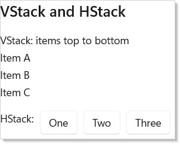
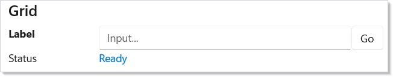
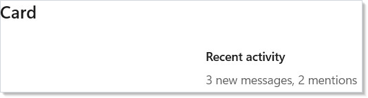
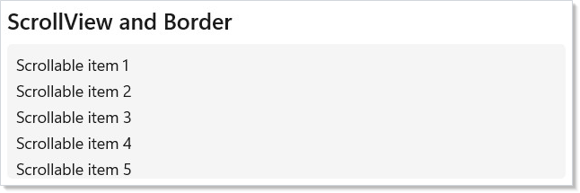
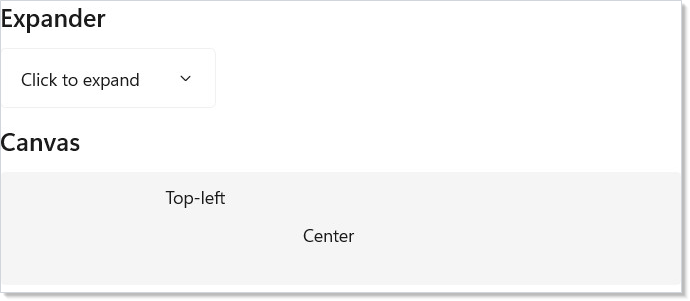
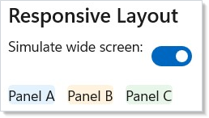
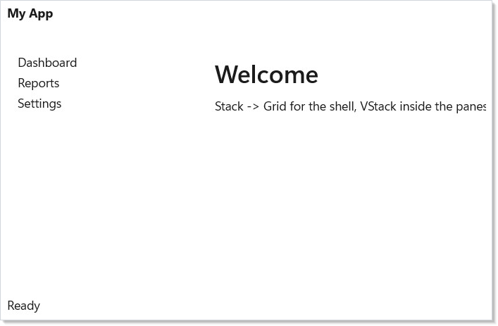
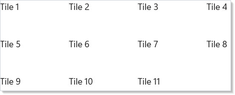
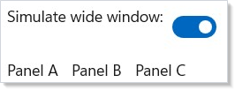
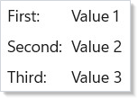

> **WinUI reference:** For the full property surface and design guidance, see [Layout](https://learn.microsoft.com/en-us/windows/apps/design/layout/).

Every Microsoft.UI.Reactor (Reactor) layout is a composition of single-responsibility panels —
you pick by *direction* (`HStack` for a row, `VStack` for a column),
*wrap behavior* (`WrapGrid` when items should flow into new rows), or
*grid axes* (`Grid` when you want explicit rows × columns). The panels
do not overlap each other's job: a `Stack` is for one axis, a `Grid` is
for two, a `Canvas` is for absolute coordinates, and a `FlexPanel` (see
[flex-layout](flex-layout.md)) is for the CSS-Flexbox feature set
including `flex-grow`, `flex-shrink`, and `flex-basis`. The reason this
matters: the right panel keeps the layout cost linear in the child
count. The wrong panel — say, a `VStack` of `HStack`s where a `Grid`
would do — forces every nested measure-and-arrange pass through
multiple panels' code paths, which both costs more and reads worse.
Start with `VStack` for a screen's top-level scaffold; switch to `Grid`
the moment you have row-and-column alignment; switch to
[`FlexPanel`](flex-layout.md) when you need ratio-based sizing or
multi-line wrapping with gaps.

# Layout

Reactor provides a small set of layout primitives that compose to build any
screen structure. Every layout element accepts children and optional spacing.

## Decision table

| Shape | Panel | Why |
|---|---|---|
| Items in one direction | `VStack(spacing, children)` / `HStack(spacing, children)` | Single-axis stacking with built-in spacing. |
| Items in rows × columns | `Grid(columns, rows, children)` | Two-axis with explicit track sizing (`Auto`, `Star`, `Px`). |
| Items that should wrap | `WrapGrid(maxRowsOrColumns, children)` | Auto-flow after a row fills. |
| Items that need ratio sizing or multi-line wrap with gaps | `FlexPanel(...)` (see [flex-layout](flex-layout.md)) | CSS-Flexbox semantics: grow/shrink/basis. |
| Absolute positioning | `Canvas(children)` | Free-form `Canvas.SetLeft` / `SetTop`. |
| Visual container | `Border(child)` / `Card(child)` | Background, corner radius, padding around a single child. |
| Overflow handling | `ScrollView(child)` | Wraps anything that may exceed its allotted space. |
| Collapsible group | `Expander(header, content)` | Header that toggles its content panel. |

## VStack and HStack

The two most common layouts. VStack stacks children vertically, HStack
horizontally. The first argument is the pixel spacing between children:

```csharp
class StackDemo : Component
{
    public override Element Render()
    {
        return VStack(16,
            SubHeading("VStack and HStack"),
            VStack(4,
                TextBlock("VStack: items top to bottom"),
                TextBlock("Item A"), TextBlock("Item B"), TextBlock("Item C")
            ),
            HStack(8,
                TextBlock("HStack:"),
                Button("One"), Button("Two"), Button("Three")
            )
        );
    }
}
```



`VStack(16, ...)` puts 16 pixels between each child, top to bottom.
`HStack(8, ...)` puts 8 pixels between each child, left to right. Omit
the spacing argument for zero spacing: `VStack(child1, child2)`.

Nest them freely — an HStack inside a VStack, VStacks inside HStacks,
as deep as you need. **But the moment you find yourself nesting more
than two deep, reach for `Grid` instead** (see
[Common Mistakes](#common-mistakes) for why).

## Grid

For row-and-column layouts, use `Grid`. Define columns and rows with
`GridSize` helpers, then place children with the `.Grid()` modifier:

```csharp
class GridDemo : Component
{
    public override Element Render()
    {
        return VStack(8,
            SubHeading("Grid"),
            Grid(
                columns: [GridSize.Px(120), GridSize.Star(), GridSize.Auto],
                rows: [GridSize.Auto, GridSize.Auto],
                TextBlock("Label").Bold().Grid(row: 0, column: 0),
                TextBox("", _ => { }, placeholder: "Input...")
                    .Grid(row: 0, column: 1),
                Button("Go").Grid(row: 0, column: 2),
                TextBlock("Status").Grid(row: 1, column: 0),
                TextBlock("Ready").Foreground("#0078D4")
                    .Grid(row: 1, column: 1, columnSpan: 2)
            ).Height(80)
        );
    }
}
```



| Helper | Meaning |
|--------|---------|
| `GridSize.Px(200)` | Fixed 200 pixels |
| `GridSize.Star()` | Proportional — fills available space (weight 1) |
| `GridSize.Star(2)` | Proportional — twice the space of `GridSize.Star()` |
| `GridSize.Auto` | Sizes to content |

Place children with `.Grid(row: 0, column: 1)`. Use `columnSpan` or
`rowSpan` to span multiple cells: `.Grid(row: 1, column: 0, columnSpan: 2)`.

> The older `Grid(["120", "1*", "Auto"], ...)` string-form overload still
> works but is soft-deprecated (`CS0618`). Prefer the typed helpers — they
> catch typos at compile time.

## Card

`Card(child)` wraps any element in the canonical WinUI card chrome — 8px
corner radius, 16px padding, theme-aware background and 1px stroke. Use
it instead of hand-rolling a
`Border(...).Background(Theme.CardBackground).WithBorder(...)` pipeline:

```csharp
class CardDemo : Component
{
    public override Element Render()
    {
        return VStack(12,
            SubHeading("Card"),
            Card(
                VStack(8,
                    TextBlock("Recent activity").SemiBold(),
                    TextBlock("3 new messages, 2 mentions")
                        .Foreground(Theme.SecondaryText)
                )
            ).Width(240)
        );
    }
}
```



Override any preset by chaining further fluents:
`Card(child).Padding(24).CornerRadius(16)`. The background and stroke
resolve through `ThemeRef`, so light/dark/contrast switches re-paint
without code changes — see [styling](styling.md).

## Type-Ramp Factories

For headings and body copy that match the WinUI 3 type ramp, use the
named factories instead of repeating `.FontSize(...).Bold()` chains:

```csharp
class TypeRampDemo : Component
{
    public override Element Render()
    {
        return VStack(8,
            Title("Quarterly results"),
            Subtitle("Q3 2026 highlights"),
            BodyLarge("Revenue grew 18% year over year."),
            BodyStrong("Net income reached an all-time high."),
            Body("Full breakdown on the following pages.")
        ).Padding(24);
    }
}
```


| Factory | WinUI style |
|---------|-------------|
| `Title(text)` | `TitleTextBlockStyle` — 28px Semibold |
| `Subtitle(text)` | `SubtitleTextBlockStyle` — 20px Semibold |
| `BodyLarge(text)` | `BodyLargeTextBlockStyle` — 18px regular |
| `BodyStrong(text)` | `BodyStrongTextBlockStyle` — 14px Semibold |
| `Body(text)` | `BodyTextBlockStyle` — 14px regular |

These are factories (not fluents) by design — see
[spec 039](../specs/039-property-and-event-scrub.md) §17.6. Layer
further modifiers on the result (`Title("…").Foreground(Theme.Accent)`)
when you need to deviate.

## ScrollView and Border

`ScrollView` wraps content that might overflow. `Border` adds a visual
container with background, corner radius, and padding:

```csharp
class ScrollBorderDemo : Component
{
    public override Element Render()
    {
        return VStack(8,
            SubHeading("ScrollView and Border"),
            Border(
                ScrollView(
                    VStack(4,
                        ForEach(
                            Enumerable.Range(1, 20),
                            i => TextBlock($"Scrollable item {i}"))
                    ).Padding(8)
                ).Height(120)
            ).CornerRadius(4).Background("#F5F5F5")
        );
    }
}
```



`ScrollView` takes a single child element. Wrap a `VStack` to scroll a
vertical list. `Border` is purely visual — it renders a rounded
rectangle behind its child and is useful for cards, panels, and
grouping.

**For long lists, prefer [`VirtualList`](collections.md) over
`ScrollView(VStack(...))`.** A `ScrollView` lays out every child even
when off-screen, which is fast for ≤100 items and visibly slow above
~500; `VirtualList` materializes only the items in view.

## Expander and Canvas

`Expander` shows a header and collapses/expands its content on click.
`Canvas` positions children at absolute coordinates:

```csharp
class ExpanderCanvasDemo : Component
{
    public override Element Render()
    {
        return VStack(12,
            SubHeading("Expander"),
            Expander("Click to expand", VStack(8,
                TextBlock("Hidden content revealed!"),
                TextBlock("Expanders are great for optional details.")
            )),
            SubHeading("Canvas"),
            Border(
                Canvas(
                    TextBlock("Top-left").Set(c => {
                        Microsoft.UI.Xaml.Controls.Canvas.SetLeft((UIElement)c, 10);
                        Microsoft.UI.Xaml.Controls.Canvas.SetTop((UIElement)c, 10);
                    }),
                    TextBlock("Center").Set(c => {
                        Microsoft.UI.Xaml.Controls.Canvas.SetLeft((UIElement)c, 120);
                        Microsoft.UI.Xaml.Controls.Canvas.SetTop((UIElement)c, 40);
                    })
                ).Height(90).Width(300)
            ).Background("#F5F5F5").CornerRadius(4)
        );
    }
}
```



`Expander(header, content)` handles the expand/collapse state
internally. Pass `isExpanded: true` to start expanded, or use
`onExpandedChanged` to track the state yourself.

`Canvas` positions children using the `.Set()` modifier to call
`Canvas.SetLeft` and `Canvas.SetTop`. Use it for overlays, diagrams, or
any layout that doesn't follow a stack or grid pattern.

## Responsive Layout

Switch between layouts based on window width. Use a state toggle or
[`UseBreakpoint`](hooks.md) to swap between HStack and VStack:

```csharp
class ResponsiveDemo : Component
{
    public override Element Render()
    {
        var (wide, setWide) = UseState(true);

        var content = new Element[]
        {
            Border(TextBlock("Panel A").Padding(16))
                .Background("#E3F2FD").CornerRadius(4),
            Border(TextBlock("Panel B").Padding(16))
                .Background("#FFF3E0").CornerRadius(4),
            Border(TextBlock("Panel C").Padding(16))
                .Background("#E8F5E9").CornerRadius(4),
        };

        return VStack(8,
            SubHeading("Responsive Layout"),
            HStack(8,
                TextBlock("Simulate wide screen:"),
                ToggleSwitch(wide, setWide)
            ),
            If(wide,
                () => HStack(12, content),
                () => VStack(8, content))
        );
    }
}
```



For real responsive layouts, use [`UseBreakpoint`](hooks.md)
`(window, minWidth)` which returns `true` when the window is at least
`minWidth` pixels wide. Pair it with `If()` to swap layouts:

<!-- ai:lock -->
```csharp
var wide = UseBreakpoint(window, 800);
return If(wide,
    () => HStack(12, panelA, panelB),
    () => VStack(8, panelA, panelB));
```
<!-- /ai:lock -->

`UseWindowSize(window)` returns `(Width, Height)` if you need exact
dimensions for more granular control.

## Alignment and Sizing

Every element supports sizing and alignment modifiers:

<!-- ai:lock -->
```csharp
Text("Centered").HAlign(HorizontalAlignment.Center)
Text("Fixed width").Width(200).Height(40)
VStack(8, items).Margin(24).Padding(16)
```
<!-- /ai:lock -->

| Modifier | Effect |
|----------|--------|
| `.Width(n)` | Fixed width in pixels |
| `.Height(n)` | Fixed height in pixels |
| `.Margin(n)` | Outer spacing (all sides) |
| `.Padding(n)` | Inner spacing (all sides) |
| `.HAlign(alignment)` | Horizontal alignment (Left, Center, Right, Stretch) |
| `.VAlign(alignment)` | Vertical alignment (Top, Center, Bottom, Stretch) |

See [modifier-system](modifier-system.md) for how these chain
internally.

> **Caveat:** `Grid` panels with `*` (star) sizing measure their children twice on
> the first layout pass — once with `Available = Infinity` to determine
> the natural content size, and once with `Available = ActualWidth` to
> resolve the star tracks. The double pass is fast for ≤100 children and
> visible above ~500 (the layout-cost overlay reports the extra
> measure-pass cost — see [dev-tooling](dev-tooling.md)). For large
> lists rendered into a star-sized cell, wrap the content in
> [`VirtualList`](collections.md) or `LazyVStack` so the panel only
> materializes the visible window; the host star track measures the
> viewport size once. Fixed (`Px`) and `Auto` tracks do not pay the
> double-measure cost.

## Patterns

### App-shell scaffold

The canonical admin-style app shell — title bar, sidebar, main content,
status bar. One `Grid` declaration; one measure-and-arrange pass:

```csharp
// App shell scaffold: title bar + sidebar + content using a single Grid
// declaration. The two-column / three-row layout is the canonical
// shape for an admin-style app and replaces hand-rolled nested
// HStacks/VStacks.
class AppShellExample : Component
{
    public override Element Render()
    {
        return Grid(
            columns: [GridSize.Px(220), GridSize.Star()],
            rows:    [GridSize.Px(44),  GridSize.Star(), GridSize.Px(28)],
            // Top bar — spans both columns.
            Border(TextBlock("My App").Bold().Padding(12))
                .Background(Theme.LayerFill)
                .Grid(row: 0, column: 0, columnSpan: 2),
            // Sidebar.
            Border(VStack(4,
                    TextBlock("Dashboard"),
                    TextBlock("Reports"),
                    TextBlock("Settings"))
                .Padding(12))
                .Background(Theme.CardBackground)
                .Grid(row: 1, column: 0),
            // Main content.
            ScrollView(VStack(8,
                    Title("Welcome"),
                    Body("Stack -> Grid for the shell, VStack inside the panes.")))
                .Padding(16)
                .Grid(row: 1, column: 1),
            // Status bar.
            TextBlock("Ready").Padding(6)
                .Grid(row: 2, column: 0, columnSpan: 2)
        ).Width(560).Height(360);
    }
}
```



A naive version with nested `HStack`/`VStack` panels works but couples
the rows to the column widths — resizing the sidebar requires editing
every row that intersects it. The `Grid` keeps the axes independent.

### Auto-grid

A photo gallery, a tile dashboard, a chip cloud — anything that should
flow into rows as the container width allows — uses `WrapGrid`:

```csharp
// Auto-grid: WrapGrid wraps a sequence of items into columns once a
// row fills, no manual row/column placement. Picks "max 4 per row".
class AutoGridExample : Component
{
    public override Element Render()
    {
        return WrapGrid(maxRowsOrColumns: 4,
            children: Enumerable.Range(1, 11)
                .Select(i =>
                    Border(TextBlock($"Tile {i}").Padding(12))
                        .Background(Theme.CardBackground)
                        .CornerRadius(6)
                        .Width(110).Height(60))
                .Cast<Element?>()
                .ToArray()
        ).Padding(24);
    }
}
```



`maxRowsOrColumns` caps the major axis; the panel wraps once that
count is reached. For content that should wrap by available pixel
width (rather than item count), use [`FlexPanel`](flex-layout.md) with
`FlexWrap.Wrap`.

### Responsive switcher

The minimum responsive recipe — different shape at narrow vs. wide:

```csharp
// Responsive switcher: the same content renders as HStack at wide
// widths, VStack when the window narrows past 480px. UseBreakpoint is
// the canonical hook for this pattern.
class ResponsiveSwitcherExample : Component
{
    public override Element Render()
    {
        var (simulated, setSimulated) = UseState(true);  // toy demo without a window handle

        var panels = new Element[]
        {
            Border(TextBlock("Panel A").Padding(16))
                .Background(Theme.CardBackground).CornerRadius(4),
            Border(TextBlock("Panel B").Padding(16))
                .Background(Theme.CardBackground).CornerRadius(4),
            Border(TextBlock("Panel C").Padding(16))
                .Background(Theme.CardBackground).CornerRadius(4),
        };

        return VStack(8,
            HStack(8,
                TextBlock("Simulate wide window:"),
                ToggleSwitch(simulated, setSimulated)),
            If(simulated,
                () => HStack(12, panels),
                () => VStack(8, panels))
        ).Padding(24);
    }
}
```



The same `panels` array drops into either container. The real
production version reads `UseBreakpoint(window, 480)` rather than a
manual toggle — see the [Responsive Layout](#responsive-layout) section
above.

## Common Mistakes

### Nesting deep stack hierarchies where Grid would suffice

```csharp
// BAD — deeply nested VStack/HStack hierarchies obscure intent and
// produce a layout cost that Grid would absorb in one measure pass.
class DontDeepStack : Component
{
    public override Element Render()
    {
        return HStack(8,
            VStack(4,
                TextBlock("Label").Bold(),
                TextBlock("Sublabel").Foreground(Theme.SecondaryText)),
            VStack(0,
                HStack(4, TextBlock("First:"), TextBlock("Value 1")),
                HStack(4, TextBlock("Second:"), TextBlock("Value 2")),
                HStack(4, TextBlock("Third:"), TextBlock("Value 3")))
        ).Padding(24);
    }
}
```

Three levels of `HStack`/`VStack` to lay out a label-value list is
harder to read than the row × column shape it really is. The same
shape as a `Grid`:

```csharp
// GOOD — same shape as a 2-column Grid. Labels in column 0 are auto-
// sized to their content; column 1 stretches.
class DoGridForForms : Component
{
    public override Element Render()
    {
        return Grid(
            columns: [GridSize.Auto, GridSize.Star()],
            rows:    [GridSize.Auto, GridSize.Auto, GridSize.Auto],
            TextBlock("First:").Margin(4).Grid(row: 0, column: 0),
            TextBlock("Value 1").Margin(4).Grid(row: 0, column: 1),
            TextBlock("Second:").Margin(4).Grid(row: 1, column: 0),
            TextBlock("Value 2").Margin(4).Grid(row: 1, column: 1),
            TextBlock("Third:").Margin(4).Grid(row: 2, column: 0),
            TextBlock("Value 3").Margin(4).Grid(row: 2, column: 1)
        ).Padding(24).Width(300);
    }
}
```



The `Auto` column hugs the label width; the `Star` column stretches.
Adding a row is one declaration. The nested-Stack version requires
re-indenting every sibling. As a rule: **if any two items in your
layout need to align across rows or columns, use `Grid`.**

### Missing `*` sizing in templates that should fill

```csharp
// Don't:
Grid(
    columns: [GridSize.Px(220), GridSize.Auto],   // content column is auto-sized
    rows: [GridSize.Star()],
    Sidebar(), Content())  // Content shrinks to its intrinsic width
```

`Auto` is "measure my content and use that"; `Star` is "take what's
left". A main-content cell that should fill the remaining horizontal
space must declare `GridSize.Star()` — otherwise it shrinks to its
intrinsic size and the surrounding empty cell appears. The
analyzer's `REACTOR_GRID_001` (when enabled) flags the common
"unused column" symptom.

### Mixing FlexPanel and Stack on the same axis

```csharp
// Don't:
FlexPanel(
    HStack(8, leftA, leftB),    // Stack inside Flex on the same axis
    HStack(8, rightA, rightB)
).FlexDirection(FlexDirection.Row)
```

`FlexPanel` and `Stack` both lay out along an axis, but `FlexPanel`
applies CSS-Flexbox semantics (`flex-grow`, `flex-shrink`, `flex-basis`)
and `Stack` applies a simpler "give every child its natural size with
fixed gaps" rule. Mixing them on the same axis means the outer
`FlexPanel`'s grow/shrink calculations operate on opaque `Stack`
measurements — predictable enough for trivial cases, surprising for
anything dynamic. Pick one per axis. See
[flex-layout](flex-layout.md) for when each shape is right.

## Tips

**Start with VStack.** Most screens are a vertical stack of sections.
Add `HStack` for side-by-side content within those sections; reach for
`Grid` when two items need to align across rows or columns.

**Use Grid for forms.** A two-column grid with
`[GridSize.Auto, GridSize.Star()]` columns gives you aligned labels on
the left and stretching inputs on the right — see the
[do-grid-for-forms snippet](#common-mistakes).

**Wrap long content in ScrollView; use VirtualList past ~500 items.**
A `ScrollView(VStack(...))` lays out every child even when off-screen.
[`VirtualList`](collections.md) materializes only the visible window.

**Prefer spacing over margin.** `VStack(12, ...)` gives consistent
spacing between children. Adding `.Margin(12)` to each child
individually is harder to maintain and creates double-spacing at
boundaries.

**Use Card over hand-rolled Border for grouping.** `Card(content)` is
8px corner radius, 16px padding, theme-aware background, and a 1px
stroke — the canonical WinUI surface. Reach for `Border` only when you
need a non-card chrome (a colored accent, a single-side border, a
non-standard radius).

## Next Steps

- **[Hooks](hooks.md)** — Previous: `UseState`, `UseMemo`, and the rest of the hook surface
- **[Flex Layout](flex-layout.md)** — Next: `FlexPanel` for grow/shrink/basis and multi-line wrap with gaps
- **[Styling and Theming](styling.md)** — Apply colors, typography, and themes to your layouts
- **[Collections](collections.md)** — `VirtualList` for large data sets that overflow `ScrollView`
- **[Forms and Input](forms.md)** — Build data entry forms with text fields, checkboxes, and validation
- **[Dev Tooling](dev-tooling.md)** — Layout-cost overlay surfaces double-measure passes and other layout hot spots
- **[Modifier System](modifier-system.md)** — How `.Width()`, `.Margin()`, and friends chain internally
