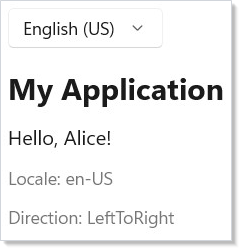
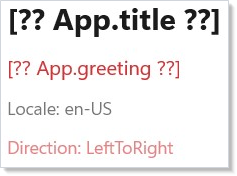
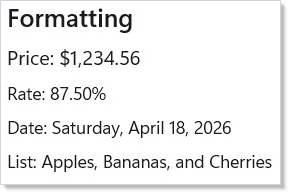
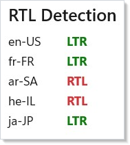
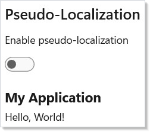

# Localization

Reactor's localization system wraps your component tree in a `LocaleProvider`
that supplies an `IntlAccessor` to every descendant via [context](context.md).
You look up messages, format numbers and dates, and detect RTL layouts — all
locale-aware, all reactive.

## String Resource Provider

You start by implementing `IStringResourceProvider`. It maps a locale,
namespace, and key to a translated string. For production apps, use
`ReswResourceProvider` to load `.resw` files. For demos and tests, an
in-memory dictionary works:

```csharp
class DemoResourceProvider : IStringResourceProvider
{
    private readonly Dictionary<string, Dictionary<string, string>> _strings = new()
    {
        ["en-US"] = new() {
            ["App.title"] = "My Application",
            ["App.greeting"] = "Hello, {name}!",
        },
        ["fr-FR"] = new() {
            ["App.title"] = "Mon Application",
            ["App.greeting"] = "Bonjour, {name} !",
        },
        ["ar-SA"] = new() {
            ["App.title"] = "\u062a\u0637\u0628\u064a\u0642\u064a",
            ["App.greeting"] = "\u0645\u0631\u062d\u0628\u0627\u060c {name}!",
        }
    };

    public string? GetString(string locale, string ns, string key)
    {
        var fullKey = $"{ns}.{key}";
        return _strings.TryGetValue(locale, out var s)
            && s.TryGetValue(fullKey, out var v) ? v : null;
    }
}
```

The `GetString` method receives the full locale tag (e.g., `"fr-FR"`), the
namespace (matching the `.resw` file name), and the key. Return `null` for
missing keys — the system falls back to the default locale automatically.

## LocaleProvider

Wrap your app tree with `LocaleProvider`. It takes a locale string, a child
element, and an optional resource provider:

```csharp
class LocaleSwitcher : Component
{
    public override Element Render()
    {
        var (localeIndex, setLocaleIndex) = UseState(0);
        var locales = new[] { "en-US", "fr-FR", "ar-SA" };
        var locale = locales[localeIndex];
        var provider = new DemoResourceProvider();

        return VStack(16,
            ComboBox(["English (US)", "Fran\u00e7ais", "\u0627\u0644\u0639\u0631\u0628\u064a\u0629"],
                localeIndex, setLocaleIndex),
            LocaleProvider(locale,
                Component<LocalizedContent>(),
                resourceProvider: provider,
                defaultLocale: "en-US")
        ).Padding(24);
    }
}
```



When the locale changes (here via a `ComboBox`), `LocaleProvider` re-renders
its subtree with a new `IntlAccessor`. Every component that calls `UseIntl()`
picks up the new locale automatically.

## Message Lookup

Call `UseIntl()` in any descendant — it is a [hook](hooks.md) — to get the
`IntlAccessor`. Use `.Message()` to look up translated strings by key. Pass
arguments as an anonymous object for interpolation:

```csharp
class LocalizedContent : Component
{
    public override Element Render()
    {
        var intl = UseIntl();
        var title = intl.Message(new MessageKey("App", "title"));
        var greeting = intl.Message(
            new MessageKey("App", "greeting"),
            new { name = "Alice" });

        return VStack(12,
            Text(title).FontSize(24).Bold(),
            Text(greeting).FontSize(16),
            Text($"Locale: {intl.Locale}").Opacity(0.6),
            Text($"Direction: {intl.Direction}").Opacity(0.6)
        );
    }
}
```



`MessageKey` takes a namespace and key. The namespace maps to your `.resw`
file name (e.g., `"App"` for `App.resw`). The accessor also exposes the
current `Locale`, `Direction`, and `IsRtl` flag.

## Formatting Numbers and Dates

`IntlAccessor` provides locale-aware formatting for numbers, dates, and
lists. Each method returns a string formatted according to the current
locale's rules:

```csharp
class FormattingDemo : Component
{
    public override Element Render()
    {
        var intl = UseIntl();
        var price = intl.FormatNumber(1234.56,
            new NumberFormatOptions { Style = NumberStyle.Currency });
        var percent = intl.FormatNumber(0.875,
            new NumberFormatOptions { Style = NumberStyle.Percent });
        var date = intl.FormatDate(DateTimeOffset.Now,
            new DateFormatOptions { Style = DateStyle.Long });
        var items = intl.FormatList(
            new[] { "Apples", "Bananas", "Cherries" },
            ListFormatType.Conjunction);

        return VStack(8,
            SubHeading("Formatting"),
            Text($"Price: {price}"),
            Text($"Rate: {percent}"),
            Text($"Date: {date}"),
            Text($"List: {items}")
        ).Padding(24);
    }
}
```



| Method | Options |
|--------|---------|
| `FormatNumber(value, options?)` | `NumberStyle.Default`, `.Currency`, `.Percent`; fraction digit control |
| `FormatDate(value, options?)` | `DateStyle.Short`, `.Long`, `.Full`, `.Default` |
| `FormatList(values, type)` | `ListFormatType.Conjunction` ("and") or `.Disjunction` ("or") |

Formatting follows the locale's conventions — decimal separators, date order,
currency symbols, and list conjunctions all adapt automatically.

## RTL Detection

Use `RtlHelper.IsRtlLocale()` to check whether a locale is right-to-left.
The `IntlAccessor` exposes `IsRtl` and `Direction` for the active locale:

```csharp
class RtlDemo : Component
{
    public override Element Render()
    {
        var intl = UseIntl();
        var locales = new[] { "en-US", "fr-FR", "ar-SA", "he-IL", "ja-JP" };

        return VStack(8,
            SubHeading("RTL Detection"),
            VStack(4,
                locales.Select(loc =>
                    HStack(8,
                        Text(loc).Width(60),
                        Text(RtlHelper.IsRtlLocale(loc) ? "RTL" : "LTR")
                            .Bold()
                            .Foreground(RtlHelper.IsRtlLocale(loc)
                                ? "#d13438" : "#107c10")
                    )
                ).ToArray()
            ),
            When(intl.IsRtl, () =>
                Text("Current layout is right-to-left")
                    .Foreground("#d13438").SemiBold())
        ).Padding(24);
    }
}
```



Arabic, Hebrew, Farsi, Urdu, and several other languages are detected as RTL.
Use `intl.Direction` to set `FlowDirection` on your [layout](layout.md)
containers so text and UI elements flow correctly.

## Pseudo-Localization

Pseudo-localization replaces characters with accented equivalents and adds
padding to expose hardcoded strings and truncation issues. Enable it by
setting `pseudoLocalize: true` on `LocaleProvider`:

```csharp
class PseudoLocDemo : Component
{
    public override Element Render()
    {
        var (pseudo, setPseudo) = UseState(false);
        var provider = new DemoResourceProvider();

        return VStack(12,
            SubHeading("Pseudo-Localization"),
            ToggleSwitch(pseudo, setPseudo,
                header: "Enable pseudo-localization"),
            LocaleProvider("en-US",
                Func(ctx =>
                {
                    var intl = ctx.UseIntl();
                    var title = intl.Message(new MessageKey("App", "title"));
                    var greeting = intl.Message(
                        new MessageKey("App", "greeting"),
                        new { name = "World" });
                    return VStack(4,
                        Text(title).FontSize(18).Bold(),
                        Text(greeting));
                }),
                resourceProvider: provider,
                pseudoLocalize: pseudo)
        ).Padding(24);
    }
}
```



Run pseudo-localization during development to catch problems early: strings
that were not routed through `intl.Message()` appear unchanged, making them
easy to spot. The padded text reveals truncation in fixed-width layouts.

## Tips

**Always wrap with `LocaleProvider` at the root.** Components that call
`UseIntl()` without a provider fall back to the OS locale, but you lose
control over locale switching and resource loading.

**Use namespaced keys.** Organize your `.resw` files by feature area
(`"Settings"`, `"Checkout"`, `"Common"`) so translations stay manageable as
the app grows.

**Test with pseudo-localization early.** Turn it on in debug builds. It costs
nothing at runtime and catches layout issues that only surface in German or
Arabic.

**Format all user-visible numbers and dates.** Never call `.ToString()`
directly. `FormatNumber` and `FormatDate` handle thousands separators, decimal
symbols, and date ordering for every locale.

**Check `intl.IsRtl` for layout-sensitive logic.** If you have directional
icons (arrows, chevrons) or absolute positioning, flip them when the locale
is RTL.

## Next Steps

- **[Accessibility](accessibility.md)** — previous topic: label controls, set landmarks, and support screen readers
- **[Animation](animation.md)** — next topic: add transitions and layout animations to your UI
- **[Context](context.md)** — understand the provider pattern that `LocaleProvider` uses under the hood
- **[Forms and Input](forms.md)** — localize form labels, placeholders, and validation messages
