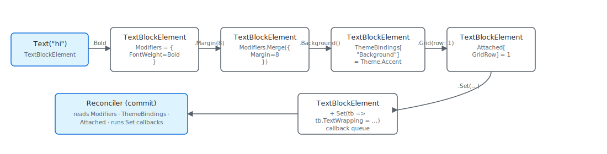

A modifier in Microsoft.UI.Reactor (Reactor) is not an operation — it is a value-bearing
function `T -> T` that returns a new [`Element`](components.md) record
with its `Modifiers` slot replaced. `.Bold().Margin(8).Background(Theme.Accent)`
allocates one `TextBlockElement` and folds three small `ElementModifiers`
records into it via `ElementModifiers.Merge`, then the reconciler reads
the merged record at commit time and writes WinUI properties in a single
sweep. The trade-off is that you do not get the SwiftUI / Compose
"each modifier wraps the previous one" semantics — most Reactor
modifiers are commutative because they live in a flat record, not on a
stack — and the cases where order *does* matter (paint stacking,
event-handler null-clears, `.Set` callbacks that read other modifiers)
are exactly the cases where the modifier writes to a property that
already carries semantics on its own. The most common mistake is
expecting `.Padding().Background()` to paint differently than
`.Background().Padding()`; in Reactor it doesn't, because both end up
in the same merged `Padding` / `Background` slots.

# Modifier System

This page is the runtime view of the same fluent chain
[Styling](styling.md) introduces from the surface. Both ride on top of
`ElementExtensions` in `src/Reactor/Elements/`; the difference is which
half of the call you care about — the API or the fold.

## Modifiers are flat records, not nested wrappers

A modifier extension method does exactly one thing: it produces a new
`Element` whose `Modifiers` slot is the merge of the old one with a
single-field `ElementModifiers` carrying the new value. The two
helpers that do all the work are `Modify` and `ModifyTheme`:

```csharp
private static T Modify<T>(T el, ElementModifiers mods) where T : Element =>
    el with { Modifiers = el.Modifiers is not null ? el.Modifiers.Merge(mods) : mods };

private static T ModifyA11y<T>(T el, AccessibilityModifiers a11y) where T : Element
{
    var existing = el.Modifiers?.Accessibility;
    var merged = existing is not null ? existing.Merge(a11y) : a11y;
    return Modify(el, new ElementModifiers { Accessibility = merged });
}

private static T ModifyTheme<T>(T el, string property, ThemeRef theme) where T : Element
{
    var bindings = el.ThemeBindings is not null
        ? new Dictionary<string, ThemeRef>(el.ThemeBindings) { [property] = theme }
        : new Dictionary<string, ThemeRef> { [property] = theme };
    return el with { ThemeBindings = bindings };
}
```

`Modify<T>(el, mods)` is a `record with` expression on the concrete
element type — `T : Element`. That generic constraint is what lets
the call chain stay typed as `TextBlockElement` all the way through
`.Bold().Margin(8).FontSize(24)`. SwiftUI returns
`some View` and Compose returns `Modifier`; Reactor keeps the concrete
type so `.Set(tb => tb.TextWrapping = TextWrapping.Wrap)` two modifiers
later still binds to a `TextBlockElement` action — the WinUI control
you get inside the callback is a typed `TextBlock`, not a base
`UIElement`.

| Where the value lands | Slot on `Element` | Set via |
|---|---|---|
| Layout (margin, padding, size, alignment) | `Modifiers.Layout` | `.Margin`, `.Padding`, `.Width`, `.HAlign`, etc. |
| Visual (font, foreground, opacity) | `Modifiers.Visual` | `.FontSize`, `.Foreground`, `.Opacity`, etc. |
| Theme-bound brushes | `ThemeBindings[propertyName]` | `.Background(Theme.Accent)`, `.Foreground(Theme.Ref(...))` |
| Container-attached values | `Attached[typeof(TAttached)]` | `.Grid(row: 1)`, `.Flex(grow: 1)`, `.Canvas(left: 8)` |
| Event callbacks | typed `OnXxx` property on the leaf record | `.Click(handler)`, `.TextChanged(handler)` |
| Imperative escape hatch | element callback list | `.Set(control => …)` |



The slots are independent — adding a `.Margin` after a `.Background`
doesn't displace the `.Background`, it just merges into the same
record. That is why "modifier order doesn't matter" is true for almost
every Reactor modifier: the merge target is a field on a flat record,
not a position in a wrapper chain.

> **Caveat:** `Modify` calls `el.Modifiers.Merge(mods)` with the *new* modifier as
> the right-hand side. `Merge`'s rule for scalar properties is
> "`other ?? self`" — the later call wins when both set the same slot.
> `.FontSize(12).FontSize(16)` keeps 16, not 12, because the second call
> went on top. This matters for [theming](theming-tokens.md): a
> `.Background("#FF0000")` literal placed *after* a
> `.Background(Theme.Accent)` overrides the theme binding entirely and
> silently breaks dark-mode color swaps. The
> [`REACTOR_THEME_001`](rules-of-reactor.md) analyzer flags the literal
> form so the override never ships.

## Attached values live in a separate slot

Container-attached values (`Grid.Row`, `Canvas.Left`, `FlexPanel.Grow`)
don't go into `Modifiers` because they're metadata for a *parent*, not
the element itself. They ride in `Element.Attached` — a
`Dictionary<Type, object>` keyed by the attached-data record:

```csharp
/// <summary>
/// Sets Grid attached properties (row, column, spans) on this element.
/// Only meaningful when the element is a child of a Grid.
/// </summary>
public static T Grid<T>(this T el, int row = 0, int column = 0, int rowSpan = 1, int columnSpan = 1) where T : Element =>
    (T)el.SetAttached(new GridAttached(row, column, rowSpan, columnSpan));
```

`.Grid(row: 1, column: 2)` creates a `GridAttached(1, 2, 1, 1)` record
and calls `el.SetAttached(...)`. The dictionary is keyed by
`typeof(GridAttached)`, so a later `.Grid(row: 3)` replaces the prior
entry (not merges — attached records are atomic). A Reactor `Grid`
asks each child element for its `GetAttached<GridAttached>()` during
mount, then writes `Grid.SetRow` / `Grid.SetColumn` on the WinUI
child. The same pattern wraps `Flex`:

```csharp
public static T Flex<T>(this T el,
    double grow = 0,
    double shrink = 1,
    double? basis = null,
    double? minWidth = null,
    double? minHeight = null,
    FlexAlign? alignSelf = null,
    FlexPositionType position = FlexPositionType.Relative,
    double? left = null,
    double? top = null,
    double? right = null,
    double? bottom = null
) where T : Element
{
    if (grow < 0 || double.IsNaN(grow) || double.IsInfinity(grow))
        throw new ArgumentOutOfRangeException(nameof(grow), "Grow must be a non-negative, finite value.");

    if (shrink < 0 || double.IsNaN(shrink) || double.IsInfinity(shrink))
        throw new ArgumentOutOfRangeException(nameof(shrink), "Shrink must be a non-negative, finite value.");

    if (minWidth is { } mw && (mw < 0 || double.IsNaN(mw) || double.IsInfinity(mw)))
        throw new ArgumentOutOfRangeException(nameof(minWidth), "MinWidth must be a non-negative, finite value (or null for CSS `min-width: auto`).");

    if (minHeight is { } mh && (mh < 0 || double.IsNaN(mh) || double.IsInfinity(mh)))
        throw new ArgumentOutOfRangeException(nameof(minHeight), "MinHeight must be a non-negative, finite value (or null for CSS `min-height: auto`).");

    return (T)el.SetAttached(new FlexAttached(grow, shrink, basis, minWidth, minHeight, alignSelf, position, left, top, right, bottom));
}
```

Flex distinguishes itself with input validation — `grow` and `shrink`
have to be non-negative and finite — but otherwise lives in the same
`Attached` dictionary, keyed by `typeof(FlexAttached)`. Reading two
attached entries from the same child is the parent's call; a `Grid`
ignores `FlexAttached`, a [`FlexPanel`](flex-layout.md) ignores
`GridAttached`. Mixing them on one element is harmless but pointless —
only the parent's matching kind gets read.

## Event-callback modifiers are typed `with` updates

Event handlers don't ride in `ElementModifiers` either. They are
typed properties on the concrete leaf record (`ButtonElement.OnClick`,
`TextFieldElement.OnChanged`), and the `.Click(...)` /
`.Changed(...)` extensions are thin `record with { }` updates:

```csharp
/// <summary>Wires a click handler (sets <see cref="ButtonElement.OnClick"/>). Passing <c>null</c> clears any existing handler.</summary>
public static ButtonElement Click(this ButtonElement el, Action? handler) =>
    el with { OnClick = handler };

/// <summary>Wires a click handler (sets <see cref="HyperlinkButtonElement.OnClick"/>). Passing <c>null</c> clears.</summary>
public static HyperlinkButtonElement Click(this HyperlinkButtonElement el, Action? handler) =>
    el with { OnClick = handler };
```

Two reasons the design split this off from generic modifiers. First,
[`C# binds `el.OnClick(arg)` to delegate invocation before considering
extension methods`](../specs/039-fluent-api-uplift.md), so a `.OnClick`
extension method would be permanently unreachable — the WinUI XAML
convention (`Click="…"`, drop the `On` prefix) avoids the clash.
Second, callback identity participates in
[reconciliation](reconciliation.md) — `Element.HasCallbacks` is the
signal the reconciler uses to decide whether to refresh the event
trampoline's `Tag` after a skip fast-path. Storing callbacks in typed
fields keeps that check cheap (one `is not null` per relevant slot)
instead of forcing the reconciler to walk a delegate dictionary.

## Patterns

### Authoring a custom modifier

If you find yourself writing `.Padding(8).WithBorder("#DDD").Background(Theme.CardBackground)`
on every card, hoist it into a single extension that calls the existing
modifiers in order:

```csharp
public static T Card<T>(this T el) where T : Element =>
    el.Padding(8).WithBorder("#DDD").Background(Theme.CardBackground);
```

The generic constraint `T : Element` is the only ceremony — every
piece of the chain preserves the concrete type, so the result still
binds to whatever record the caller passed in. There is no
`CardModifier` record to define, no `ModifierBuilder`, no registration
step. The chain *is* the modifier.

When you need a modifier that writes to a new slot (e.g., a custom
attached property a custom container reads), the pattern is the same
two helpers `Grid` and `Flex` use: define an attached-data record,
expose an extension that calls `el.SetAttached(...)`, and have the
parent panel read it via `GetAttached<TAttached>()` in its mount /
update code.

### Reading the merged modifier in a custom panel

A custom layout panel that needs to know the user's
`Modifiers.Layout.Margin` reads it off the element directly — the
reconciler has already folded the chain by the time the panel's
mount handler runs:

```csharp
public abstract record Element
{
    /// <summary>
    /// Optional key for stable identity across re-renders (like React's key prop).
    /// When set, the reconciler uses it to match elements across list reorderings.
    /// </summary>
    public string? Key { get; init; }

    /// <summary>
    /// Layout modifiers (margin, padding, size, alignment, etc.) applied to this element.
    /// Set via fluent extension methods: Text("hi").Margin(10).Width(200)
    /// Modifiers are stored inline so the concrete element type is preserved through chaining.
    /// </summary>
    public ElementModifiers? Modifiers { get; init; }
```

The record exposes `Modifiers` as a single nullable slot; if null, no
modifier touched the element; if non-null, every modifier the chain
applied has been merged into it. There is no traversal cost — one
field read tells you everything the user said about the element's
appearance.

## Common Mistakes

### Expecting `Padding` and `Background` to stack like SwiftUI

```csharp
// Don't expect a red stripe inside the padding:
Text("hi").Padding(10).Background("#FF0000");
```

```csharp
private static T Modify<T>(T el, ElementModifiers mods) where T : Element =>
    el with { Modifiers = el.Modifiers is not null ? el.Modifiers.Merge(mods) : mods };

private static T ModifyA11y<T>(T el, AccessibilityModifiers a11y) where T : Element
{
    var existing = el.Modifiers?.Accessibility;
    var merged = existing is not null ? existing.Merge(a11y) : a11y;
    return Modify(el, new ElementModifiers { Accessibility = merged });
}

private static T ModifyTheme<T>(T el, string property, ThemeRef theme) where T : Element
{
    var bindings = el.ThemeBindings is not null
        ? new Dictionary<string, ThemeRef>(el.ThemeBindings) { [property] = theme }
        : new Dictionary<string, ThemeRef> { [property] = theme };
    return el with { ThemeBindings = bindings };
}
```

In SwiftUI, calling `.padding().background(Color.red)` paints the
background *outside* the padding; reversing the order paints it
inside. In Reactor, both calls land in the same `Modifiers.Layout.Padding`
and `Modifiers.Visual.Background` slots, and the WinUI control gets
one padding and one background — the order doesn't change the
geometry. If you want the SwiftUI semantics, wrap the inner element in
a [`Border`](styling.md) explicitly: `Border(Text("hi").Padding(10)).Background("#FF0000")`
gives you the outer stripe; `Border(Text("hi")).Padding(10).Background("#FF0000")`
gives you the inner.

### Re-setting the same property and expecting an additive effect

```csharp
// Don't:
Text("hi").Margin(8).Margin(left: 16);   // last wins — margin is (16,8,8,8)? NO. it's (16,0,0,0)
```

```csharp
private static T Modify<T>(T el, ElementModifiers mods) where T : Element =>
    el with { Modifiers = el.Modifiers is not null ? el.Modifiers.Merge(mods) : mods };

private static T ModifyA11y<T>(T el, AccessibilityModifiers a11y) where T : Element
{
    var existing = el.Modifiers?.Accessibility;
    var merged = existing is not null ? existing.Merge(a11y) : a11y;
    return Modify(el, new ElementModifiers { Accessibility = merged });
}

private static T ModifyTheme<T>(T el, string property, ThemeRef theme) where T : Element
{
    var bindings = el.ThemeBindings is not null
        ? new Dictionary<string, ThemeRef>(el.ThemeBindings) { [property] = theme }
        : new Dictionary<string, ThemeRef> { [property] = theme };
    return el with { ThemeBindings = bindings };
}
```

The second `.Margin(left: 16)` builds a fresh `ElementModifiers` with
`Margin = new Thickness(16, 0, 0, 0)` and hands it to `Merge`. `Merge`
treats the new `Margin` value as a single atomic field — there's no
field-level merge inside `Thickness`. The result is `(16, 0, 0, 0)`,
not `(16, 8, 8, 8)`. Either call the per-side overload once
(`.Margin(left: 16, top: 8, right: 8, bottom: 8)`) or stick to the
uniform shape if all sides are equal.

## Tips

**Generic constraint preserves type — chain freely.** `.Bold()` returns
`TextBlockElement`, `.Margin()` returns `TextBlockElement`, every
modifier preserves the type. `.Set(tb => ...)` at any point in the
chain still gets the strongly-typed `TextBlock` callback.

**Merge is "later wins" per slot.** Repeating the same modifier
overrides; it doesn't accumulate. The exception is event-callback
parity, which the [Fluent API spec §15 Q2](../specs/039-fluent-api-uplift.md)
documents — passing `null` to a `.Click(null)` clears the handler
rather than queuing a no-op.

**Attached values are atomic.** `.Grid(row: 1).Grid(column: 2)`
replaces the first `GridAttached` with a fresh one — the column wins
and the row resets to zero. Set all attached fields in one call:
`.Grid(row: 1, column: 2)`.

**Reach for `.Set` only when nothing else fits.** If a modifier exists
(`.Bold`, `.FontSize`, `.Foreground`), use it — the reconciler can
batch property writes for known modifiers and skip them under
[`CanSkipUpdate`](reconciliation.md). `.Set` always runs.

## Next Steps

- **[Styling](styling.md)** — Previous: the surface API for the chain documented here.
- **[Reconciliation](reconciliation.md)** — Next: where the merged modifier actually reaches WinUI.
- **[Theming tokens](theming-tokens.md)** — `ThemeBindings` companion slot for brush properties.
- **[Flex layout](flex-layout.md)** — Worked example of an attached-data record.
- **[Element pool](element-pool.md)** — Why modifier cleanup matters when a control is recycled.
