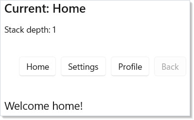
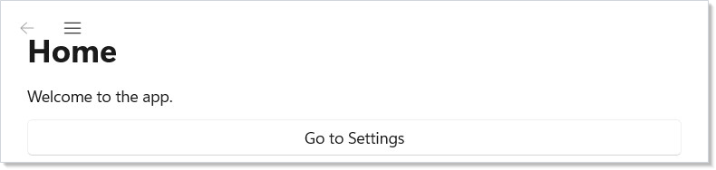
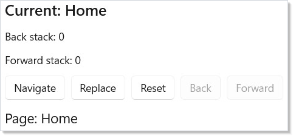
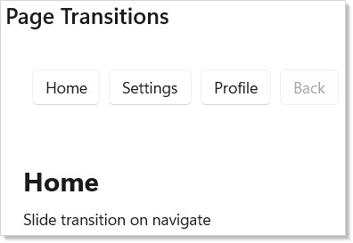
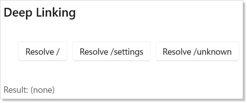
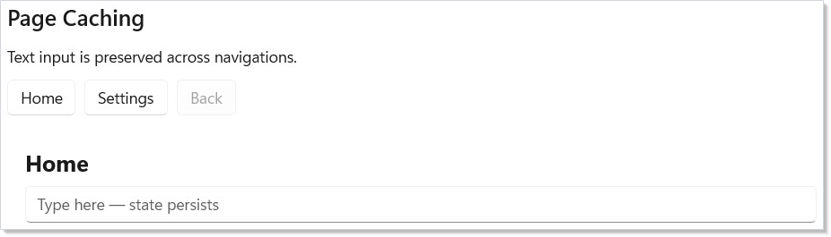
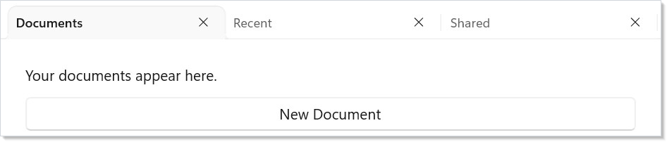
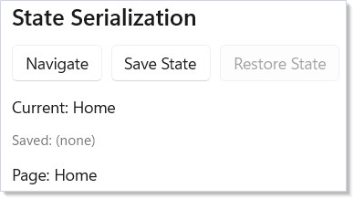

# Navigation

Reactor uses a stack-based navigation model with type-safe routes. You define
your routes as an enum, create a navigation handle with
[`UseNavigation`](hooks.md), and render the current page with `NavigationHost`.

## Defining Routes

Start by defining an enum for your pages:

```csharp
enum Route { Home, Settings, Profile, Details }
```

Each enum value represents a distinct page in your app. The navigation system
uses this type to ensure you can only navigate to valid routes.

## Basic Navigation

Call `UseNavigation(Route.Home)` to create a navigation handle rooted at
your initial route. Use `NavigationHost` to render the current page:

```csharp
class BasicNavDemo : Component
{
    public override Element Render()
    {
        var nav = UseNavigation(Route.Home);

        return VStack(12,
            SubHeading($"Current: {nav.CurrentRoute}"),
            TextBlock($"Stack depth: {nav.Depth}"),
            HStack(8,
                Button("Home", () => nav.Navigate(Route.Home)),
                Button("Settings", () => nav.Navigate(Route.Settings)),
                Button("Profile", () => nav.Navigate(Route.Profile)),
                Button("Back", () => nav.GoBack())
                    .Disabled(!nav.CanGoBack)
            ),
            NavigationHost(nav, route => route switch
            {
                Route.Home => TextBlock("Welcome home!").FontSize(18).Padding(16),
                Route.Settings => TextBlock("Settings page").FontSize(18).Padding(16),
                Route.Profile => TextBlock("Your profile").FontSize(18).Padding(16),
                _ => TextBlock("Not found").Padding(16)
            })
        ).Padding(24);
    }
}
```



Here is what each piece does:

- **`UseNavigation(Route.Home)`** creates a `NavigationHandle<Route>` with
  `Home` as the initial route. Call this once in your root component.
- **`nav.Navigate(route)`** pushes a new route onto the stack.
- **`nav.GoBack()`** pops the current route and returns to the previous one.
- **`NavigationHost(nav, route => ...)`** renders whichever element the
  route map returns for the current route.

## NavigationView

`NavigationView` creates a sidebar menu with icons. Pair it with
`NavigationHost` for a standard app layout:

```csharp
class NavViewDemo : Component
{
    public override Element Render()
    {
        var nav = UseNavigation(Route.Home);
        return NavigationView(
            [
                NavItem("Home", icon: "Home", tag: "Home"),
                NavItem("Settings", icon: "Setting", tag: "Settings"),
                NavItem("Profile", icon: "Contact", tag: "Profile")
            ],
            content: NavigationHost(nav, route => route switch
            {
                Route.Home => VStack(12, Heading("Home"),
                    TextBlock("Welcome to the app."),
                    Button("Go to Settings",
                        () => nav.Navigate(Route.Settings))).Padding(24),
                Route.Settings => VStack(12, Heading("Settings"),
                    TextBlock("Configure your preferences."),
                    Button("Back", () => nav.GoBack())).Padding(24),
                Route.Profile => VStack(12, Heading("Profile"),
                    TextBlock("View your profile info.")).Padding(24),
                _ => TextBlock("Not found").Padding(24)
            })
        );
    }
}
```



`NavItem` takes a label, an optional icon name (from the Segoe Fluent Icons
font), and an optional tag string. The `NavigationView` handles selection
state and displays the content you pass.

## Stack Operations

The `NavigationHandle` supports several stack manipulation methods beyond
simple push and pop:

```csharp
class StackOperationsDemo : Component
{
    public override Element Render()
    {
        var nav = UseNavigation(Route.Home);

        return VStack(12,
            SubHeading($"Current: {nav.CurrentRoute}"),
            TextBlock($"Back stack: {nav.BackStack.Count}"),
            TextBlock($"Forward stack: {nav.ForwardStack.Count}"),
            HStack(8,
                Button("Navigate", () =>
                    nav.Navigate(Route.Settings)),
                Button("Replace", () =>
                    nav.Replace(Route.Profile)),
                Button("Reset", () =>
                    nav.Reset(Route.Home)),
                Button("Back", () => nav.GoBack())
                    .Disabled(!nav.CanGoBack),
                Button("Forward", () => nav.GoForward())
                    .Disabled(!nav.CanGoForward)
            ),
            NavigationHost(nav, route =>
                TextBlock($"Page: {route}")
                    .FontSize(18).Padding(16))
        ).Padding(24);
    }
}
```



| Method | Effect |
|--------|--------|
| `Navigate(route)` | Push route onto back stack, navigate to it |
| `GoBack()` | Pop current, return to previous |
| `GoForward()` | Move forward (after going back) |
| `Replace(route)` | Swap current route without touching the stack |
| `Reset(route)` | Clear all stacks, start fresh at route |
| `PopTo(predicate)` | Pop until a matching route is found |

Use `CanGoBack` and `CanGoForward` to enable/disable navigation buttons.

## Page Lifecycle

`UseNavigationLifecycle` lets a component react to navigation events. Use it
to load data when a page appears or save state when it disappears:

```csharp
class LifecyclePage : Component
{
    public override Element Render()
    {
        var (log, updateLog) = UseReducer(new List<string>());

        UseNavigationLifecycle(
            onNavigatedTo: ctx =>
                updateLog(l => [.. l,
                    $"Arrived from {ctx.PreviousRoute}"]),
            onNavigatingFrom: ctx =>
                updateLog(l => [.. l,
                    $"Leaving to {ctx.TargetRoute}"]),
            onNavigatedFrom: ctx =>
                updateLog(l => [.. l,
                    $"Left for {ctx.TargetRoute}"])
        );

        return VStack(8,
            SubHeading("Lifecycle Events"),
            VStack(4,
                log.TakeLast(5).Select(entry =>
                    TextBlock(entry).FontSize(12).Opacity(0.7)
                ).ToArray()
            )
        ).Padding(16);
    }
}
```


The three callbacks fire at different points:

| Callback | When it fires |
|----------|--------------|
| `onNavigatedTo` | After this page becomes active |
| `onNavigatingFrom` | Before leaving this page (can inspect target) |
| `onNavigatedFrom` | After this page is no longer active |

Use `onNavigatedTo` to fetch data or start timers. Use `onNavigatingFrom` to
save drafts or confirm unsaved changes — you can call `context.Cancel()` on
the `NavigatingToContext` to prevent navigation entirely (useful for
"unsaved changes" guards). See [Effects and Lifecycle](effects.md) for more
on lifecycle patterns.

## Page Transitions

`NavigationHost` supports animated page transitions. Set the `Transition`
property to control how pages animate in and out:

```csharp
class PageTransitionsDemo : Component
{
    public override Element Render()
    {
        var nav = UseNavigation(Route.Home);

        return VStack(12,
            SubHeading("Page Transitions"),
            HStack(8,
                Button("Home", () => nav.Navigate(Route.Home)),
                Button("Settings", () => nav.Navigate(Route.Settings)),
                Button("Profile", () => nav.Navigate(Route.Profile)),
                Button("Back", () => nav.GoBack())
                    .Disabled(!nav.CanGoBack)
            ),
            NavigationHost(nav, route => route switch
            {
                Route.Home => VStack(8,
                    TextBlock("Home").FontSize(24).Bold(),
                    TextBlock("Slide transition on navigate")).Padding(16),
                Route.Settings => VStack(8,
                    TextBlock("Settings").FontSize(24).Bold(),
                    TextBlock("DrillIn transition to detail")).Padding(16),
                _ => TextBlock($"{route}").FontSize(18).Padding(16)
            }) with { Transition = NavigationTransition.DrillIn() }
        ).Padding(24);
    }
}
```



| Transition | Effect |
|-----------|--------|
| `NavigationTransition.Slide()` | Slide + fade (default) |
| `NavigationTransition.Fade()` | Crossfade |
| `NavigationTransition.DrillIn()` | Scale + fade from center |
| `NavigationTransition.Spring()` | Spring-physics slide |
| `NavigationTransition.None` | Instant swap |

Transitions run on the compositor thread — no managed-code involvement during
playback. GoBack automatically reverses the direction. See
[Animation](animation.md) for more on compositor transitions.

## Deep Linking

`DeepLinkMap` maps URI patterns to route constructors. Use it to restore
navigation state from activation URIs or protocol handlers:

```csharp
class DeepLinkingDemo : Component
{
    public override Element Render()
    {
        var map = UseMemo(() => new DeepLinkMap<Route>()
            .Map("/", _ => Route.Home)
            .Map("/settings", _ => Route.Settings)
            .Map("/profile", _ => Route.Profile));

        var (result, setResult) = UseState("(none)");

        return VStack(12,
            SubHeading("Deep Linking"),
            HStack(8,
                Button("Resolve /", () =>
                    setResult($"/ -> {map.Resolve("/").Matched}")),
                Button("Resolve /settings", () =>
                    setResult($"/settings -> {map.Resolve("/settings").Matched}")),
                Button("Resolve /unknown", () =>
                    setResult($"/unknown -> {map.Resolve("/unknown").Matched}"))
            ),
            TextBlock($"Result: {result}").FontSize(14).Opacity(0.7)
        ).Padding(24);
    }
}
```



Pattern segments support rich matching:

| Segment | Matches |
|---------|---------|
| `/literal` | Exact match |
| `/{param}` | Captures a string |
| `/{param:int}` | Typed capture (int, long, bool, Guid) |
| `/{param?}` | Optional parameter |
| `/{**}` | Wildcard — matches remaining path |
| `?key=value` | Query string parameters |

Use `RouteArgs.Get<T>(name)` for required params, `RouteArgs.GetOrDefault<T>(name)`
for optional ones, and `RouteArgs.Query<T>(name)` for query string values.
The `backStackFactory` parameter builds a synthetic back stack so GoBack works
even after deep-linked entry.

```csharp
class DeepLinkQueryDemo : Component
{
    public override Element Render()
    {
        var (info, setInfo) = UseState("(none)");

        // RouteArgs are available inside the factory lambda —
        // capture typed params and query values there
        var map = UseMemo(() => new DeepLinkMap<Route>()
            .Map("/", _ => Route.Home)
            .Map("/settings", _ => Route.Settings)
            .Map("/users/{id:int}/posts/{postId:int}",
                args =>
                {
                    var userId = args.Get<int>("id");
                    var postId = args.Get<int>("postId");
                    var sort = args.Query<string>("sort");
                    setInfo($"userId={userId}, postId={postId}, sort={sort}");
                    return Route.Details;
                },
                () => new[] { Route.Home })
        );

        return VStack(12,
            SubHeading("Deep Link Query Params"),
            Button("Resolve /users/42/posts/7?sort=date", () =>
                map.Resolve("/users/42/posts/7?sort=date")),
            TextBlock($"Captured: {info}").FontSize(14).Opacity(0.7)
        ).Padding(24);
    }
}
```

This example shows query parameters and optional path segments. The resolver
parses `/users/42/posts?sort=date&page=2` into typed values you can use
directly in route constructors.

## Page Caching

Set `CacheMode` on `NavigationHost` to preserve page state across
navigations. Cached pages keep their visual tree alive instead of remounting:

```csharp
class PageCachingDemo : Component
{
    public override Element Render()
    {
        var nav = UseNavigation(Route.Home);

        return VStack(12,
            SubHeading("Page Caching"),
            TextBlock("Text input is preserved across navigations."),
            HStack(8,
                Button("Home", () => nav.Navigate(Route.Home)),
                Button("Settings", () => nav.Navigate(Route.Settings)),
                Button("Back", () => nav.GoBack())
                    .Disabled(!nav.CanGoBack)
            ),
            NavigationHost(nav, route => route switch
            {
                Route.Home => CachedPage("Home"),
                Route.Settings => CachedPage("Settings"),
                _ => TextBlock($"{route}").Padding(16)
            }) with
            {
                CacheMode = NavigationCacheMode.Enabled,
                CacheSize = 5
            }
        ).Padding(24);
    }

    static Element CachedPage(string name) =>
        VStack(8,
            TextBlock(name).FontSize(20).Bold(),
            TextField("", _ => { }, placeholder: "Type here — state persists")
        ).Padding(16);
}
```



| Cache mode | Behavior |
|-----------|----------|
| `Disabled` | Always unmount/remount (default) |
| `Enabled` | LRU cache up to `CacheSize` entries |
| `Required` | Always cached, never evicted |

Caching preserves scroll position, text input, and component state. Use it
for pages that are expensive to render or where losing state would frustrate
the user.

## TabView

For tab-based navigation, use `TabView` with `Tab` items. Each tab holds its
own content independently:

```csharp
class TabNavDemo : Component
{
    public override Element Render()
    {
        return TabView(
            Tab("Documents",
                VStack(12,
                    TextBlock("Your documents appear here."),
                    Button("New Document", () => { })
                ).Padding(24)
            ),
            Tab("Recent",
                VStack(12,
                    TextBlock("Recently opened files."),
                    TextBlock("No recent files.").Opacity(0.5)
                ).Padding(24)
            ),
            Tab("Shared",
                VStack(12,
                    TextBlock("Files shared with you."),
                    TextBlock("Nothing shared yet.").Opacity(0.5)
                ).Padding(24)
            )
        );
    }
}
```



Unlike stack-based navigation, tabs keep all their content alive simultaneously.
Use tabs when users need to switch freely between parallel workspaces.

## State Serialization

`NavigationHandle` can serialize and restore the full navigation state —
back stack, current route, and forward stack — as JSON. Use this to persist
navigation state across app restarts or to restore deep-linked sessions:

```csharp
class StateSerializationDemo : Component
{
    public override Element Render()
    {
        var nav = UseNavigation(Route.Home);
        var (savedState, setSavedState) = UseState<string?>(null);

        return VStack(12,
            SubHeading("State Serialization"),
            HStack(8,
                Button("Navigate", () =>
                    nav.Navigate(Route.Settings)),
                Button("Save State", () =>
                    setSavedState(nav.GetState())),
                Button("Restore State", () =>
                {
                    if (savedState is not null)
                        nav.SetState(savedState);
                }).Disabled(savedState is null)
            ),
            TextBlock($"Current: {nav.CurrentRoute}"),
            TextBlock($"Saved: {savedState?[..Math.Min(50, savedState?.Length ?? 0)] ?? "(none)"}")
                .FontSize(12).Opacity(0.6),
            NavigationHost(nav, route =>
                TextBlock($"Page: {route}").Padding(16))
        ).Padding(24);
    }
}
```



`GetState()` returns a JSON string. `SetState(json)` restores the stacks
and fires `Navigated` with `Reset` mode. Pass `JsonSerializerOptions` if
your route type needs custom serialization.

## Navigation Diagnostics

`NavigationDiagnostics` exposes static events for debugging and telemetry.
Subscribe to trace navigation activity without modifying page code:

```csharp
class DiagnosticsDemo : Component
{
    public override Element Render()
    {
        var nav = UseNavigation(Route.Home);
        var (log, updateLog) = UseReducer(new List<string>());

        UseEffect(() =>
        {
            Action<NavigationDiagnosticEvent> onRequested =
                e => updateLog(l => [.. l, $"Requested: {e.From} → {e.To}"]);
            Action<NavigationDiagnosticEvent> onCompleted =
                e => updateLog(l => [.. l, $"Completed: {e.To}"]);

            NavigationDiagnostics.NavigationRequested += onRequested;
            NavigationDiagnostics.NavigationCompleted += onCompleted;
            return () =>
            {
                NavigationDiagnostics.NavigationRequested -= onRequested;
                NavigationDiagnostics.NavigationCompleted -= onCompleted;
            };
        });

        return VStack(12,
            SubHeading("Navigation Diagnostics"),
            HStack(8,
                Button("Home", () => nav.Navigate(Route.Home)),
                Button("Settings", () => nav.Navigate(Route.Settings))
            ),
            VStack(4, log.TakeLast(6).Select(
                entry => TextBlock(entry).FontSize(11).Opacity(0.6)
            ).ToArray()),
            NavigationHost(nav, route =>
                TextBlock($"Page: {route}").Padding(16))
        ).Padding(24);
    }
}
```

| Event | Fires when |
|-------|-----------|
| `NavigationRequested` | A navigation is about to start |
| `NavigationCompleted` | A page has finished loading |
| `NavigationCancelled` | A lifecycle guard cancelled the navigation |
| Cache events | Page cached, evicted, or hit |
| Transition events | Transition started or completed |

Events fire synchronously on the UI thread. Use them for development
logging, analytics, or custom progress indicators.

## Tips

**Use enums for routes.** Enums give you compile-time safety — you cannot
navigate to a route that does not exist. For routes that carry data (like a
detail page ID), use a discriminated union pattern with records.

**Call `UseNavigation(initial)` once at the root.** Child components access
the same handle with `UseNavigation<Route>()` (no initial value). This
retrieves the nearest ancestor's handle via [context](context.md).

**Use `NavigationTransition.DrillIn()` for list-to-detail flows.** It
signals hierarchy and pairs naturally with Connected Animation keys.

**Use `Reset` for sign-out flows.** It clears the entire stack and starts
fresh, preventing the user from navigating back to authenticated pages.

**Pair `UseSystemBackButton` with your nav handle.** Call
`UseSystemBackButton(nav, window)` to wire the system back button (title bar
or hardware) to your navigation stack automatically.

## Next Steps

- **[Collections](collections.md)** — Next: render data-driven lists and grids within pages
- **[Styling and Theming](styling.md)** — apply visual styles and themes across pages
- **[Context](context.md)** — share navigation handles and other state across the component tree
- **[Effects and Lifecycle](effects.md)** — run side effects when pages appear or disappear
- **[Animation](animation.md)** — combine page transitions with enter/exit animations
- **[Data System](data-system.md)** — data grids with sort, filter, and inline editing
