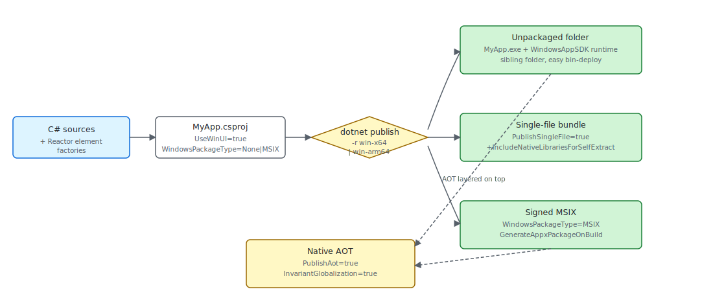

# Packaging

A Microsoft.UI.Reactor (Reactor) app is a normal WinUI 3 / Windows App SDK executable —
`dotnet publish` produces the deployable artifact and the framework
itself adds nothing exotic to the project file. What you choose at
publish time is the **shape** of that artifact: an unpackaged folder
(the [`dotnet new reactorapp`](getting-started.md) default), a signed
MSIX, a single-file bundle, or a Native AOT native binary — each
combined with a `win-x64` or `win-arm64` runtime identifier. The
trade-offs are the same ones any WinUI 3 app faces; the
Reactor-specific notes on this page cover what changes when your
codebase leans on the reflection-driven pieces of the framework
([`AutoColumns<T>`](data-system.md), the devtools component
discovery in [`ReactorApp.Run`](components.md), and the
`UseObservableTree` INPC walker).

| Publish shape | Key properties | Runtime identifier | What you get |
|---|---|---|---|
| Unpackaged (template default) | `WindowsPackageType=None`, `WindowsAppSDKSelfContained=true` | `win-x64` / `win-arm64` | A folder with `MyApp.exe` and the WinUI 3 runtime alongside it. Run from anywhere; ship as a zip. |
| MSIX | `WindowsPackageType=MSIX`, `GenerateAppxPackageOnBuild=true`, signed via `PackageCertificateThumbprint` or `PackageCertificateKeyFile` | `win-x64` / `win-arm64` | A signed `.msix`. Required for Microsoft Store; the cleanest sideload story for enterprise. |
| Single-file | `PublishSingleFile=true`, `IncludeNativeLibrariesForSelfExtract=true` | `win-x64` / `win-arm64` (must be set) | One `.exe` that self-extracts the WinUI runtime to `%TEMP%/.net/` on first launch. |
| Native AOT | `PublishAot=true`, `InvariantGlobalization=true` (recommended) | `win-x64` / `win-arm64` (required) | A native binary with no JIT, no `Assembly.GetTypes()`, no `Reflection.Emit`. Fastest cold start; trim-only. |

The four shapes are not mutually exclusive — MSIX wraps any of the
three publish outputs, and AOT layers on top of either an unpackaged
folder or an MSIX. The decision is usually distribution-channel-first
(Store / sideload / direct download) and then performance-second.



## The unpackaged shape

`dotnet new reactorapp` scaffolds an unpackaged WinUI 3 project — the
shape every sample in this repo also uses:

```xml snippet="source:samples/TodoApp/TodoApp.csproj#unpackaged-shape"
```

The load-bearing properties are `UseWinUI=true` (pulls the WinUI 3
XAML runtime), `WindowsPackageType=None` (no MSIX wrapper —
`MyApp.exe` runs straight from the publish folder), and the explicit
`<Platforms>x64;ARM64</Platforms>` (Windows App SDK self-contained
builds reject the AnyCPU default). The
[`Microsoft.WindowsAppSDK`](https://www.nuget.org/packages/Microsoft.WindowsAppSDK)
package reference pulls the WinUI runtime; the `WindowsAppSDKVersion`
property comes from `Directory.Build.props` so every project in the
repo pins the same SDK build.

To ship this shape, `dotnet publish -c Release -r win-x64`. The
publish folder contains `MyApp.exe`, `Reactor.dll`, the WinUI runtime
(`Microsoft.WindowsAppRuntime.Bootstrap.dll`, the XAML compiler
output `MyApp.xbf`, etc.), and the .NET runtime if
`WindowsAppSDKSelfContained=true`. Zip it and you have a sideloadable
build that runs on any matching-arch Windows 10 1809+ machine.

## MSIX

For Microsoft Store distribution and most enterprise sideloading,
wrap the same publish output in an MSIX. The single-project MSIX
shape adds three properties on top of the unpackaged CSPROJ:

```xml
<PropertyGroup>
  <WindowsPackageType>MSIX</WindowsPackageType>
  <GenerateAppxPackageOnBuild>true</GenerateAppxPackageOnBuild>
  <AppxPackageSigningEnabled>true</AppxPackageSigningEnabled>
  <PackageCertificateThumbprint>...</PackageCertificateThumbprint>
</PropertyGroup>

<ItemGroup>
  <AppxManifest Include="Package.appxmanifest" />
</ItemGroup>
```

`Package.appxmanifest` declares the package identity (Publisher,
PackageFamilyName, capabilities, file-type associations). The
[WinUI 3 packaging docs](https://learn.microsoft.com/en-us/windows/apps/package-and-deploy/packaging/)
cover the manifest surface in full. The signing certificate is
either a Microsoft Store-issued cert (for Store submissions) or a
self-signed cert imported into `Cert:\CurrentUser\My` (for
sideloading). MSIX is the only shape that gives the app a package
identity — features like background tasks, share targets, and the
notifier APIs require it.

## Single-file publish

Single-file collapses the publish folder into one `.exe` that
self-extracts on launch. For a WinUI 3 app the native runtime bits
are not in managed assemblies, so the bare `PublishSingleFile=true`
leaves several DLLs alongside the binary — add
`IncludeNativeLibrariesForSelfExtract` to fold those into the bundle:

```xml
<PropertyGroup>
  <PublishSingleFile>true</PublishSingleFile>
  <SelfContained>true</SelfContained>
  <IncludeNativeLibrariesForSelfExtract>true</IncludeNativeLibrariesForSelfExtract>
  <RuntimeIdentifier>win-x64</RuntimeIdentifier>
</PropertyGroup>
```

The trade-off is first-launch latency — the runtime extracts the
embedded assemblies to `%TEMP%\.net\` (or the directory in
`DOTNET_BUNDLE_EXTRACT_BASE_DIR`) before the process starts. Two
Reactor-specific notes: `Assembly.Location` returns an empty string
inside a single-file bundle, so any code path that builds paths next
to the exe should use
[`AppContext.BaseDirectory`](https://learn.microsoft.com/en-us/dotnet/api/system.appcontext.basedirectory)
instead; and the
[`UsePersisted`](persistence.md) `Application` scope writes to
`%LOCALAPPDATA%\<AssemblyName>\` — single-file doesn't change that
location, but trimming away the assembly name (via
`<AssemblyName>` rename in a publish profile) does.

## ARM64

ARM64 is a second runtime identifier on the same project — the
`<Platforms>x64;ARM64</Platforms>` line in the project template
exists so MSBuild accepts the per-platform restore. Build for both
in CI by running publish twice:

```powershell
dotnet publish -c Release -r win-x64   -o out/x64
dotnet publish -c Release -r win-arm64 -o out/arm64
```

There is no separate Reactor build for ARM64 — `Reactor.dll` is
AnyCPU-equivalent managed code that compiles for both architectures
from the same source. The native bits below it (the WinUI 3 runtime
and any `System.Drawing.Common` / `TraceEvent` natives transitively
pulled in by Reactor) ship per-RID, which is why the runtime
identifier matters even for managed-only Reactor code. The repo's
sample apps default to `<Platforms>x64;ARM64</Platforms>`; the
`reactorapp` template adds `X86` to the list for parity with the
WinUI 3 templates, but Reactor itself is only tested on x64 / ARM64.

## Native AOT

Reactor's perf-bench projects publish under AOT and run cleanly —
the framework is built to be AOT-compatible on its hot path. The
shape is the same as any other AOT publish, with `PublishAot=true`
and a runtime identifier:

```xml snippet="source:tests/stress_perf/StressPerf.Reactor/StressPerf.Reactor.csproj#aot-stress-shape"
```

`dotnet publish -c Release -r win-x64` produces a native binary —
no `coreclr.dll`, no JIT, ~50 ms cold start versus ~250 ms for the
JIT-based build on the same hardware. The project template gates
the same shape behind a `NativeAot` parameter:

```xml snippet="source:tools/Templates/templates/WinUIApp-CSharp/Company.ReactorApp1.csproj#template-shape"
```

Pass `dotnet new reactorapp --NativeAot true` to get the AOT-enabled
variant. `InvariantGlobalization=true` is paired with `PublishAot`
because the alternative — shipping the full ICU data — pulls in
trim warnings that the AOT analyzer flags as actionable.

> **Caveat:** **`AutoColumns<T>` and `Assembly.GetTypes()` are the two reflection
> surfaces to know about.** `Factories.AutoColumns<T>()` walks
> `typeof(T).GetProperties()` to build `FieldDescriptor`s for a
> [`DataGrid<T>`](data-system.md), so the generic argument carries
> `[DynamicallyAccessedMembers(PublicProperties | PublicConstructors)]`
> — call it from your component and the AOT analyzer threads the
> annotation back through your code. Hand-built `Column<T>(...)`
> columns avoid the reflection entirely and are the safe choice for
> trim-paranoid code. The devtools code path
> (`ReactorApp.Run(..., devtools: true)`) walks
> `Assembly.GetTypes()` to enumerate component types, which is
> incompatible with trimming and carries `[RequiresUnreferencedCode]`
> on every method that touches it — the AOT publish will warn unless
> you drop `devtools: true` from retail builds (the documented retail
> shape; see [Dev Tooling](dev-tooling.md)).

## Tips

**Pick distribution before performance.** MSIX is Store-only-ish
and gives you a real package identity; unpackaged + zip is the
easiest direct-download story; single-file is the same shape as
unpackaged with a slower first launch. AOT is independent of all
three — apply it once the distribution shape is settled.

**Publish for both architectures in CI from day one.** ARM64
Windows on Snapdragon X is a real audience now; an x64-only build
runs under emulation but pays a startup tax. The `<Platforms>` line
in the template covers both — the missing piece is the second
`dotnet publish -r win-arm64` invocation in the build pipeline.

**Keep `devtools: true` out of retail.** [`devtools: true`](dev-tooling.md)
on `ReactorApp.Run` is a capability gate that nothing user-visible
depends on at runtime — but the code path it enables walks
`Assembly.GetTypes()`. Removing it from the release build drops the
last AOT trim warning that the framework emits.

**`Reactor.dll` is in your publish output as a managed assembly,
not a tucked-away framework package.** Reactor ships as
`Microsoft.UI.Reactor` (see [spec 022 / Phase 0 release-asset
flow](https://github.com/microsoft/microsoft-ui-reactor) — local
builds get `0.0.0-local` via `mur pack-local`). Trim-friendly
deployments don't get any framework-side magic; the same trimmer
configuration that works for any WinUI 3 app works here.

**`Microsoft.WindowsAppSDK` is a transitive dependency, not a
direct one in the template.** The `dotnet new reactorapp` CSPROJ
references `Microsoft.UI.Reactor` and lets the WinUI SDK flow
through. Override it in your CSPROJ when you need a specific SDK
patch — Reactor pins through `WindowsAppSDKVersion` in
`Directory.Build.props` so an explicit override is the
intentional knob.

## Next Steps

- **[Dev Tooling](dev-tooling.md)** — Previous: the inner-loop side of the build pipeline (`mur pack-local`, `dotnet watch`, hot reload).
- **[Getting Started](getting-started.md)** — Where the `dotnet new reactorapp` template that produces the unpackaged shape comes from.
- **[Performance](performance.md)** — When you should reach for AOT (cold-start budgets, startup-perf benchmarks).
- **[Perf Instrumentation](perf-instrumentation.md)** — The ETW / EventPipe pipeline that survives AOT publish unchanged.
- **[Components](components.md)** — Where `ReactorApp.Run` and the `devtools: true` capability gate live.
