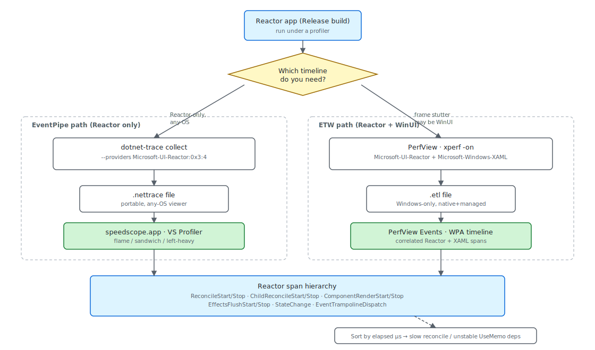

# Performance

A Microsoft.UI.Reactor (Reactor) app emits a structured account of its own work — one event at
the start and end of every reconcile pass, every component render,
every effect flush, every state write, every WinUI routed-event hop —
through one managed `EventSource` named `Microsoft-UI-Reactor`. You
attach a profiler, mask in the keywords you care about, run the
scenario, and read the resulting span hierarchy. This page walks the
top-down workflow: how to take a trace with `dotnet-trace` or PerfView,
what each span means, how to find the outlier, and how to reproduce a
benchmark from `tests/perf_bench/` so a regression has a number behind
it. The deep "how does the pipeline emit these events" story lives in
[Perf Instrumentation](perf-instrumentation.md) — read that next if
you're adding a new event id, not before you take your first trace.

## Reference

| Tool | Source | What you read | Best for |
|---|---|---|---|
| `dotnet-trace` | EventPipe | `.nettrace` opened in speedscope.app or VS Profiler | Reactor-only timing on any OS, AOT-friendly |
| PerfView / xperf | Classic ETW | `.etl` opened in PerfView's Events view or WPA | Frame stutter that may be Reactor *or* WinUI native |
| `tests/perf_bench/PerfBench.*` | In-process `BenchTracker` | `*.report.txt` next to the exe | Reproducing a regression with FPS / update-ms / GC numbers |
| Reconcile-highlight overlay | Dev menu | Flashing rectangle per re-render | Finding which component re-rendered without taking a trace |
| Layout-cost overlay | Dev menu | Heatmap tint by measure/arrange cost | Finding expensive panels without taking a trace |

The reconcile-highlight and layout-cost overlays are documented in
[Dev Tooling](dev-tooling.md); reach for them first when "something
feels slow" is the only signal you have. A profile trace is the next
step up: it costs more to set up but gives you elapsed microseconds
per span and a complete hierarchy you can sort.

## The provider and its keywords

The Reactor provider's events split across seven keywords. A consumer
masks in only the ones it wants, so a "just reconcile" trace doesn't
pay for state writes, MCP traffic, or trampoline dispatches:

```csharp
public static class Keywords
{
    public const EventKeywords Reconcile = (EventKeywords)0x1;
    public const EventKeywords Render = (EventKeywords)0x2;
    public const EventKeywords State = (EventKeywords)0x4;
    public const EventKeywords Mcp = (EventKeywords)0x8;
    public const EventKeywords Lifecycle = (EventKeywords)0x10;
    public const EventKeywords Errors = (EventKeywords)0x20;
    public const EventKeywords EventDispatch = (EventKeywords)0x40;
    // Spec 044 — subsystem coverage gaps. Each gets its own bit so a
    // consumer (dotnet-trace, EventListener, ReactorTrace.Subscribe) can
    // pick exactly the area it cares about without paying for the rest.
    public const EventKeywords Hosting = (EventKeywords)0x80;       // Window/HWND/DPI/Backdrop
    public const EventKeywords Persistence = (EventKeywords)0x100;  // settings store, placement
    public const EventKeywords Navigation = (EventKeywords)0x200;   // route push, cache, transitions
    public const EventKeywords Intl = (EventKeywords)0x400;         // missing keys, fallback, format
    public const EventKeywords Theme = (EventKeywords)0x800;        // theme apply, bindings
    public const EventKeywords Shell = (EventKeywords)0x1000;       // JumpList/Tray/ThumbnailToolbar
}
```

`Reconcile` covers reconcile-pass boundaries and the child-list diff,
`Render` covers per-component render timing and the effect-flush
boundary, `State` covers `UseState` writes, `Mcp` covers
[devtools](dev-tooling.md) tool dispatch, `Lifecycle` covers mount and
unmount, `Errors` is severity-Error events, and `EventDispatch` covers
the trampoline that fans WinUI routed events out to your Reactor
callbacks. The values are power-of-two flags on `EventKeywords`, so
`Reconcile | Render` is `0x3` and `Reconcile | Render | EventDispatch`
is `0x43`.



## Taking a Reactor-only trace

For a Reactor-only workflow on any OS, `dotnet-trace` is the right
tool. It writes a `.nettrace` file that speedscope.app, Visual
Studio's profiler, and PerfView all open:

```
dotnet tool install --global dotnet-trace
dotnet-trace collect --process-id <pid> --providers Microsoft-UI-Reactor:0x3:4
```

`0x3` masks `Reconcile | Render`, `:4` pins the level at
Informational. Pinning the level matters: the default is `Verbose`,
which means every `StateChange` event hits the session — a noisy app
can write millions of those per minute, and the trace grows from tens
of megabytes to gigabytes. Add the `EventDispatch` keyword (`0x43`
total) when you're chasing a routed-event regression; leave it out
otherwise.

Open the resulting file in [speedscope.app](https://www.speedscope.app/)
and pick the "Time order" view — that's the flame graph. Each
`ReconcileStart`/`ReconcileStop` pair is one reconcile pass; the
nested `ChildReconcileStart`/`ChildReconcileStop` band underneath is
the keyed child-list diff inside that pass.

## Taking a correlated trace (Reactor + WinUI)

When a frame stutter could be Reactor's, WinUI's, or the compositor's,
you need ETW because `Microsoft-Windows-XAML` is a native provider
that doesn't flow through EventPipe. PerfView is the easier of the
two ETW tools to use:

```
perfview /providers="Microsoft-UI-Reactor:0x3:4,*Microsoft-Windows-XAML" collect
```

The `*` prefix on `Microsoft-Windows-XAML` registers it by name
(PerfView resolves the GUID for you). Stop the collection after your
repro, open the resulting `.etl`, and use the **Events** view — not
the call-stack view — to read Reactor's timing data. Filter to
provider `Microsoft-UI-Reactor`, sort by elapsed microseconds, and
the slowest pass floats to the top.

## Reading a span: the reconciler entry

Every reconcile pass starts here. The event-id pair is `1` / `2`
(`ReconcileStart` / `ReconcileStop`) and the counters reported on
`ReconcileStop` are the per-pass cost summary:

```csharp
public UIElement? Reconcile(
    Element? oldElement,
    Element? newElement,
    UIElement? existingControl,
    Action requestRerender)
{
    // Trace only top-level reconcile passes (depth == 0) to avoid flooding
    // the provider with per-subtree entries; nested Reconcile() calls during
    // the same pass don't emit their own start/stop. Gate the depth counter
    // and Start emit on IsEnabled so the disabled path pays nothing extra.
    bool emitTrace = Diagnostics.ReactorEventSource.Log.IsEnabled(
        global::System.Diagnostics.Tracing.EventLevel.Informational,
        Diagnostics.ReactorEventSource.Keywords.Reconcile)
        && _reconcileTraceDepth++ == 0;
    if (emitTrace)
    {
        Diagnostics.ReactorEventSource.Log.ReconcileStart(
            newElement?.GetType().Name ?? "null");
    }
    if (_debugReconcileDepth++ == 0)
    {
        DebugElementsDiffed = 0;
        DebugElementsSkipped = 0;
        DebugUIElementsCreated = 0;
        DebugUIElementsModified = 0;
        if (ReactorFeatureFlags.HighlightReconcileChanges)
        {
            (_highlightMounted ??= new()).Clear();
            (_highlightModified ??= new()).Clear();
        }
        // Consume the hot-reload signal exactly once per top-level pass so
        // every component re-runs Render() even when props/deps are unchanged.
        _forceFullRenderActive = ForceFullRenderPending;
        ForceFullRenderPending = false;
    }
    try {
    try
    {
        if (newElement is null or EmptyElement)
        {
            if (existingControl is not null)
                Unmount(existingControl);
            return null;
        }

        if (oldElement is null or EmptyElement || existingControl is null)
            return Mount(newElement, requestRerender);

        return ReconcileImperative(oldElement, newElement, existingControl, requestRerender);
```

In a flame-graph viewer you see a band whose top edge is
`ReconcileStart` and whose bottom edge is `ReconcileStop`. The band's
width is the wall-clock duration of the pass. Hover the band and the
payload fields show up: `elementsDiffed` is the count of element
records the reconciler walked, `elementsSkipped` is the count it
bailed out of by `ShouldUpdate` or referential equality,
`uiElementsCreated` is the count of WinUI `FrameworkElement`
instances allocated this pass, and `uiElementsModified` is the count
of property writes against existing controls.

High `elementsSkipped` with a short pass is the healthy case — the
bail-out is working. Low `elementsSkipped` with a long pass usually
means the [`UseMemo`](hooks.md) deps array is unstable: a new array
or a new closure as a dep makes every render look new, and the
bail-out can't fire. The [reconcile-highlight
overlay](dev-tooling.md) catches this cheaper than a trace — flick
it on and watch which component flashes every time you type.

> **Caveat:** Debug builds disable several of the reconciler's bail-out optimizations
> to surface invariant violations. The same scenario on a Debug build
> shows 3–4× the `elementsDiffed` count and roughly 2× the elapsed
> microseconds vs. Release. Always profile against `-c Release`; a flame
> graph from a Debug build is not a valid signal about Release
> performance.

## The EventDispatch keyword

The `EventDispatch` keyword covers the per-event trampoline that lets
Reactor swap your handler closure between renders without
detaching from the WinUI event:

```csharp
private static void EnsureSizeChangedSubscribed(FrameworkElement fe, EventHandlerState state, Action<object, SizeChangedEventArgs>? handler)
{
    state.CurrentSizeChanged = handler;
    if (state.SizeChangedTrampoline is null && handler is not null)
    {
        state.SizeChangedTrampoline = (s, e) =>
        {
            Diagnostics.ReactorEventSource.Log.EventTrampolineDispatch("SizeChanged");
            state.CurrentSizeChanged?.Invoke(s!, e);
        };
        fe.SizeChanged += state.SizeChangedTrampoline;
        Diagnostics.ReactorEventSource.Log.EventTrampolineAttached("SizeChanged", fe.GetType().Name);
    }
}
```

The pattern matters for performance because the trampoline is bound
**once** per element lifetime — every subsequent render that hands
the element a new callback updates a field in `state`, not the WinUI
event subscription list. Without this trick, every render that
changes a handler would call `fe.SizeChanged -=` then `fe.SizeChanged
+=`; under the cover, WinUI walks a linked list each time and you'd
see a measurable hit on lists with hundreds of subscribed elements.

When you do see `EventTrampolineDispatch` events dominating a
verbose-level trace, that's the trampoline doing its actual job —
the events fire on the UI thread for every routed event WinUI emits.
Mask out `EventDispatch` (`0x3` instead of `0x43`) unless you're
specifically debugging input or pointer flow.

## Reproducing a benchmark

A regression claim needs a number, and the bench harness under
`tests/perf_bench/` is how you get one. Each bench has three sibling
variants — `*.Reactor`, `*.Direct` (raw WinUI), and `*.Bound`
(WinUI + MVVM bindings) — so you can compare Reactor to its
non-declarative baselines. The entry point is the standard top-level
`ReactorApp.Run` call with a CLI options parser bolted on:

```csharp
var opts = BenchCliOptions.Parse(args);
if (opts.Headless) ConsoleHelper.EnsureConsole();
DirtyTrackingApp.Opts = opts;
ReactorApp.Run<DirtyTrackingApp>("EXP-1 DirtyTracking.Reactor", fullScreen: true);
```

Run with `--headless --duration 10` and the app writes a
`*.report.txt` next to the exe, then exits. The report includes the
metrics the harness records each frame — FPS, update milliseconds,
memory, GC generation counts, longest frame block:

```csharp
sb.AppendLine($"Avg FPS:       {_fpsSamples.Average():F1}");
sb.AppendLine($"Min FPS:       {_fpsSamples.Min():F1}");
sb.AppendLine($"Max FPS:       {_fpsSamples.Max():F1}");

if (_updateTimeSamples.Count > 0)
{
    sb.AppendLine($"Avg Update:    {_updateTimeSamples.Average():F2} ms");
    sb.AppendLine($"Max Update:    {_updateTimeSamples.Max():F2} ms");
}

sb.AppendLine($"Avg Memory:    {_memorySamples.Average() / (1024 * 1024):F1} MB");
sb.AppendLine($"Peak Memory:   {_memorySamples.Max() / (1024 * 1024):F1} MB");

// GC
int gen0Total = GC.CollectionCount(0) - _baselineGen0;
int gen1Total = GC.CollectionCount(1) - _baselineGen1;
int gen2Total = GC.CollectionCount(2) - _baselineGen2;
sb.AppendLine($"GC Gen0:       {gen0Total}");
sb.AppendLine($"GC Gen1:       {gen1Total}");
sb.AppendLine($"GC Gen2:       {gen2Total}");

// Frame jank
sb.AppendLine($"Longest Block: {_longestFrameBlockMs:F1} ms");
sb.AppendLine($"Anim Drops:    {_animationDrops}");
```

To reproduce a regression locally:

```
dotnet build tests/perf_bench/PerfBench.DirtyTracking/DirtyTracking.Reactor -c Release
./tests/perf_bench/PerfBench.DirtyTracking/DirtyTracking.Reactor/bin/<plat>/Release/<tfm>/DirtyTracking.Reactor.exe --headless --duration 30
cat ./tests/.../bin/<plat>/Release/<tfm>/EXP1_DirtyTracking_Reactor.report.txt
```

Re-run the same command on `main` and on your branch; the deltas in
`Avg Update`, `Anim Drops`, and `GC Gen0` are the regression signal.

## Tips

**Pin the level when you collect.** `dotnet-trace` defaults to
`Verbose`, which captures every `StateChange` write. Pin to
`Informational` (`:4`) for reconcile/render workflows and the trace
shrinks by roughly an order of magnitude — a 30-second session that
was 1.2 GB becomes ~80 MB.

**Reach for an overlay before a trace.** The
[reconcile-highlight](dev-tooling.md) and
[layout-cost](dev-tooling.md) overlays cost nothing to enable and
will solve "which component is re-rendering too much" without you
ever opening a profiler. A trace is the right tool when you need
elapsed microseconds; the overlays are the right tool when you need
"which one".

**Compare against the matching `*.Direct` bench.** A Reactor bench
result in isolation is hard to interpret. Run the sibling
`PerfBench.*.Direct` variant on the same hardware and the delta
tells you what declarative composition costs over raw WinUI — that's
the framework-overhead number, not the absolute number.

## Next Steps

- **[Perf Instrumentation](perf-instrumentation.md)** — Under-the-hood companion: why each event exists, the IsEnabled gate, how to add a new event id.
- **[Dev Tooling](dev-tooling.md)** — The reconcile-highlight and layout-cost overlays plus the rest of the `mur` CLI.
- **[DevTools Internals](devtools-internals.md)** — How the overlays read the same provider events the profilers do.
- **[Reconciliation](reconciliation.md)** — What the `ReconcileStop` counters describe; how to read the keyed child-list diff.
- **[Hooks](hooks.md)** — Where `UseMemo` deps come from and what makes them unstable.
