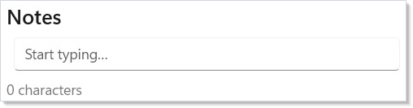

# Persistence

[`UsePersisted`](hooks.md) holds a value past a component re-mount —
the user navigates away, the component unmounts, the user navigates
back, and the captured state is still there. It's the right hook for
"keep what the user typed across a tab switch" or "remember the
selected row in a list while the user opens a side pane". It is *not*
the right hook for "save to disk so the value survives an app
restart"; that one needs a disk bridge in `UseEffect`, covered below.

```csharp
// UsePersisted with explicit Window scope. The text outlives a re-mount
// of the component (e.g. navigation away and back) but is dropped when
// the host window closes. Replace PersistedScope.Window with
// PersistedScope.Application for process-lifetime persistence.
class NotesEditor : Component
{
    public override Element Render()
    {
        var (text, setText) = UsePersisted(
            "notes/body",
            initialValue: "",
            scope: PersistedScope.Window);

        return VStack(8,
            SubHeading("Notes"),
            TextField(text, setText, placeholder: "Start typing…").Width(380),
            TextBlock($"{text.Length} characters").Opacity(0.6)
        ).Padding(16);
    }
}
```



The lookup happens once per mount: the hook checks the named scope
for `"notes/body"`, returns the cached value if present (otherwise
the supplied `initialValue`), and writes the latest value back into
the scope on every state update. When the component unmounts and
later remounts, the second mount finds the stored value and skips the
default.

## Reference

| API | Returns | Notes |
|---|---|---|
| `UsePersisted<T>(key, initialValue)` | `(T, Action<T>)` | Defaults to `PersistedScope.Application`. |
| `UsePersisted<T>(key, initialValue, scope)` | `(T, Action<T>)` | Explicit scope — recommended in new code. |
| `PersistedScope.Window` | enum value | Bound to the host window; dropped on unload. |
| `PersistedScope.Application` | enum value | Process lifetime; survives across windows. |
| `IPersistedStateScope` | interface | LRU-bounded cache; `TryGet`/`Set`/`Remove`. |
| `ApplicationPersistedScope.Default` | static | Process-wide singleton, 4096-entry LRU. |
| `ReactorWindow.PersistedScope` | property | Per-window scope `PersistedScope.Window` resolves to. |

The cache is **in-memory only**. It is bounded by LRU (4096 entries
by default for application scope) and registers for OS
memory-pressure notifications — when the host signals pressure, the
scope shrinks to 25% of capacity. No serialization to disk happens
inside the framework.

## Scopes

`PersistedScope.Window` ties the value to the [`ReactorWindow`](windows.md)
the component lives in. Two open windows of the same app component
class hold independent state under the same key. When the window
closes, the entire `WindowPersistedScope` is disposed and its
entries drop.

`PersistedScope.Application` survives across windows in the same
process. Two windows opened sequentially against the same key see
the previous one's value. The process exiting always clears the
state.

```csharp
// Survives a tab swap; dropped on window close.
var (filter, setFilter) = UsePersisted(
    "list/filter", "", PersistedScope.Window);

// Survives navigation across windows in this process.
var (token, setToken) = UsePersisted(
    "auth/token", "", PersistedScope.Application);
```

The two-arg overload `UsePersisted(key, initial)` defaults to
`PersistedScope.Application` for back-compat and will eventually
trigger an analyzer warning — new code should pass the scope
explicitly.

## Versioned shape migration

When the shape stored under a key changes, never reuse the same key.
Bump the version in the key suffix and write a one-shot migrator that
moves the v1 payload into v2 at app startup:

```csharp
// Versioned persisted shape. When the field set changes, bump the
// version and migrate forward. The reader matches on the stored shape
// and never trusts the cache to hold a current schema.
record NotesStateV1(string Body, DateTimeOffset LastEdit);
record NotesStateV2(string Body, DateTimeOffset LastEdit, string Title);

class VersionedNotesEditor : Component
{
    public override Element Render()
    {
        var (state, setState) = UsePersisted(
            "notes/state-v2",
            initialValue: new NotesStateV2("", DateTimeOffset.Now, ""),
            scope: PersistedScope.Application);

        return VStack(8,
            TextField(state.Title, t => setState(state with { Title = t }),
                placeholder: "Title"),
            TextField(state.Body, b => setState(state with { Body = b, LastEdit = DateTimeOffset.Now }),
                placeholder: "Body")
        );
    }

    // One-shot migration from the v1 key to the v2 key. Run once at app
    // startup; thereafter the v1 key is empty and never consulted again.
    public static void MigrateOnce(IPersistedStateScope scope)
    {
        if (scope.TryGet<NotesStateV1>("notes/state-v1", out var v1))
        {
            scope.Set("notes/state-v2",
                new NotesStateV2(v1.Body, v1.LastEdit, Title: ""));
            scope.Remove("notes/state-v1");
        }
    }
}
```

Two design choices to call out:

- **The key carries the version, not the payload.** A reader that
  trusts the cache to hold a current schema is one shape change away
  from a runtime cast exception. Reading by versioned key lets
  unknown-version lookups miss cleanly and fall back to the default.
- **Migrate once, then drop the old key.** The migrator's `Remove`
  call frees the old slot so the LRU doesn't carry two copies
  forever. Run the migrator at app startup — not in the component —
  so it executes before any consumer sees a half-populated state.

## Disk bridge (cross-process persistence)

`UsePersisted` does not write to disk. For state that needs to
survive a process restart — app settings, the last-opened document,
window placement — combine `UsePersisted` (or `UseState`) with a
`UseEffect` that mirrors writes to disk:

```csharp
// Disk-backed bridge. UsePersisted alone is in-memory only — to outlive
// a process restart, mirror to disk in UseEffect. The state hook holds
// the live value; the effect writes it whenever it changes.
class PersistentSettings : Component
{
    private static readonly string SettingsPath = System.IO.Path.Combine(
        Environment.GetFolderPath(Environment.SpecialFolder.LocalApplicationData),
        "MyApp", "settings.json");

    public override Element Render()
    {
        // Seed from disk once via UseMemo; UsePersisted holds the live value
        // across re-mounts; the effect mirrors writes to disk.
        var initial = UseMemo(LoadFromDisk, Array.Empty<object>());
        var (settings, setSettings) = UsePersisted(
            "settings", initial, PersistedScope.Application);

        UseEffect(() =>
        {
            Directory.CreateDirectory(System.IO.Path.GetDirectoryName(SettingsPath)!);
            File.WriteAllText(SettingsPath, JsonSerializer.Serialize(settings));
            return () => { };
        }, settings);

        return ToggleSwitch(settings.NotificationsOn,
            on => setSettings(settings with { NotificationsOn = on }),
            header: "Notifications");
    }

    private static AppSettings LoadFromDisk() =>
        File.Exists(SettingsPath)
            ? JsonSerializer.Deserialize<AppSettings>(File.ReadAllText(SettingsPath))
                ?? new AppSettings(NotificationsOn: true)
            : new AppSettings(NotificationsOn: true);
}

record AppSettings(bool NotificationsOn);
```

The pattern is small but the constraints are real:

1. **Seed once.** `UseMemo` with an empty dependency array reads from
   disk on first render only. Re-running the read on every render
   would race the writer.
2. **Throttle writes.** Every keystroke updates `settings`, which
   fires the effect, which writes a file. For a high-frequency value
   like a text-box body, debounce inside the effect (e.g.
   `await Task.Delay(500, ct)`, write on cancellation-free exit).
3. **Handle malformed input.** `JsonSerializer.Deserialize` returns
   `null` for empty files; the example falls back to a default.
   Don't catch and swallow `JsonException` — log it; a corrupt
   settings file is a real failure mode worth seeing.
4. **Cancel on unmount.** The `UseEffect` cleanup function is the
   place to cancel any in-flight write so a closing window doesn't
   leave a half-written file on disk.

The [async-resources](async-resources.md) page covers the cancellation
pattern in depth; reach for it once the bridge gets non-trivial.

## Conflict resolution

Two components writing to the same key is a programming bug, not a
framework feature — Microsoft.UI.Reactor (Reactor) doesn't merge concurrent updates. The
last writer wins. If you find two components writing to the same key,
the right move is to lift state up to a [context](context.md) value
shared by both rather than coordinating through the cache. The cache
is a *survive-unmount* facility, not a *coordinate-between-components*
one.

For the cross-process disk-bridge case, "conflict" means a second
process touched the same JSON file. Reactor doesn't lock or arbitrate
this; if two processes can run simultaneously against the same store,
build a single-writer model (e.g. only the most-recently-focused
window writes) or move to a real database (`Microsoft.Data.Sqlite`,
`LiteDB`).

## Tips

**Use `PersistedScope.Window` until you have a reason to widen it.**
Window-scoped state has clear lifecycle bounds and won't leak into a
second window opened by mistake. Application scope is the right
default only for genuinely process-global facts (auth tokens, feature
flags, recently-opened-files lists).

**Prefix keys by topic.** `"notes/body"` over `"body"`; `"prefs/theme"`
over `"theme"`. The cache is process-wide for application scope, so
two unrelated topics colliding on `"id"` is a bug waiting to happen.
Keys are limited to 256 characters; the validator rejects null,
empty, or whitespace.

**Don't cache large objects.** The LRU policy means a single 1MB
payload can evict thousands of small values. Hold the live model in
ordinary state and use `UsePersisted` to remember the *position*
inside it (selected row id, scroll offset) — the position survives,
the model rehydrates from the source of truth.

## Next Steps

- **[Hooks](hooks.md)** — Previous: the `UseState` / `UseMemo` /
  `UseEffect` shapes this hook composes with.
- **[Effects](effects.md)** — Next: the lifecycle that drives the
  disk-bridge pattern's `UseEffect` block.
- **[Windows](windows.md)** — Where `PersistedScope.Window` actually
  resolves; how `ReactorWindow.PersistedScope` is wired.
- **[Async Resources](async-resources.md)** — Cancellation and
  debouncing for the disk-bridge writes.
- **[Context](context.md)** — When persistence is the wrong tool and
  you should be lifting state up instead.
