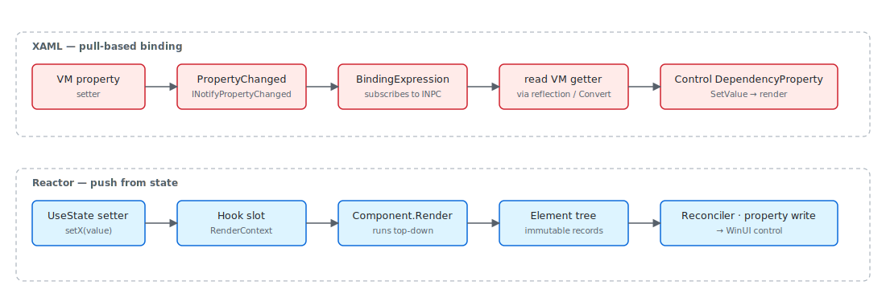

> **WinUI reference:** For the full property surface and design guidance, see [Winui3](https://learn.microsoft.com/en-us/windows/apps/winui/winui3/).

If you've spent years inside XAML, the question that keeps coming back
is "where did my bindings go?" Microsoft.UI.Reactor (Reactor) renders the same WinUI controls
your XAML pages renders — `Button`, `TextBox`, `TabView`,
`ItemsRepeater` — and lays them out through the same panels.
What changes is the source of truth for property values. In XAML, a
control owns its dependency properties, and a binding expression
listens to a view-model property and pulls the new value when
`PropertyChanged` raises. In Reactor, a hook owns the state, the
component re-renders to produce a new element tree, and the reconciler
writes the property values onto the existing control. The two models
solve the same problem (keep UI in sync with state) but locate the
work in opposite places. Read this page once and the rest of the
codebase falls into place: nothing in [Architecture
Overview](architecture-overview.md), [Hooks Internals](hooks-internals.md),
or [Reconciliation](reconciliation.md) hides a binding system.

# Reactor vs XAML

This page is for the XAML developer who wants the *why*. The
[Reactor for XAML Developers](xaml-developers.md) cookbook covers the
*how* for common rewrite tasks ("I have a `Page` with bindings; what
does that become?"). Indexed in two places: section 1 (Get Started)
so a XAML developer hitting the docs cold finds it early, and section
9 (Under the hood) so it sits next to the architecture pages it
complements.

## Pull vs push, one diagram



| Concern | XAML | Reactor |
|---|---|---|
| State location | View-model property / dependency property | Hook slot inside `RenderContext` |
| State signal | `INotifyPropertyChanged.PropertyChanged` | Setter closure from `UseState` |
| Property write | `BindingExpression.UpdateTarget` pulls VM getter | Reconciler writes after render |
| Style application | `Style` + `Setter` + triggers | Modifier chain or `Use*` named-style hook |
| Animation | `Storyboard` defined in XAML, started imperatively | `.WithAnimation(...)` modifier resolved by reconciler |
| Layout state | `VisualStateManager` + `VisualState`/Group XAML | `.InteractionStates(...)` modifier on element |
| Resources | `ResourceDictionary` / `ThemeDictionary` | [`ThemeRef`](theming-tokens.md) record struct |
| Lists | `ItemsControl` + `DataTemplate` | `ForEach(items, item => …)` builds element per item |
| MVVM | View-model class with INPC properties | Function or class component with hooks |

Every row below explains the mapping in enough depth that the
mechanical translation isn't a guess.

> **Caveat:** The pull/push contrast is a runtime distinction, not a feature
> checklist. Reactor still uses dependency properties — every WinUI
> control it materializes has its DPs set by the reconciler. What's gone
> is the binding *expression* that listens to a VM and pulls. If you
> attach a `{Binding}` to a control Reactor materialized (via an
> [ElementRef](hooks-internals.md) cast or by setting it imperatively in
> an effect), you'll create a parallel reactive edge the reconciler
> doesn't know about, and the next reconcile pass will overwrite your
> property write. Drive properties through hook state and let the
> reconciler write them; do not bind onto controls Reactor owns.

## DependencyProperty → element record + modifier

XAML's dependency property system is the substrate for everything
reactive in WinUI: bindings hang off DPs, styles set DPs, animations
animate DPs, the `VisualStateManager` flips DPs. The DP itself is a
slot on a control, with a metadata-driven default value, type
coercion, change notifications, and inheritance through the visual
tree. A `Button.Content` value is a DP; a `Grid.Row` attached
property is a DP; theme colors come out of a DP-flavored resource
system.

```csharp
public abstract record Element
{
    /// <summary>
    /// Optional key for stable identity across re-renders (like React's key prop).
    /// When set, the reconciler uses it to match elements across list reorderings.
    /// </summary>
    public string? Key { get; init; }

    /// <summary>
    /// Layout modifiers (margin, padding, size, alignment, etc.) applied to this element.
    /// Set via fluent extension methods: Text("hi").Margin(10).Width(200)
    /// Modifiers are stored inline so the concrete element type is preserved through chaining.
    /// </summary>
    public ElementModifiers? Modifiers { get; init; }
```

Reactor replaces the DP-slot-on-the-control with the
`Element` record. `ButtonElement` (a `record` deriving from
`Element`) carries `Content`, `OnClick`, etc. as record fields. The
modifier system folds layout and styling concerns into a separate
[`ElementModifiers`](modifier-system.md) record threaded through
record `with` updates. Attached properties (Grid.Row, Canvas.Left)
live in a type-keyed `Attached` dictionary on the same record.

```csharp
private static T Modify<T>(T el, ElementModifiers mods) where T : Element =>
    el with { Modifiers = el.Modifiers is not null ? el.Modifiers.Merge(mods) : mods };

private static T ModifyA11y<T>(T el, AccessibilityModifiers a11y) where T : Element
{
    var existing = el.Modifiers?.Accessibility;
    var merged = existing is not null ? existing.Merge(a11y) : a11y;
    return Modify(el, new ElementModifiers { Accessibility = merged });
}

private static T ModifyTheme<T>(T el, string property, ThemeRef theme) where T : Element
{
    var bindings = el.ThemeBindings is not null
        ? new Dictionary<string, ThemeRef>(el.ThemeBindings) { [property] = theme }
        : new Dictionary<string, ThemeRef> { [property] = theme };
    return el with { ThemeBindings = bindings };
}
```

The chain `Text("hi").FontSize(24).Margin(8)` produces one
`TextElement` record with merged `Modifiers`. The reconciler reads
both the typed fields and the modifiers when it patches the control.
There is no per-property change notification: the comparison is
record-level on the next render, and only differences become property
writes.

## Binding → closure over state

A `{Binding Name}` in XAML installs a `BindingExpression` that holds
a reference to the view model and the property path, subscribes to
`INotifyPropertyChanged`, and on each `PropertyChanged` raise reads
the source and writes the target DP. The binding is a long-lived
object; mode (`OneWay`, `TwoWay`, `OneTime`), update trigger, converter,
and fallback all live on it.

```csharp
public (T Value, Action<T> Set) UseState<T>(T initialValue, bool threadSafe = false)
{
    if (_hookIndex >= _hooks.Count)
    {
        _hooks.Add(new ValueHookState<T>(initialValue, threadSafe));
    }

    var currentIndex = _hookIndex;
    _hookIndex++;

    if (_hooks[currentIndex] is not ValueHookState<T> hook)
        throw new HookOrderException(
            $"Hook at index {currentIndex} is {_hooks[currentIndex].GetType().Name}, expected ValueHookState<{typeof(T).Name}> (UseState). " +
            "Hooks must be called in the same order every render.");
```

Reactor doesn't install anything. `TextBlock(name)` reads the current
value of `name` (a plain C# variable that happens to come out of
`UseState`) and produces a `TextElement` with `Text = name` as a
record field. When `name` changes, the setter writes the slot, the
component re-renders, the new `TextElement` differs from the old, and
the reconciler writes the new `Text` value onto the existing
`TextBlock`. There is no binding object — the closure that produces
the element is the binding.

`TwoWay` shows up as the controlled-input pattern. A `TextBox` takes
the current value and a setter callback; the user's input fires the
callback, which writes the slot, which re-renders, which writes the
new value back into the `TextBox`. Mode is implicit in whether you
pass a setter.

## DataTemplate → function component

A `DataTemplate` is a recipe: given a data item, produce a control
tree. It's authored in XAML and instantiated by the framework when
items appear in an `ItemsControl`. The template can name elements
and bind to properties on the item; the runtime keeps a pool and
recycles.

```csharp
ForEach(items, item => Card(item))
```

The closure `item => Card(item)` is the template. It runs once per
item per render, produces an element tree, and the [child
reconciler](reconciliation.md) matches the elements against the
previous render. Identity comes from position by default; `.WithKey(id)`
on the item element preserves identity across reorders.
[`ItemsRepeater`](collections.md) is still under the hood — the
`ForEach` materializes through an `ElementFactory` that recycles the
real WinUI controls.

## Style → modifier composition / named style

`Style` in XAML applies a bag of property setters to every control
that matches a `TargetType` (or carries the style key). The bag is
keyed by DP, and `BasedOn` chains styles through inheritance.

Reactor has two analogues. The most common is a plain method that
takes an element and applies modifiers:

```csharp
static Element CardSurface(Element child) =>
    child.Background(Theme.CardBackground).CornerRadius(8).Padding(16);
```

Calling `CardSurface(Text("hi"))` returns the modified element. This
is just composition — no framework involvement, no static
registration, no `Style.TargetType` check at runtime.

For widely-reused style bundles, the [styling](styling.md) page
documents the `UseNamedStyle` hook and the `.Named()` modifier, which
let you declare a named bag of modifiers once and apply it across the
app. Theme-aware brush properties resolve through
[`ThemeRef`](theming-tokens.md) at reconcile time.

## ResourceDictionary → ThemeRef + Theme tokens

```csharp
public readonly record struct ThemeRef(string ResourceKey)
{
    public override string ToString() => $"ThemeRef({ResourceKey})";

    /// <summary>
    /// Resolves this theme reference using the element's actual theme.
    /// Walks the ThemeDictionaries in Application.Resources and MergedDictionaries
    /// to find the brush matching the element's effective theme (which respects
    /// per-element RequestedTheme overrides, not just the app-level theme).
    /// </summary>
    internal static Brush? Resolve(string resourceKey, FrameworkElement fe)
    {
        var themeName = GetEffectiveThemeName(fe);
        return ResolveForTheme(resourceKey, themeName);
    }
```

A `ResourceDictionary` (especially merged into `Application.Resources`)
is the XAML way to declare named resources — brushes, doubles, styles
— and reference them via `{StaticResource Key}` or `{ThemeResource Key}`.
The latter resolves through the active `ThemeDictionaries[name]`.

Reactor exposes the same WinUI theme dictionaries through
`ThemeRef`, a readonly record struct holding a resource key. The
static [`Theme`](theming-tokens.md) class names the 35 most-used
tokens (`Theme.Accent`, `Theme.CardBackground`, etc.); `Theme.Ref(key)`
is the escape hatch for any other key. The reconciler walks
`Application.Resources.ThemeDictionaries` exactly the way `{ThemeResource}`
does, and re-resolves on `ActualThemeChanged` — so flipping the system
theme updates every `Theme.Accent` brush without a re-render.

## VisualStateManager → InteractionStates modifier

`VisualStateManager` in XAML drives state-machine animations: a control
declares groups of named `VisualState`s (Normal / PointerOver /
Pressed / Disabled), and a state transition triggers the storyboard
attached to the `VisualState`. Authors pick states by calling
`VisualStateManager.GoToState`.

Reactor's `.InteractionStates(...)` modifier on an element declares
per-state property overrides directly. The reconciler installs WinUI
visual-state group plumbing on the materialized control and flips
properties when the visual state changes. There is no separate
storyboard authoring; transitions are described in C# alongside the
element. See the [animation](animation.md) page for the full surface
and the [animation-pipeline](animation-pipeline.md) page for the
reconciler-side detail.

## Storyboard → WithAnimation / Animate modifier

`Storyboard` is the WinUI animation primitive: a tree of timelines
animating dependency properties over time, started imperatively or
declaratively via `VisualState`. The result is a long-lived
`AnimationCollection` attached to the control.

Reactor's `.WithAnimation(...)` and `.Animate(...)` modifiers on an
element describe the same animation as a record on the element. The
reconciler unpacks the record into either an
`ImplicitAnimationCollection` (composition-level transitions) or a
keyframe-driven property animation, depending on the mode. Stop the
animation by removing the modifier on the next render; the reconciler
detaches the collection.

## INotifyPropertyChanged → hook re-render

```csharp
public sealed class Observable<T> : INotifyPropertyChanged
{
    private T _value;

    public Observable() : this(default!) { }

    public Observable(T initial) => _value = initial;

    public T Value
    {
        get => _value;
        set
        {
            if (EqualityComparer<T>.Default.Equals(_value, value)) return;
            _value = value;
            PropertyChanged?.Invoke(this, _valueChangedArgs);
        }
    }

    public event PropertyChangedEventHandler? PropertyChanged;
```

`INotifyPropertyChanged` is XAML's contract for "this property is
observable". A binding subscribes to `PropertyChanged`; raising it
re-pulls. Reactor's `UseObservable` hook is the migration bridge:
hand it an existing `INotifyPropertyChanged` object, and the component
subscribes for the lifetime of the hook and re-renders on
`PropertyChanged`. For pure Reactor state you never declare
`INotifyPropertyChanged` — the hook setter is the signal.

## MVVM ViewModel → component state + UseObservable bridge

The MVVM ViewModel is the place XAML developers put "things the page
needs to display and the commands the page can issue". It implements
`INotifyPropertyChanged`, holds `ICommand` instances, and stays alive
across navigations.

Reactor doesn't separate VM from View. State lives in the component,
in hooks. Commands are functions you close over. Pages persist via
[`UsePersistedState`](persistence.md), not via a long-lived VM. When
you need a VM-shaped object — for shared logic across components,
for an existing service-layer model — author a plain class, raise
`PropertyChanged` (or wrap a value in [`Observable<T>`](#)), and let
each consuming component subscribe via `UseObservable`. The component
still owns its rendered slice of state; the VM is the source.

## Patterns

### Porting a XAML page

The mechanical translation has four steps:

1. **Identify VM properties used in the page.** Each becomes a `UseState`
   (component-local) or a `UseObservable` over an existing INPC source.
2. **Translate the XAML markup tree.** Outer panel → `VStack` / `HStack`
   / `Grid`; named elements stay positional inside the render; styles
   become modifier chains.
3. **Translate bindings into closures.** `{Binding Name}` → just read
   the variable. `Mode=TwoWay` → controlled-input pair `(value, setter)`.
4. **Translate commands.** An `ICommand` becomes a regular function,
   typically captured by the click handler closure. The
   [commanding](commanding.md) page documents the explicit shape if
   the command must be sharable.

```csharp
public (T Value, Action<T> Set) UseState<T>(T initialValue, bool threadSafe = false)
{
    if (_hookIndex >= _hooks.Count)
    {
        _hooks.Add(new ValueHookState<T>(initialValue, threadSafe));
    }

    var currentIndex = _hookIndex;
    _hookIndex++;

    if (_hooks[currentIndex] is not ValueHookState<T> hook)
        throw new HookOrderException(
            $"Hook at index {currentIndex} is {_hooks[currentIndex].GetType().Name}, expected ValueHookState<{typeof(T).Name}> (UseState). " +
            "Hooks must be called in the same order every render.");
```

The [Reactor for XAML Developers](xaml-developers.md) cookbook has
worked examples for the most common page shapes: settings, list-detail,
modal dialog. Use that as the recipe surface; this page is for when
you want to understand what's happening underneath.

## Common Mistakes

### Implementing INPC on local state out of habit

```csharp
// Don't:
public class ProfilePage : Component, INotifyPropertyChanged
{
    private string _name = "";
    public string Name
    {
        get => _name;
        set { _name = value; PropertyChanged?.Invoke(this, new(nameof(Name))); }
    }
    public event PropertyChangedEventHandler? PropertyChanged;
}
```

```csharp
public (T Value, Action<T> Set) UseState<T>(T initialValue, bool threadSafe = false)
{
    if (_hookIndex >= _hooks.Count)
    {
        _hooks.Add(new ValueHookState<T>(initialValue, threadSafe));
    }

    var currentIndex = _hookIndex;
    _hookIndex++;

    if (_hooks[currentIndex] is not ValueHookState<T> hook)
        throw new HookOrderException(
            $"Hook at index {currentIndex} is {_hooks[currentIndex].GetType().Name}, expected ValueHookState<{typeof(T).Name}> (UseState). " +
            "Hooks must be called in the same order every render.");
```

The framework doesn't subscribe to `PropertyChanged` on a component —
re-renders come from `UseState` setters or parent re-renders. The
field is invisible to the render loop, so updating `Name` does
nothing. Move the value into `UseState` and the setter is the signal;
the INPC ceremony goes away.

## Tips

**Bindings don't exist.** When you find yourself wondering "how do I
bind this", stop and ask "what state does this property read from?"
The answer is a `UseState`, a `UseObservable`, or a prop — and the
control just reads the variable.

**`ThemeRef` is your `{ThemeResource}`.** Anywhere you'd reach for a
themed brush from `Application.Resources`, use `Theme.Accent` or
`Theme.Ref(key)`. The reconciler resolves the brush per element and
re-resolves on theme change.

**Don't translate XAML 1:1.** A page with seven `UserControl`s and
twelve bindings often becomes a single component with four hooks. The
markup-to-code translation collapses a lot of XAML's structure
because the C# function body holds it all in one place.

## Next Steps

- **[Reactor for XAML Developers](xaml-developers.md)** — Cookbook with worked page rewrites.
- **[Architecture Overview](architecture-overview.md)** — The runtime diagram that places everything here.
- **[Theming Tokens](theming-tokens.md)** — Full `ThemeRef` surface.
- **[Hooks](hooks.md)** — The state-handling API surface.
- **[Reactivity Model](reactivity-model.md)** — Why the push direction is the way it is.
