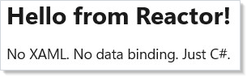
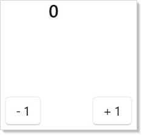
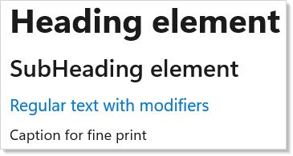

# Reactor

Microsoft.UI.Reactor (Reactor) is a declarative UI framework for building native Windows desktop apps in
pure C#. No XAML. No data binding. No view models. You describe your UI as a
function of state, and Reactor keeps the screen in sync.

| If you want to... | Start here |
|-------------------|------------|
| Build your first Reactor app | [Getting Started](getting-started.md) |
| Understand the mental model | [Thinking in Reactor](thinking-in-reactor.md) |
| Port a XAML/WinUI/WPF app | [Reactor for XAML Developers](xaml-developers.md) |
| Look up a hook or modifier | [API Reference](reference/hooks/index.md) |
| Read how the runtime works | [Architecture Overview](architecture-overview.md) |

## Why Reactor?

**Pure C# from top to bottom.** Your entire app — layout, styling, state,
logic — lives in `.cs` files. No markup languages, no code-behind split, no
designer files.

**Declarative rendering.** You write a `Render()` method that returns your UI.
When state changes, Reactor diffs the old and new element trees and patches only
what changed in the native WinUI controls.

**Hooks for state management.** `UseState`, `UseReducer`, `UseEffect`, and
friends give you React-style state management without the JavaScript.

**Native performance.** Reactor renders to real WinUI 3 controls. Your app is a
standard Windows desktop app — no web views, no Electron, no interpretation
layer.

## Quick Look

A complete Reactor app in one file:

```csharp
class HelloWorld : Component
{
    public override Element Render()
    {
        return VStack(12,
            TextBlock("Hello from Reactor!").FontSize(24).Bold(),
            TextBlock("No XAML. No data binding. Just C#.")
        ).Padding(24);
    }
}
```



State and interactivity in a few lines:

```csharp
class QuickCounter : Component
{
    public override Element Render()
    {
        var (count, setCount) = UseState(0);

        return HStack(8,
            Button("- 1", () => setCount(count - 1)),
            TextBlock($"{count}").FontSize(20).SemiBold().Width(40)
                .HAlign(HorizontalAlignment.Center),
            Button("+ 1", () => setCount(count + 1))
        ).Padding(24);
    }
}
```



Built-in text styling:

```csharp
class StyledText : Component
{
    public override Element Render()
    {
        return VStack(8,
            Heading("Heading element"),
            SubHeading("SubHeading element"),
            TextBlock("Regular text with modifiers")
                .FontSize(14).Foreground("#0078D4"),
            Caption("Caption for fine print")
        ).Padding(24);
    }
}
```



## How It Works

1. You define [**components**](components.md) — classes with a `Render()` method that returns
   an element tree.
2. You manage state with [**hooks**](hooks.md) — `UseState`, `UseReducer`, `UseEffect`,
   and more — called inside `Render()`.
3. When state changes, Reactor calls `Render()` again, diffs the result, and
   updates only the WinUI controls that changed.

That's it. No event subscriptions to manage, no property-changed notifications
to wire up, no dispatcher threading to worry about.

## Documentation

The docset is organized as ten sections, working from "first app on screen" to
"how the runtime is built". XAML developers should read sections 1, 8, and 9
first; everyone else can follow the order.

### 1. Get Started

- **[Getting Started](getting-started.md)** — Create your first app, manage state, build a todo list
- **[Thinking in Reactor](thinking-in-reactor.md)** — Mental-model essay: UI as a function of state
- **[Reactor for XAML Developers](xaml-developers.md)** — Migration cookbook: XAML, bindings, MVVM, navigation
- **[Reactor vs XAML](reactor-vs-xaml.md)** — Architectural essay: DependencyProperty → modifier, Binding → closure

### 2. Learn the framework

- **[Components](components.md)** — Component classes, props, function components, composition
- **[Hooks](hooks.md)** — UseState, UseReducer, UseEffect, UseMemo, UseRef, UseCallback
- **[Effects and Lifecycle](effects.md)** — UseEffect patterns, cleanup, async work, timers
- **[Context](context.md)** — Share state across the component tree without prop drilling
- **[Commanding](commanding.md)** — Commands, keyboard shortcuts, async actions
- **[Advanced Patterns](advanced.md)** — ErrorBoundary, Memo, observable binding, performance tuning

### 3. UI surface

- **[Layout](layout.md)** — VStack, HStack, Grid, ScrollView, Border, responsive patterns
- **[Flex Layout](flex-layout.md)** — Flexible box layout for adaptive UIs
- **[Styling and Theming](styling.md)** — Colors, typography, dark/light themes, custom styles
- **[Animation](animation.md)** — Transitions, keyframes, interaction states, choreography
- **[Input and Gestures](input-and-gestures.md)** — Pointer events, taps, gestures, access keys

### 4. Controls catalog

- **[Controls](controls.md)** — Thumbnail-indexed catalog of every control
- **[Forms and Input](forms.md)** — Text fields, checkboxes, sliders, validation, data entry
- **[Collections](collections.md)** — ListView, LazyVStack, VirtualList for large datasets
- **[Text and Media](text-and-media.md)** — TextBlock, MarkdownTextBlock, Image, MediaPlayerElement, WebView2, InkCanvas
- **[Status and Info](status-and-info.md)** — InfoBar, InfoBadge, ProgressBar, TeachingTip, PipsPager
- **[Dialogs and Flyouts](dialogs-and-flyouts.md)** — ContentDialog, MenuFlyout, CommandBarFlyout, Popup
- **[Data System](data-system.md)** — DataGrid with sort, filter, search, inline editing
- **[Charting](charting.md)** — Line, bar, area, pie charts with the ReactorCharting library

### 5. App architecture

- **[Navigation](navigation.md)** — NavigationView, TabView, multi-page apps, routing
- **[Windows](windows.md)** — Top-level windows, tray icons, OpenWindow, shutdown policy
- **[Async Resources](async-resources.md)** — `UseResource`, `UseInfiniteResource`, `UseMutation`, `Pending`
- **[Persistence](persistence.md)** — UsePersisted, scopes, migration
- **[Localization](localization.md)** — Multi-language support, resource strings, RTL layouts
- **[Accessibility](accessibility.md)** — Screen readers, keyboard navigation, focus trapping, runtime scanning

### 6. Patterns & recipes

- **[Recipes](recipes/index.md)** — Gallery of end-to-end patterns (login, master-detail, paginated list, command palette, …)
- **[Cheat Sheet](cheat-sheet.md)** — Single-page reference card
- **[Rules of Reactor](rules-of-reactor.md)** — Hook rules, render purity, anti-patterns
- **[Theming Tokens](theming-tokens.md)** — Full token catalog with swatches

### 7. Tooling & process

- **[Dev Tooling](dev-tooling.md)** — `mur` CLI, MCP server, VS Code panel, dotnet watch, in-app dev menu
- **[Testing](testing.md)** — Headless renderer, snapshot tests, async test patterns
- **[Performance](performance.md)** — ETW, EventDispatch, flame graphs
- **[Packaging](packaging.md)** — MSIX, single-file, ARM64, AOT considerations

### 8. Interop & integration

- **[WinForms Interop](winforms-interop.md)** — Host Reactor components inside WinForms apps via XAML Islands
- **[WPF Interop](wpf-interop.md)** — Host Reactor components inside WPF apps

(XAML migration lives in [Section 1](#1-get-started) — XAML developers are a primary entry path.)

### 9. Under the hood

The runtime explained — for readers who want to know *why* it works the way it
does, not just how to use it.

- **[Architecture Overview](architecture-overview.md)** — Declarative shell → element records → reconciler → WinUI tree
- **[Reactivity Model](reactivity-model.md)** — setState → re-render; why hooks not INotifyPropertyChanged
- **[Reactor vs XAML](reactor-vs-xaml.md)** — (also in §1) the architectural essay
- **[Hooks Internals](hooks-internals.md)** — Hook slot table, dispatcher, closure capture
- **[Reconciliation](reconciliation.md)** — Element-record diff, identity, the three phases
- **[Element Pool](element-pool.md)** — Allocation reduction under scroll-heavy lists
- **[Effects Scheduling](effects-scheduling.md)** — When effects run; dep semantics; cleanup ordering
- **[Threading and Dispatch](threading-and-dispatch.md)** — UI-thread invariants, trampoline, batched renders
- **[Source Mapping](source-mapping.md)** — How stack traces and devtools attribute work back to user source
- **[Modifier System](modifier-system.md)** — How `.FontSize(24).Bold()` actually works
- **[Analyzer Architecture](analyzer-architecture.md)** — Roslyn analyzers shipped with Reactor; authoring your own
- **[DevTools Internals](devtools-internals.md)** — Dev menu, reconcile-highlight, layout-cost overlay, MCP protocol
- **[Animation Pipeline](animation-pipeline.md)** — Composition API end-to-end; 4 animation systems
- **[Focus and Input Internals](focus-and-input-internals.md)** — `UseFocus` dispatcher, `FocusTrap` container, pointer event flow
- **[Perf Instrumentation](perf-instrumentation.md)** — ETW sources, frame-aligned sampling, layout-cost attribution

### 10. API Reference

Auto-generated from XML doc comments in `src/Reactor*/`. Each member gets a
uniform Summary / Parameters / Returns / Discussion / Examples / See Also page.

- **[Hooks](reference/hooks/index.md)** — every `Use*` hook
- **Factories** — every element factory (coming soon)
- **Modifiers** — every chainable modifier (coming soon)
- **Elements** — every Element record type (coming soon)
- **System** — App, Window, Navigation, Context, Command (coming soon)

## Minimal Project Setup

Create a console project, then edit the `.csproj`:

<!-- ai:lock -->
```xml
<Project Sdk="Microsoft.NET.Sdk">
  <PropertyGroup>
    <OutputType>WinExe</OutputType>
    <TargetFramework>net10.0-windows10.0.22621.0</TargetFramework>
    <UseWinUI>true</UseWinUI>
    <WindowsPackageType>None</WindowsPackageType>
  </PropertyGroup>
  <ItemGroup>
    <PackageReference Include="Microsoft.WindowsAppSDK" Version="2.0.*" />
    <ProjectReference Include="..\Reactor\Reactor.csproj" />
  </ItemGroup>
</Project>
```
<!-- /ai:lock -->

Replace `App.cs` with a component and a `ReactorApp.Run<T>()` call, and run with
`dotnet run`. That's your first Reactor app.

## Tips

**Start with function components.** For quick experiments, use
`ReactorApp.Run("Title", ctx => { ... })` — no class needed.

**Read the [hooks page](hooks.md).** Hooks are the core of Reactor. Understanding `UseState`
and `UseEffect` unlocks everything else.

**Keep components small.** Extract pieces into their own components early.
Composition is always easier to reason about than a single giant `Render()`.

## Next Steps

- **[Getting Started](getting-started.md)** — Build your first app, manage state, ship a todo list.
- **[Hooks](hooks.md)** — `UseState`, `UseEffect`, `UseMemo`, and the rest of the core state primitives.
- **[Components](components.md)** — Component classes, props, and function components in detail.
- **[Reactor for XAML Developers](xaml-developers.md)** — Migration cookbook for XAML, bindings, MVVM, and navigation.
