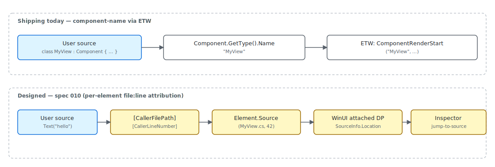

# Source Mapping

"Source mapping" in Reactor is the chain that ties a runtime artifact —
an ETW event, a `--preview` overlay highlight, a thrown exception —
back to the C# source that produced it. Today, attribution is at the
*component* granularity: every render emits an ETW event carrying the
component's type name, and exceptions log with the same name plus the
exception type. Spec 010 designs the next step — per-*element* source
tagging via `[CallerFilePath]` / `[CallerLineNumber]` attributes on
the DSL factories, plumbed onto realized WinUI controls through an
attached `DependencyProperty`. This page covers what's emitted now and
how the design layers on top of it.

> **Status.** Per-element source tagging (`Element.Source`,
> `SourceInfo.LocationProperty`) is **designed but not implemented**.
> The reference for the design is
> [spec 010](../specs/010-source-mapping-design.md). This page treats
> it as the next-step plan, not current behavior. Component-name
> attribution via ETW is shipping today and is documented below.

## Component-name attribution via ETW

Every `ComponentRender` boundary emits an ETW event keyed by the
component's CLR type name. The keyword `Render` gates the events so
consumers can subscribe to just the render channel:

```csharp
public static class Keywords
{
    public const EventKeywords Reconcile = (EventKeywords)0x1;
    public const EventKeywords Render = (EventKeywords)0x2;
    public const EventKeywords State = (EventKeywords)0x4;
    public const EventKeywords Mcp = (EventKeywords)0x8;
    public const EventKeywords Lifecycle = (EventKeywords)0x10;
    public const EventKeywords Errors = (EventKeywords)0x20;
    public const EventKeywords EventDispatch = (EventKeywords)0x40;
}
```

`ComponentRenderStart` / `ComponentRenderStop` fire with
`componentName = node.Component?.GetType().Name`. That string is the
attribution token that flows into PerfView / `dotnet-trace` /
`xperf`, and it is the same string [`devtools-internals`](devtools-internals.md)
uses to label overlay frames. Per-component, not per-element — but
sufficient for the common question "which component is re-rendering
on every tick".



## Reconcile-pass attribution

| Signal | Granularity | Where it surfaces |
|---|---|---|
| `ComponentRenderStart` / `Stop` | Component CLR type name | ETW `Render` keyword |
| `ReconcileStart` / `Stop` | Root element type + diff counters | ETW `Reconcile` keyword |
| `EffectsFlushStart` / `Stop` | Component CLR type name | ETW `Render` keyword |
| `StateChange` | Hook kind + value type | ETW `State` keyword |
| `RenderError` | Component name + exception type only (message redacted) | ETW `Errors` keyword |
| Per-element file:line | **Designed (spec 010)** — not shipping | Future: `Element.Source` + `SourceInfo.LocationProperty` |

The reconcile pass also emits a counter summary on stop:

```csharp
[Event(2, Level = EventLevel.Informational, Keywords = Keywords.Reconcile,
    Task = Tasks.Reconcile, Opcode = EventOpcode.Stop,
    Message = "Reconcile stop (diffed={elementsDiffed}, skipped={elementsSkipped}, created={uiElementsCreated}, modified={uiElementsModified})")]
public void ReconcileStop(int elementsDiffed, int elementsSkipped, int uiElementsCreated, int uiElementsModified)
{
    if (IsEnabled(EventLevel.Informational, Keywords.Reconcile))
        WriteEvent(2, elementsDiffed, elementsSkipped, uiElementsCreated, uiElementsModified);
}
```

`elementsDiffed` / `elementsSkipped` / `uiElementsCreated` /
`uiElementsModified` give a frame-level view of how much actual work
the reconciler did. None of these carry a source location — they're
aggregate counters — but pairing them with the component start/stop
events tells you "this component rendered, the reconciler touched N
elements, and Y of them resulted in real WinUI writes."

## Why ETW attribution stops at the component

The reconciler hand-rolls per-mount calls into `MountXxx` handlers,
each of which constructs a fresh WinUI control. The handler doesn't
know which user line called `Text("hello")`:

```csharp
public abstract class Component
{
    internal RenderContext Context { get; } = new();

    /// <summary>
    /// Override to describe the UI. Use UseState, UseEffect, etc. from the context.
    /// Must call hooks in the same order every render.
    /// </summary>
    public abstract Element Render();

    /// <summary>
    /// Controls whether this propless component should re-render when its parent re-renders.
    /// Default: false — propless components only re-render from their own state changes or context changes.
    /// Override and return true to always re-render when the parent re-renders.
    /// </summary>
    protected internal virtual bool ShouldUpdate() => false;
```

`Component.Render()` returns an `Element` tree the reconciler walks;
the element records currently carry `Key`, `Modifiers`, `Attached`,
event handlers, and metadata — but no source location. The component
type name is the closest available attribution because the reconciler
has the `Component` instance in hand; everything finer would require
the element to carry the location, which is exactly what spec 010
adds.

## The spec 010 design at a glance

Spec 010 settles on two coordinated pieces:

1. **CallerInfo on the DSL.** Every factory method
   (`Text(string)`, `Button(...)`, `VStack(...)`) gains optional
   trailing `[CallerFilePath]` / `[CallerLineNumber]` parameters. C#
   bakes the values into IL as constants, so call sites stay
   `Text("Hello")` and the runtime cost is zero. A `SourceLocation`
   value rides on the element record (`Element.Source`).
2. **Attached property on the WinUI control.** During reconcile, the
   location string is written to a custom attached
   `DependencyProperty` on the realized control, where the XAML Live
   Visual Tree, the `--preview` inspector, and the
   [devtools overlay](devtools-internals.md) can read it.

The result is a runtime where right-clicking a `Button` in the
preview inspector navigates to the `Button("Save", …)` call in C#,
the same way Flutter's widget inspector navigates to a `Widget`
constructor. Until that ships, attribution stops at the component
name.

## Tips

**For now, lean on the component name.** Wrap chunks of UI in
purpose-named components — `<UserCard>`, `<RegisterForm>`,
`<NotificationBadge>` — and the ETW events will identify them.
Inline anonymous `Func`-component lambdas show up as
`FuncElement` in traces, which is almost never what you want.

**`RenderError` redacts the message on purpose.** TASK-064 strips
`ex.Message` from the ETW payload because exception messages can
carry absolute paths, env values, and form values. Apps that want
richer diagnostics should log through their own pipeline (ETL/disk
under their own ACL) rather than the `Microsoft-UI-Reactor` provider.

**PerfView gives you the full sequence.** `Microsoft-UI-Reactor` is a
managed `EventSource`, so it surfaces on both EventPipe
(`dotnet-trace`) and classic ETW (PerfView / xperf / WPA). When you
need to correlate Reactor renders with native WinUI events
(`Microsoft-Windows-XAML`), only ETW carries both — EventPipe doesn't
flow native providers.

**Watch the design before designing around it.** Spec 010 owns the
per-element story and several Phase 4 surfaces (preview inspector,
layout-cost overlay, reconcile-highlight) wait on it. Don't fork a
parallel attribution scheme; track the spec.

## Next Steps

- **[Devtools internals](devtools-internals.md)** — Where the preview inspector will consume `SourceLocation` once it lands.
- **[Perf instrumentation](perf-instrumentation.md)** — Same ETW pipeline, focused on the timing axis.
- **[Architecture overview](architecture-overview.md)** — How the render-loop produces the events documented here.
- **[Spec 010 — Source mapping design](../specs/010-source-mapping-design.md)** — The full design reference.
