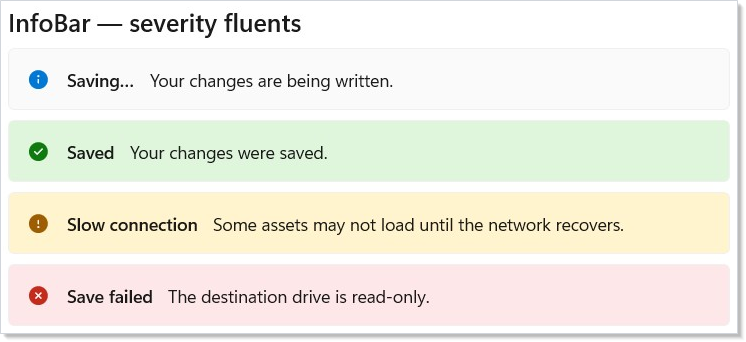
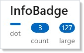
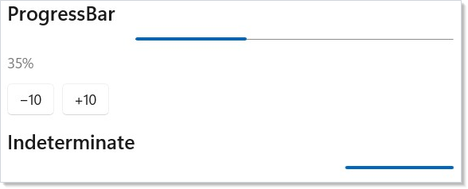
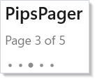

> **WinUI reference:** For the full property surface and design guidance, see [Controls](https://learn.microsoft.com/en-us/windows/apps/design/controls/).

# Status and Info

Status and info controls report what the app is doing without stealing
focus. Reach for them when the user needs to know something — a save
succeeded, a long operation is running, a feature exists — and doesn't
need to decide anything. For controls that demand a choice
(Save / Discard / Cancel), use [Dialogs and Flyouts](dialogs-and-flyouts.md).

## Reference

| Control | Factory | Purpose |
|---|---|---|
| `InfoBar` | `InfoBar(title?, message?)` | App-level message banner with severity. |
| `InfoBadge` | `InfoBadge()` / `InfoBadge(int)` | Notification count or presence dot. |
| `ProgressBar` | `Progress(double)` / `ProgressIndeterminate()` | Linear progress, determinate or indeterminate. |
| `ProgressRing` | `ProgressRing()` / `ProgressRing(double)` | Spinner / determinate ring. |
| `TeachingTip` | `TeachingTip(title, subtitle?)` | One-shot guided callout anchored to a control. |
| `PipsPager` | `PipsPager(count, index, onChanged?)` | Compact paginator dots. |
| `PersonPicture` | `PersonPicture()` | Contact avatar — display name, initials, or image. |
| `RatingControl` | `RatingControl(value, onChanged?)` | 0–5 star rating. |

## InfoBar

`InfoBar` is the right control for an app-level message that the user
should notice but doesn't have to act on. The severity fluents
(`.Informational()`, `.Success()`, `.Warning()`, `.Error()`) set the
icon, color, and accessibility role in one call:

```csharp
class InfoBarSeveritiesDemo : Component
{
    public override Element Render() => VStack(8,
        SubHeading("InfoBar — severity fluents"),
        InfoBar("Saving…", "Your changes are being written.")
            .Informational().IsClosable(false),
        InfoBar("Saved", "Your changes were saved.")
            .Success().IsClosable(false),
        InfoBar("Slow connection",
            "Some assets may not load until the network recovers.")
            .Warning().IsClosable(false),
        InfoBar("Save failed",
            "The destination drive is read-only.")
            .Error().IsClosable(false)
    ).Padding(24);
}
```



| Fluent | Effect |
|---|---|
| `.Informational()` / `.Success()` / `.Warning()` / `.Error()` | Sets `Severity` + paired icon/color. |
| `.IsClosable(bool)` | Toggle the dismiss button. |
| `.IconSource(IconData)` | Override the severity icon. |
| `.Content(Element)` | Render rich content (links, embedded controls) below the message. |
| `.ActionButtonClick(Action)` | Subscribe to the trailing action button. |
| `.Closed(Action)` | Fires when the user dismisses. |

`IsOpen` defaults to `true`, so a bare `InfoBar(...)` is visible
immediately. For a dismissible bar that can re-open, treat `IsOpen` as
controlled state — own the `bool`, set it to `false` on `OnClosed`, and
flip it back to `true` when conditions change:

```csharp
class InfoBarDismissDemo : Component
{
    public override Element Render()
    {
        // InfoBar is a controlled component — you own the IsOpen flag,
        // and you reset it via the OnClosed callback the user dismiss
        // raises.
        var (open, setOpen) = UseState(true);

        return VStack(8,
            SubHeading("Dismiss and re-open"),
            InfoBar("Tip", "InfoBar uses controlled visibility.") with
            {
                IsOpen = open,
                IsClosable = true,
                OnClosed = () => setOpen(false),
                Severity = Microsoft.UI.Xaml.Controls.InfoBarSeverity.Informational,
            },
            Button("Show again", () => setOpen(true)).IsEnabled(!open)
        ).Padding(24);
    }
}
```

WinUI design page: [Info bar](https://learn.microsoft.com/en-us/windows/apps/design/controls/infobar).

## InfoBadge

`InfoBadge` is the dot or count that decorates a `NavigationViewItem`,
tab, or any element with a notification. Pass an `int` for a count;
omit the argument for a presence-only dot:

```csharp
class InfoBadgeDemo : Component
{
    public override Element Render() => VStack(8,
        SubHeading("InfoBadge"),
        HStack(16,
            // Dot variant — no value, just a presence indicator.
            VStack(4,
                InfoBadge(),
                TextBlock("dot").FontSize(11).Opacity(0.6)),
            // Numeric — common for unread counts.
            VStack(4,
                InfoBadge(3),
                TextBlock("count").FontSize(11).Opacity(0.6)),
            VStack(4,
                InfoBadge(127),
                TextBlock("large").FontSize(11).Opacity(0.6))
        )
    ).Padding(24);
}
```



`InfoBadgeElement.Value` is nullable — large counts (≥100) render as
"99+" by the underlying WinUI control. Use `.Set(b => b.Icon = ...)`
when you need a custom glyph instead of a numeric value.

WinUI design page: [Info badge](https://learn.microsoft.com/en-us/windows/apps/design/controls/info-badge).

## ProgressBar and ProgressRing

`Progress(value)` returns a determinate bar; `ProgressIndeterminate()`
returns an indeterminate bar. `ProgressRing(value)` and `ProgressRing()`
are the ring counterparts. Pick the bar for known-duration work in a
strip of horizontal real estate (uploads, downloads, batch progress);
pick the ring for unknown-duration spinners next to a label
("Loading…"):

```csharp
class ProgressBarDemo : Component
{
    public override Element Render()
    {
        var (value, setValue) = UseState(35.0);

        return VStack(12,
            SubHeading("ProgressBar"),
            Progress(value).Width(320),
            TextBlock($"{value:0}%").Opacity(0.6),
            HStack(8,
                Button("−10", () => setValue(Math.Max(0, value - 10))),
                Button("+10", () => setValue(Math.Min(100, value + 10)))
            ),
            // Indeterminate — no value argument.
            SubHeading("Indeterminate"),
            ProgressIndeterminate().Width(320)
        ).Padding(24);
    }
}
```



```csharp
class ProgressRingDemo : Component
{
    public override Element Render() => VStack(12,
        SubHeading("ProgressRing"),
        // Determinate ring at 60%.
        ProgressRing(0.6).Width(48).Height(48),
        // Indeterminate spinner.
        ProgressRing().IsActive().Width(48).Height(48)
    ).Padding(24);
}
```

The `value` argument is 0–100 for `Progress(double)` and 0–1 for
`ProgressRing(double)` — same convention as the underlying WinUI
controls. The `ProgressBar` factory is the deprecated legacy name; use
`Progress` and `ProgressIndeterminate` for new code (spec 039 §5).

WinUI design pages: [Progress controls](https://learn.microsoft.com/en-us/windows/apps/design/controls/progress-controls).

## TeachingTip

`TeachingTip` is a one-shot guided callout — "did you know this menu
exists?" — anchored next to a target control. Like `InfoBar`, it uses
controlled `IsOpen`:

```csharp
class TeachingTipDemo : Component
{
    public override Element Render()
    {
        var (show, setShow) = UseState(false);

        return VStack(12,
            SubHeading("TeachingTip"),
            Button("Show tip", () => setShow(true)),
            TeachingTip("Try the new sort menu",
                "Sort across multiple columns by holding Shift.") with
            {
                IsOpen = show,
                OnClosed = () => setShow(false),
            }
        ).Padding(24);
    }
}
```

| Fluent | Effect |
|---|---|
| `.IconSource(IconData)` | Leading icon next to the title. |
| `.HeroContent(Element)` | Image or rich content above the title. |
| `.PreferredPlacement(mode)` | Top / Bottom / Left / Right / Auto. |
| `.PlacementMargin(Thickness)` | Offset from the anchor. |
| `.ActionButtonClick(Action)` | Subscribe to the action button. |
| `.Closed(Action)` | Fires when the user dismisses. |

Show a teaching tip once, not on every render. The
[`UsePersisted`](persistence.md) pattern keeps a `"tour-seen"` boolean
that gates `IsOpen` so the tip doesn't re-appear after the user
dismisses it.

WinUI design page: [Teaching tip](https://learn.microsoft.com/en-us/windows/apps/design/controls/dialogs-and-flyouts/teaching-tip).

## PipsPager

`PipsPager` is a compact paginator — a row of dots where the active
index is highlighted. Use it for short page sets (≤ 10 pages,
typically) where the standard `Pager` chrome would be heavy:

```csharp
class PipsPagerDemo : Component
{
    public override Element Render()
    {
        var (page, setPage) = UseState(2);
        var pageCount = 5;

        return VStack(8,
            SubHeading("PipsPager"),
            TextBlock($"Page {page + 1} of {pageCount}").Opacity(0.6),
            PipsPager(pageCount, page, setPage)
        ).Padding(24);
    }
}
```



| Fluent | Effect |
|---|---|
| `.MaxVisiblePips(int)` | Cap the visible dot count for long ranges. |
| `.WrapMode(mode)` | `None` (default) / `Wrap` — Right of last → first. |
| `.PreviousButtonVisibility(visibility)` | `Collapsed` / `Visible` / `VisibleOnPointerOver`. |
| `.NextButtonVisibility(visibility)` | Same options for the next button. |

WinUI design page: [Pips pager](https://learn.microsoft.com/en-us/windows/apps/design/controls/pipspager).

## PersonPicture

`PersonPicture` is the contact avatar. It accepts a display name (uses
the first letter of each word as initials), explicit initials, or a
profile image through `.Set(p => p.ProfilePicture = ...)`. Without any
of those, it falls back to a generic person glyph:

```csharp
class PersonPictureDemo : Component
{
    public override Element Render() => VStack(8,
        SubHeading("PersonPicture"),
        HStack(12,
            PersonPicture()
                .DisplayName("Ada Lovelace")
                .Width(48).Height(48),
            PersonPicture()
                .Initials("CB")
                .Width(48).Height(48),
            // No name or initials — falls back to the generic person glyph.
            PersonPicture().Width(48).Height(48)
        )
    ).Padding(24);
}
```

| Fluent | Effect |
|---|---|
| `.DisplayName(string)` | Auto-derives initials. |
| `.Initials(string)` | Override the derived initials. |
| `.Set(p => p.ProfilePicture = ...)` | Provide a `BitmapImage`. |

Pair `PersonPicture` with `InfoBadge` for a "user with notification"
chrome — set `BadgeNumber` / `BadgeGlyph` on the underlying control
through `.Set`.

WinUI design page: [Person picture](https://learn.microsoft.com/en-us/windows/apps/design/controls/person-picture).

## RatingControl

`RatingControl` is a 0–5 star rating (the maximum is configurable).
The factory takes the current value and an optional change handler —
same controlled-input pattern as `Slider` and `NumberBox` from
[Forms](forms.md):

```csharp
class RatingDemo : Component
{
    public override Element Render()
    {
        var (rating, setRating) = UseState(3.0);

        return VStack(8,
            SubHeading("RatingControl"),
            RatingControl(rating, setRating)
                .Caption("Tap a star or use ←/→ to rate"),
            TextBlock($"Selected: {rating} stars").Opacity(0.6)
        ).Padding(24);
    }
}
```

| Fluent | Effect |
|---|---|
| `.MaxRating(int)` | Star count. Default 5. |
| `.IsReadOnly(bool)` | Display-only mode for showing an existing rating. |
| `.Caption(string)` | Caption shown below the stars. |
| `.PlaceholderValue(double)` | Greyed-out value before the user rates. |
| `.InitialSetValue(int)` | Value applied on first interaction. |

WinUI design page: [Rating control](https://learn.microsoft.com/en-us/windows/apps/design/controls/rating-control).

## Tips

**Pick the smallest signal for the message.** A 3-line `InfoBar` says
the same thing as a "Saved!" toast but takes ten times the screen
height. Reach for `InfoBadge` first, `InfoBar` next, dialogs last.

**Determinate progress beats indeterminate every time you can compute
it.** The user can plan around 3 minutes remaining; they cannot plan
around a spinner. Use the count of completed items / total items, even
if the time-per-item is rough.

**Don't combine multiple `TeachingTip`s on the same page.** They steal
attention from each other. Show one tip per session, dismiss it on
interaction with the target, and persist the dismissal with
[`UsePersisted`](persistence.md).

**Use `Severity.Error` sparingly.** Reserve it for actual failure
states. If `Warning` works ("operation took longer than expected"), use
it — `Error` borrows the alert role from the accessibility tree, which
screen readers announce immediately.

**Bind `PersonPicture` to your user model, not to chrome.** The
control is a passive view of the current user's identity — drive the
display name through your auth/profile state hook, never hardcode.

## Next Steps

- **[Text and Media](text-and-media.md)** — Previous: read-only content surfaces.
- **[Dialogs and Flyouts](dialogs-and-flyouts.md)** — Next: modal and ephemeral interaction surfaces.
- **[Forms](forms.md)** — The interactive counterparts (RatingControl pattern matches Slider/NumberBox).
- **[Accessibility](accessibility.md)** — How InfoBar's severity maps to ARIA live regions.
- **[Persistence](persistence.md)** — Persisting "user has seen this teaching tip" with `UsePersisted`.
