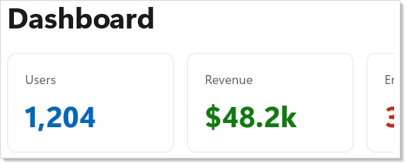
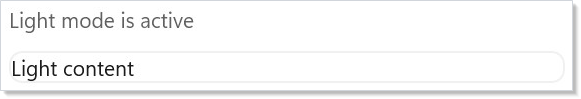
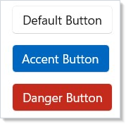

# Styling and Theming

Reactor uses WinUI's built-in theme system. Instead of hardcoding colors, you
reference semantic tokens that automatically adapt to light mode, dark mode,
and high contrast. The `Theme` class exposes these tokens as `ThemeRef` values
you can pass to any color modifier. These modifiers work on any
[component](components.md) that supports background or foreground properties.

## Theme Tokens

Apply a theme token with `.Background()` or `.Foreground()`:

```csharp
class ThemeTokensExample : Component
{
    public override Element Render()
    {
        return VStack(12,
            TextBlock("Primary Text").Foreground(Theme.PrimaryText),
            TextBlock("Secondary Text").Foreground(Theme.SecondaryText),
            TextBlock("Accent Text").Foreground(Theme.AccentText).SemiBold(),
            TextBlock("On Accent Background")
                .Foreground("#FFFFFF")
                .Padding(8, 4)
                .Background(Theme.Accent)
                .CornerRadius(4)
        ).Padding(24);
    }
}
```


Each token maps to a WinUI resource brush. When the user switches between light
and dark mode, every element using a `ThemeRef` updates automatically — no
manual rebinding needed.

## Building Cards

A card is a `Border` with a background, rounded corners, padding, and a subtle
stroke. Combine these modifiers with [layout containers](layout.md) to build
reusable card layouts:

```csharp
class CardLayoutExample : Component
{
    public override Element Render()
    {
        return VStack(16,
            Heading("Dashboard"),
            HStack(12,
                Card("Users", "1,204", Theme.Accent),
                Card("Revenue", "$48.2k", Theme.SystemSuccess),
                Card("Errors", "3", Theme.SystemCritical)
            )
        ).Padding(24);
    }

    static Element Card(string title, string value, ThemeRef accent) =>
        Border(
            VStack(8,
                Caption(title).Foreground(Theme.SecondaryText),
                TextBlock(value).FontSize(28).Bold().Foreground(accent)
            ).Padding(16)
        ).Background(Theme.CardBackground)
         .CornerRadius(8)
         .WithBorder(Theme.CardStroke, 1)
         .Width(160);
}
```



`Theme.CardBackground` gives you the standard WinUI card surface color.
`Theme.CardStroke` adds the matching border. Together they produce a card that
looks native in both light and dark mode.

## Color Modifiers

You can pass three types of values to `.Background()` and `.Foreground()`:

```csharp
class ColorModifiersExample : Component
{
    public override Element Render()
    {
        return VStack(8,
            TextBlock("Theme token").Background(Theme.SubtleFill).Padding(8),
            TextBlock("Hex string").Background("#E8F5E9").Padding(8),
            TextBlock("Mixed").Foreground(Theme.PrimaryText)
                .Background("#1E1E2E").Padding(8)
        ).Padding(24);
    }
}
```

| Overload | Example |
|----------|---------|
| Theme token | `.Background(Theme.Accent)` |
| Hex string | `.Background("#FF5733")` |
| `Windows.UI.Color` | `.Background(Colors.Blue)` |

Theme tokens are preferred because they respect the system theme. Use hex
strings for brand colors that should stay constant regardless of mode.

## Signal Colors

WinUI provides semantic signal colors for status indicators. Reactor exposes them
through `Theme`:

```csharp
class SignalColorsExample : Component
{
    public override Element Render()
    {
        return HStack(12,
            Badge("Info", Theme.SystemAttention),
            Badge("Success", Theme.SystemSuccess),
            Badge("Warning", Theme.SystemCaution),
            Badge("Error", Theme.SystemCritical)
        ).Padding(24);
    }

    static Element Badge(string label, ThemeRef color) =>
        TextBlock(label)
            .FontSize(12).SemiBold()
            .Foreground(color)
            .Padding(8, 4)
            .Background(Theme.SubtleFill)
            .CornerRadius(4);
}
```


Use these instead of hardcoded red/green/yellow — they meet
[accessibility](accessibility.md) contrast requirements in both themes.

## Dark and Light Mode

Use `.RequestedTheme()` to force a subtree to a specific theme. The
`UseColorScheme()` and `UseIsDarkTheme()` hooks let you read the effective
theme reactively:

```csharp
class DarkLightToggleExample : Component
{
    public override Element Render()
    {
        var (isDark, setIsDark) = UseState(false);
        var theme = isDark ? ElementTheme.Dark : ElementTheme.Light;

        return VStack(16,
            ToggleSwitch(isDark, setIsDark, onContent: "Dark", offContent: "Light"),
            Border(
                VStack(12,
                    TextBlock("This panel follows the toggle.").Foreground(Theme.PrimaryText),
                    TextBlock("Background adapts automatically.").Foreground(Theme.SecondaryText)
                ).Padding(16)
            ).Background(Theme.CardBackground)
             .CornerRadius(8)
             .RequestedTheme(theme)
        ).Padding(24);
    }
}
```


`.RequestedTheme(ElementTheme.Dark)` sets the theme on the underlying
`FrameworkElement`. All `ThemeRef` bindings in descendants automatically
resolve against the new theme. `UseIsDarkTheme()` returns `true` when the
effective scheme is dark — use it to drive conditional logic.

## Reactive Theme Hooks

`UseColorScheme()` returns the effective color scheme at the component's
position in the tree. `UseIsDarkTheme()` is a convenience wrapper:

```csharp
class ColorSchemeHookExample : Component
{
    public override Element Render()
    {
        var isDark = UseIsDarkTheme();
        var scheme = UseColorScheme();

        return VStack(12,
            TextBlock($"Color scheme: {scheme}").FontSize(16).SemiBold(),
            TextBlock(isDark ? "Dark mode is active" : "Light mode is active")
                .Foreground(Theme.SecondaryText),
            Border(
                TextBlock(isDark ? "Dark content" : "Light content")
                    .Padding(12)
            ).Background(Theme.CardBackground)
             .CornerRadius(8)
             .WithBorder(Theme.CardStroke, 1)
        ).Padding(24);
    }
}
```



`ColorScheme` has three values: `Light`, `Dark`, and `HighContrast`. Use
these hooks when you need to branch logic — not just colors — based on the
theme (e.g., choosing different icon sets or layouts).

## Lightweight Styling

`.Resources()` overrides WinUI control resource keys without replacing the
control template. VisualStateManager states (hover, pressed, disabled)
automatically respect your overrides:

```csharp
class LightweightStylingExample : Component
{
    public override Element Render()
    {
        return VStack(12,
            Button("Default Button", () => { }),
            Button("Accent Button", () => { })
                .Resources(r => r
                    .Set("ButtonBackground", Theme.Accent)
                    .Set("ButtonBackgroundPointerOver", Theme.AccentSecondary)
                    .Set("ButtonBackgroundPressed", Theme.AccentTertiary)
                    .Set("ButtonForeground", "#FFFFFF")
                    .Set("ButtonForegroundPointerOver", "#FFFFFF")
                    .Set("ButtonForegroundPressed", "#FFFFFF")),
            Button("Danger Button", () => { })
                .Resources(r => r
                    .Set("ButtonBackground", Theme.SystemCritical)
                    .Set("ButtonBackgroundPointerOver", "#C42B1C")
                    .Set("ButtonForeground", "#FFFFFF")
                    .Set("ButtonForegroundPointerOver", "#FFFFFF"))
        ).Padding(24);
    }
}
```



`ResourceBuilder` supports `.Set(key, ThemeRef)` for theme-reactive
overrides, `.Set(key, string)` for hex colors, `.Set(key, double)` for
numeric values, and `.Set(key, CornerRadius)` for corner radius. Overrides
cascade to child elements through WinUI's resource dictionary hierarchy.

## Custom Resource Access

Access any WinUI theme resource by key name with `Theme.Ref()`:

```csharp
class CustomResourceExample : Component
{
    public override Element Render()
    {
        return VStack(12,
            TextBlock("Using a named WinUI resource:")
                .Foreground(Theme.PrimaryText),
            TextBlock("NavigationViewItemForeground")
                .Foreground(Theme.Ref("NavigationViewItemForeground"))
        ).Padding(24);
    }
}
```

This is useful when you need a resource that `Theme` doesn't expose as a
named property. The key must exist in WinUI's resource dictionaries.

## Roslyn Analyzers

Reactor ships three Roslyn analyzers that flag common styling mistakes:

| Analyzer | Severity | What it flags |
|----------|----------|--------------|
| DUCT001 | Warning | Hard-coded color string where a `Theme.*` token exists |
| DUCT002 | Info | `.Set()` brush assignment that has a lightweight styling key |
| DUCT003 | Info | `.Set(fe => fe.RequestedTheme = ...)` — use `.RequestedTheme()` |

Each analyzer includes a code fix that auto-converts to the preferred
pattern. Enable them by referencing the `Reactor.Analyzers` project.

## Tips

**Prefer theme tokens over hex colors.** Tokens adapt to light/dark mode and
high contrast automatically. Reserve hex for brand colors.

**Use `.Resources()` for button/control color overrides.** Lightweight styling
preserves hover/pressed/disabled states, unlike `.Set()` which forces a
single value.

**Use `UseIsDarkTheme()` for conditional logic.** When you need different
behavior (not just colors) based on the theme, read the hook instead of
checking resources manually.

**Use `Theme.CardBackground` + `Theme.CardStroke` for card containers.** This
matches the WinUI design language exactly.

**Test in both themes.** Run your app, switch Windows to dark mode, and verify
nothing becomes unreadable. Theme tokens handle this if you avoid hardcoded
colors.

## Next Steps

- **[Navigation](navigation.md)** — Previous: route between pages and manage navigation history
- **[Effects and Lifecycle](effects.md)** — Next: run side effects on mount, update, and cleanup
- **[Context](context.md)** — Provide theme values to an entire subtree without prop drilling
- **[Accessibility](accessibility.md)** — Ensure themed colors meet contrast requirements
- **[Animation](animation.md)** — Combine theme-aware colors with animation transitions
