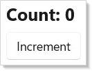

# Testing

Reactor's render loop is deterministic and synchronous. A `Component`
mounted in a unit test renders, runs effects, accepts state updates,
re-renders, and disposes through the same code path the WinUI host
uses — minus the WinUI tree at the bottom. That makes the unit layer
fast (an xUnit run for the framework's 800+ tests is seconds), and it
keeps test bodies focused on the component's behavior instead of the
windowing chrome.

This page covers the four test layers Reactor uses internally:

```csharp
class Counter : Component
{
    public override Element Render()
    {
        var (count, setCount) = UseState(0);
        return VStack(8,
            TextBlock($"Count: {count}").FontSize(20).Bold(),
            Button("Increment", () => setCount(count + 1))
        ).Padding(16);
    }
}
```



## Reference

| Test layer | Project | When to reach for it |
|---|---|---|
| Unit | `tests/Reactor.Tests/` | Hook semantics, reducer logic, modifier chains, analyzer rules. Fastest loop. |
| Self-test | `tests/Reactor.SelfTests/` + `Reactor.AppTests.Host` | Component renders into a real WinUI tree; assertions via `VisualTreeHelper`. |
| App E2E | `tests/Reactor.AppTests/` | WinAppDriver-driven full apps; click, type, screenshot diff. |
| Doc | `docs/_pipeline/apps/` | Compile + snapshot capture for the docs pipeline. |

## Unit-level fixtures

Reactor's component lifecycle (`BeginRender` → `Render` → `FlushEffects` → `RunCleanups`)
is exposed through the framework's internal API and used directly by
`ComponentModelIntegrationTests` in `tests/Reactor.Tests/`. The pattern
is small enough to fit in a helper inside your test class:

```csharp
private readonly ContextScope _scope = new();   // internal

private Element Mount(Component component,
    Dictionary<ContextBase, object?>? ctx = null)
{
    if (ctx is { Count: > 0 }) _scope.Push(ctx);
    component.Context.BeginRender(onReRender: () => { }, _scope);
    var el = component.Render();
    component.Context.FlushEffects();
    return el;
}

private Element Rerender(Component c) => Mount(c);
private void Unmount(Component c) => c.Context.RunCleanups();
```

`Mount` returns the root element. The test then drives state via the
component's own public surface (a property the component exposes, or a
captured setter from `UseState`), calls `Rerender`, and asserts.
`Unmount` runs the cleanup chain so effects with `dispose` lambdas
release their resources before the next test starts.

The full pattern is in `ComponentModelIntegrationTests.cs` — that file
mounts a component with state + context + effects, drives 5 distinct
lifecycle transitions, and asserts the effect log after each. Use it
as the template when adding a unit fixture for a new hook.

## Effect-aware async tests

`UseEffect` does not fire during render. It fires when the component's
context flushes effects — which the unit `Mount` helper above does
inline. Tests that exercise effect ordering must observe the log
between mount and the next render, not during render:

```csharp
// Effect-aware component used as a fixture target. UseEffect fires on the
// next flush, not during render — tests must wait for the flush before
// observing the side effect's log entry (see testing.md, "Async patterns").
class EffectfulCounter : Component
{
    public List<string> Log { get; } = new();

    public override Element Render()
    {
        var (count, setCount) = UseState(0);
        UseEffect(() =>
        {
            Log.Add($"effect:{count}");
            return () => Log.Add($"cleanup:{count}");
        }, count);
        return Button($"count={count}", () => setCount(count + 1));
    }
}
```

A test for `EffectfulCounter` mounts the component, asserts
`Log = ["effect:0"]`, increments state, re-renders, and asserts
`Log = ["effect:0", "cleanup:0", "effect:5"]`. The cleanup from the
previous effect runs before the new effect's body — that's the
contract `tests/Reactor.Tests/ComponentModelIntegrationTests.cs` codifies.

For genuinely async effects (timer fires, HTTP callback), use
`UseAsync` with a `CancellationToken` so the test can deterministically
flush by awaiting the completion of a task the component exposes — or
inject a fake clock via `UseContext` of a clock interface and tick it
forward by hand. Avoid `Thread.Sleep` in tests; it leaks wall-clock
time into the suite and makes CI flaky.

## Snapshot tests

A snapshot test takes the rendered element tree, serializes it to a
deterministic string, and compares against a checked-in golden file.
Reactor's `Element` records implement `ToString()` for compact
descriptions, and the reconciler's `ElementDescription` helper produces
a stable JSON shape. Place goldens next to the test file as
`*.snapshot.txt` and diff with `Assert.Equal`:

```csharp
[Fact]
public void Card_renders_three_slots()
{
    var card = new ProfileCard("Ada", "Lovelace", 36);
    var rendered = Mount(card);
    var actual = ElementDescription.Of(rendered);
    var expected = File.ReadAllText("ProfileCard.snapshot.txt");
    Assert.Equal(expected.Trim(), actual.Trim());
}
```

Update goldens when an intended UI change makes them stale — the diff
of the snapshot file is the review surface. Don't snapshot anything
that includes a timestamp, a randomly generated id, or a hash; either
normalize those fields before comparison or factor them out of the
component under test.

## Accessibility scanner integration

[`AccessibilityScanner.Scan(root)`](accessibility.md) walks the
rendered tree and returns a `List<A11yDiagnostic>` with the WCAG
criterion, fix suggestion, and source context for each finding. In a
test, mount the component and assert the scan returns empty:

```csharp
// AccessibilityScanner fixture target. The scanner walks the element tree
// post-render and returns one A11yDiagnostic per finding; an icon-only
// button without an accessible name is the canonical positive case.
class IconOnlyButton : Component
{
    public override Element Render() =>
        Button("", () => { });   // no accessible name → diagnostic
}
```

```csharp
[Fact]
public void IconOnlyButton_flags_missing_accessible_name()
{
    var rendered = Mount(new IconOnlyButton());
    var diagnostics = AccessibilityScanner.Scan(rendered);

    Assert.Contains(diagnostics, d => d.Rule == "ButtonName");
}

[Fact]
public void NamedButton_passes_a11y_scan()
{
    var rendered = Mount(new NamedButton());
    Assert.Empty(AccessibilityScanner.Scan(rendered));
}
```

The same scanner backs the in-app dev menu's "Run accessibility scan"
button, so a fixture that passes here is the same shape that passes in
the running app. Treat scanner-clean as the standing bar for every new
component you ship.

## Self-tests (real WinUI tree)

`Reactor.SelfTests` is the layer between the unit suite (pure C#, no
WinUI) and the full E2E suite (WinAppDriver). A self-test mounts a
real fixture into the `Reactor.AppTests.Host` window, walks the WinUI
visual tree, and emits TAP. The xUnit wrapper in `SelfTestBatch.cs`
parses the TAP and surfaces one test method per fixture.

To add a self-test:

1. Add a new fixture file under
   `tests/Reactor.AppTests.Host/Fixtures/` returning the component
   under test wrapped in a small assertion harness.
2. Register the fixture name in `FixtureRegistry`.
3. The xUnit wrapper picks it up at discovery time via
   `--list-fixtures`; no code change needed on the test runner side.

Reach for a self-test when the unit layer can't see the answer — e.g.
when the WinUI control's measured size affects the component's
behavior, or when an automation peer's role depends on the
materialized XAML control class.

## Tips

**Don't drive the unit fixture from `Task.Delay`.** If an effect
schedules async work, expose its completion task so the test can
`await` it. Wall-clock delays leak into the suite and make CI flaky.

**Snapshot the tree, not the rendered pixels.** `ElementDescription.Of`
gives you a deterministic string; an actual rendered bitmap depends on
font rendering, DPI, and platform Composition — none of which belong
in a unit test.

**Run the accessibility scan in every fixture's teardown.** It's
cheap, it catches regressions the moment they land, and it puts the
analyzer's output next to the test that introduced the problem.

**Use `Reactor.AppTests` only where xUnit and self-tests can't reach.**
WinAppDriver is the slow lane; reserve it for keyboard navigation,
focus order, and click sequences that depend on Composition or input
routing.

## Next Steps

- **[Hooks](hooks.md)** — Previous in the learning path: the
  primitives a fixture exercises.
- **[Effects](effects.md)** — `UseEffect` lifecycle and cleanup,
  including the flush ordering tested above.
- **[Accessibility](accessibility.md)** — The scanner's rules and how
  to extend it with project-specific checks.
- **[Dev Tooling](dev-tooling.md)** — `mur` CLI, preview mode, and the
  doc-pipeline harness that powers the screenshots on this page.
- **[Components](components.md)** — Render purity rules that make the
  unit layer worth the investment.
