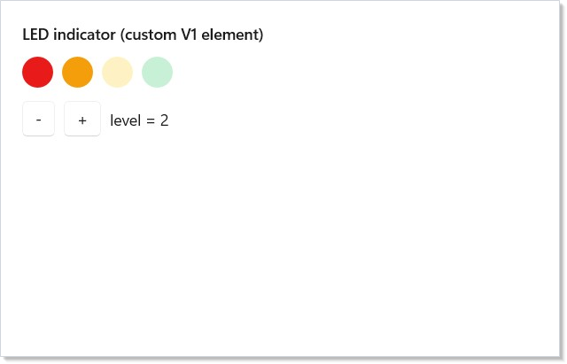

Microsoft.UI.Reactor (Reactor) draws the visible part of a frame by handing
each immutable element record off to a per-control-type plug-in called a
**handler**. The handler knows two things the [reconciler](reconciliation.md)
doesn't: which WinUI control to instantiate, and which of that control's
properties and events to wire to which element fields. The protocol is
designed so authors do not pay for what they do not use — a handler that
declares no children does no child dispatch, a controlled prop with no
callback does not subscribe its event trampoline, a one-way prop whose
value did not change does not write — and so every built-in control and
every control you add yourself dispatches through the same tight loop.
Read this page before adding a new native control or before reaching for
a debugger when an existing one mis-updates.

# The V1 Handler Protocol

This page documents the data path between
[`Reconciler.Reconcile`](reconciliation.md#reconcile--the-entry-point)
and the WinUI control it edits. The audience is anyone extending
Reactor with a new native control, or anyone debugging why an
existing element does not update the way it should. The companion
[Extending Reactor with Native Controls](extending-reactor-controls.md)
walks through adding a control end-to-end; this page is the
reference under that recipe.

## Dispatch — one handler per element type

The reconciler holds a dictionary keyed by `System.Type` of the
element record. When a re-render passes a new element to
`Reconcile`, the dictionary entry for that element's exact runtime
type is fetched, and that entry's `Mount` / `Update` / `Unmount`
methods run against the existing WinUI control. There is no base-class
fallback for ordinary handlers — registering `ButtonElement` does
**not** also catch a `MyButtonElement` that inherits from it; each
concrete element type has its own registration. (The one exception,
[`RegisterHandlerForDerivedTypes`](#registration), exists for the
T-erased templated-list family and is called out explicitly below.)

```csharp
public UIElement Mount(Element element, Action requestRerender, Reconciler reconciler)
{
    var typedEl = (TElement)element;
    var ctx = new MountContext(reconciler, requestRerender);
    var control = _handler.Mount(ctx, typedEl);

    // Anchor element identity on the control via the attached state DP so
    // event trampolines can re-fetch the live element on each fire.
    if (control is FrameworkElement fe)
        Reconciler.SetElementTag(fe, typedEl);

    // Strategy dispatch — only when the handler declares a non-None Children strategy.
    var strategy = _handler.Children;
    if (strategy is not null)
        DispatchChildrenMount(strategy, ctx, typedEl, control);

    // Post-children mount hook. Fires after every child has mounted
    // (whether via the strategy switch above or an items-binder strategy
    // the handler dispatched inline before returning). Lets handlers
    // subscribe events that must wire after children-add. Default no-op
    // for handlers that don't override it.
    _handler.AfterChildrenMount(ctx, typedEl, control);

    return control;
}
```

The adapter shown above is the engine-side bridge between the typed
`IElementHandler<TElement, TControl>` shape and the type-erased entry
the registry stores. The hot path is dictionary lookup → interface call
→ a cast that the JIT folds at monomorphic call sites. The cost is
measured at one or two nanoseconds per element on warmed paths and is
the reason the protocol does not expose a switch-on-type dispatcher to
authors.

| Subsystem | File | What it owns |
|---|---|---|
| Handler contract | `src/Reactor/Core/V1Protocol/IElementHandler.cs` | The `Mount` / `Update` / `Unmount` / `Children` surface |
| Contexts | `src/Reactor/Core/V1Protocol/MountContext.cs` | Ref-struct mount/update/unmount contexts |
| Adapter | `src/Reactor/Core/V1Protocol/V1HandlerAdapter.cs` | Type-erasure bridge into the registry |
| Children strategies | `src/Reactor/Core/V1Protocol/ChildrenStrategy.cs` | Declarative child-dispatch shapes |
| Bindings | `src/Reactor/Core/V1Protocol/ReactorBindingT.cs` | Event helpers + echo suppression |
| Descriptors | `src/Reactor/Core/V1Protocol/Descriptor/` | Declarative handlers + the interpreter |
| Pool | `src/Reactor/Core/ElementPool.cs` | `TryRent` / `Return` for poolable controls |

## The handler contract

```csharp
[Experimental("REACTOR_V1_PREVIEW")]
public interface IElementHandler<TElement, TControl>
    where TElement : Element
    where TControl : UIElement
{
    /// <summary>Create or rent the WinUI control, apply initial writes,
    /// and subscribe event trampolines. Returns the control the engine
    /// places into the parent's children collection.</summary>
    TControl Mount(MountContext ctx, TElement element);

    /// <summary>Diff <paramref name="oldEl"/> vs <paramref name="newEl"/>
    /// and apply minimal writes to <paramref name="control"/>. Returns void:
    /// the control identity is preserved (§13 Q12).</summary>
    void Update(UpdateContext ctx, TElement oldEl, TElement newEl, TControl control);

    /// <summary>Optional override for handlers with explicit teardown
    /// (e.g. control-side IDisposable resources). Default no-op — the
    /// engine still runs the pool reset contract.</summary>
    void Unmount(UnmountContext ctx, TControl control) { }

    /// <summary>Optional override for handlers that want to drive child
    /// reconciliation manually instead of through
    /// <see cref="Children"/>. Phase 1 strategy dispatch routes through
    /// <see cref="Children"/>; this overload is retained for parity with
    /// the spec §4 surface and Phase 3 use.</summary>
    void ReconcileChildren(MountContext ctx, TElement oldEl, TElement newEl, TControl control) { }

    /// <summary>Optional children strategy. Engine dispatches through it
    /// when non-null (and not <see cref="None{TElement,TControl}"/>);
    /// otherwise the handler is a leaf for the purposes of child
    /// reconciliation.</summary>
    ChildrenStrategy<TElement, TControl>? Children => null;

    /// <summary>Spec 047 §14 Phase 3 prelude (Engine A1) — optional hook the
    /// engine invokes from <see cref="V1HandlerAdapter{TElement,TControl}"/>
    /// after the <see cref="Children"/> strategy has mounted/bound every child
    /// (and after any items-binder strategy the handler dispatched inline).
    /// Default no-op.
    ///
    /// <para>Override this to wire events whose subscription must happen
    /// strictly after children-add — e.g. <c>TabView.SelectionChanged</c>,
    /// which WinUI fires spuriously while the first tab is being added if the
    /// handler subscribes during the prop-apply phase. Subscribing here side-
    /// steps that first-add echo.</para></summary>
    void AfterChildrenMount(MountContext ctx, TElement element, TControl control) { }
}
```

`Mount` runs the first time the reconciler sees an element of this
type at a given slot. It rents a control from the pool (or allocates
one), applies initial property writes, subscribes the events it cares
about, and returns the control the reconciler will install in the
parent's child collection. `Update` runs every subsequent render where
the same slot still holds an element of the same type — it diffs the
old element against the new and applies the minimum writes needed.
`Unmount` runs when the slot disappears or its element type changes;
the default body is a no-op because the engine handles pool return
and child teardown for the standard case. The optional `Children`
property declares how child elements are dispatched — see
[Children strategies](#children-strategies) below.

The contract has two deliberate constraints worth pointing out. First,
`Update` returns `void` — handlers do **not** swap control instances
across renders. If a re-render genuinely needs a different control
type (a `Button` becoming a `HyperlinkButton`, for example), it is
encoded as a different `Element` subclass, and the reconciler's
type-change path unmounts the old and mounts the new at that slot.
Second, `Mount` and `Update` run on the dispatcher thread that owns
the reconciler — handler bodies are free to touch control state
without synchronization, and code that crosses threads is the
author's responsibility (and a debug-build assert).

> **Caveat:** `Mount` is called exactly once per realized control, but the same
> control may be passed back to a different handler instance through the
> pool. If you stash per-control state in a field on the handler
> instance, it survives pool rent — and that is almost certainly a bug.
> Per-control state lives on the **control**, either as an attached
> state DP or as the typed event payload box
> ([`Reconciler.GetOrCreateControlEventPayload`](#echo-suppression-and-write-suppressed)),
> both of which the pool reset contract clears. The handler instance is
> a stateless interpreter.

## Contexts and bindings

The reconciler passes three contexts into a handler, one per lifecycle
phase. Each is a `readonly ref struct`, so the context cannot escape
the call stack, cannot be captured by a closure, and does not allocate.

```csharp
[Experimental("REACTOR_V1_PREVIEW")]
public readonly ref struct MountContext
{
    private readonly Reconciler _reconciler;
    private readonly Action _requestRerender;

    internal MountContext(Reconciler reconciler, Action requestRerender)
    {
        _reconciler = reconciler;
        _requestRerender = requestRerender;
    }

    /// <summary>The rerender callback for the owning component subtree.</summary>
    public Action RequestRerender => _requestRerender;

    /// <summary>The owning reconciler. Provided as an escape hatch for handlers
    /// that need to forward a child mount through some non-strategy path.</summary>
    public Reconciler Reconciler => _reconciler;

    /// <summary>Mount a child element through the reconciler. The returned
    /// <see cref="UIElement"/> is whatever the reconciler decided to mount
    /// (possibly null for <c>EmptyElement</c>).</summary>
    public UIElement? MountChild(Element child) => _reconciler.Mount(child, _requestRerender);

    /// <summary>Apply a setter array to the control. Equivalent to the public
    /// <see cref="Reconciler.ApplySetters{T}(Action{T}[], T)"/> helper; provided
    /// on the context for symmetry with handler-authored mount bodies.</summary>
    public void ApplySetters<T>(Action<T>[] setters, T control) where T : class
        => Reconciler.ApplySetters(setters, control);

    /// <summary>Construct a per-binding event helper for the given control + element.
    /// The returned binding closes over the control identity, not the element
    /// — handlers re-fetch the live element via <c>ReactorState.Element</c> on
    /// each event fire, so the same binding survives element re-renders.</summary>
    public ReactorBinding<TElement> BindFor<TElement>(FrameworkElement control, TElement element)
        where TElement : Element
        => new ReactorBinding<TElement>(_reconciler, control, element);

    /// <summary>Rent a control instance from the per-type pool, or allocate
    /// a fresh one if the pool is empty / the policy opts out.</summary>
    public T RentControl<T>(PoolPolicy<T>? policy = null, Func<T>? factory = null) where T : class, new()
        => _reconciler.RentControl(policy, factory);

    /// <summary>Push a typed context value for the duration of the returned
    /// <see cref="IDisposable"/>. Used by handlers that mount children which
    /// must see an author-supplied context.</summary>
    public IDisposable PushContext<T>(Context<T> context, T value) => _reconciler.PushContextDisposable(context, value);

    /// <summary>Push a stagger scope; children mounted inside the scope
    /// consume stagger indices for their enter transitions.</summary>
    public IDisposable PushStaggerScope(TimeSpan delay) => _reconciler.PushStaggerScopeDisposable(delay);

    /// <summary>Escape hatch (Q11) — attach a raw routed handler directly to
    /// the control. Handlers should prefer the typed <c>On*</c> family on
    /// <see cref="ReactorBinding{TElement}"/>; use this only for events the
    /// binding doesn't cover (e.g. <c>UIElement.PreviewKeyDown</c> on a
    /// non-FrameworkElement, or app-side custom routed events).</summary>
    public void AddRawRoutedHandler(UIElement target, RoutedEvent re, Delegate h, bool handledEventsToo)
        => target.AddHandler(re, h, handledEventsToo);
}
```

`MountContext.RentControl<T>()` is how a handler obtains its WinUI
control. By default the engine pools every type that opts in via
`PoolableTypes` — `Button`, `TextBlock`, `Border`, every common leaf —
and `RentControl` returns a reset instance from the per-type stack
when one is available. Authors can override the pool policy or supply
a custom `Func<T>` factory for controls that need constructor
arguments or that should never pool. `RentControl` is therefore the
single place a handler crosses into native land, and the engine
ensures that every rented control reaches `ReturnControl` on unmount.

`MountContext.BindFor(control, element)` produces a
[`ReactorBinding<TElement>`](source:src/Reactor/Core/V1Protocol/ReactorBindingT.cs)
that wires events from the WinUI side back to element callbacks. The
binding has typed `On…` methods for the WinUI routed-event families
(pointer, key, tap, focus) and a general `OnCustomEvent<TArgs>` for
plain CLR events (`Click`, `ValueChanged`, `TextChanged`). The
critical property of every `On…` method is that the event trampoline
captures the **control**, not the element — at fire time it re-reads
the live element from
[`Reconciler.GetElementTag(control)`](#element-identity-via-the-tag).
The same subscription therefore survives every re-render without
re-subscribing.

`UpdateContext` is the same surface as `MountContext` minus
`RentControl` — update bodies run against an existing control, and
allocating a new one is forbidden on this path. `UnmountContext` is
narrower still: it carries only `ReturnControl<T>` for the optional
pool-return contract.

## The mount-then-subscribe invariant

A controlled property — a property whose value the framework writes
*and* whose value the user can edit on the WinUI side — would race if
the handler subscribed to the change event before writing the initial
value. The descriptor interpreter (and every hand-coded handler that
follows the same shape) sequences the work in two passes so the race
cannot happen:

```csharp
public TControl Mount(MountContext ctx, TElement el)
{
    var ctrl = ctx.RentControl(_descriptor.PoolPolicy, _descriptor.Factory);

    // §14 Phase 3-final: when the descriptor declares an ItemsHost,
    // populate the items collection BEFORE the prop loop. Initial writes
    // for selection-tracking props (SelectedIndex/SelectedItem) need the
    // collection populated first — WinUI silently clamps selection
    // against an empty collection.
    if (_descriptor.Children is ItemsHost<TElement, TControl> ih)
        DispatchItemsHostMount(in ctx, el, ctrl, ih);
    // §14 Phase 3 finish — consolidated dispatch arm: every items-
    // binder variant uses the same "bind before prop loop" ordering so
    // SelectedIndex initial writes land against a populated list.
    else if (_descriptor.Children is IItemsBinderStrategy binder && ctrl is FrameworkElement feBinder)
        binder.Bind(feBinder, oldElement: null, el, ctx.Reconciler, ctx.RequestRerender, isMount: true);

    // Phase 1: all bare initial writes (no echo possible — subscriptions
    // not yet live). §14 Phase 3-final: dispatch through the
    // context-carrying overload so OneWayBridged entries can reach the
    // reconciler/rerender helpers; existing entries forward to the
    // parameterless overload via the virtual default on PropEntry.
    var props = _descriptor.Properties;
    for (int i = 0; i < props.Count; i++)
        props[i].Mount(in ctx, ctrl, el);

    // Phase 2: subscribe controlled entries.
    var binding = ctx.BindFor(ctrl, el);
    for (int i = 0; i < props.Count; i++)
        props[i].EnsureSubscribed(binding, ctrl, el);

    var getSetters = _descriptor.GetSetters;
    if (getSetters is not null)
        ctx.ApplySetters(getSetters(el), ctrl);
    return ctrl;
}
```

The first loop runs the bare initial writes for every entry. The
second loop wires the trampolines. Because no trampoline is listening
during the first loop, the synchronous change events WinUI raises when
the framework writes `IsOn = true`, `Value = 3.5`, or `Text = "hi"`
go nowhere — and the user's callback receives no spurious initial
fire on Mount. On Update the equivalent property writes go through
`ReactorBinding.WriteSuppressed`, which marks a per-control suppress
counter that the trampoline drains before invoking the callback. The
net effect is that the **callback fires exactly when the user
interacted with the control**, never when the framework wrote a value
the user did not type.

The same invariant covers pool rent: a control returned to the pool
keeps its typed event-payload box, and re-mount checks the box's
`Trampoline` slot to skip re-subscription. A pooled `RatingControl`
that gets rented out for a fresh `StarMeterElement` does not
double-subscribe its `ValueChanged` event.

## Children strategies

A handler's `Children` property declares **how** its child elements
get dispatched. The strategy is a sealed record subclass; the
adapter's switch over the strategy types runs after `Mount` / `Update`
return, so the handler body itself never has to walk children.

```csharp
[Experimental("REACTOR_V1_PREVIEW")]
public abstract record ChildrenStrategy<TElement, TControl>
    where TElement : Element
    where TControl : UIElement;

/// <summary>Leaf — no children. Engine performs no dispatch beyond the
/// handler's Mount/Update body.</summary>
[Experimental("REACTOR_V1_PREVIEW")]
public sealed record None<TElement, TControl>() : ChildrenStrategy<TElement, TControl>
    where TElement : Element
    where TControl : UIElement;

/// <summary>Single-content host (Border, ContentControl, Viewbox). The
/// engine mounts <paramref name="GetChild"/>'s result and assigns it via
/// <paramref name="SetChild"/>.
///
/// <para><b>Structural reconcile:</b> set <see cref="GetCurrentChild"/> so
/// the engine can read the existing slot value during <c>Update</c> and
/// route through <c>Reconciler.ReconcileV1Child</c> — that preserves
/// descendant component state across parent re-renders. When left null,
/// the engine remounts the child on every update (only safe for slots that
/// are reset every render anyway). All built-in handlers set it.</para></summary>
[Experimental("REACTOR_V1_PREVIEW")]
public sealed record SingleContent<TElement, TControl>(
    Func<TElement, Element?> GetChild,
    Action<TControl, UIElement?> SetChild) : ChildrenStrategy<TElement, TControl>
    where TElement : Element
    where TControl : UIElement
{
    /// <summary>Optional: read the current child from the control. Required
    /// for structural child reconciliation; if null the engine falls back to
    /// remounting the child every Update.</summary>
    public Func<TControl, UIElement?>? GetCurrentChild { get; init; }
}

/// <summary>Panel host (StackPanel, Grid, Canvas). Engine mounts each
/// child and appends to the panel's <see cref="UIElementCollection"/>.
///
/// <para><b>Phase 1 limitation:</b> the dispatch is append-only; structural
/// diff against the previous render goes through the host's child
/// collection wholesale. Spec-042 keyed-reconcile integration is a
/// Phase 3 follow-up.</para>
///
/// <para><b>§14 Phase 3-final addition:</b>
/// <see cref="PerChildAttached"/> — optional callback invoked after each
/// child mount AND after each child Update. Receives the mounted
/// <see cref="UIElement"/> alongside the child element so the descriptor
/// can write WinUI attached DPs (e.g. <c>Grid.SetRow</c>,
/// <c>Canvas.SetLeft</c>) based on attached-prop hints carried on the
/// child element. No-op by default.</para>
///
/// <para><b>§14 Phase 3 close-out addition:</b>
/// <see cref="PerChildAttachedAfterAll"/> — optional two-pass callback
/// invoked once after every child has been mounted (Mount path) or
/// reconciled (Update path). Receives the full <c>(UIElement, Element)</c>
/// pair list in collection order so the descriptor can apply attached
/// DPs that reference OTHER children by name (e.g.
/// <c>RelativePanel.SetRightOf(b, a)</c>). Distinct from
/// <see cref="PerChildAttached"/>, which fires per-child mid-pass and
/// cannot see siblings that haven't mounted yet. Most descriptors set
/// only one of the two; <c>RelativePanel</c> is the canonical consumer
/// of the after-all shape.</para>
/// </summary>
[Experimental("REACTOR_V1_PREVIEW")]
public sealed record Panel<TElement, TControl>(
    Func<TElement, IReadOnlyList<Element>> GetChildren,
    Func<TControl, UIElementCollection> GetCollection) : ChildrenStrategy<TElement, TControl>
    where TElement : Element
    where TControl : UIElement
{
    /// <summary>Optional per-child attached-prop writer. Called by the
    /// engine after each child is mounted (Mount path) AND after each child
    /// is reconciled (Update path). The descriptor reads attached-prop
    /// hints off the child element (via <c>Element.GetAttached&lt;T&gt;()</c>
    /// or similar) and writes the corresponding WinUI attached DPs onto
    /// the mounted <see cref="UIElement"/>. Defaults to <c>null</c> for
    /// containers that don't carry per-child attached props
    /// (e.g. <c>StackPanel</c>).</summary>
    public Action<TControl, UIElement, Element>? PerChildAttached { get; init; }

    /// <summary>Optional two-pass callback fired once after every child has
    /// been mounted/reconciled, receiving the full ordered list of
    /// <c>(UIElement, Element)</c> pairs. Use for attached DPs that
    /// reference siblings by name — e.g. <c>RelativePanel.SetRightOf</c>.
    /// Defaults to <c>null</c>; only RelativePanel-shaped descriptors set
    /// it.</summary>
    public Action<TControl, IReadOnlyList<(UIElement Mounted, Element ChildElement)>>? PerChildAttachedAfterAll { get; init; }
}
```

| Strategy | Shape | Used by |
|---|---|---|
| `None` | Leaf — no children | `Button`, `TextBlock`, `Slider`, `RatingControl`, every leaf |
| `SingleContent` | One child slot, `GetCurrentChild` for structural reconcile | `Border`, `ContentControl`, `Viewbox`, `Expander` body |
| `Panel` | Ordered child list against `UIElementCollection`, optional `PerChildAttached` for attached DPs | `Grid`, `StackPanel`, `Canvas`, `RelativePanel` |
| `NamedSlots` | Multiple named slots, each binding via a `NamedSlot` record | `SplitView` (Pane + Content), `NavigationView` (Header + Content + PaneFooter) |
| `ItemsHost` | Flat items collection — `IReadOnlyList<object>` projected into the control's `Items` sink | `ListBox`, `ComboBox`, `RadioButtons`, simple `FlipView` |
| `TemplatedItems<TItem,…>` | Keyed templated list — routes through `BindKeyedItemsSource` for spec-042 keyed reconcile | `ListView<T>`, `GridView<T>` |
| `TemplatedItemsErased` | Same shape, T erased via `IKeyedItemSource` for typed-list base types | `TemplatedListViewElement<T>` family |
| `TreeChildren` | Hierarchical `TreeViewNode` tree, optional per-node `ContentElement` | `TreeView` |
| `TabItemsHost` | Heterogeneous items (`TabViewItem` / `PivotItem`) with in-place positional reconcile | `TabView`, `Pivot` |
| `PreMountedItems` | Pre-mounted items against a flat sink with no `ContainerContentChanging` | Templated `FlipView` |
| `Imperative` | Escape hatch — handler reconciles children itself | Custom containers that span multiple WinUI properties |

The strategy switch is the engine's seam between the handler protocol
and the rest of the reconciler — `SingleContent` and `NamedSlots`
route through
[`Reconciler.ReconcileV1Child`](reconciliation.md#child-reconciler),
which is the same diff path the rest of Reactor uses; `Panel`
walks the new and old child lists in lockstep and preserves descendant
component state across reorderings that do not change identity;
`TemplatedItems` and `TemplatedItemsErased` route through
`Reconciler.BindKeyedItemsSource`, which owns the spec-042
`KeyedListDiff` realization plumbing — and so on. Adding a new
strategy is a Reactor-internals task; adding a new handler that
*consumes* one of these strategies is what extension authors do.

## Pool integration

The descriptor's `PoolPolicy` (and the corresponding parameter to
`MountContext.RentControl<T>`) determines whether the control type
pools at all and, if so, how to reset its mutable state when it goes
back into the pool. Most leaf controls — `Button`, `TextBlock`,
`Border`, `RatingControl`, every input the form catalog covers —
opt in by default; the per-type entry in `PoolableTypes` declares the
reset hook (clearing handlers, restoring default property values) so
a rented instance is observably indistinguishable from a fresh one.
Authors writing a new handler should generally accept the default and
let the engine pool the control; the policy escape hatch exists for
controls whose state is too large or whose teardown is too expensive
to be worth pooling.

`MountContext.RentControl<T>` is the single rent path. The engine
guarantees that every rent reaches a `ReturnControl` on unmount — the
default adapter body calls `Unmount` with a `V1UnmountDisposition`
result that opts into pool collection, the engine then walks the
unmounted subtree and returns each control to its per-type stack. An
author writing `Unmount` does not have to call `ReturnControl`
themselves unless they rented from the engine via the manual
`RentControl` overload — the default lifecycle is fully managed.

## Echo suppression and `WriteSuppressed`

When the framework writes the controlled prop, the WinUI control
raises its change event synchronously. The event trampoline cannot
distinguish "the user typed this" from "the framework just wrote
this" without help, and forwarding the framework's own write to the
element callback would round-trip the same value through the user's
state setter and trigger a spurious re-render. `ReactorBinding`
suppresses that echo with a per-control counter:

| Method | When to call | Effect |
|---|---|---|
| `binding.WriteSuppressed(mutate)` | Inside `Update` when writing a controlled prop | Increments the suppress counter, runs the mutate, decrements |
| `ChangeEchoSuppressor.ShouldSuppress(fe)` | Inside an event trampoline | Drains a pending suppress count and returns true; trampoline short-circuits |

The trampolines `ReactorBinding.OnCustomEvent<TArgs>` generates call
`ShouldSuppress` on entry — every controlled prop in every built-in
handler is echo-safe without the handler author having to think
about it. Hand-authored trampolines (the ones that bypass
`OnCustomEvent` for performance) follow the same shape; see
`Reconciler.GetOrCreateControlEventPayload` for the per-control
payload box that anchors the trampoline for the control's lifetime.

## Element identity via the tag

Every framework element record is anchored on its mounted
`FrameworkElement` via `Reconciler.SetElementTag(fe, element)`, an
attached state DP. The tag is what makes event trampolines safe across
re-renders: the trampoline closes over the control instance, calls
`Reconciler.GetElementTag(control)` at fire time, casts the result to
the typed element, and invokes the callback. The element value is
refreshed by `Reconciler.SetElementTag` on every Update, so the
trampoline always sees the live element — including the live
callback, the live state captured by the user's component, and any
intervening prop changes.

Handler authors get the tag wiring for free — the adapter writes it
after `Mount` returns and after every `Update`. Hand-authored trampolines
that need to read the tag (e.g. the descriptor's static
`ClickTrampoline` for `Button`) call `GetElementTag` and pattern-match
on the expected element type.

## Descriptors — declarative handlers

`IElementHandler` is the imperative shape; `ControlDescriptor` is the
declarative one. A descriptor is a list of `PropEntry` objects (each
encoding one property's binding shape) plus an optional children
strategy, optional factory, and optional pool policy. The
`DescriptorHandler<TElement, TControl>` interpreter is itself an
`IElementHandler`, so the registry sees no difference between a
hand-coded handler and a descriptor — the dispatch shell is identical,
and any cost difference is the interpreter's iteration over a small
list of entries.

```csharp
// A descriptor declares property bindings against the WinUI control the
// element targets. The framework's DescriptorHandler interprets the entries
// during Mount and Update — there is no per-element interpreter overhead
// beyond a dictionary lookup and the entry-loop iteration.
public static class LedIndicatorDescriptor
{
    public static readonly ControlDescriptor<LedIndicatorElement, WinUI.Border> Descriptor =
        new ControlDescriptor<LedIndicatorElement, WinUI.Border>
        {
            // The descriptor's children strategy says "no children" — this is
            // a leaf control. See ChildrenStrategy survey in the prose.
            Children = new None<LedIndicatorElement, WinUI.Border>(),
        }
        // OneWay: write on Mount, diff-and-write on Update. Equality skips
        // the write when the element value didn't change.
        .OneWay(
            get: static e => e.Size,
            set: static (c, v) => { c.Width = v; c.Height = v; c.CornerRadius = new Microsoft.UI.Xaml.CornerRadius(v / 2); })
        // The IsOn → Background mapping coerces both inputs onto one WinUI
        // property. A single OneWay entry observes (Color, IsOn) jointly
        // by reading both off the element in the get/set lambdas.
        .OneWay(
            get: static e => (e.Color, e.IsOn),
            set: static (c, v) =>
                c.Background = new SolidColorBrush(
                    v.IsOn ? v.Color : Color.FromArgb(0x40, v.Color.R, v.Color.G, v.Color.B)));
}
```

The descriptor above declares a single one-way mapping from
`(Color, IsOn)` onto `Border.Background`, plus a size hook that
writes `Width`, `Height`, and `CornerRadius` in one entry. It is a
complete extension: every `LedIndicatorElement` the app renders
flows through this descriptor, including pool rent, prop diff, and
unmount.



### `PropEntry` shapes — the prop-binding vocabulary

The fluent builder methods on `ControlDescriptor` add one entry per
call. The full vocabulary covers the common cases plus the escape
hatches a hand-coded handler would otherwise need:

| Builder | When to reach for it |
|---|---|
| `.OneWay(get, set)` | Plain one-way prop; write on Mount, diff-write on Update. No event subscription. |
| `.OneWayConditional(get, set, shouldWrite)` | Nullable / optional prop where leaving the control's default is the intent when the element didn't set a value. |
| `.Initial(get, set)` | Write once at Mount and never again. Use for seed-only props (`TextBox.InitialText`, etc.). |
| `.Controlled<TValue, TArgs>(get, set, subscribe, unsubscribe, callback, readBack)` | Two-way prop. Framework writes with echo suppression; user input rounds back via the change event. Subscription is gated on `callback` returning non-null. |
| `.CoercingOneWay(get, set, coercesController)` | One-way prop whose write may coerce a sibling controlled value (e.g. `Slider.Minimum` re-clamping `Slider.Value`); writes through `WriteSuppressed` when the coercion fires. |
| `.HandCodedControlled<TPayload, TValue, TDelegate>` | Two-way prop with a multi-event control where the standard `Controlled` shape would collide on the per-control event payload (`TextBox.Text` alongside `SelectionChanged`). |
| `.HandCodedEvent<TPayload, TDelegate>` | Fire-and-forget event with no associated DP (`Button.Click`, `Image.ImageOpened`). |
| `.CollectionDiffControlled<…>` | Two-way prop whose value is an `IReadOnlyList<TItem>` round-tripped against a control-side `IList<TItem>` (`CalendarView.SelectedDates`). |
| `.OneWayBridged(get, set, shouldWrite)` | One-way prop whose `set` lambda needs access to the reconciler (used by the button-family flyout port). |
| `.Imperative(mount, update)` | Property-level escape hatch — the lambdas receive `(control, element)` and `(control, oldEl, newEl)` so an entry can express a diff the standard builders cannot. |
| `.ImperativeBridged(mount, update)` | Same shape with the `MountContext` / `UpdateContext` available — primary use is a secondary Element slot that needs structural reconcile via `ReconcileV1Child`. |

The entries iterate as a flat list, in declaration order. The
descriptor's children strategy runs first when it is an items binder
(so selection-tracking props see the populated collection at Mount);
otherwise the strategy fires after the entry loop. The mount-then-
subscribe ordering invariant is preserved by running every entry's
`Mount` body before any entry's `EnsureSubscribed`.

## Registration

Handlers are registered with a Reactor host's reconciler before the
first render. The standard call is `Reconciler.RegisterHandler<TElement,
TControl>(handler)`:

```csharp
// Registration is one call per Reactor host. RegisterDescriptor wraps
// RegisterHandler<...>(new DescriptorHandler<...>(descriptor)) — both shapes
// land on the same dispatch table. Duplicate registrations for the same
// element type throw.
public sealed class LedIndicatorRegistration
{
    public static void Register(Reconciler reconciler)
    {
        reconciler.RegisterHandler<LedIndicatorElement, WinUI.Border>(
            new DescriptorHandler<LedIndicatorElement, WinUI.Border>(
                LedIndicatorDescriptor.Descriptor));
    }
}
```

There are two variants worth knowing about:

| Method | Use when |
|---|---|
| `RegisterHandler<TElement, TControl>(handler)` | Standard registration — exact-type dispatch on `element.GetType()`. |
| `RegisterHandlerForDerivedTypes<TBase, TControl>(handler)` | T-erased registration on a non-generic base type — every closed-T variant whose chain reaches `TBase` routes to the same handler. Used by the typed templated-list family (`TemplatedListViewElement<T>`, etc.). |

Exact-type registrations always win over a derived-type registration
for the same chain. Duplicate registration for the same element type
**throws** — there is no last-writer-wins. If you need a different
mapping for the same element type (e.g., a test harness substituting a
fake control), build a separate `Reconciler` instance for the scope
that needs the override.

## Patterns

A handful of recurring patterns cover the long tail of real handlers:

**Map two element fields onto one control property.** Use a single
`.OneWay` entry whose `get` returns a tuple and whose `set` reads
both fields. The descriptor's value comparer treats the tuple
atomically, so the write fires only when either field changes. This
is how the LED demo collapses `(Color, IsOn)` into a single
`Background` update.

**Map one element field onto multiple control properties.** Same
shape: one `.OneWay` entry whose `set` body writes all of them. The
diff-check still runs only against the element's source field.

**Gate subscription on callback presence.** Pass `e => e.OnXxx` as
the `callback` parameter to `.Controlled` or `.HandCodedEvent`. When
the element returns `null` the engine skips subscription entirely —
callback-less controls pay zero per-fire dispatch cost. This is the
standard idiom; do not gate manually inside a hand-authored
trampoline.

**Survive across re-renders.** Hand-authored trampolines that bypass
`OnCustomEvent` must read the live element via
`Reconciler.GetElementTag(control)` rather than capturing the element
in the closure — the closure-captured element goes stale every render
and the callback observes the wrong state. Every built-in
`HandCodedEvent` trampoline follows this shape; copy it.

## Common Mistakes

**Subscribing inside `Update`.** Each `Update` call runs against an
existing control whose subscriptions are already wired from `Mount`.
Subscribing again in `Update` multiplies the trampolines across
re-renders. The protocol's contract is: subscribe in `Mount` (or, for
descriptors, in `EnsureSubscribed` which the interpreter calls after
the Mount entry loop and lazily on `null → non-null` callback
transitions).

**Writing without `WriteSuppressed` from `Update`.** A controlled
prop write from `Update` raises the change event synchronously and
echoes through the trampoline back into the user's setter. Every
controlled-shape descriptor entry already wraps the write; hand-coded
handlers should mirror this. Forgetting it is the most common cause
of "the value snaps back when I type" bugs.

**Capturing the element in a trampoline closure.** Closures over the
element observe a stale value on the next render. Re-fetch via
`Reconciler.GetElementTag(control)` on every fire instead.

**Stashing state on the handler instance.** Handler instances are
registered once per host and live as long as the reconciler. Per-
control state needs to live on the control (attached state DP, typed
event payload box), not on the handler. The handler is a stateless
interpreter.

**Registering a handler against an open generic.** The dispatch table
keys on `System.Type`, so an open generic like `typeof(DataGrid<>)`
has no usable runtime type. Use `RegisterHandlerForDerivedTypes` with
a non-generic intermediate base when you need to catch every closed
variant of a generic element family.

## Tips

**Prefer descriptors for new ports.** A descriptor is a declarative
list that the interpreter executes against the same surface a hand-
coded handler uses. The dispatch shape is identical; the descriptor
just reads better. Reach for a hand-coded handler when the prop
diffing legitimately needs imperative logic (multi-source props,
template-part trampolines), and use the `.Imperative` /
`.HandCoded…` escape hatches inside a descriptor before writing a
full hand-coded handler.

**Read the `RatingControl` descriptor before writing your own.** The
built-in descriptors in
`src/Reactor/Core/V1Protocol/Descriptor/Descriptors/` are the
authoritative examples of every shape. Start from the closest match
to your control and adapt; copy the comments along with the code so
future maintainers see the rationale.

**Let the engine handle pool integration.** Default `PoolPolicy`
covers every leaf control already in `PoolableTypes`. Custom pool
policies exist for the cases where the default does not fit; do not
reach for them as a first move.

**Test the controlled-prop round trip with a real pointer driver.**
The echo-suppression contract is invisible until two writes race. The
existing `SelfTests` fixtures (in `tests/Reactor.AppTests.Host/SelfTest/Fixtures/`)
are the template — copy the pattern that drives the control via an
`AutomationPeer` `IInvokeProvider`/`IValueProvider` and asserts the
callback fired exactly once.

## Next Steps

- [Extending Reactor with Native Controls](extending-reactor-controls.md) — the cookbook companion to this page.
- [Reconciliation](reconciliation.md) — how the reconciler decides Mount vs Update vs Unmount, and where `Reconcile` calls into the handler.
- [Element Pool](element-pool.md) — what `RentControl` and `ReturnControl` actually do.
- [Hooks Internals](hooks-internals.md) — how the re-render side of the same loop works.
- [Modifier System](modifier-system.md) — the `Setters` chain a descriptor applies after its own prop loop.
