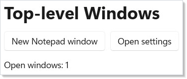

# Windows

Most Microsoft.UI.Reactor (Reactor) apps start with a single window — the one `ReactorApp.Run` opens
for you. When you need more (a settings dialog, a multi-document app, a tray
flyout), the `ReactorApp` static surface and a handful of hooks give you a
declarative way to manage every top-level window in the process.

## The Primary Window

`ReactorApp.Run<TRoot>(...)` opens one window with `TRoot` mounted as its
content:

```csharp
ReactorApp.Run<WindowsApp>("Windows Demo", width: 640, height: 520
#if DEBUG
    , preview: true
#endif
);
```

That window becomes `ReactorApp.PrimaryWindow`. By default, when the primary
window closes the process exits — see [Shutdown Policy](#shutdown-policy)
below if you need different behavior.

## Opening a Secondary Window

Call `ReactorApp.OpenWindow(spec, factory)` from anywhere on the UI thread.
The `WindowSpec` describes the window's chrome (title, size, icon,
presenter); the factory builds the root component:

```csharp
class WindowsApp : Component
{
    public override Element Render()
    {
        var (count, setCount) = UseState(0);

        return VStack(12,
            Heading("Top-level Windows"),
            HStack(8,
                Button("New Notepad window", () =>
                {
                    var n = count + 1;
                    ReactorApp.OpenWindow(
                        new WindowSpec
                        {
                            Title = $"Notepad #{n}",
                            Width = 420,
                            Height = 300,
                        },
                        () => new NotePadWindow($"Document #{n}"));
                    setCount(n);
                }),
                Button("Open settings", () =>
                {
                    // Reuse the same window if it's already open: FindWindow
                    // looks the surface up by its WindowKey, so a second
                    // click brings the existing window forward instead of
                    // opening a duplicate.
                    var key = WindowKey.Of("settings");
                    var existing = ReactorApp.FindWindow(key);
                    if (existing is not null)
                    {
                        existing.Activate();
                        return;
                    }

                    ReactorApp.OpenWindow(
                        new WindowSpec
                        {
                            Title = "Settings",
                            Width = 480,
                            Height = 360,
                            Key = key,
                        },
                        () => new SettingsWindow());
                })
            ),
            TextBlock($"Open windows: {ReactorApp.Windows.Count}")
        ).Padding(20);
    }
}
```



Each click of "New Notepad window" spawns an independent window. They have
their own state, their own DPI, their own lifecycle — closing one doesn't
affect the others.

`WindowSpec` is an immutable record. The fields you'll reach for most often:

| Field | Default | Purpose |
|-------|---------|---------|
| `Title` | `"Reactor App"` | Caption text |
| `Width` / `Height` | `1024` / `768` | Initial size in DIPs |
| `MinWidth` / `MinHeight` | `null` | Optional resize floor |
| `Icon` | `null` | `WindowIcon.FromPath(...)` or `WindowIcon.FromResource(...)` |
| `StartPosition` | `Default` | `CenterOnPrimary`, `CenterOnOwner`, `Manual`, `RestoreFromPersistence` |
| `PersistenceId` | `null` | Save and restore placement across sessions |
| `Key` | `null` | Stable identity for `FindWindow` and `UseOpenWindow` |
| `Owner` | `null` | Owner window for owned-window semantics |

All sizes are DIPs (device-independent pixels). Reactor handles the
DIP→physical conversion at the destination monitor's DPI.

## Reading the Current Window

Inside any component rendered as a window's content, hooks reach the owning
`ReactorWindow`:

```csharp
class NotePadWindow : Component
{
    private readonly string _label;
    public NotePadWindow(string label) { _label = label; }

    public override Element Render()
    {
        var (text, setText) = UseState("");
        var window = UseWindow();
        var state = UseWindowState();

        return VStack(12,
            SubHeading(_label),
            TextBlock(window is null
                ? "(no owning window)"
                : $"id={window.Id}  state={state}  dpi={window.Dpi}"),
            TextBox(text, setText, placeholderText: "Type something...")
                .Width(360),
            Button("Close", () => window?.Close())
        ).Padding(16);
    }
}
```

| Hook | Purpose |
|------|---------|
| `UseWindow()` | The owning `ReactorWindow` — `null` outside a window (e.g. tray flyouts) |
| `UseWindowState()` | `Normal` / `Minimized` / `Maximized` / `FullScreen` / `CompactOverlay`; re-renders on change |
| `UseIsActive()` | `true` while the window has foreground; re-renders on activation change |
| `UseDpi()` | Current DPI; re-renders on monitor change |
| `UseClosingGuard(canClose)` | Register a synchronous predicate that can veto a close |

`ReactorWindow` itself exposes `Close()`, `Activate()`, `SetSize(...)`,
`SetPosition(...)`, and lifecycle events (`Closing`, `Closed`,
`SizeChanged`, `StateChanged`).

## Finding and Enumerating Windows

```csharp
ReactorApp.Windows          // IReadOnlyList<ReactorWindow> snapshot
ReactorApp.PrimaryWindow    // First window opened, or null after it closes
ReactorApp.FindWindow(key)  // Look up by WindowKey
```

`WindowKey` is a string-typed identity stamped onto a `WindowSpec.Key`. Use
it to dedupe "open the settings window" against an existing one, as the
button handler in the shell snippet above does.

## Reusing a Window with `UseOpenWindow`

`UseOpenWindow` lets a component declaratively own a window's lifetime:
while the component is mounted, the window stays open; renders that pass
the same `WindowKey` reuse the same handle.

```csharp
class SettingsHost : Component
{
    public override Element Render()
    {
        // While this component is mounted, ensure a settings window keyed
        // to "settings" is open. Re-renders that pass the same WindowKey
        // reuse the same handle; the hook dedupes against the live window
        // registry via FindWindow.
        var settings = UseOpenWindow(
            key: "settings",
            spec: new WindowSpec { Title = "Settings", Width = 480, Height = 360 },
            factory: () => new SettingsWindow());

        return TextBlock(settings is null
            ? "(no UI dispatcher)"
            : $"Settings open — id={settings.Id}");
    }
}
```

`UseOpenWindow` doesn't unmount-close the window — that's deliberate, since
windows usually outlive the menu item that opened them. To close on
unmount, return a `UseEffect` cleanup that calls `Close()` on the handle.

(Tray icons go the other way — `UseTrayIcon` *does* close on unmount, since
a tray icon belongs to the component that declared it.)

## Shutdown Policy

```csharp
// Call once at startup, before ReactorApp.Run. With OnLastSurfaceClosed the
// process keeps running while a tray icon or any window is alive; with
// Explicit you must call ReactorApp.Exit() yourself.
static class Startup
{
    public static void ConfigureShutdown()
    {
        ReactorApp.ShutdownPolicy = ShutdownPolicy.OnLastSurfaceClosed;
    }
}
```

| Policy | Process exits when... |
|--------|-----------------------|
| `OnPrimaryWindowClosed` *(default)* | The primary window closes |
| `OnLastSurfaceClosed` | The last window AND the last tray icon both close |
| `Explicit` | Never automatically — you must call `ReactorApp.Exit()` |

Pick `OnLastSurfaceClosed` for tray-resident apps that should keep running
while only an icon is visible. Pick `Explicit` when you need a custom
"quit" gesture (a tray menu item, a `Cmd-Q` accelerator, etc.) and call
`ReactorApp.Exit(exitCode)` from the handler.

## Tray Icons (in Brief)

A tray icon is a non-window surface registered with the shell's notification
area. Use `UseTrayIcon` from a component to register one whose lifetime is
tied to that component:

```csharp
class TrayHost : Component
{
    public override Element Render()
    {
        var icon = UseMemo(() => WindowIcon.FromPath("Assets/TrayIcon.ico"));
        var tray = UseTrayIcon(new TrayIconSpec(
            Icon: icon,
            Tooltip: "My App",
            Key: WindowKey.Of("main-tray")));

        UseEffect(() =>
        {
            if (tray is null) return () => { };
            void onClick(object? s, EventArgs e)
                => ReactorApp.PrimaryWindow?.Activate();
            tray.Click += onClick;
            return () => tray.Click -= onClick;
        }, tray ?? (object)"no-tray");

        return TextBlock("Tray icon registered while this component is mounted.");
    }
}
```

The hook returns a `ReactorTrayIcon?` exposing `Click`, `DoubleClick`, and
`RightClick` events plus `ShowFlyout(content)` for in-place flyout UI.
For app-scoped tray icons that survive component unmount, call
`ReactorApp.OpenTrayIcon(spec)` directly.

## Tips

**One spec record per window — don't rebuild it in `Render()` if you can
avoid it.** Wrap the `WindowSpec` (and especially the `WindowIcon`) in a
`UseMemo` so re-renders don't reallocate them. Identity-stable specs let
`UseOpenWindow`'s value-equality compare see no change and skip the
chrome-update pass.

**`Width`/`Height` are doubles, not ints.** All sizes and positions are
DIPs. Literal call sites bind cleanly (`Width = 480`), but a variable
typed `int` needs a cast.

**Use `WindowKey` for any window you might want to find again.** The cost
is one string allocation; the payoff is `FindWindow` lookups,
`UseOpenWindow` reuse, and shell tools that can address the surface by
name.

**Closing guards are synchronous.** `UseClosingGuard(() => …)` runs on the
UI thread and must return immediately. For an async confirmation dialog,
return `false` from the guard and re-trigger `Close()` from the dialog
callback.

**The primary window is special only by default.** Once you change
`ShutdownPolicy`, "primary" is just a name for the first window you opened
— there's nothing the framework treats differently about it.

## Next Steps

- **[WinForms Interop](winforms-interop.md)** — previous topic: hosting Reactor inside WinForms via XAML Islands
- **[Reactor](index.md)** — back to the index: overview of the framework and full topic list
- **[Navigation](navigation.md)** — in-window routing with `UseNavigation`, `NavigationView`, deep links
- **[Effects and Lifecycle](effects.md)** — `UseEffect` patterns for the imperative work that pairs with windows
- **[Commanding](commanding.md)** — wire keyboard accelerators and tray-menu items to commands
