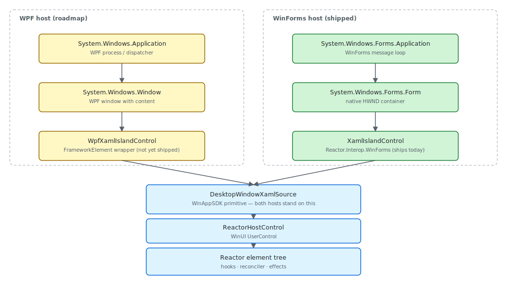
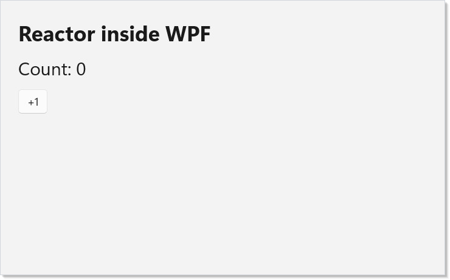

# WPF Interop

**Status:** A first-class WPF host control (`Reactor.Interop.Wpf`) is
not yet shipped. The package `Reactor.Interop.WinForms` is the only
host wrapper in the box today; the WPF equivalent is on the roadmap.
Until it ships, host Reactor content from WPF by embedding
[`DesktopWindowXamlSource`](https://learn.microsoft.com/en-us/windows/windows-app-sdk/api/winrt/microsoft.ui.xaml.hosting.desktopwindowxamlsource)
directly — the same WinAppSDK primitive [WinForms Interop](winforms-interop.md)
wraps in `XamlIslandControl`. This page describes the proposed surface
so existing WPF apps can plan around it, and the data-flow / threading
patterns that already work today.



## Proposed surface

The WPF host control will mirror `Reactor.Interop.WinForms`. Two types:
a single-shot bootstrap that brings up WinAppSDK alongside WPF's
dispatcher, and a `FrameworkElement` that wraps `DesktopWindowXamlSource`
and mounts a Reactor `Component` by type:

```csharp
// Roadmap shape — Reactor.Interop.Wpf is not shipped yet. The proposed
// API mirrors XamlIslandBootstrap from Reactor.Interop.WinForms, swapping
// the System.Windows.Forms message loop for System.Windows.Application.
//
//   using Microsoft.UI.Reactor.Interop.Wpf;
//   using System.Windows;
//
//   [STAThread]
//   public static void Main()
//   {
//       WpfXamlIslandBootstrap.Run(() =>
//       {
//           var window = new Window
//           {
//               Title = "My WPF + Reactor App",
//               Width = 800,
//               Height = 500,
//           };
//
//           var island = new WpfXamlIslandControl
//           {
//               ComponentType = typeof(WpfHostDemo),
//           };
//
//           window.Content = island;
//           window.Show();
//
//           new System.Windows.Application().Run(window);
//       });
//   }
//
// Today: until the WPF host ships, host Reactor content from WPF by
// embedding ReactorHostControl through DesktopWindowXamlSource directly
// (the same primitive XamlIslandControl wraps for WinForms). The
// XamlIslandBootstrap shape on the WinForms page applies — substitute the
// WPF dispatcher for the WinForms message loop.
```

The snippet is roadmap-shaped — the types `WpfXamlIslandBootstrap` and
`WpfXamlIslandControl` are not yet shipped. The shape parallels
`XamlIslandBootstrap.Run()` from
[Reactor.Interop.WinForms](winforms-interop.md), with WPF's
`System.Windows.Application` driving the message loop in place of
`System.Windows.Forms.Application.Run()`.

## Reference

| Surface | Status | Notes |
|---|---|---|
| `Reactor.Interop.Wpf.WpfXamlIslandBootstrap.Run(Action)` | Roadmap | Initializes WinAppSDK + WinUI dispatcher; calls back into WPF startup. |
| `Reactor.Interop.Wpf.WpfXamlIslandControl` | Roadmap | `FrameworkElement` wrapping `DesktopWindowXamlSource`. `ComponentType` / `ContentFactory` / `XamlContent` slots mirror [WinForms](winforms-interop.md). |
| `Microsoft.UI.Xaml.Hosting.DesktopWindowXamlSource` | Ships (WinAppSDK) | The underlying primitive both hosts wrap. Today's WPF apps embed this directly. |
| `Microsoft.UI.Reactor.Hosting.ReactorHostControl` | Ships | The WinUI `UserControl` that owns the Reactor element tree. Any WPF host control would mount this inside the island. |
| `UseObservable<T>(INotifyPropertyChanged)` | Ships | Bridges a WPF MVVM view-model into Reactor's re-render. |

The Reactor side is the same surface a WinForms or WinUI host uses —
nothing about the component, hooks, or modifiers changes inside the
island. The interop wrapper is purely a host-side adapter.

## The component a host mounts

`WpfXamlIslandControl.ComponentType` will accept any concrete
`Component` subclass with a parameterless constructor — same shape as
`XamlIslandControl.ComponentType` on the WinForms side. The component
itself has no idea it's hosted in WPF:

```csharp
// The Component that a WPF host (now: DesktopWindowXamlSource; future:
// WpfXamlIslandControl.ComponentType) mounts. This is identical to any
// other Reactor component — interop happens at the host boundary, not
// inside the component.
class WpfHostDemo : Component
{
    public override Element Render()
    {
        var (count, setCount) = UseState(0);

        return VStack(12,
            Heading("Reactor inside WPF"),
            TextBlock($"Count: {count}").FontSize(24),
            Button("+1", () => setCount(count + 1))
        ).Padding(24).Background(SolidBackground);
    }
}
```



This is the screenshot of `WpfHostDemo` running in a stock Reactor
window — exactly what `WpfXamlIslandControl` will render once the host
ships. Build the component first, then bring up the WPF shell around
it when the API lands.

## Bridging a WPF MVVM view-model

The most common WPF migration story today is "I have a working
view-model implementing `INotifyPropertyChanged` and I want the Reactor
island to observe it." [`UseObservable`](hooks.md) does exactly that —
it subscribes the current component's re-render to the source's
`PropertyChanged` event:

```csharp
// Bridging a WPF MVVM view-model into Reactor. The view-model is plain
// INotifyPropertyChanged — the same class your existing WPF bindings
// observe. UseObservable subscribes Reactor's re-render to that channel
// so a property change from the WPF side re-renders the island.
//
// The view-model instance is passed via Props so the same component
// works against any IUserViewModel implementation — easier to test and
// avoids capturing a singleton in the closure.

interface IUserViewModel : INotifyPropertyChanged
{
    string Name { get; set; }
    int UnreadCount { get; }
}

record UserPanelProps(IUserViewModel ViewModel);

class UserPanel : Component<UserPanelProps>
{
    public override Element Render()
    {
        var vm = UseObservable(Props.ViewModel);

        return VStack(8,
            Heading(vm.Name),
            TextBlock($"{vm.UnreadCount} unread")
                .Foreground(vm.UnreadCount > 0 ? AccentText : SecondaryText),
            TextField(vm.Name, next => vm.Name = next, placeholder: "Display name")
        ).Padding(16).Background(SolidBackground);
    }
}
```

Passing the view-model through `Props` rather than capturing a
singleton in the closure makes the component independent of the host's
service-locator setup — the same component renders against a real
view-model from the WPF side and a fake one from a unit test that
drives `Component<UserPanelProps>` directly. The `OnPropertyChanged`
fire from a setter on the WPF side enqueues a render; the next render
sees the new value.

Two-way binding flows the other direction through plain event handlers.
The snippet's `TextField` writes back to `vm.Name`, which raises
`PropertyChanged`, which re-enters `UseObservable`, which schedules a
no-op re-render (the value has already been written; equality
short-circuits the slot update).

## Threading: WPF Dispatcher vs WinUI DispatcherQueue

The single most load-bearing fact about WPF + WinUI cohabitation:
WPF's `System.Windows.Threading.Dispatcher` and WinUI's
`Microsoft.UI.Dispatching.DispatcherQueue` are **distinct objects**.
They run on the same UI thread, but they are separate queues with
separate continuations. A property write that originates inside a WPF
event handler — a `Click`, a `Loaded`, a `Binding` update — is on
WPF's dispatcher; reaching a Reactor hook setter from that handler
means the setter sees an `Environment.CurrentManagedThreadId` that
matches the WinUI dispatcher's captured thread, so the fast path
runs and nothing has to be marshalled.

The case to think about is the *other* direction: a Reactor effect
that touches a WPF `DependencyProperty` directly. Inside the effect,
you're on the WinUI dispatcher; the WPF property setter expects WPF's.
Reach for `Dispatcher.Invoke` on the WPF side:

```csharp
// Threading note for any cross-framework host: WPF's Dispatcher (System
// .Windows.Threading.Dispatcher) and WinUI's DispatcherQueue are NOT the
// same instance — even when both run on the same UI thread. A property
// write that originates on the WPF side (a Click handler, a Loaded
// event, a Binding update) is on WPF's Dispatcher; it has to reach
// Reactor through a hook setter, which auto-marshals onto the WinUI
// DispatcherQueue captured at island bootstrap.
//
// The "free" path: call setX from anywhere — RenderContext detects the
// off-dispatcher call and posts onto the captured WinUI dispatcher. No
// app code needed.

class ThreadingDemo : Component
{
    public override Element Render()
    {
        var (ticks, setTicks) = UseState(0);

        UseEffect(() =>
        {
            // Background timer feeds the setter from a worker thread.
            // The setter detects the off-dispatcher call and queues
            // itself back onto the captured WinUI DispatcherQueue —
            // no manual TryEnqueue needed.
            var cts = new CancellationTokenSource();
            _ = Task.Run(async () =>
            {
                while (!cts.IsCancellationRequested)
                {
                    await Task.Delay(1000, cts.Token);
                    setTicks(ticks + 1);
                }
            }, cts.Token);
            return () => cts.Cancel();
        });

        return VStack(8,
            Heading("Threading"),
            TextBlock($"Ticks: {ticks}")
        ).Padding(16).Background(SolidBackground);
    }
}
```

The snippet uses an off-thread background timer to update Reactor
state — that path is fully automatic; `setTicks` detects the
off-dispatcher call and posts back onto the captured WinUI dispatcher
without any wrapper code. The hand-marshalling concern only applies
when you reach *out of* Reactor into WPF objects from inside an effect
or callback.

## Accessibility

Inside the WinUI subtree, every accessibility modifier from a pure
Reactor app keeps working — `AutomationName`, `HeadingLevel`,
`Landmark`, [`UseFocusTrap`](accessibility.md), and `UseAnnounce` all
operate against the WinUI automation peer attached to
`DesktopWindowXamlSource`:

```csharp
// Accessibility surface inside a WPF island is the same as in a pure
// Reactor window: AutomationName, HeadingLevel, Landmark, and the
// UseFocusTrap/UseAnnounce hooks all work unchanged because the
// automation tree hangs off DesktopWindowXamlSource, not the WPF host.
//
// The one cross-host concern: WPF's UIAutomation peers and the WinUI
// automation tree are siblings — a screen reader walks each tree via
// its window peer. Inside the island, build the automation tree with
// Reactor's modifiers; do not try to reach across the boundary from
// either side.

class AccessibleWpfDemo : Component
{
    public override Element Render()
    {
        var (name, setName) = UseState("");

        return VStack(12,
            Heading("Profile")
                .HeadingLevel(AutomationHeadingLevel.Level1),
            TextField(name, setName, header: "Display name")
                .AutomationName("Display name")
                .TabIndex(0),
            Button("Save", () => { })
                .AutomationName("Save profile")
                .TabIndex(1)
        ).Padding(24)
         .Landmark(AutomationLandmarkType.Form)
         .Background(SolidBackground);
    }
}
```

The interop boundary itself shows up as a sibling automation tree —
the screen reader walks WPF's tree via its window peer and the
WinUI tree via the island's peer. Build the WinUI-side semantics with
Reactor modifiers and don't try to reach across the boundary from
either side; the two automation trees are explicitly designed to
coexist without cross-tree parent/child links.

## Tips

**Use `Reactor.Interop.WinForms` as the shape reference.** Until the
WPF host ships, the WinForms host control demonstrates every
designer / `ComponentType` / `ContentFactory` decision the WPF host
will mirror. Reading [WinForms Interop](winforms-interop.md) first is
the fastest way to be productive against the proposed surface.

**Keep the Reactor component dispatcher-agnostic.** Don't reach for
`System.Windows.Threading.Dispatcher.CurrentDispatcher` from inside a
hook body — the captured `DispatcherQueue` is the only dispatcher the
reconciler knows about. Hand-marshalling onto WPF's dispatcher belongs
in `UseEffect` cleanup against WPF objects, not inside `Render()`.

**Bridge view-models through `UseObservable`, not `DataContext`.** WPF
`DataContext` is a pull-based binding propagation mechanism; Reactor
binds by closure, with re-renders driven by `INotifyPropertyChanged`
through [`UseObservable`](hooks.md). Pass the view-model through `Props`
so the component is testable without a WPF host.

**Build and screenshot the component first.** Author the Reactor side
(component, hooks, modifiers) as a standalone Reactor window the same
way every other doc app in this docset does. When the WPF host control
ships, dropping the component into a `WpfXamlIslandControl.ComponentType`
slot is a one-line change.

## Next Steps

- **[WinForms Interop](winforms-interop.md)** — Previous: the shipping
  parallel host with `XamlIslandControl`, `XamlIslandBootstrap.Run()`,
  and the `ComponentType` designer integration the WPF surface will
  mirror.
- **[Windows](windows.md)** — Next: top-level windows, multi-window apps,
  and tray icons inside a Reactor-primary host.
- **[Hooks](hooks.md)** — `UseObservable`, `UseObservableTree`, and
  `UseObservableProperty` for bridging WPF view-models.
- **[Threading and Dispatch](threading-and-dispatch.md)** — How
  Reactor's hook setters auto-marshal across dispatchers and the
  invariants the WinUI side enforces.
- **[XAML Developers](xaml-developers.md)** — Migration cookbook for
  WPF XAML pages moving to Reactor's declarative shell.
- **[Reactor vs XAML](reactor-vs-xaml.md)** — The architectural shift
  from `Binding` / `DataContext` / `DataTemplate` to closure-based
  binding and function components.
