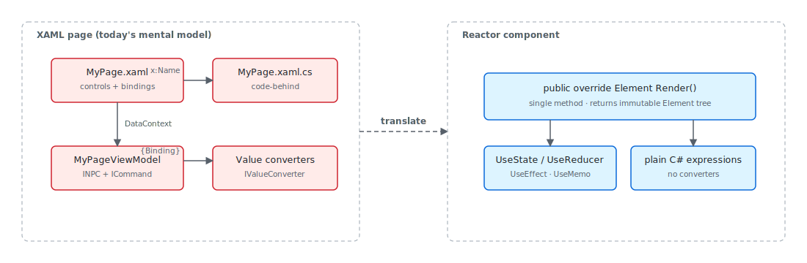

Reactor's render-from-state model has a clean 1:1 translation table to XAML
that an experienced XAML developer can hold in their head. Where XAML
describes *bindings* between view-model properties and control DPs and lets
the binding engine pull values on change-notification, Reactor describes the
*current UI* directly and re-evaluates the entire component when state
changes. The control tree is the same WinUI control tree at runtime — only
the authoring surface differs. This page is the translation key: every
XAML idiom you reach for (DataContext, Binding modes, DataTemplate,
DependencyProperty, code-behind, ICommand, Frame.Navigate) maps to a
specific Reactor shape, and the body below walks each one in order.
Companion essay [`reactor-vs-xaml`](reactor-vs-xaml.md) covers the
architectural *why* — read this page for the recipes, that one for the
philosophy.

# Reactor for XAML Developers

If you already know XAML, Reactor is not a different Windows UI stack. It still
renders real WinUI controls. The shift is in **how** you describe the UI: instead
of splitting a page across XAML, bindings, converters, and code-behind, you
return the UI directly from C# and let Reactor keep the native control tree in
sync.



## The Mental Model Shift

Think of Reactor as "WinUI controls, but expressed like a function of state."

| In XAML | In Reactor |
|---------|------------|
| `Page`, `UserControl`, `Window` markup | A `Component` with `Render()` |
| `{Binding Name}` | Plain C# variable usage: `TextBlock(name)` |
| `Mode=TwoWay` | Controlled input: `TextField(name, setName)` |
| `DataContext` | Local hook state, typed props, or [context](context.md) |
| `ICommand` | Lambdas, methods, or [commands](commanding.md) |
| `StackPanel` | [`VStack`](layout.md) or [`HStack`](layout.md) |
| `Grid.Row`, `Grid.Column` | `.Grid(row: ..., column: ...)` |
| `StaticResource` / `ThemeResource` | [`Theme`](styling.md) tokens and fluent modifiers |
| `Frame.Navigate(...)` | [`UseNavigation`](navigation.md) + `NavigationHost` |

The important difference is that Reactor does not ask you to describe *bindings*.
It asks you to describe the **current UI**. When the state changes, `Render()`
runs again and Reactor updates only the native WinUI controls that changed.

## Rewriting a Familiar Form

Here is the kind of XAML page many WinUI developers start with:

```xml
<StackPanel Spacing="12" Padding="24">
  <TextBlock Text="Customer" FontSize="24" FontWeight="SemiBold" />

  <TextBox Header="Name"
           Text="{Binding Name, Mode=TwoWay}" />

  <TextBox Header="Email"
           Text="{Binding Email, Mode=TwoWay}" />

  <CheckBox Content="Email me updates"
            IsChecked="{Binding WantsUpdates, Mode=TwoWay}" />

  <Button Content="Save"
          Command="{Binding SaveCommand}" />
</StackPanel>
```

In Reactor, the same screen becomes a component:

```csharp
class TutorialFormPage : Component
{
    public override Element Render()
    {
        var (name, setName) = UseState("");
        var (email, setEmail) = UseState("");
        var (wantsUpdates, setWantsUpdates) = UseState(true);
        var canSave = !string.IsNullOrWhiteSpace(name) && !string.IsNullOrWhiteSpace(email);

        return VStack(12,
            SubHeading("Customer"),
            TextField(name, setName, header: "Name"),
            TextField(email, setEmail, header: "Email"),
            CheckBox(wantsUpdates, setWantsUpdates, label: "Email me updates"),
            HStack(8,
                Button("Save", () => { }).Disabled(!canSave),
                TextBlock(canSave ? "Ready to save" : "Complete all required fields")
                    .Opacity(0.7)
            )
        ).Width(360);
    }
}
```

What changed:

- **Bindings became state variables.** `Name`, `Email`, and `WantsUpdates` live in `UseState`.
- **Two-way input became explicit.** `TextField(name, setName)` makes data flow obvious.
- **The command became normal C#.** The save button uses a lambda instead of XAML command wiring.
- **Derived UI stayed inline.** `canSave` is just a local expression, not a converter or extra property.

That is the Reactor pattern in one screen: **state at the top, UI returned at the
bottom**.

## Layout Feels Familiar, but Smaller

Most XAML layouts translate directly, but Reactor pushes you toward a smaller set
of composition primitives.

| XAML | Reactor |
|------|---------|
| `StackPanel Orientation="Vertical"` | `VStack(...)` |
| `StackPanel Orientation="Horizontal"` | `HStack(...)` |
| `Grid` with row/column definitions | `Grid(columns: ..., rows: ..., ...)` |
| `Border` | `Border(child)` |
| `ScrollViewer` | `ScrollView(child)` |

This XAML:

```xml
<Grid ColumnSpacing="12" RowSpacing="8">
  <Grid.ColumnDefinitions>
    <ColumnDefinition Width="Auto" />
    <ColumnDefinition Width="*" />
  </Grid.ColumnDefinitions>

  <Grid.RowDefinitions>
    <RowDefinition Height="Auto" />
    <RowDefinition Height="Auto" />
  </Grid.RowDefinitions>

  <TextBlock Grid.Row="0" Grid.Column="0" Text="First name" />
  <TextBox Grid.Row="0" Grid.Column="1" />
  <TextBlock Grid.Row="1" Grid.Column="0" Text="Last name" />
  <TextBox Grid.Row="1" Grid.Column="1" />
</Grid>
```

becomes:

```csharp
class GridTranslationPage : Component
{
    public override Element Render()
    {
        return Grid(
            columns: [GridSize.Auto, GridSize.Star()],
            rows: [GridSize.Auto, GridSize.Auto],
            TextBlock("First name").Bold().Grid(row: 0, column: 0),
            TextField("", _ => { }).Grid(row: 0, column: 1),
            TextBlock("Last name").Bold().Grid(row: 1, column: 0),
            TextField("", _ => { }).Grid(row: 1, column: 1)
        ) with
        {
            ColumnSpacing = 12,
            RowSpacing = 8
        };
    }
}
```

The layout idea is the same. The difference is that the child placement lives in
fluent modifiers instead of attached properties written in markup.

## Bindings Turn into State, Props, or Plain Expressions

XAML developers often look for the Reactor equivalent of `Binding`. There is no
single replacement, because bindings usually solve several different problems.

Use this rule of thumb instead:

- **Value owned by this component:** [`UseState`](hooks.md)
- **Complex local updates:** [`UseReducer`](hooks.md)
- **Input from a parent:** typed props via [`Component<TProps>`](components.md)
- **Computed value:** ordinary local C# expression
- **Shared app state:** [`context`](context.md) or a higher-level parent component
- **Existing MVVM object:** [`UseObservable`](advanced.md) or `UseObservableTree`

That is why Reactor code often looks simpler than XAML. A label like
`TextBlock($"{firstName} {lastName}")` is already "bound" because `Render()`
re-runs whenever the relevant state changes.

> **Caveat:** A XAML `Binding` with `Mode=TwoWay` becomes a Reactor controlled-input
> pattern (`TextField(name, setName)`), not a binding-with-mode. There is
> **no** Reactor analogue to `Mode=OneWay` / `Mode=OneTime` / `Mode=TwoWay`
> because state IS the binding — every render re-reads from state, every
> edit calls a setter. If you write `TextField(name, _ => { })` and never
> call a setter, the field is read-only (effectively `Mode=OneWay`); if
> you wire both, it round-trips (effectively `Mode=TwoWay`). The trap is
> "reach for the binding mode for OneTime" — there is no equivalent.
> Cache the value in a `UseRef` and read `ref.Current` if you genuinely
> want to capture-and-freeze, or call a function once in a
> `UseEffect(() => …, Array.Empty<object>())` so it runs only on mount.
> The Reactor analyzer doesn't emit a specific diagnostic for "missing
> setter" — passing `null` to a `TextField` change handler is a
> `CS8625` "Cannot convert null literal" instead.

## Events and Commands Are Just C#

You do not need a special command layer for every button click.

- `Button("Save", Save)` is the direct equivalent of a button command.
- `Button("Refresh", async () => await ReloadAsync())` works for async actions.
- `TextField(text, setText)` replaces both `TextChanged` wiring and two-way binding.

If you want richer busy/error behavior, Reactor also has a dedicated
[Commanding](commanding.md) API. But the default is deliberately small: use a
method or lambda first, then add command abstractions when they actually help.

## Events: XAML Attributes Become Fluents

Every WinUI event attribute has a matching Reactor fluent. For most events
the rule is straightforward — drop the leading `On` from the Reactor
property name. A handful of Reactor fluents normalize across WinUI's
slightly different event shapes (e.g. `CheckBox` exposes three separate
`Checked` / `Unchecked` / `Indeterminate` events in XAML; Reactor surfaces
a single `IsCheckedChanged` callback):

| WinUI XAML event | Reactor fluent |
|------------------|----------------|
| `<Button Click="OnClick"/>` | `Button("…").Click(handler)` |
| `<TextBox TextChanged="OnTextChanged"/>` | `TextField(text, setText).Changed(handler)` |
| `<ListView SelectionChanged="OnSelectionChanged"/>` | `ListView<T>(...).SelectionChanged(handler)` |
| `<ComboBox SelectionChanged="OnSelectionChanged"/>` | `ComboBox(...).SelectedIndexChanged(handler)` — Reactor reports the selected index, not the args |
| `<CheckBox Checked="…" Unchecked="…"/>` | `CheckBox(value, setValue).IsCheckedChanged(handler)` — Reactor collapses the three XAML events into a single bool callback |

The underlying init property keeps the `On` prefix, so existing
property-init code continues to compile:

```csharp
class EventsFluentExample : Component
{
    public override Element Render()
    {
        Action handler = () => { /* clicked */ };

        return VStack(8,
            // Property-init still works:
            new ButtonElement("Save") { OnClick = handler },
            // Preferred fluent:
            Button("Save").Click(handler)
        );
    }
}
```

The fluent drops the `On` because C# binds `el.OnClick(arg)` to
delegate-as-property invocation (`Action?.Invoke(arg)`) and never falls back
to extension methods — see
[spec 039](../specs/039-property-and-event-scrub.md) §0.1 for the discovery
and the naming decision. Passing `null` to any of these fluents clears a
previously-set handler.

## Navigation Without `Frame`

Reactor navigation is still WinUI navigation in spirit, but it is declared in the
component tree instead of being driven by imperative `Frame.Navigate(...)` calls.

```csharp
class TutorialNavigationPage : Component
{
    public override Element Render()
    {
        var nav = UseNavigation(TutorialRoute.Home);

        return Border(
            NavigationView(
                [
                    NavItem("Home", icon: "Home", tag: "Home"),
                    NavItem("Settings", icon: "Setting", tag: "Settings"),
                    NavItem("Account", icon: "Contact", tag: "Account")
                ],
                content: NavigationHost(nav, route => route switch
                {
                    TutorialRoute.Home => VStack(8,
                        Heading("Home"),
                        TextBlock("This is the shell root."),
                        Button("Go to Settings", () => nav.Navigate(TutorialRoute.Settings))
                    ).Padding(24),
                    TutorialRoute.Settings => VStack(8,
                        Heading("Settings"),
                        TextBlock("Typed routes replace imperative Frame calls."),
                        Button("Back", () => nav.GoBack())
                    ).Padding(24),
                    TutorialRoute.Account => VStack(8,
                        Heading("Account"),
                        TextBlock("A second page in the same shell.")
                    ).Padding(24),
                    _ => TextBlock("Not found").Padding(24)
                })
            )
        ).Height(320).Background(Theme.CardBackground).CornerRadius(8);
    }
}
```

Instead of keeping a `Frame` reference and pushing pages into it, you keep a typed
navigation handle in component state and render the current page through
`NavigationHost`. That keeps navigation decisions in the same declarative flow as
the rest of the UI.

## You Can Keep MVVM While Migrating

You do **not** have to throw away existing `INotifyPropertyChanged` view models on
day one. Reactor has a bridge specifically for migration:

```csharp
class ObservableTreeDemo : Component
{
    private static readonly SettingsViewModel _vm = new();

    public override Element Render()
    {
        var vm = UseObservableTree(_vm);

        return VStack(12,
            SubHeading("UseObservableTree"),
            TextField(vm.UserName, v => vm.UserName = v,
                header: "User Name"),
            ToggleSwitch(vm.DarkMode, v => vm.DarkMode = v,
                header: "Dark Mode"),
            Slider(vm.FontSize, 10, 32, v => vm.FontSize = (int)v),
            TextBlock($"Preview: {vm.UserName}")
                .FontSize(vm.FontSize).Bold()
        ).Padding(24);
    }
}
```

`UseObservableTree` subscribes to your existing view model and triggers a
re-render when it changes. That lets you migrate screen-by-screen:

1. Keep the current view model.
2. Replace the XAML view with a Reactor component.
3. Move simple screens from view-model state to hooks later, if you want.

This is usually the least risky way to adopt Reactor in an existing codebase.

## What You Usually Stop Writing

Most XAML developers notice the same things disappear first:

- **No `DataContext` plumbing** for ordinary screens
- **No value converters** for simple formatting or visibility rules
- **No code-behind just to mirror control state**
- **No separate markup file** for routine UI composition
- **Fewer tiny view models** whose only job was exposing bindable properties

The replacement is not "more framework." It is usually just **more ordinary C#**.

## A Practical Migration Path

If you are moving an existing WinUI app to Reactor, this tends to work well:

1. Start with one leaf page, not the whole app shell.
2. Rebuild the layout with `VStack`, `HStack`, `Grid`, and `Border`.
3. Replace bindings with `UseState`, props, or `UseObservableTree`.
4. Inline trivial converters as local expressions.
5. Keep existing services and view models until the Reactor version is stable.
6. Extract reusable UI into small components once the page works.

The goal is not to "port XAML syntax into C#." The goal is to adopt Reactor's
state-driven model while preserving your WinUI knowledge.

## Patterns

### DependencyProperty becomes a hook

In XAML, every reactive value on a control sits on a `DependencyProperty`
— a globally-registered slot with metadata, change callbacks, and
inheritance rules. In Reactor, the analogue is a hook call inside
[`Render()`](components.md): `var (count, setCount) = UseState(0)` is
the equivalent of a single instance-scoped DP, and the hook slot table
behind it ([hooks-internals](hooks-internals.md)) plays the role the
DP system plays for XAML. The mental shift is "I don't need a registry;
I need a positional slot," and the implementation gets vastly smaller
in the process.

### `UserControl` becomes a component

XAML developers reach for `UserControl` whenever a screen contains a
reusable visual chunk with its own state. In Reactor, that chunk is a
[component](components.md) — a class with a `Render()` method and
typed props. The XAML version has a `.xaml` markup file plus a
`.xaml.cs` code-behind plus often a property dependency-injected via
DataContext; the Reactor version is one C# class. The reuse story is
the same; the line count drops by ~70% on most controls.

### `DataTemplate` becomes a render function

XAML `DataTemplate` declares how each item in a list renders. Reactor's
equivalent is the third argument to [`ListView<T>`](collections.md) /
[`GridView<T>`](collections.md) / [`VirtualList`](collections.md): a
`Func<T, Element>` that returns the per-item Element tree. Item
selection and editing are state in the parent component, not a
hand-wired `SelectedItem` binding. The
[recipes/master-detail](recipes/master-detail.md) walkthrough is the
canonical example.

## Common Mistakes

### Trying to compute layout from a `DependencyProperty`

Reactor has no DP system — there is no `DependencyProperty.Register`,
no metadata callback, no `AffectsMeasure`. Computed values live as
ordinary local variables inside `Render()`; cached computations live in
[`UseMemo`](hooks.md). If you find yourself looking for "the equivalent
of `AffectsArrange`," the answer is "your `Render()` already ran and
the reconciler diffed the layout-affecting modifiers" — see
[reactor-vs-xaml](reactor-vs-xaml.md) for the longer explanation.

### Using `INotifyPropertyChanged` to back local state

A small "binding view model" that exposes `Name`, `Email`, etc. as
INPC properties is the XAML idiom — in Reactor, those four lines
collapse to four `UseState` calls. The `INotifyPropertyChanged` bridge
still exists ([`UseObservable`](advanced.md)), but reach for it only
when you're migrating an existing view model. New code uses hooks.

### Writing XAML at all

Reactor does not host a XAML loader. There is no `Application.LoadComponent`
equivalent, no `xmlns:reactor`, no `*.reactor.xml` markup. Apps that
need part of the screen in XAML use a WinUI `Page` as the host and
embed Reactor via [winforms-interop](winforms-interop.md) or
`ReactorHostControl`; everything inside that host is C#. If a
contractor's "Reactor XAML compiler" appears in your search results,
it doesn't exist — the framework's design eliminates the second
authoring language deliberately.

## Tips

**Think "render the current truth."** In XAML, you often describe relationships
between properties. In Reactor, you usually compute the current value directly and
return it.

**Prefer state over control references.** If changing something should update the
screen, store the value in `UseState` instead of reaching into a control instance.

**Use small components where you used `UserControl`.** The same decomposition
instinct still applies; the only change is that the reusable unit is a C#
component rather than a XAML file.

**Keep MVVM only where it earns its keep.** Existing observable objects migrate
well, but many small "binding-only" view models become unnecessary once your UI is
already C#.

## Next Steps

- **[Reactor vs XAML](reactor-vs-xaml.md)** — the architectural essay: why the binding model is fundamentally different, not just syntactically
- **[Getting Started](getting-started.md)** — build your first Reactor app from scratch
- **[Components](components.md)** — break UI into reusable typed components
- **[Hooks](hooks.md)** — learn `UseState`, `UseReducer`, `UseEffect`, and the core render model
- **[Layout](layout.md)** — map more WinUI layout patterns into Reactor primitives
- **[Advanced Patterns](advanced.md)** — bridge existing MVVM state with `UseObservableTree`
