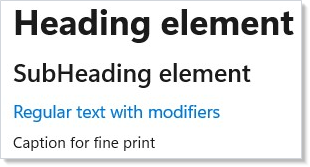

# Duct

Duct is a declarative UI framework for building native Windows desktop apps in
pure C#. No XAML. No data binding. No view models. You describe your UI as a
function of state, and Duct keeps the screen in sync.

## Why Duct?

**Pure C# from top to bottom.** Your entire app — layout, styling, state,
logic — lives in `.cs` files. No markup languages, no code-behind split, no
designer files.

**Declarative rendering.** You write a `Render()` method that returns your UI.
When state changes, Duct diffs the old and new element trees and patches only
what changed in the native WinUI controls.

**Hooks for state management.** `UseState`, `UseReducer`, `UseEffect`, and
friends give you React-style state management without the JavaScript.

**Native performance.** Duct renders to real WinUI 3 controls. Your app is a
standard Windows desktop app — no web views, no Electron, no interpretation
layer.

## Quick Look

A complete Duct app in one file:

```csharp
class HelloWorld : Component
{
    public override Element Render()
    {
        return VStack(12,
            Text("Hello from Duct!").FontSize(24).Bold(),
            Text("No XAML. No data binding. Just C#.")
        ).Padding(24);
    }
}
```


State and interactivity in a few lines:

```csharp
class QuickCounter : Component
{
    public override Element Render()
    {
        var (count, setCount) = UseState(0);

        return HStack(8,
            Button("- 1", () => setCount(count - 1)),
            Text($"{count}").FontSize(20).SemiBold().Width(40)
                .HAlign(HorizontalAlignment.Center),
            Button("+ 1", () => setCount(count + 1))
        ).Padding(24);
    }
}
```


Built-in text styling:

```csharp
class StyledText : Component
{
    public override Element Render()
    {
        return VStack(8,
            Heading("Heading element"),
            SubHeading("SubHeading element"),
            Text("Regular text with modifiers")
                .FontSize(14).Foreground("#0078D4"),
            Caption("Caption for fine print")
        ).Padding(24);
    }
}
```



## How It Works

1. You define [**components**](components.md) — classes with a `Render()` method that returns
   an element tree.
2. You manage state with [**hooks**](hooks.md) — `UseState`, `UseReducer`, `UseEffect`,
   and more — called inside `Render()`.
3. When state changes, Duct calls `Render()` again, diffs the result, and
   updates only the WinUI controls that changed.

That's it. No event subscriptions to manage, no property-changed notifications
to wire up, no dispatcher threading to worry about.

## Documentation

### Beginner

- **[Getting Started](getting-started.md)** — Create your first app, manage state, build a todo list
- **[Dev Tooling](dev-tooling.md)** — Preview mode, hot reload, development workflow
- **[Components](components.md)** — Component classes, props, function components, composition
- **[Hooks](hooks.md)** — UseState, UseReducer, UseEffect, UseMemo, UseRef, UseCallback
- **[Layout](layout.md)** — VStack, HStack, Grid, ScrollView, Border, responsive patterns
- **[Flex Layout](flex-layout.md)** — Flexible box layout for adaptive UIs

### Intermediate

- **[Forms and Input](forms.md)** — Text fields, checkboxes, sliders, validation, data entry
- **[Collections](collections.md)** — ListView, LazyVStack, virtualized scrolling for large datasets
- **[Navigation](navigation.md)** — NavigationView, TabView, multi-page apps, routing
- **[Styling and Theming](styling.md)** — Colors, typography, dark/light themes, custom styles
- **[Effects and Lifecycle](effects.md)** — UseEffect patterns, cleanup, async work, timers
- **[Commanding](commanding.md)** — Commands, keyboard shortcuts, button actions

### Advanced

- **[Context](context.md)** — Share state across the component tree without prop drilling
- **[Accessibility](accessibility.md)** — Screen readers, keyboard navigation, focus trapping, runtime scanning
- **[Localization](localization.md)** — Multi-language support, resource strings, RTL layouts
- **[Animation](animation.md)** — Transitions, keyframes, interaction states, choreography
- **[Charting](charting.md)** — Line, bar, area, and pie charts with the DuctD3 library
- **[Advanced Patterns](advanced.md)** — Performance tuning, custom hooks, large-scale architecture
- **[Data System](data-system.md)** — DataGrid with sort, filter, search, inline editing, paging
- **[WinForms Interop](winforms-interop.md)** — Host Duct components inside WinForms apps via XAML Islands

## Minimal Project Setup

Create a console project, then edit the `.csproj`:

<!-- ai:lock -->
```xml
<Project Sdk="Microsoft.NET.Sdk">
  <PropertyGroup>
    <OutputType>WinExe</OutputType>
    <TargetFramework>net9.0-windows10.0.22621.0</TargetFramework>
    <UseWinUI>true</UseWinUI>
    <WindowsPackageType>None</WindowsPackageType>
  </PropertyGroup>
  <ItemGroup>
    <PackageReference Include="Microsoft.WindowsAppSDK" Version="2.0.*" />
    <ProjectReference Include="..\Duct\Duct.csproj" />
  </ItemGroup>
</Project>
```
<!-- /ai:lock -->

Replace `App.cs` with a component and a `DuctApp.Run<T>()` call, and run with
`dotnet run`. That's your first Duct app.

## Tips

**Start with function components.** For quick experiments, use
`DuctApp.Run("Title", ctx => { ... })` — no class needed.

**Read the [hooks page](hooks.md).** Hooks are the core of Duct. Understanding `UseState`
and `UseEffect` unlocks everything else.

**Keep components small.** Extract pieces into their own components early.
Composition is always easier to reason about than a single giant `Render()`.
