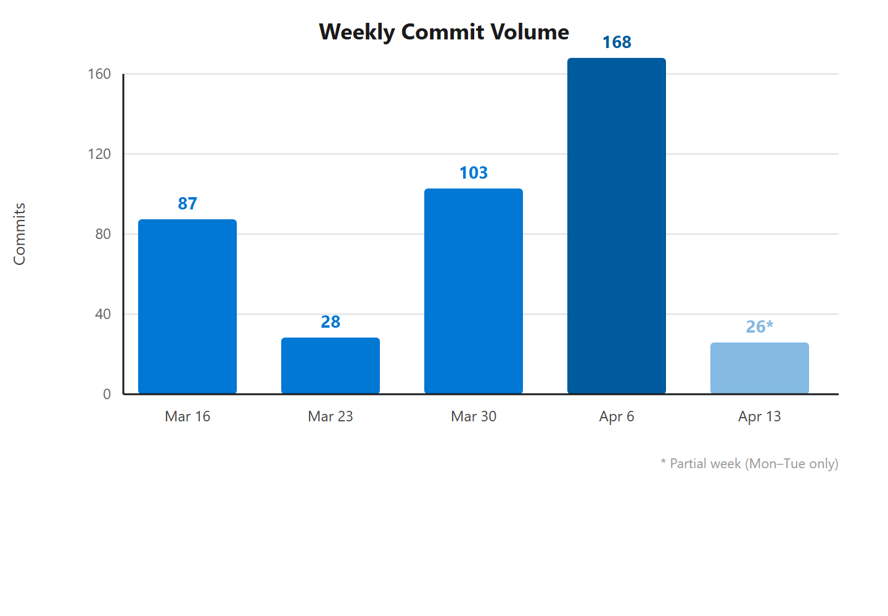
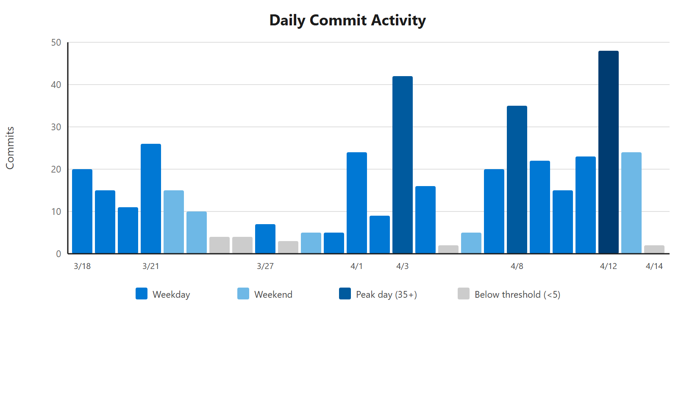
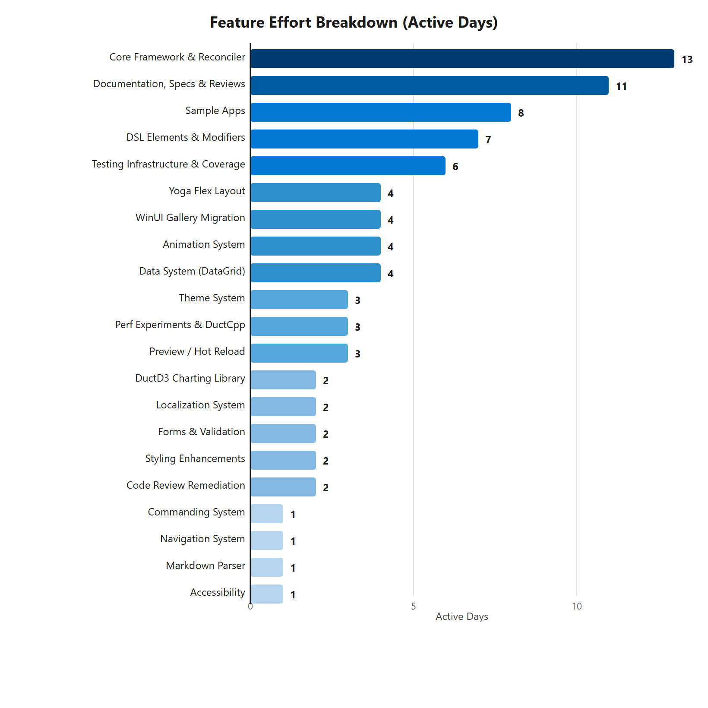
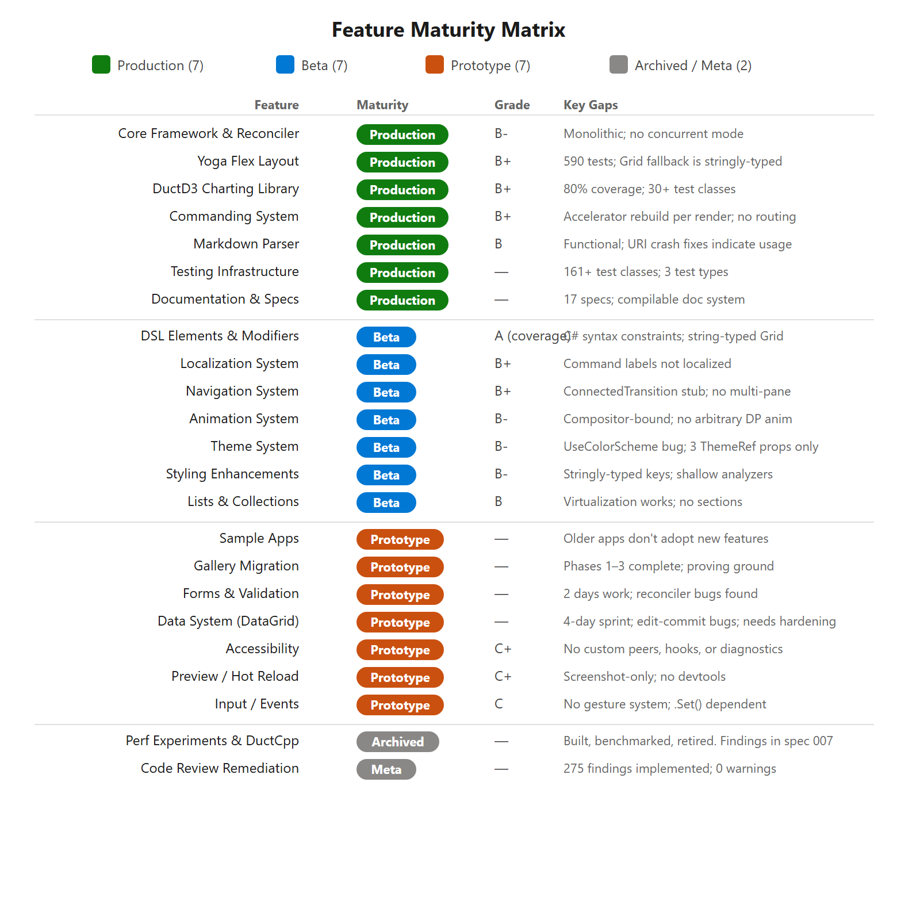

# Reactor Framework — Work Summary

**Period:** March 18 – April 14, 2026 (4 weeks)
**Total commits:** 412 | **Active days (5+ commits):** 21 | **Contributors:** 4

---

## Commit Traffic at a Glance

### Weekly Volume

| Week (Mon start) | Commits | Contributors |
|---|---:|---|
| Mar 16 | 87 | Chris Anderson |
| Mar 23 | 28 | Chris Anderson |
| Mar 30 | 103 | Chris Anderson (86), Karen Lai (14), GitOps (2), Nikola Metulev (1) |
| Apr 6 | 168 | Chris Anderson (166), Karen Lai (2) |
| Apr 13 *(partial)* | 26 | Chris Anderson |

### Daily Activity

Peak days: **Apr 12** (48 commits, Saturday) and **Apr 3** (42 commits, Thursday). Weekend work accounted for roughly 25% of all commits.

---

## Feature Effort Breakdown

The table below estimates the number of **active calendar days** spent on each major feature area, based on commit messages and dates. Days overlap across features since most days included work on multiple initiatives.

| Feature | Active Days | Date Range | Summary |
|---|---:|---|---|
| **Core Framework & Reconciler** | 13 | Mar 18 – Apr 13 | Initial scaffold, keyed LIS reconciler, element pooling, tree serializer, Rust differ (added then removed), WinRT interop caching, control recycling, skip-unchanged optimization, ShallowEquals, render coalescing, native interop (bypass CsWinRT RCW), memoization, context/state system, modifier clearing |
| **Documentation, Specs & Reviews** | 11 | Mar 20 – Apr 13 | Onboarding docs, contribution guide, 17-topic compilable documentation, critical framework review (vs React/SwiftUI/Compose with iterative re-grades), competitive analysis, C# language improvements spec, bento box presentation, WinUI integration proposals |
| **Sample Apps** | 8 | Mar 20 – Apr 14 | ReactorFiles file explorer, Monaco Editor, ReactorOutlook (Outlook clone), NetPulse stress test, HeadTrax employee DB, StressPerf benchmarks, TestApp enhancements, WinUI vanilla host demo |
| **DSL Elements & Modifiers** | 7 | Mar 21 – Apr 7 | 14 high-priority + medium/low-priority DSL elements, modifier generalization to match WinUI inheritance hierarchy, attached properties for Grid/Canvas/RelativePanel, first-class transitions, SplitPanel, declarative event handlers, UseReducer, grid builders |
| **Testing Infrastructure & Coverage** | 6 | Mar 21 – Apr 13 | In-process self-test harness, Appium/WinAppDriver E2E (182s to 41s), selfhost fixture system, render-idle detection, coverage expansion (Core 75%, Controls 88%, Hooks 68%, D3 80%), 312 ReactorCharting tests, flaky test fixes |
| **Yoga Flex Layout** | 4 | Mar 22 – Apr 13 | C# port of facebook/yoga, FlexPanel component, 590 ported test fixtures, two-pass measure fix, double-margin fix, stale attached properties fix |
| **WinUI Gallery Migration** | 4 | Mar 18 – Mar 21 | Migration planning spec, Phase 1-3 implementation, 8+ Gallery page ports, CommandBar fixes, Gallery modernization |
| **Animation System** | 4 | Apr 7 – Apr 11 | 8 compositor-layer features, layout animations, connected animations, interaction states, 7 integration bug fixes |
| **Data System (DataGrid)** | 4 | Apr 3 – Apr 14 | FieldDescriptor, PropertyGrid, VirtualList, DataGrid (headless state, Column DSL, sort, selection, keyboard navigation, inline editing, column resize, validation, async commit, block cache), Phases 0-5, HeadTrax integration |
| **Theme System** | 3 | Apr 3 – Apr 7 | ThemeRef API, WinUI native {ThemeResource} via Style, dark mode support, Color gallery, ThemeDictionary key mapping, theme toggle reactivity |
| **Perf Experiments & ReactorCpp** | 3 | Mar 30 – Apr 4 | ReactorCpp fully native C++ reconciler (built, measured, archived), NativeAOT, property diff bitmask, interactive control pooling, arena allocation experiments, benchmark suite |
| **Preview / Hot Reload** | 3 | Mar 20 – Apr 3 | Visual Studio hot reload, CLI hot reload spec, built-in --preview flag, VS Code live preview with HTTP component switching |
| **ReactorCharting Charting Library** | 2 | Apr 1 – Apr 12 | Full charting library, 30+ gallery samples, declarative D3 DSL, SVG icons, functional generators (LinePath, AreaPath, ArcPath, Pie), chart DSL migration to native D3 element trees |
| **Localization System** | 2 | Apr 3 – Apr 4 | Phases 1-6: runtime core, source generator, pseudolocalization, CLI tooling (extract, translate via GitHub Copilot SDK, validate, status, prune), RichMessage API, RTL support, E2E test |
| **Forms & Validation** | 2 | Apr 11 – Apr 12 | FormField, ValidationRule, ValidationVisualizer, auto-validation, controlled TextField input, reconciler bug fixes |
| **Styling Enhancements** | 2 | Apr 11 – Apr 12 | Style caching, style hooks, lightweight styling, Roslyn analyzers |
| **Code Review Remediation** | 2 | Apr 11 – Apr 12 | 6-agent parallel review (139 findings), 136 findings implemented across 33 batches, zero-warnings clean build |
| **Commanding System** | 1 | Apr 8 | Command, StandardCommand, UseCommand hook, CommandHost, perf benchmark, MenuBar fix |
| **Navigation System** | 1 | Apr 8 | Design spec and full declarative navigation implementation |
| **Markdown Parser** | 1 | Mar 26 | md4c native parser, Markdown() element builder, live preview |
| **Accessibility** | 1 | Apr 7 | Modifier system with lazy sub-record, UIA E2E tests, AutomationId |

---

## Contributor Summary

| Contributor | Commits | % of Total | Active Weeks |
|---|---:|---:|---|
| Chris Anderson | 393 | 95.4% | All 5 weeks |
| Karen Lai | 16 | 3.9% | Mar 30, Apr 6 |
| GitOps | 2 | 0.5% | Mar 30 |
| Nikola Metulev | 1 | 0.2% | Mar 30 |

---

## Feature Maturity Matrix

Each feature is rated against the following scale based on implementation completeness, test coverage, bug-fix iterations, and known gaps documented in the [critical review](../critical-review.md). The **Review Grade** column reflects the scorecard from the competitive analysis (vs React, SwiftUI, Compose).

| Level | Definition |
|---|---|
| **Production** | Stable API, comprehensive tests, multiple bug-fix cycles, reviewed. On track to ship to OSS as "preview" |
| **Beta** | Functional with known limitations. Tested but gaps remain; API may still evolve. Would want to heavily caveat that we are churning in this area. |
| **Prototype** | Early implementation or proof of concept. Significant gaps; not ready for real use. |
| **Archived** | Deliberately built, evaluated, and retired. Findings documented. |

### Feature Ratings

| Feature | Maturity | Review Grade | Rationale |
|---|---|---|---|
| **Core Framework & Reconciler** | Production | B- | Stable through 13 days of continuous iteration. Skip-unchanged optimization (40% speedup), native interop bypass of CsWinRT, element pooling, render coalescing. Monolithic reconciler (no concurrent mode) is the known ceiling. |
| **Yoga Flex Layout** | Production | B+ | Faithful C# port of facebook/yoga with 590 ported test fixtures. Three separate bug-fix rounds (two-pass measure, double-margin, stale attached properties). Grid fallback is stringly-typed. |
| **ReactorCharting Charting Library** | Production | B+ | Full charting library with 30+ test classes (80% line coverage). Declarative D3 DSL, functional generators, native element trees. Complete and independently usable. |
| **Commanding System** | Production | B+ | 16 standard commands, async lifecycle, focus-scoped accelerators, ICommand interop. Unique differentiator — no competing framework provides this. Gaps: accelerator rebuild per render, no command routing, no palette UI. |
| **Markdown Parser** | Production | B | Native md4c parser, Markdown() element builder, live preview. Tests exist. URI crash fixes and margin handling indicate real usage. |
| **Testing Infrastructure** | Production | — | 161+ test classes across unit, selfhost, and E2E Appium. Render-idle detection replaced blind Task.Delay waits. Selfhost system with per-fixture result bars. Coverage: Core 75%, Controls 88%, Hooks 68%, D3 80%. |
| **Documentation & Specs** | Production | — | 17 numbered design specs, compilable documentation system with getting-started guide, comprehensive critical review with competitive scorecard. |
| **DSL Elements & Modifiers** | Beta | A (coverage) | 94% of WinUI controls wrapped with clean factory APIs. Constrained by C# language — no block syntax for children, string-typed Grid columns, verbose compared to JSX/SwiftUI. Coverage is complete; ergonomics are the gap. |
| **Localization System** | Beta | B+ | Full Phases 1–6: ICU runtime, source generator, pseudolocalization, CLI (extract/translate/validate/status/prune), RichMessage API, RTL. Migrated to Context. Gap: standard command labels not yet localized. |
| **Navigation System** | Beta | B+ | Type-safe routes, developer-owned back stack, GPU composition transitions, lifecycle guards, LRU caching, serialization, deep linking. Architecturally competitive with Compose Navigation 3. Gaps: ConnectedTransition is a stub, E2E tests written but unexecuted, no adaptive multi-pane. |
| **Animation System** | Beta | B- | 8 compositor-layer features (curves, transitions, interaction states, keyframes, stagger, scroll-linked, WithAnimation). 7 integration bugs found and fixed, 47 regression tests, 13 selfhost fixtures. Ceiling: compositor-property-bound, no arbitrary DP animation, no per-frame hooks. |
| **Theme System** | Beta | B- | Style caching eliminates XamlReader.Load perf issue. Lightweight styling is a genuine differentiator. RequestedTheme modifier, UseColorScheme hook. Gaps: UseColorScheme reads app theme not element effective theme, only 3 ThemeRef properties, no custom branded theme resources. |
| **Styling Enhancements** | Beta | B- | Lightweight styling (WinUI resource key overrides via fluent API) is unique among C# declarative frameworks. 3 Roslyn analyzers for static guidance. Gaps: stringly-typed resource keys, shallow analyzer coverage, composition bugs with RequestedTheme. |
| **Lists & Collections** | Beta | B | Virtualized ListView/GridView/ItemsRepeater, LazyStack. Recycling crash fixed. Gap: no section/group support. |
| **Sample Apps** | Prototype | — | 10 sample apps (ReactorOutlook, HeadTrax, ReactorFiles, Monaco, NetPulse, StressPerf, etc.). Serve as integration tests and demos. Gap: older apps don't adopt newest features (navigation, context, commanding). |
| **WinUI Gallery Migration** | Prototype | — | Phases 1–3 complete, 8+ Gallery pages ported. Served as the proving ground for the element system. Active migration work front-loaded in week 1. |
| **Forms & Validation** | Prototype | — | FormField, ValidationRule, ValidationVisualizer landed with auto-validation and controlled TextField. Only 2 active days of work; limited test coverage; reconciler bugs found during implementation. |
| **Data System (DataGrid)** | Prototype | — | Phases 0–5 scaffolded in a 4-day sprint: headless state, Column DSL, sort, selection, keyboard navigation, inline editing, column resize, validation, async commit, block cache. Functional but needs hardening — edit-commit bugs found, stale column cache issues, LazyStack reconciler fixes required. |
| **Accessibility** | Prototype | C+ | 16 modifier properties exposed with 8 real UIA E2E tests. Structural limits remain: no custom automation peers, no accessibility hooks, no diagnostics tooling. |
| **Preview / Hot Reload** | Prototype | C+ | Hot reload functional via MetadataUpdateHandler. --preview flag with HTTP component switching. VS Code live preview is screenshot-only (not interactive). No devtools, profiling, or component inspector. |
| **Input / Events** | Prototype | C | Semantic event modifiers (OnClick, OnTextChanged). 3 pointer event modifiers. Commanding reduces .Set() surface area but no gesture system, no PointerEntered/Exited, drag-drop requires .Set(). |
| **Perf Experiments & ReactorCpp** | Archived | — | ReactorCpp C++ reconciler: built, benchmarked, concluded overhead didn't justify complexity. Rust differ: same arc (week 1 add, week 2 remove). Property diff bitmask, control pooling, arena allocation all evaluated. Findings documented in spec 007. |
| **Code Review Remediation** | *(meta)* | — | 275 code review findings identified (139 from 6-agent parallel review + 136 across 33 batches) and implemented. Zero-warnings clean build achieved. Ongoing quality activity, not a feature. |

### Maturity Distribution

| Level | Count | Features |
|---|---|---|
| Production | 7 | Core Framework, Yoga Flex, ReactorCharting, Commanding, Markdown, Testing, Documentation |
| Beta | 7 | DSL/Elements, Localization, Navigation, Animation, Theming, Styling, Lists |
| Prototype | 7 | Sample Apps, Gallery Migration, Forms/Validation, DataGrid, Accessibility, Preview/Hot Reload, Input/Events |
| Archived / Meta | 2 | Perf Experiments/ReactorCpp, Code Review Remediation |

---

## Observations

- **Accelerating trajectory:** Commit volume nearly doubled each week (87 to 28 to 103 to 168), reflecting compounding framework capability enabling faster feature delivery.
- **Sustained weekend work:** Significant Saturday/Sunday activity throughout the period, with Apr 12 (Saturday, 48 commits) being the single busiest day.
- **Rapid experimentation:** ReactorCpp was a deliberate 3-day spike — built a full C++ reconciler, benchmarked it, concluded the perf gains didn't justify the complexity, and archived findings. Same pattern with the Rust differ (added week 1, removed week 2).
- **Single-day feature deliveries:** Commanding, Navigation, Markdown, and Accessibility each shipped in approximately one active day, suggesting mature patterns enabling fast execution.
- **Week 4 inflection point:** The Apr 6 week (168 commits) saw 11 distinct feature areas active simultaneously — Data System, selfhost coverage, animations, styling, validation, code review, competitive analysis, and more.
